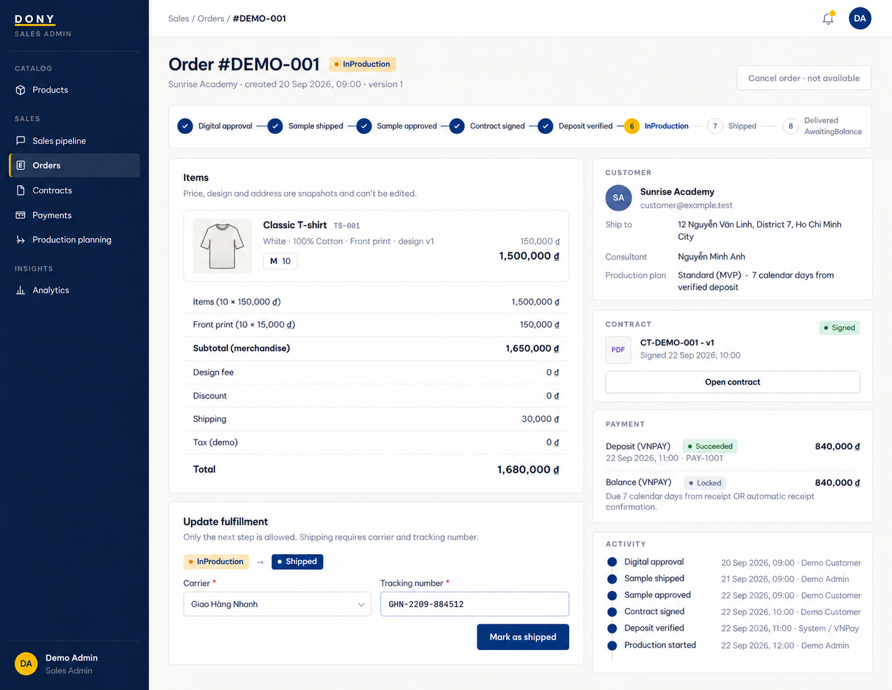

# Screen Spec: S37 Staff Order Detail

| Field | Value |
|---|---|
| Screen ID | `S37` |
| Screen name | Staff Order Detail |
| Actor | Sales Admin / Assigned Sales |
| Priority | Must (MVP) |
| Belongs to module | [MFG-07](../specs/spec-MFG-07.md) |
| Route | `/admin/orders/{order_id}` |
| Mockup image | img/S37-01-staff-order-detail.png |
| Status | Resolved implementation specification |

## 1. Purpose

**Shown when:** The Sales Admin sees any Dony order; a Sales employee sees only an order tied to their current customer assignment. Mutations follow order state and expected_version. All identifiers and permissions come from the server session.

**The user leaves this screen when:** An authorized action in section 5 succeeds, the user follows a role-allowed global route, or they return to the validated originating route.

**MVP rules (MFG-06 BR-019):** Recording verified delivery proof starts no timer. Instead, Sales Admin may use **Confirm receipt on Customer's behalf**, which records `received_at`, the acting staff ID and the evidence reference and advances `Shipped→DeliveredAwaitingBalance`. Cancel order is available only before a deposit has succeeded. A Cancelled order with `manual_refund_required=true` shows a "Manual refund required" banner; the refund is handled outside the system. There is no Overdue state.

## 2. Mockup

The mockup illustrates the defined workflow. Fictional sample values do not replace the field, lifecycle and release-scope rules below.

### Mockup deviations

- The staff stepper omits the `SampleInPreparation` state; include it in the implemented lifecycle display.

## 3. Element inventory

| # | Element | Type | Content / data source | Required | Validation |
|---|---|---|---|---|---|
| 1 | Screen heading | Heading | Staff Order Detail | Yes | Static route title. |
| 2 | Route | Navigation target | /admin/orders/{order_id} | Yes | Access checked on server. |
| 3 | order_id / order_number / snapshots | Field / control | UUID (route only), customer-visible order number (MFG-06 BR-017) and read-only data | As specified | Sales Admin or assigned Sales (read-only in MVP) only; price, address, design and contract snapshots cannot be edited. |
| 4 | lifecycle_event / expected_version | Field / control | required mutation inputs | As specified | In MVP, permit only Sales Admin to start sample preparation, dispatch sample, start production, ship goods or record verified delivery proof; Sales is read-only. |
| 5 | sample / shipment / delivery evidence | Evidence panel | Versioned sample fields, carrier tracking event or signed proof-of-delivery reference | By transition | Sample dispatch binds sample/design version and tracking; goods shipment requires carrier/tracking and server shipped_at; verified delivery proof records evidence and verified-delivered timestamp but leaves status Shipped while the 3-day auto-confirmation timer runs. |
| 5a | estimated_delivery_from / estimated_delivery_to | Date range inputs | Optional on sample dispatch and goods shipment; editable while `SampleShipped` or `Shipped` | Optional | MFG-06 BR-018: Sales Admin only in MVP; `from` ≥ dispatch/shipment date and `to` ≥ `from`; updates use expected_version and are audited; the range never changes status or timers. |
| 6 | cancellation_reason | Field / control | string 1..500, Sales Admin only | As specified | Require current cancellation eligibility; Sales cannot cancel. |
| 7 | contract_action | Field / control | Sales Admin only | As specified | Open S39 only when current physical sample is Approved and order is PendingContract; never mutate a Signed contract. |
| 8 | API errors | Field / control | standard API error envelope | As specified | 400 malformed; 422 invalid fields; 409 stale/duplicate; 429 rate limit; 503 dependency failure |
| 9 | Start/dispatch physical sample | Action | Advance `DigitalDesignApproved→SampleInPreparation→SampleShipped` and retain sample version/evidence. | Sales Admin only in MVP | Destination: S37 |
| 10 | Generate contract | Action | Snapshot current approved design/sample plus commercial and deposit terms. | Only in PendingContract with Approved sample | Destination: S39 |
| 11 | Start production / ship | Action | Advance `Confirmed→InProduction→Shipped`; shipping requires carrier and tracking. | Sales Admin only in MVP | Destination: S37 |
| 12 | Record delivery proof | Action | Store/verify the evidence timestamp and notify the Customer; do not change status immediately or expose balance payment. Post-MVP: also start the MFG-06 BR-007 3-calendar-day timer. | Sales Admin only | Destination: S37 |
| 12a | Confirm receipt on Customer's behalf | Action (MVP only, MFG-06 BR-019) | Requires recorded verified delivery evidence; records `received_at`, acting staff ID and evidence reference; advances `Shipped→DeliveredAwaitingBalance`; audited and idempotent. | Sales Admin only; Shipped with verified evidence | Destination: S37 |
| 13 | Cancel order | Action | Sales Admin with reason and eligibility; Sales cannot cancel. | Available when authorized | Destination: S36 |
| 14 | Merge batch | Action | After MFG-10 activation, Sales Admin opens S46 for this order or its assigned run; preserve validated origin and order context. | Available when authorized | Destination: S46 |

## 4. States

**Loading, access, errors and retry:** Show a labelled Loading state while reads resolve. A missing or inaccessible route returns a safe 401/403/404 without disclosing protected records. Error states show the API code, message, field_errors and request_id while preserving safe input. Retry transient reads; retry a mutation only with the original idempotency key and identical payload. Preserve safe user input after recoverable failures.

| State | What the user sees | Trigger |
|---|---|---|
| Empty | Not applicable to this single-record route; a missing or inaccessible record uses Forbidden/not found. | The route identifies one record. |
| Success | Refresh order events/evidence; verified delivery proof starts the three-calendar-day timer without immediately changing Shipped. | Valid action commits |
| Conflict | Order status changed concurrently: reload timeline and reject duplicate proof or stale status updates. | Stale version, duplicate or invalid lifecycle transition |
## 5. Interactions and navigation

| # | Element | User action | System response | Goes to screen |
|---|---|---|---|---|
| 1 | Start/dispatch physical sample | Activate | Persist versioned preparation/dispatch event and notify Customer. | S37 |
| 2 | Generate contract | Activate | Snapshot current approved sample and payment terms. | S39 |
| 3 | Start production / ship | Activate | Commit one valid fulfillment transition with required shipment evidence. | S37 |
| 4 | Record delivery proof | Activate | Persist and verify evidence; keep order `Shipped`. Post-MVP: show the countdown and let the scheduled MFG-06 event transition after three calendar days unless the Customer confirms sooner. | S37 |
| 4a | Confirm receipt on Customer's behalf | Activate (MVP) | Advance `Shipped→DeliveredAwaitingBalance` with the recorded evidence reference. | S37 |
| 5 | Cancel order | Activate | Sales Admin supplies a reason; server rechecks eligibility. | S36 |
| 6 | Merge batch | Activate | Sales Admin opens S46 with the selected order/run context; reauthorize access and preserve return navigation. | S46 |

Portal: Sales Admin / Assigned Sales. Route: /admin/orders/{order_id}. Back preserves the originating route and filters. 

### Production-console consistency

After MFG-10 activation, show the order's standard/flexible choice, snapshotted incentive, readiness-based due date, waiting limit when applicable and assigned batch status separately from the canonical order state. Link operational batch actions to [S46 Merge Console](S46-production-planning.md); reuse this screen's readiness evidence, commercial snapshots and audit-timeline presentation there. For an assigned ScheduledOpen/Locked order, disable independent Start production here and route authorized Sales Admin to S46's revalidated group start; Assigned Sales cannot bypass the batch gate. Shipping still follows the individual order lifecycle.

Preproduction cancellation retains the existing role/reason/refund rules and atomically releases scheduled/locked membership under MFG-07. Refresh the authoritative order and affected schedule after commitment; do not display a canceled order as an active member or imply that locking started production.

### Capacity and deadline presentation

After MFG-10 activation, use the shared daily-capacity profile/version from [S19](S19-product-design-rules.md) and scheduling detail from [S46](S46-production-planning.md). Show the order quantity, garments/day estimate, readiness day 1, waiting day 7 and separate 8–14-working-day production range with its unchanged maximum due date. Distinguish scheduling estimate, Admin-approved plan and actual human start. A late review displays risk/overdue status instead of recalculating a new full waiting or production window. Assigned Sales cannot edit capacity or approve a shared/individual fallback plan.

### Shared Sales / Sales Admin view

This same screen supports both Sales Admin and Sales; no duplicate screen is created. Sales Admin sees the Dony-wide queue. Sales sees only orders tied to their current customer assignment and can read design/sample, contract acknowledgement, deposit/balance, production/shipping, delivery-proof and receipt progress. The server applies assignment scope to rows, totals and filters and rechecks it on detail/deep links; reassignment removes the previous Sales employee’s access immediately. Sales cannot gain access through a submitted employee/customer ID or a broader filter.

Visibility does not grant contract administration, cancellation, delivery-proof verification, payment settlement or batch approval. Existing explicitly permitted fulfillment actions keep their module role/state gates. The mockup remains the Sales Admin example; Sales uses the same layout with role-restricted controls.

## 6. Screen-level rules

| Rule ID | Rule | Source |
|---|---|---|
| SR-001 | Check access and ownership on the server; never trust submitted customer, company, role, price, stage or provider status. Apply the documented 401/403/404 behavior and field rules. | Project baseline |
| SR-002 | IDs are UUIDs; timestamps are UTC and displayed in Asia/Ho_Chi_Minh; money and quantities are integers. Mutations use expected versions and idempotency keys where specified. | Project baseline |
| SR-003 | Apply the owning module's lifecycle and validation rules; preserve immutable submitted snapshots and design versions. | Project baseline |
| SR-004 | Use documented project assumptions; do not invent factual company, author, client-approval or course identifiers. | Project baseline |

### Acceptance scenarios

1. Only valid next fulfillment transition is applied; shipment requires carrier, tracking and timestamp.
2. Sales cannot cancel an order or bypass Customer design/sample approval, contract, deposit, receipt or balance gates; stale order version returns 409.
3. Staff can never set `Completed`; only verified BALANCE settlement or MFG-06's authoritative zero-balance completion path can do so. Both produce the same final lifecycle milestone for MFG-11; payment-attempt counts remain separate.

## 7. Linked requirements

| FR ID (from the module spec) | What this screen does for it |
|---|---|
| MFG-07/F-ORD-006 | **Status Update Logic** — Enforce event-owned order transitions with expected-version/idempotency checks and required shipment/delivery evidence; only authorized actors can advance their permitted transitions. |
| MFG-07/F-ORD-007 | **Status Notify Logic** — Notify the order owner after a committed status change with timestamp and safe tracking link; suppress duplicates. |
| MFG-06/F-PAY-003 | Sales Admin performs versioned physical-sample preparation/dispatch; Sales is read-only in MVP. |
| MFG-06/F-PAY-006 | Show authoritative order and fulfillment state to authorized staff. |
| MFG-09/F-CONTR-001 | Opens contract generation only after the current physical sample is Approved. |
Additional linked modules: [MFG-06](../specs/spec-MFG-06.md), [MFG-09](../specs/spec-MFG-09.md).

## 8. Responsive and accessibility notes

Support 360px through desktop; stack columns and use labelled horizontal-scroll tables on narrow screens. Controls are keyboard-operable with visible focus, logical headings, associated form labels, and aria-live status/error announcements. Text contrast is at least 4.5:1 (large text 3:1); pointer targets are at least 24px. Preserve user-entered data after recoverable failures. Confirm destructive actions, disable duplicate submit while pending, and enforce idempotency on the server.

## 9. Open questions

| # | Question | Blocking? | Status |
|---|---|---|---|
| 1 | No unresolved screen behavior questions remain; routes, fields, permissions, and defaults are resolved in this specification and its linked module requirements. | No | Resolved |

## Completion checklist

- [x] Route, actor, module, priority, and mockup status are identified.
- [x] Element fields, actions, validation, and data ownership are documented.
- [x] Loading, empty, forbidden, error, retry, success, and conflict states are documented.
- [x] Navigation and acceptance scenarios are explicit.
- [x] Responsive and accessibility requirements are documented in this screen.
- [x] No unresolved screen-level decisions remain.

MVP: In MVP, Sales uses these screens for read-only progress; only Sales Admin can perform operational mutations. No MFG-08 queue is needed to render an already assigned order; no assignment returns an empty scoped list.
