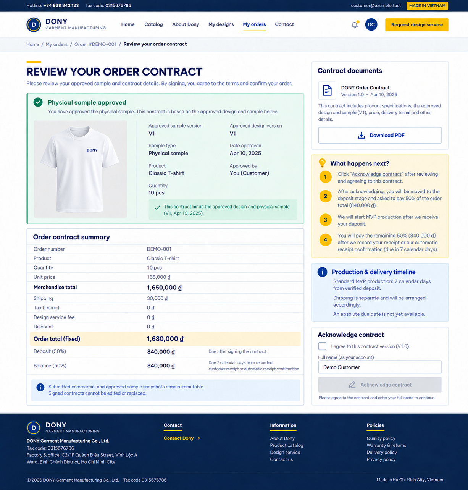

# Screen Spec: S38 Contract Detail (Customer)

| Field | Value |
|---|---|
| Screen ID | `S38` |
| Screen name | Contract Detail (Customer) |
| Actor | Customer owner |
| Priority | Must (MVP) |
| Belongs to module | [MFG-09](../specs/spec-MFG-09.md) |
| Route | `/contracts/{contract_id}` |
| Mockup image | `img/S38-01-customer-contract.png` |
| Status | Resolved implementation specification |

## 1. Purpose

**Shown when:** The customer reviews the generated contract only after approving the received physical sample. The screen shows bound design/sample evidence, buyer organization snapshot when present, contract total, deposit percentage/amount and remaining-balance formula. MVP acknowledgement requires explicit consent and typed full-name match in the active authenticated session; stronger reauthentication/challenge is full-system only.

**MVP authentication level:** Follow the [MVP scope](../mvp-scope-proposal.md): the already-authenticated Customer gives explicit consent and types their matching full name; the active Customer session is the authentication evidence. MVP does not require password re-entry or a one-time signing challenge. The stronger reauthentication/challenge flow below is post-MVP and must not block MVP contract acknowledgement.

**The user leaves this screen when:** An authorized action in section 5 succeeds, the user follows a role-allowed global route, or they return to the validated originating route.

## 2. Mockup

The mockup illustrates the defined workflow. Fictional sample values do not replace the field, lifecycle and release-scope rules below.

### Mockup deviations

- Hide the header/footer “Request design service” entry in MVP; S24 is post-MVP.

## 3. Element inventory

| # | Element | Type | Content / data source | Required | Validation |
|---|---|---|---|---|---|
| 1 | Screen heading | Heading | Contract Detail (Customer) | Yes | Static route title. |
| 2 | Route | Navigation target | /contracts/{contract_id} | Yes | Access checked on server. |
| 3 | contract_id / order_number | Field / control | UUID, required / read-only order reference | As specified | Customer must own associated order; inaccessible ID returns 404. Show the order's `order_number` (MFG-06 BR-017) as the reference; the PDF uses the same value. |
| 4 | pdf_asset_id | Field / control | private UUID | As specified | Authorized expiring download URL (10 minutes); no public asset URL. |
| 5 | consent | Field / control | boolean, required true | As specified | Explicit acceptance of displayed consent text version; checkbox alone does not sign. |
| 6 | consent_text_version | Field / control | version, required | As specified | Persisted with evidence. |
| 7 | typed_full_name | Field / control | string, required | As specified | 1..100; trimmed/casefold match to authenticated profile full_name. |
| 8 | password | Post-MVP field | secret | No (MVP) | Full-system flow only: reauthenticate within 5 minutes before requesting the signing challenge; never logged or stored in evidence. Omit in MVP. |
| 9 | signing_challenge | Post-MVP field | one-time token | No (MVP) | Full-system flow: server binds contract UUID/version/content hash; expires in 10 minutes; single use. Omit in MVP. |
| 10 | Idempotency-Key | Field / control | UUID, required | As specified | Same key/payload returns signed version; changed payload returns 409. |
| 11 | signature evidence | Server-generated evidence record | signer, name, consent version, contract hash, timestamp, server IP/user-agent | Yes | MVP records active session, matching name and consent; full-system may also record a challenge digest. |
| 12 | Request signing challenge | Post-MVP action | Require explicit consent, typed name and recent password reauth; issue contract-bound 10m one-use challenge. | Post-MVP only | Destination: S38; MVP signing uses the authenticated session, consent and matching typed name only. |
| 13 | Sign | Action | Verify active session, consent, matching typed name and hash/version/sample binding (full system also verifies the challenge), then transactionally record evidence; order advances to `AwaitingDeposit`. | Available when authorized | Destination: S40 |
| 14 | Download/view PDF | Action | Authorized private URL; no public asset URL. | Available when authorized | Destination: S38 |
| 15 | design_fee_vnd / source_design_request_id | Read-only price line | Integer VND and originating request reference from order snapshot | Yes | Show separately outside merchandise subtotal, including 0 for free/repeat orders; same fee/total as S33/S40 and PDF; no manual surcharge. |
| 16 | approved sample / payment terms | Read-only evidence | design version, sample ID/version, approved_at, deposit percent/amount and balance formula | Yes | Must match current Approved sample and immutable contract; mismatch blocks signing. |

## 4. States

**Loading, access, errors and retry:** Show a labelled Loading state while reads resolve. A missing or inaccessible route returns a safe 401/403/404 without disclosing protected records. Error states show the API code, message, field_errors and request_id while preserving safe input. Retry transient reads; retry a mutation only with the original idempotency key and identical payload. Preserve safe user input after recoverable failures.

| State | What the user sees | Trigger |
|---|---|---|
| Empty | No Contract Detail (Customer) records match the current route/filter; preserve inputs and show only the screen’s authorized next action. | Screen has no eligible or matching record |
| Success | Record customer consent/signature once; show signed status and disable duplicate signing. | Valid action commits |
| Conflict | Contract was signed, revised, or expired elsewhere: reload canonical version and reject stale consent. | Stale version, duplicate or invalid lifecycle transition |
## 5. Interactions and navigation

| # | Element | User action | System response | Goes to screen |
|---|---|---|---|---|
| 1 | Request signing challenge | Post-MVP only | Full-system flow; not used for MVP acknowledgement. | S38 |
| 2 | Sign | Activate | Verify active session, consent, matching typed name and hash/version/sample binding (full system also verifies the challenge), then transactionally record evidence; order advances to `AwaitingDeposit`. | S40 |
| 3 | Download/view PDF | Activate | Authorized private URL; no public asset URL. | S38 |

Portal: Customer owner. Route: /contracts/{contract_id}. Back preserves the originating route and filters. 

### Versioned production commitment

For an activated MFG-10 flexible order, the contract matches [S33](S33-order-summary.md) and [S32](S32-production-terms.md): 7 Monday–Friday waiting days followed by 8–14 additional production working days, readiness working date counted as day 1 (weekend rolls forward), and maximum completion at readiness working day 21. Before all readiness conditions are met, show the signed relative duration/counting rule, not an invented fixed date. The derived date follows that same immutable rule after readiness. Preserve the 5% capped incentive on early sharing or human-approved individual production; approval of the commercial contract is not production-start approval. Shipping remains separate.

## 6. Screen-level rules

| Rule ID | Rule | Source |
|---|---|---|
| SR-001 | Check access and ownership on the server; never trust submitted customer, company, role, price, stage or provider status. Apply the documented 401/403/404 behavior and field rules. | Project baseline |
| SR-002 | IDs are UUIDs; timestamps are UTC and displayed in Asia/Ho_Chi_Minh; money and quantities are integers. Mutations use expected versions and idempotency keys where specified. | Project baseline |
| SR-003 | Apply the owning module's lifecycle and validation rules; preserve immutable submitted snapshots and design versions. | Project baseline |
| SR-004 | Use documented project assumptions; do not invent factual company, author, client-approval or course identifiers. | Project baseline |

### Acceptance scenarios

1. MVP: correct consent, typed account name and active session record acknowledgement once and moves order to `AwaitingDeposit`; full-system additionally requires recent password and valid contract-bound challenge.
2. Missing/invalid session, mismatched name, stale sample/design/hash/version or missing consent rejects MVP acknowledgement; expired/replayed challenge also rejects the full-system path.
3. Contract/PDF displays the snapshotted design fee separately before signing; it never reads current configuration or adds a second charge.

## 7. Linked requirements

| FR ID (from the module spec) | What this screen does for it |
|---|---|
| MFG-06/F-PAY-003 | Enforce sample-approval gate before contract acknowledgement. |
| MFG-06/F-PAY-006 | Show the authoritative sample, contract and payment gate in the order workflow. |
| MFG-09/F-CONTR-008 | **Sign Contract** — Record customer acknowledgement with consent and matching name; full system additionally requires recent reauthentication and one-time challenge bound to contract version/hash. |
| MFG-09/F-CONTR-009 | **Sign Contract** — Notify customer and Dony Sales Admins after successful signing; only then advance order PendingContract→AwaitingDeposit. |

## 8. Responsive and accessibility notes

Support 360px through desktop; stack columns and use labelled horizontal-scroll tables on narrow screens. Controls are keyboard-operable with visible focus, logical headings, associated form labels, and aria-live status/error announcements. Text contrast is at least 4.5:1 (large text 3:1); pointer targets are at least 24px. Preserve user-entered data after recoverable failures. Confirm destructive actions, disable duplicate submit while pending, and enforce idempotency on the server.

## 9. Open questions

| # | Question | Blocking? | Status |
|---|---|---|---|
| 1 | No unresolved screen behavior questions remain; routes, fields, permissions, and defaults are resolved in this specification and its linked module requirements. | No | Resolved |

## Completion checklist

- [x] Route, actor, module, priority, and mockup status are identified.
- [x] Element fields, actions, validation, and data ownership are documented.
- [x] Loading, empty, forbidden, error, retry, success, and conflict states are documented.
- [x] Navigation and acceptance scenarios are explicit.
- [x] Responsive and accessibility requirements are documented in this screen.
- [x] No unresolved screen-level decisions remain.
