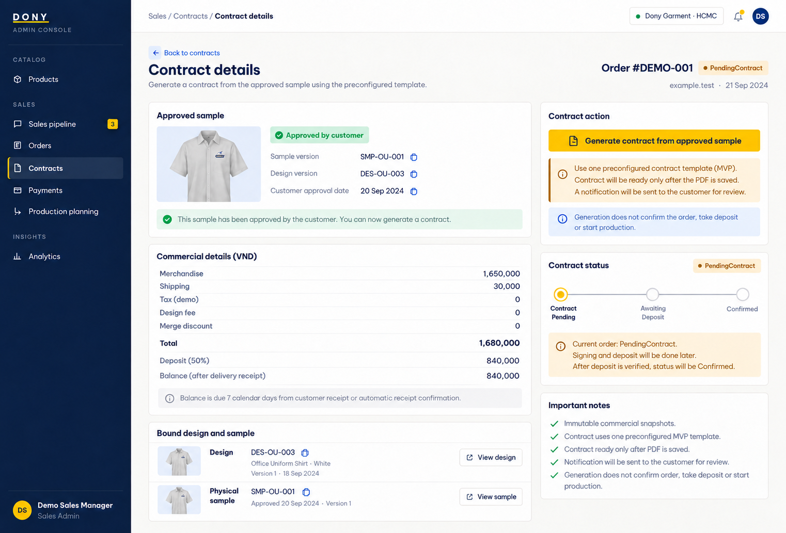

# Screen Spec: S39 Contract Detail (Sales Admin)

| Field | Value |
|---|---|
| Screen ID | `S39` |
| Screen name | Contract Detail (Sales Admin) |
| Actor | Sales Admin |
| Priority | Must (MVP) |
| Belongs to module | [MFG-09](../specs/spec-MFG-09.md) |
| Route | `/admin/contracts/{contract_id}` |
| Mockup image | img/S39-01-admin-contract.png |
| Status | Resolved implementation specification |

## 1. Purpose

**Shown when:** The Sales Admin sees a Dony contract whose order has a current Customer-approved physical sample, together with status history, generated private PDF and permitted void/supersede controls. All identifiers and permissions come from the server session.

**The user leaves this screen when:** An authorized action in section 5 succeeds, the user follows a role-allowed global route, or they return to the validated originating route.

## 2. Mockup

The mockup illustrates the defined workflow. Fictional sample values do not replace the field, lifecycle and release-scope rules below.

## 3. Element inventory

| # | Element | Type | Content / data source | Required | Validation |
|---|---|---|---|---|---|
| 1 | Screen heading | Heading | Contract Detail (Sales Admin) | Yes | Static route title. |
| 2 | Route | Navigation target | /admin/contracts/{contract_id} | Yes | Access checked on server. |
| 3 | contract_id / order_id / order_number | Field / control | UUID / UUID / read-only order reference | As specified | Both IDs belong to Dony; inaccessible IDs return 404. Display `order_number` (MFG-06 BR-017) and bind it into the generated contract snapshot and PDF. |
| 4 | status | Field / control | Draft, Ready, Signed, Superseded, Voided | As specified | Controls appear only when allowed by contract state and role. |
| 5 | template_version / content_hash | Field / control | integer / SHA-256 | As specified | Generated from immutable order/customer/design/sample/payment-policy snapshots and selected template version. |
| 6 | pdf_asset_id | Field / control | private UUID, nullable until generated | As specified | Private PDF; download uses access-checked expiring URL. |
| 7 | ready_at / signed_at | Field / control | nullable UTC timestamps | As specified | Server-set after PDF storage or signature commit. |
| 8 | expected_version | Field / control | integer, required on mutation | As specified | Stale replacement/void returns 409; Signed version cannot be edited. |
| 9 | Generate PDF/publish Ready | Action | Generate and store PDF first; transition only on success, queue notice after commit. | Available when authorized | Destination: S39; Customer notification links to S38 |
| 10 | Replace unsigned contract | Action | Create a new version only from the same approved sample/commercial snapshot; supersede prior unsigned version and notify. | Available when authorized | Destination: S39 |
| 11 | Download PDF | Action | Issue authorized expiring URL. | Available when authorized | Destination: S39 |
| 12 | Approved sample/payment terms | Read-only evidence | design version, sample ID/version, approval time, total, deposit percent/amount and balance formula | Yes | Must match current Approved sample and immutable policy snapshot; no manual amount override. |

## 4. States

**Loading, access, errors and retry:** Show a labelled Loading state while reads resolve. A missing or inaccessible route returns a safe 401/403/404 without disclosing protected records. Error states show the API code, message, field_errors and request_id while preserving safe input. Retry transient reads; retry a mutation only with the original idempotency key and identical payload. Preserve safe user input after recoverable failures.

| State | What the user sees | Trigger |
|---|---|---|
| Empty | No Contract Detail (Sales Admin) records match the current route/filter; preserve inputs and show only the screen’s authorized next action. | Screen has no eligible or matching record |
| Success | Refresh the committed Contract Detail (Sales Admin) data and show the next action permitted by its lifecycle and actor. | Valid action commits |
| Conflict | The Contract Detail (Sales Admin) data or lifecycle changed concurrently; reload authoritative state and do not replay a stale mutation. | Stale version, duplicate or invalid lifecycle transition |
## 5. Interactions and navigation

| # | Element | User action | System response | Goes to screen |
|---|---|---|---|---|
| 1 | Generate PDF/publish Ready | Activate | Generate and store PDF first; transition only on success, queue notice after commit; retain the Sales Admin view and notify the Customer with an S38 link. | S39 |
| 2 | Replace unsigned contract | Activate | Create new version; supersede prior unsigned version and notify. | S39 |
| 3 | Download PDF | Activate | Issue authorized expiring URL. | S39 |

Portal: Sales Admin. Route: /admin/contracts/{contract_id}. Back preserves the originating route and filters. 

## 6. Screen-level rules

| Rule ID | Rule | Source |
|---|---|---|
| SR-001 | Check access and ownership on the server; never trust submitted customer, company, role, price, stage or provider status. Apply the documented 401/403/404 behavior and field rules. | Project baseline |
| SR-002 | IDs are UUIDs; timestamps are UTC and displayed in Asia/Ho_Chi_Minh; money and quantities are integers. Mutations use expected versions and idempotency keys where specified. | Project baseline |
| SR-003 | Apply the owning module's lifecycle and validation rules; preserve immutable submitted snapshots and design versions. | Project baseline |
| SR-004 | Use documented project assumptions; do not invent factual company, author, client-approval or course identifiers. | Project baseline |

### Acceptance scenarios

1. Generation is rejected unless the order is `PendingContract` and its current physical sample is Approved.
2. Ready is published only after private PDF generation/storage succeeds and binds exact sample/deposit/balance terms; then notification enters outbox.
3. Signed contract cannot be edited/replaced; failed PDF leaves prior state and allows retry.

## 7. Linked requirements

| FR ID (from the module spec) | What this screen does for it |
|---|---|
| MFG-06/F-PAY-003 | Enforce the approved-sample gate before contract generation. |
| MFG-06/F-PAY-006 | Show the authoritative sample and contract gate before generating a contract. |
| MFG-09/F-CONTR-003 | **Generate Contract** — Fill immutable draft contract from order/customer/address/item/design/sample/payment-policy snapshots, including design fee, approved sample, deposit percentage and balance formula. |
| MFG-09/F-CONTR-004 | **Generate Contract** — Render the separate snapshotted design-fee line and persist PDF/hash as Ready transactionally with idempotency and private asset access. |
| MFG-09/F-CONTR-005 | **Receive Ready contract notice** — Notify customer of Ready contract after commit using authorized review link. |
| MFG-09/F-CONTR-007 | **Update Contract** — Regenerate unsigned PendingContract documents only from the same approved sample and commercial snapshots; revised design/sample returns to approval instead of silently changing the contract. |

## 8. Responsive and accessibility notes

Support 360px through desktop; stack columns and use labelled horizontal-scroll tables on narrow screens. Controls are keyboard-operable with visible focus, logical headings, associated form labels, and aria-live status/error announcements. Text contrast is at least 4.5:1 (large text 3:1); pointer targets are at least 24px. Preserve user-entered data after recoverable failures. Confirm destructive actions, disable duplicate submit while pending, and enforce idempotency on the server.

## 9. Open questions

| # | Question | Blocking? | Status |
|---|---|---|---|
| 1 | No unresolved screen behavior questions remain; routes, fields, permissions, and defaults are resolved in this specification and its linked module requirements. | No | Resolved |

## Completion checklist

- [x] Route, actor, module, priority, and mockup status are identified.
- [x] Element fields, actions, validation, and data ownership are documented.
- [x] Loading, empty, forbidden, error, retry, success, and conflict states are documented.
- [x] Navigation and acceptance scenarios are explicit.
- [x] Responsive and accessibility requirements are documented in this screen.
- [x] No unresolved screen-level decisions remain.
