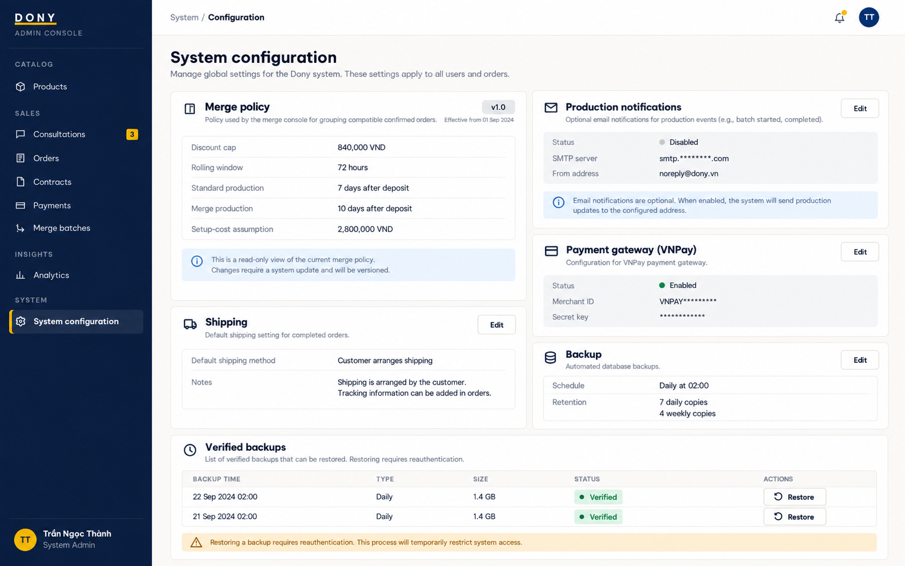

# Screen Spec: S39 System Configuration and Backup/Restore

| Field | Value |
|---|---|
| Screen ID | `S39` |
| Screen name | System Configuration and Backup/Restore |
| Actor | System Admin |
| Priority | P3 |
| Belongs to module | [MFG-12](../specs/spec-MFG-12.md) |
| Route | `/system/configuration` |
| Mockup image | img/S39-system_configuration_and_backup_restore_screen.png |
| Status | Resolved implementation specification |

## 1. Purpose

**Shown when:** The System Admin edits typed allowlisted Dony-wide configuration and runs backup/restore operations. Secret fields show status only; merge policy (840,000 VND cap, rolling seven-day pool, Sales Admin final approval/start, and 7/10 production days after deposit) is versioned and read-only here. Restore requires reauthentication, exact backup ID, verified log chain, pre-restore backup and maintenance mode. If provider replay references an order absent from the restored snapshot, do not create a ghost order; log ERROR, alert System Admin and manually refund via VNPay dashboard.

**The user leaves this screen when:** An authorized action in section 5 succeeds, the user follows a role-allowed global route, or they return to the validated originating route.

## 2. Mockup

Written behavior below takes precedence over obsolete sample content.

## 3. Element inventory

| # | Element | Type | Content / data source | Required | Validation |
|---|---|---|---|---|---|
| 1 | Screen heading | Heading | System Configuration and Backup/Restore | Yes | Static route title. |
| 2 | Route | Navigation target | /system/configuration | Yes | Access checked on server. |
| 3 | settings_version / expected_version | Field / control | integer, required on save | As specified | Complete allowlisted configuration validates and activates atomically. |
| 4 | public_company_contacts | Field / control | typed nullable values | As specified | Omit unset phone/social links; never invent business identifiers. |
| 5 | SMTP/VNPay secret references | Field / control | write-only secret-reference strings | As specified | Show configured/not configured only; never reveal secret values. |
| 6 | design_service_fee_vnd | Field / control | integer | As specified | Suggested Complex assessment fee: range 1..9999999999 VND; default 200000. Changes affect future assessments only; Simple uses 0 and existing proposals/accepted fees remain unchanged. |
| 7 | shipping_vnd | Field / control | integer | As specified | Configurable nonnegative VND; default 30000. |
| 8 | merge_discount_policy | Read-only policy summary | MFG-10 policy version | Yes | Display v3 as `min(order_subtotal_vnd, 840000)` per opted-in order; do not present a percentage. MFG-10 owns the canonical formula and constants; this screen only displays the active policy version. |
| 9 | standard_production_days / merge_extra_days | Read-only duration policy | Standard / merge durations | Yes | Fixed at 7 / 3 days; customer promise is production_due_at, not carrier delivery. Merge duration applies only after MFG-10 activation. |
| 10 | daily_backup_time | Field / control | HH:mm, editable | As specified | Asia/Ho_Chi_Minh; default 02:00. |
| 11 | daily_retention_count / weekly_retention_count | Field / control | integers, editable | As specified | Daily 1..30 default 7; weekly 1..12 default 4; retain required transaction logs/assets for all retained bases. |
| 12 | backup_id | Field / control | UUID, required for restore | As specified | Require reauth and exact confirmation; checksum/schema validation and pre-restore backup. |
| 13 | maintenance_mode / restore_lock | Field / control | server state | As specified | One restore at a time; payment callbacks queue durably and replay idempotently. |
| 14 | production_notification_email | Field / control | optional validated email | As specified | Allowlisted Dony-wide notification address; absent value falls back to active Sales Admin recipients. |
| 15 | post-restore orphan payment | Field / control | provider event/resource reference | As specified | Never recreate an order missing from restored database; ERROR audit + System Admin alert + manual VNPay refund. |
| 14 | Save settings | Action | Validate allowlist and complete config version atomically; secrets are reference-only; audit and notify after commit. | Available when authorized | Destination: S39 |
| 15 | Run backup | Action | Queue backup; show state until checksums/schema manifest verified. | Available when authorized | Destination: S39 |
| 16 | Restore backup | Action | Reauthenticate, confirm exact ID, prebackup and enter maintenance; replay callbacks idempotently after validation. | Available when authorized | Destination: S39 |
| 17 | View logs | Action | Open redacted audit viewer. | Available when authorized | Destination: S40 |

## 4. States

| State | What the user sees | Trigger |
|---|---|---|
| Loading | Load the S39 System Configuration and Backup/Restore view model and show labelled progress; keep writes disabled until route data and authorization are resolved. | Request starts |
| Empty | No System Configuration and Backup/Restore records match the current route/filter; preserve inputs and show only the screen’s authorized next action. | Screen has no eligible or matching record |
| Forbidden/not found | Return a safe 401/403/404 for S39 System Configuration and Backup/Restore without revealing inaccessible record, customer, staff or payment details. | 401/403/404 |
| Error | For S39 System Configuration and Backup/Restore, show the API code, message, field_errors and request_id; preserve safe user-entered values. | Request failure |
| Retry | Retry transient reads for S39 System Configuration and Backup/Restore; retry a mutation only with its original idempotency key and identical payload, never as a new side effect. | Recoverable failure |
| Success | Refresh the committed System Configuration and Backup/Restore data and show the next action permitted by its lifecycle and actor. | Valid action commits |
| Conflict | The System Configuration and Backup/Restore data or lifecycle changed concurrently; reload authoritative state and do not replay a stale mutation. | Stale version, duplicate or invalid lifecycle transition |
## 5. Interactions and navigation

| # | Element | User action | System response | Goes to screen |
|---|---|---|---|---|
| 1 | Save settings | Activate | Validate allowlist and complete config version atomically; secrets are reference-only; audit and notify after commit. | S39 |
| 2 | Run backup | Activate | Queue backup; show state until checksums/schema manifest verified. | S39 |
| 3 | Restore backup | Activate | Reauthenticate, confirm exact ID, prebackup and enter maintenance; replay callbacks idempotently after validation. | S39 |
| 4 | View logs | Activate | Open redacted audit viewer. | S40 |

Portal: System Admin. Route: /system/configuration. Back preserves the originating route and filters. Fallback: Customer→S26; Sales Admin→S28; Sales→S20; System Admin→S41; Guest→S01. Enforce role, ownership and assignment before rendering.

## 6. Screen-level rules

| Rule ID | Rule | Source |
|---|---|---|
| SR-001 | Access and ownership are checked server-side; do not trust submitted customer, company, role, price, or provider status. Apply 401/403/404 behavior and the field rules above. | Authorization and data ownership requirements |
| SR-002 | IDs are UUIDs; timestamps are UTC and displayed in Asia/Ho_Chi_Minh; money and quantities are integers. Mutations use expected_version; significant create/sign/pay/batch operations use idempotency keys. | Data representation and concurrency requirements |
| SR-003 | Apply the module lifecycle and validation rules linked below; preserve immutable submitted snapshots. | Module specification |
| SR-004 | Selected product and technical defaults are project implementation decisions; do not invent factual company, author, client-approval, or course identifiers. | Project implementation assumptions |

### Acceptance scenarios

1. Allowlisted settings version activates atomically only after validation and emits audit/notification.
2. Restore requires reauth/confirmation/prebackup; failure keeps maintenance enabled and does not report success.
3. Orphaned provider replay after restore creates no order/payment record and yields ERROR audit, System Admin alert and manual-refund instruction.

## 7. Linked requirements

| FR ID (from the module spec) | What this screen does for it |
|---|---|
| MFG-12/F-SYS-003 | **Backup Data** — Show backup schedule/retention, base/log watermarks, recent jobs, operation lock and available controls. |
| MFG-12/F-SYS-004 | **Backup Data** — Queue verified encrypted snapshot and return backup job state/manifest reference. |
| MFG-12/F-SYS-005 | **Restore Data** — Restore selected verified base plus continuous transaction logs through pre-maintenance watermark under one restore lock. |
| MFG-12/F-SYS-006 | **Config System** — Show typed allowlisted settings, masked write-only secret references, active version and validation guidance; canonical MFG-10 v3 merge policy values are read-only; design_service_fee_vnd is the suggested Complex assessment fee, not a submission charge. |
| MFG-12/F-SYS-007 | **Config System** — Validate entire typed config patch, atomically activate new version and audit; reject fixed policy edits; design_service_fee_vnd changes affect future assessments only, never existing proposals or accepted fees. |
| MFG-12/F-SYS-008 | **Config System** — Notify active admins of committed configuration key names/version/time, excluding secret values. |

## 8. Responsive and accessibility notes

Support 360px through desktop; stack columns and use labelled horizontal-scroll tables on narrow screens. Controls are keyboard-operable with visible focus, logical headings, associated form labels, and aria-live status/error announcements. Text contrast is at least 4.5:1 (large text 3:1); pointer targets are at least 24px. Preserve user-entered data after recoverable failures. Confirm destructive actions, disable duplicate submit while pending, and enforce idempotency on the server.

## 9. Open questions

| # | Question | Blocking? | Status |
|---|---|---|---|
| 1 | No unresolved screen behavior questions remain; routes, fields, permissions, and defaults are resolved in this specification and its linked module requirements. | No | Resolved |

## Completion checklist

- [x] Route, actor, module, priority, and mockup status are identified.
- [x] Element fields, actions, validation, and data ownership are documented.
- [x] Loading, empty, forbidden, error, retry, success, and conflict states are documented.
- [x] Navigation and acceptance scenarios are explicit.
- [x] Responsive and accessibility requirements follow the shared baseline.
- [x] No unresolved screen-level decisions remain.
