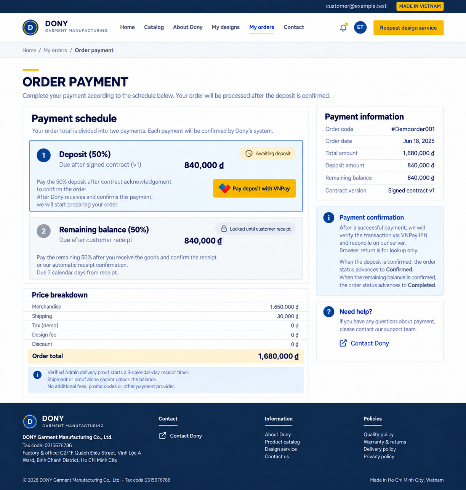

# Screen Spec: S40 Order Payment

| Field | Value |
|---|---|
| Screen ID | `S40` |
| Screen name | Order Payment |
| Actor | Customer owner |
| Priority | Must (MVP) |
| Belongs to module | [MFG-06](../specs/spec-MFG-06.md) |
| Route | `/orders/{order_id}/payment` |
| Mockup image | `img/S40-01-order-payment.png` |
| Status | Resolved implementation specification |

## 1. Purpose

**Shown when:** The customer pays exactly one server-derived installment through VNPay: `DEPOSIT` after signing, or `BALANCE` after delivery receipt is recorded. Browser returns trigger status polling; verified callbacks alone settle payment. Retry is isolated by order and purpose.

**The user leaves this screen when:** An authorized action in section 5 succeeds, the user follows a role-allowed global route, or they return to the validated originating route.

## 2. Mockup

This mockup predates the current payment contract. Do not reproduce any promo-code, marketing-consent or second merge-consent controls visible in it; the current element inventory below is authoritative, and MVP payment is standard-order deposit or balance only.

The mockup illustrates the defined workflow. Fictional sample values do not replace the field, lifecycle and release-scope rules below.

### Mockup deviations

- Hide the header/footer “Request design service” entry in MVP; S24 is post-MVP.

## 3. Element inventory

| # | Element | Type | Content / data source | Required | Validation |
|---|---|---|---|---|---|
| 1 | Screen heading | Heading | Order Payment | Yes | Static route title. |
| 2 | Route | Navigation target | /orders/{order_id}/payment | Yes | Access checked on server. |
| 3 | order_id / order_number / purpose | Field / control | UUID / read-only order reference / DEPOSIT or BALANCE, required | As specified | Show `order_number` (MFG-06 BR-017) on the payment and receipt views; it is display-only and never replaces the order or payment-attempt reference sent to VNPay. Customer owns order; DEPOSIT requires Signed contract and AwaitingDeposit; BALANCE requires receipt evidence and DeliveredAwaitingBalance. |
| 4 | subtotal_vnd | Field / control | integer, required | As specified | Immutable quote/order snapshot; sum quantity times unit price plus option surcharges. |
| 5 | merge_discount_vnd | Field / control | integer VND, required | As specified | MVP is standard-order only: always 0 because `merge_opt_in=false`. After MFG-10 activation, an eligible accepted flexible immutable quote may carry `min(floor(subtotal_vnd*5/100),250000)`; otherwise 0. Never recalculate from a percentage at payment time. |
| 6 | shipping_vnd | Field / control | integer, required | As specified | 30000 VND snapshot. |
| 7 | merge_fee_vnd | Field / control | integer, required | As specified | 0 VND. |
| 8 | tax_vnd | Field / control | integer, required | As specified | 0 VND under classroom demo pricing assumption. |
| 9 | total_vnd / payable_amount_vnd | Field / control | integer, required | As specified | Show immutable contract total and exact installment. Deposit is floor(total × snapshotted percent / 100); balance is total minus accepted deposit and accepted order credit. |
| 10 | payment_method | Field / control | enum | As specified | VNPay only in this release; external sandbox/provider route. |
| 11 | transaction_id | Field / control | UUID | As specified | Returned browser route is lookup-only; poll status, never mark paid from browser. |
| 12 | Idempotency-Key | Field / control | UUID, required on initiation | As specified | Same key/payload returns same attempt; changed payload conflicts. |
| 13 | promo_code/marketing_consent/second merge consent | Field / control | absent | As specified | No promo controls; merge policy is already snapshotted at order submission. |
| 14 | Initiate/retry payment | Action | Reuse active Pending attempt for this order/purpose or create a new reference after failure; use exact server amount; zero remaining balance creates no BALANCE attempt. | Available when authorized | Destination: External VNPay |
| 15 | Browser return | Action | Ignore claimed success, poll authoritative transaction. | Available when authorized | Destination: S40 |
| 16 | Verified success | Action | DEPOSIT success shows `Confirmed`; BALANCE success shows `Completed`. | Available when authorized | Destination: S35 |
| 17 | Failed/expired/processing | Action | Keep `AwaitingDeposit` or `DeliveredAwaitingBalance`; show retry/processing without false success. | Available when authorized | Destination: S40 |
| 18 | design_fee_vnd | Read-only price line | Integer VND from immutable order snapshot | Yes | Component of contract total; never charged again as a standalone service or duplicated between installments. |

## 4. States

**Loading, access, errors and retry:** Show a labelled Loading state while reads resolve. A missing or inaccessible route returns a safe 401/403/404 without disclosing protected records. Error states show the API code, message, field_errors and request_id while preserving safe input. Retry transient reads; retry a mutation only with the original idempotency key and identical payload. Preserve safe user input after recoverable failures.

| State | What the user sees | Trigger |
|---|---|---|
| Empty | Show current deposit/balance due and no payment attempts; render no promo-code or marketing-consent controls. | Screen has no eligible or matching record |
| Success | Update payment status only from verified provider evidence; display the correct remaining deposit/balance. | Valid action commits |
| Conflict | Payment state changed or idempotency key conflicts: query provider result and never create a second charge. | Stale version, duplicate or invalid lifecycle transition |
## 5. Interactions and navigation

| # | Element | User action | System response | Goes to screen |
|---|---|---|---|---|
| 1 | Initiate/retry payment | Activate | Reuse/create an attempt for the exact order/purpose and server amount. | External VNPay |
| 2 | Browser return | Activate | Ignore claimed success, poll authoritative transaction. | S40 |
| 3 | Verified success | Activate | Show purpose-specific receipt and `Confirmed` or `Completed`. | S35 |
| 4 | Failed/expired/processing | Activate | Preserve the purpose-specific payable state and offer safe retry/polling. | S40 |

Portal: Customer owner. Route: /orders/{order_id}/payment. Back preserves the originating route and filters. 

## 6. Screen-level rules

| Rule ID | Rule | Source |
|---|---|---|
| SR-001 | Check access and ownership on the server; never trust submitted customer, company, role, price, stage or provider status. Apply the documented 401/403/404 behavior and field rules. | Project baseline |
| SR-002 | IDs are UUIDs; timestamps are UTC and displayed in Asia/Ho_Chi_Minh; money and quantities are integers. Mutations use expected versions and idempotency keys where specified. | Project baseline |
| SR-003 | Apply the owning module's lifecycle and validation rules; preserve immutable submitted snapshots and design versions. | Project baseline |
| SR-004 | Use documented project assumptions; do not invent factual company, author, client-approval or course identifiers. | Project baseline |

### Acceptance scenarios

1. Signed/`AwaitingDeposit` exposes only the exact DEPOSIT; accepted callback advances once to `Confirmed`.
2. Receipt-confirmed/`DeliveredAwaitingBalance` with positive balance exposes only the exact BALANCE; accepted callback advances once to `Completed`. With zero balance, MFG-06 completes automatically, no provider attempt is created, and S40 shows the authoritative completed state with navigation to S35.
3. Browser return cannot mark paid; failed/expired attempts preserve the current order state and enable purpose-specific retry.

## 7. Linked requirements

| FR ID (from the module spec) | What this screen does for it |
|---|---|
| MFG-06/F-PAY-002 | **Finalize Order** — Recompute quote from validated quantities/address with 30-minute expiry; in MVP force merge_opt_in=false and merge_discount_vnd=0; enable the versioned MFG-10 v4 final demo policy branch only after MFG-10 activation. Derive separate design_fee_vnd from request provenance and allocation state. |
| MFG-06/F-PAY-004 | **Make Payment** — Initiate one purpose-specific `DEPOSIT` or `BALANCE` payment attempt for its exact stored payable amount and return hosted-provider redirect details. |
| MFG-06/F-PAY-005 | **Make Payment** — Verify and deduplicate provider notifications by order and purpose; accept settlement once, perform the purpose-specific order transition, and support authorized reconciliation/refunds without resurrecting cancelled orders. |
| MFG-06/F-PAY-006 | **Make Payment** — Show the owner's purpose-specific receipt/state, amount and commercial breakdown with S40 navigation; browser return remains read-only. |

## 8. Responsive and accessibility notes

Support 360px through desktop; stack columns and use labelled horizontal-scroll tables on narrow screens. Controls are keyboard-operable with visible focus, logical headings, associated form labels, and aria-live status/error announcements. Text contrast is at least 4.5:1 (large text 3:1); pointer targets are at least 24px. Preserve user-entered data after recoverable failures. Confirm destructive actions, disable duplicate submit while pending, and enforce idempotency on the server.

## 9. Open questions

| # | Question | Blocking? | Status |
|---|---|---|---|
| 1 | No unresolved screen behavior questions remain; routes, fields, permissions, and defaults are resolved in this specification and its linked module requirements. | No | Resolved |

## Completion checklist

- [x] Route, actor, module, priority, and mockup status are identified.
- [x] Element fields, actions, validation, and data ownership are documented.
- [x] Loading, empty, forbidden, error, retry, success, and conflict states are documented.
- [x] Navigation and acceptance scenarios are explicit.
- [x] Responsive and accessibility requirements are documented in this screen.
- [x] No unresolved screen-level decisions remain.
