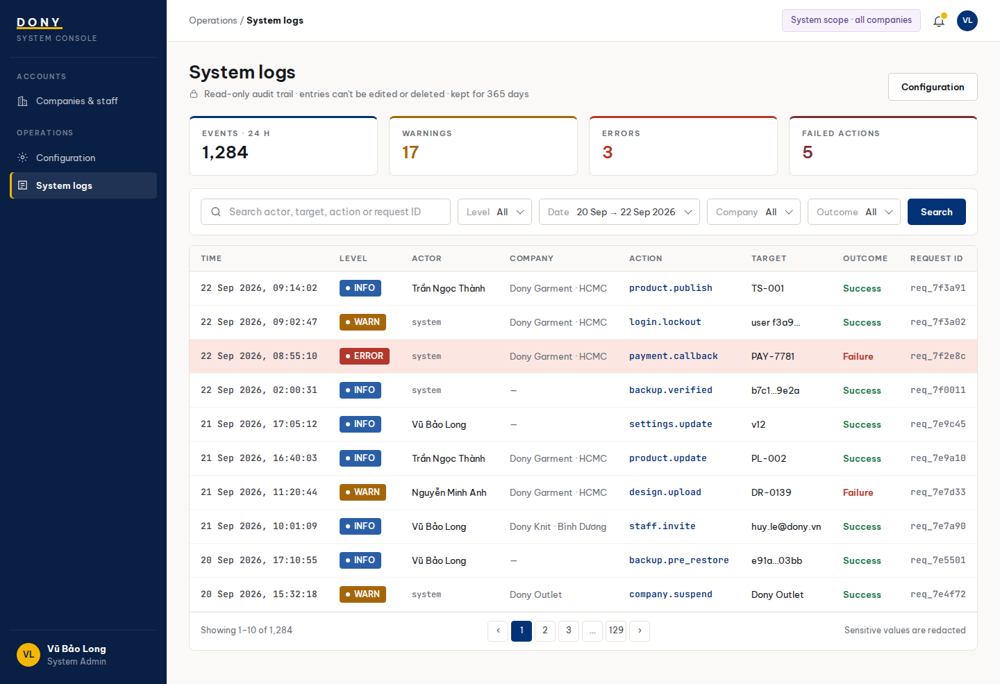

# Screen Spec: S40 System Log Viewer

| Field | Value |
|---|---|
| Screen ID | `S40` |
| Screen name | System Log Viewer |
| Actor | System Admin |
| Priority | P3 |
| Belongs to module | [MFG-12](../specs/spec-MFG-12.md) |
| Route | `/system/logs` |
| Mockup image | img/S40-system_log_viewer_screen.png |
| Status | Resolved implementation specification |

## 1. Purpose

**Shown when:** The System Admin searches append-only, redacted audit events by severity, date range and allowlisted event fields. Severity is INFO, WARN or ERROR; entries cannot be edited or deleted. All identifiers and permissions come from the server session; list filters are allowlisted and recoverable failures preserve entered values.

**The user leaves this screen when:** An authorized action in section 5 succeeds, the user follows a role-allowed global route, or they return to the validated originating route.

## 2. Mockup

Written behavior below takes precedence over obsolete sample content.

## 3. Element inventory

| # | Element | Type | Content / data source | Required | Validation |
|---|---|---|---|---|---|
| 1 | Screen heading | Heading | System Log Viewer | Yes | Static route title. |
| 2 | Route | Navigation target | /system/logs | Yes | Access checked on server. |
| 3 | level | Field / control | enum, optional | As specified | INFO, WARN, ERROR only; derived server-side, no DEBUG selector. resolved log rule |
| 4 | date_from/date_to | Field / control | ISO-8601 timestamps, optional | As specified | Range validated; UTC stored, Asia/Ho_Chi_Minh displayed; max range policy enforced. |
| 5 | search_query | Field / control | trimmed string, optional | As specified | Search allowlisted actor/target/action/request_id fields only. |
| 6 | buyer_organization_id/target_id/action/outcome | Field / control | allowlisted filters | As specified | System Admin only; optional organization is event context, not a tenant; redact sensitive target details and secrets. |
| 7 | audit row | Field / control | read-only event | As specified | Actor, company, target, action, outcome, request_id, timestamp. Append-only. |
| 8 | retention | Field / control | 365 days | As specified | Expired audit events are not returned. |
| 9 | Search logs | Action | Query append-only redacted events by allowlisted filters. | Available when authorized | Destination: S40 |
| 10 | Open target | Action | Navigate only when current System Admin is authorized for target; otherwise show redacted event detail here. | Available when authorized | Destination: authorized detail or S40 |
| 11 | Configuration | Action | Open settings and operations. | Available when authorized | Destination: S39 |

## 4. States

| State | What the user sees | Trigger |
|---|---|---|
| Loading | Load the S40 System Log Viewer view model and show labelled progress; keep writes disabled until route data and authorization are resolved. | Request starts |
| Empty | Show no audit events for the allowlisted query and preserve query filters. | Screen has no eligible or matching record |
| Forbidden/not found | Return a safe 401/403/404 for S40 System Log Viewer without revealing inaccessible record, customer, staff or payment details. | 401/403/404 |
| Error | For S40 System Log Viewer, show the API code, message, field_errors and request_id; preserve safe user-entered values. | Request failure |
| Retry | Retry transient reads for S40 System Log Viewer; retry a mutation only with its original idempotency key and identical payload, never as a new side effect. | Recoverable failure |
| Success | Refresh the committed System Log Viewer data and show the next action permitted by its lifecycle and actor. | Valid action commits |
| Conflict | The System Log Viewer data or lifecycle changed concurrently; reload authoritative state and do not replay a stale mutation. | Stale version, duplicate or invalid lifecycle transition |
## 5. Interactions and navigation

| # | Element | User action | System response | Goes to screen |
|---|---|---|---|---|
| 1 | Search logs | Activate | Query append-only redacted events by allowlisted filters. | S40 |
| 2 | Open target | Activate | Navigate only when current System Admin is authorized for target; otherwise show redacted event detail here. | authorized detail or S40 |
| 3 | Configuration | Activate | Open settings and operations. | S39 |

Portal: System Admin. Route: /system/logs. Back preserves the originating route and filters. Fallback: Customer→S26; Sales Admin→S28; Sales→S20; System Admin→S41; Guest→S01. Enforce role, ownership and assignment before rendering.

## 6. Screen-level rules

| Rule ID | Rule | Source |
|---|---|---|
| SR-001 | Access and ownership are checked server-side; do not trust submitted customer, company, role, price, or provider status. Apply 401/403/404 behavior and the field rules above. | Authorization and data ownership requirements |
| SR-002 | IDs are UUIDs; timestamps are UTC and displayed in Asia/Ho_Chi_Minh; money and quantities are integers. Mutations use expected_version; significant create/sign/pay/batch operations use idempotency keys. | Data representation and concurrency requirements |
| SR-003 | Apply the module lifecycle and validation rules linked below; preserve immutable submitted snapshots. | Module specification |
| SR-004 | Selected product and technical defaults are project implementation decisions; do not invent factual company, author, client-approval, or course identifiers. | Project implementation assumptions |

### Acceptance scenarios

1. Audit row contains actor/company/target/action/outcome/request id/time without password/token/card data.
2. Search respects date/level filters and 365-day retention; log entries cannot be edited or deleted.

## 7. Linked requirements

| FR ID (from the module spec) | What this screen does for it |
|---|---|
| MFG-12/F-SYS-001 | **System Logs** — Display paginated redacted audit events with allowlisted filters and default last-30-day UTC range. |
| MFG-12/F-SYS-002 | **System Logs** — Search redacted audit events by text, allowlisted fields, severity, date and pagination. |

## 8. Responsive and accessibility notes

Support 360px through desktop; stack columns and use labelled horizontal-scroll tables on narrow screens. Controls are keyboard-operable with visible focus, logical headings, associated form labels, and aria-live status/error announcements. Text contrast is at least 4.5:1 (large text 3:1); pointer targets are at least 24px. Preserve user-entered data after recoverable failures. Confirm destructive actions, disable duplicate submit while pending, and enforce idempotency on the server.

## 9. Open questions

| # | Question | Blocking? | Status |
|---|---|---|---|
| 1 | No unresolved screen behavior questions remain; routes, fields, permissions, and defaults are resolved in this specification and its linked module requirements. | No | Resolved |

## Completion checklist

- [x] Route, actor, module, priority, and mockup status are identified.
- [x] Element fields, actions, validation, and data ownership are documented.
- [x] Loading, empty, forbidden, error, retry, success, and conflict states are documented.
- [x] Navigation and acceptance scenarios are explicit.
- [x] Responsive and accessibility requirements follow the shared baseline.
- [x] No unresolved screen-level decisions remain.
