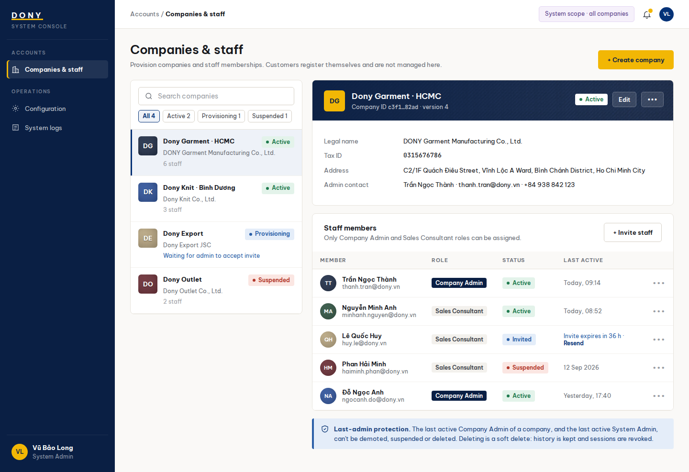

# Screen Spec: S41 Dony Staff Accounts

| Field | Value |
|---|---|
| Screen ID | `S41` |
| Screen name | Dony Staff Accounts |
| Actor | System Admin |
| Priority | P3 |
| Belongs to module | [MFG-03](../specs/spec-MFG-03.md) |
| Route | `/system/staff` |
| Mockup image | img/S41-company_and_staff_accounts_screen.png |
| Status | Resolved implementation specification |

## 1. Purpose

**Shown when:** A System Admin manages accounts for Dony employees, sends invitations, changes roles or employment status and soft-deletes eligible staff while protecting the last active System Admin. Business Buyers and Reseller Shops are customers and never appear here as tenants or staff-account owners. All identifiers and permissions come from the server session; list filters are allowlisted and recoverable failures preserve entered values.

**The user leaves this screen when:** An authorized action in section 5 succeeds, the user follows a role-allowed global route, or they return to the validated originating route.

## 2. Mockup

Written behavior below takes precedence over obsolete sample content.

## 3. Element inventory

| # | Element | Type | Content / data source | Required | Validation |
|---|---|---|---|---|---|
| 1 | Screen heading | Heading | Dony Staff Accounts | Yes | Static route title. |
| 2 | Route | Navigation target | /system/staff | Yes | System Admin authorization checked on server. |
| 3 | staff_account_id / version | Field / control | UUID / integer | As specified | Server-issued; expected_version required for edits. |
| 4 | full_name / work_email | Field / control | strings, required | As specified | Name 1..100; email normalized and globally unique. |
| 5 | role | Field / control | Sales, Sales Admin or System Admin | As specified | Internal Dony role only; Customer cannot be assigned here. |
| 6 | status | Field / control | Invited, Active, Suspended, Deleted | As specified | Deleted is terminal; suspended staff cannot start authenticated actions. |
| 7 | open_work_counts | Read-only summary | assigned customers, requests, orders, payment and production exceptions | When relevant | Unresolved work must be reassigned or resolved before removal. |
| 8 | role/status/query filters | Search and filters | allowlisted enums and bounded text | No | Filters Dony employees only. |
| 9 | API errors | Field / control | standard API error envelope | As specified | 400 malformed; 403 prohibited; 404 inaccessible staff; 409 duplicate/stale/last-admin/open-work; 422 invalid fields. |
| 10 | Add employee | Action | Create one inactive Dony employee and 48-hour single-use invitation with idempotency. | Available when authorized | Destination: S41 |
| 11 | Update employee | Action | Update allowlisted identity, role or status fields; audit and revoke obsolete sessions. | Available when authorized | Destination: S41 |
| 12 | Resend invitation | Action | Invalidate the old invitation and issue a new 48-hour token. | Invited status only | Destination: S41 |
| 13 | Suspend/reactivate | Action | Change employee access after last-admin and open-work checks. | Available when authorized | Destination: S41 |
| 14 | Soft delete | Action | Confirm employee identity and consequences; retain history and revoke sessions. | Eligible staff only | Destination: S41 |

## 4. States

| State | What the user sees | Trigger |
|---|---|---|
| Loading | Load the S41 Dony Staff Accounts view model and show labelled progress; keep writes disabled until route data and authorization are resolved. | Request starts |
| Empty | Show “No staff accounts” and an authorized add-staff action; do not imply external-company tenants. | Screen has no eligible or matching record |
| Forbidden/not found | Return a safe 401/403/404 for S41 Dony Staff Accounts without revealing inaccessible record, customer, staff or payment details. | 401/403/404 |
| Error | For S41 Dony Staff Accounts, show the API code, message, field_errors and request_id; preserve safe user-entered values. | Request failure |
| Retry | Retry transient reads for S41 Dony Staff Accounts; retry a mutation only with its original idempotency key and identical payload, never as a new side effect. | Recoverable failure |
| Success | Refresh the committed Dony Staff Accounts data and show the next action permitted by its lifecycle and actor. | Valid action commits |
| Conflict | The Dony Staff Accounts data or lifecycle changed concurrently; reload authoritative state and do not replay a stale mutation. | Stale version, duplicate or invalid lifecycle transition |
## 5. Interactions and navigation

| # | Element | User action | System response | Goes to screen |
|---|---|---|---|---|
| 1 | Add employee | Activate | Validate unique work email and internal role; create inactive staff account and invitation atomically. | S41 |
| 2 | Update employee | Activate | Apply allowlisted fields with expected-version and last-admin checks; audit committed changes. | S41 |
| 3 | Resend invitation | Activate | Invalidate the prior token and enqueue one replacement invitation. | S41 |
| 4 | Suspend/reactivate | Activate | Change staff access, revoke obsolete sessions and preserve history. | S41 |
| 5 | Soft delete | Activate | Require reassignment of blocking work, confirm identity, revoke sessions and retain history. | S41 |

Portal: System Admin. Route: /system/staff. Back preserves the originating route and filters. Fallback: Customer→S26; Sales Admin→S28; Sales→S20; System Admin→S41; Guest→S01. Enforce role, ownership and assignment before rendering.

## 6. Screen-level rules

| Rule ID | Rule | Source |
|---|---|---|
| SR-001 | Access and ownership are checked server-side; do not trust submitted customer, company, role, price, or provider status. Apply 401/403/404 behavior and the field rules above. | Authorization and data ownership requirements |
| SR-002 | IDs are UUIDs; timestamps are UTC and displayed in Asia/Ho_Chi_Minh; money and quantities are integers. Mutations use expected_version; significant create/sign/pay/batch operations use idempotency keys. | Data representation and concurrency requirements |
| SR-003 | Apply the module lifecycle and validation rules linked below; preserve immutable submitted snapshots. | Module specification |
| SR-004 | Selected product and technical defaults are project implementation decisions; do not invent factual company, author, client-approval, or course identifiers. | Project implementation assumptions |

### Acceptance scenarios

1. Adding an employee creates no company or tenant; the 48-hour invitation accepts only Sales, Sales Admin or System Admin.
2. Public Customer registration cannot grant an internal Dony role.
3. Deleting, suspending or demoting the last active System Admin is rejected; blocking work must be reassigned and soft deletion retains business history.

## 7. Linked requirements

| FR ID (from the module spec) | What this screen does for it |
|---|---|
| MFG-03/F-ACC-001 | **Add Staff Account** — List Dony staff with pagination and role, status and text filters. |
| MFG-03/F-ACC-002 | **Add Staff Account** — Render the employee creation form for an authorized System Admin. |
| MFG-03/F-ACC-003 | **Add Staff Account** — Generate and deliver a hashed, single-use 48-hour Dony employee invitation. |
| MFG-03/F-ACC-004 | **Add Staff Account** — Atomically create one inactive Dony staff account, invitation and outbox event. |
| MFG-03/F-ACC-005 | **Update Staff Account** — Return an authorized Dony employee detail with role, status and open-work counts. |
| MFG-03/F-ACC-006 | **Update Staff Account** — Update allowlisted employee fields, role or status with expected-version checks, last-admin protection and audit. |
| MFG-03/F-ACC-007 | **Delete Staff Account** — Require explicit employee identity and operational-consequence confirmation before removal. |
| MFG-03/F-ACC-008 | **Delete Staff Account** — Soft-delete or deactivate an eligible Dony employee, revoke sessions and retain audit history. |

## 8. Responsive and accessibility notes

Support 360px through desktop; stack columns and use labelled horizontal-scroll tables on narrow screens. Controls are keyboard-operable with visible focus, logical headings, associated form labels, and aria-live status/error announcements. Text contrast is at least 4.5:1 (large text 3:1); pointer targets are at least 24px. Preserve user-entered data after recoverable failures. Confirm destructive actions, disable duplicate submit while pending, and enforce idempotency on the server.

## 9. Open questions

| # | Question | Blocking? | Status |
|---|---|---|---|
| 1 | No unresolved screen behavior questions remain; routes, fields, permissions, and defaults are resolved in this specification and its linked module requirements. | No | Resolved |

## Completion checklist

- [x] Route, actor, module, priority, and mockup status are identified.
- [x] Element fields, actions, validation, and data ownership are documented.
- [x] Loading, empty, forbidden, error, retry, success, and conflict states are documented.
- [x] Navigation and acceptance scenarios are explicit.
- [x] Responsive and accessibility requirements follow the shared baseline.
- [x] No unresolved screen-level decisions remain.
