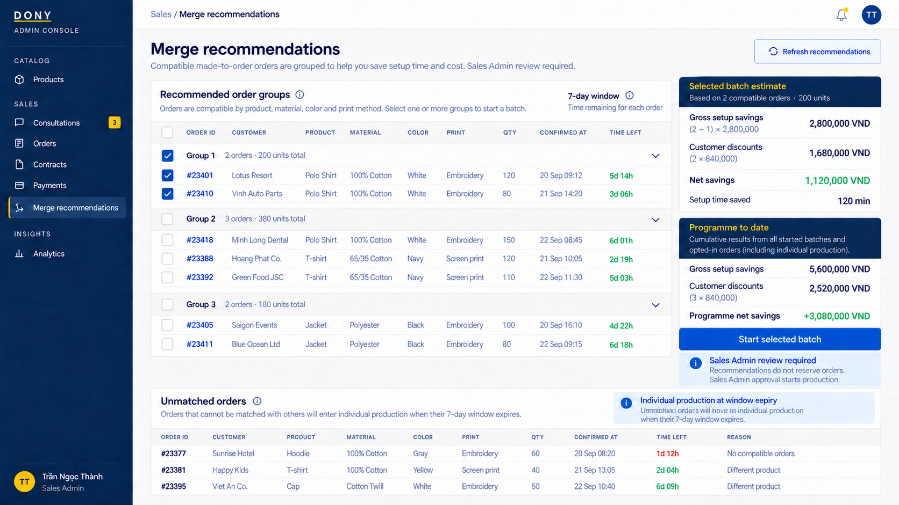

# Screen Spec: S42 Merge Recommendations and Batch Console

| Field | Value |
|---|---|
| Screen ID | `S42` |
| Screen name | Merge Recommendations and Batch Console |
| Actor | Sales Admin |
| Priority | P2 |
| Belongs to module | [MFG-10](../specs/spec-MFG-10.md) |
| Route | `/admin/merge-batches` |
| Mockup image | img/S42-merge_console_screen.png |
| Status | Resolved implementation specification |

## 1. Purpose

**Shown when:** The Sales Admin reviews system-recommended compatible Dony order groups, sees each group's savings estimate (including negative net savings), then explicitly starts or declines a proposed batch. The system cannot start a batch on the Admin's behalf. All identifiers and permissions come from the server session; list filters are allowlisted and recoverable failures preserve entered values.

**The user leaves this screen when:** An authorized action in section 5 succeeds, the user follows a role-allowed global route, or they return to the validated originating route.

## 2. Mockup

This screenshot is obsolete and must be recreated before submission: it depicts a 72-hour window, automatic scheduler batch start, and Planned-batch remove/dissolve actions. The current behavior below is authoritative: seven-day recommendations, Sales Admin final approval/start, and negative savings shown without blocking.

## 3. Element inventory

| # | Element | Type | Content / data source | Required | Validation |
|---|---|---|---|---|---|
| 1 | Screen heading | Heading | Merge Recommendations and Batch Console | Yes | Static route title. |
| 2 | Route | Navigation target | /admin/merge-batches | Yes | Access checked on server. |
| 3 | recommendations / filters | Field / control | product, material, colour, print method, confirmed_at | As specified | System recommends only confirmed-after-deposit, opted-in, uncancelled and unbatched Dony orders whose rolling seven-day windows overlap. Different buyer organizations may share a technically compatible batch. Suggestions reserve no orders. |
| 4 | selected_order_ids | Field / control | UUID array, minimum 2 | As specified | Sales Admin explicitly selects members and starts; server locks/revalidates atomically; total quantity <=10000; all windows must be open; one batch per order. |
| 5 | setup_cost_vnd | Field / control | integer, read-only | As specified | Planning assumption 2800000; selected-batch gross saving=(order_count-1)*2800000. |
| 6 | selected_batch_discount_vnd / selected_batch_net_saving_vnd | Field / control | integer VND | As specified | Selected-batch discount is the sum of immutable member discounts (each ≤840000); selected-batch net=gross-discounts. Under stated assumptions, a compatible batch of at least two has nonnegative setup-only net before other operating costs. |
| 7 | programme_to_date_gross_saving_vnd / discount_vnd / net_saving_vnd | KPI card | integer VND | As specified | Net=actual gross setup savings from started batches minus discounts for all opted-in orders reaching production, including individual fallback; this programme-level value can be negative and must be shown clearly without blocking batch start. |
| 8 | merge_window / fallback status | Field / control | UTC datetime/status | As specified | Show confirmed_at + 7 days window end, earliest due date, live eligible pool and automatic individual-fallback status; no weekday cutoff. |
| 9 | setup_minutes_saved | Field / control | integer, read-only estimate | As specified | Selected batch estimate=(order_count-1)*120; does not alter customer deadline. |
| 10 | batch_status | Field / control | InProduction, Completed | As specified | A batch is created directly as InProduction only after Sales Admin explicitly starts it; membership is immutable after start. |
| 11 | Refresh recommendations | Action | Recompute compatible opted-in Confirmed order groups in overlapping seven-day windows. | Available when authorized | Destination: S42 |
| 12 | Estimate | Action | Compute selected-batch gross/net/discount, quantity and setup minutes; refresh programme-to-date gross/discount/net separately. | Available when authorized | Destination: S42 |
| 13 | Start selected batch | Action | Sales Admin makes the final decision and starts the selected compatible group after reviewing members and savings. | At least two eligible orders selected; all windows open | Destination: S42 |

## 4. States

| State | What the user sees | Trigger |
|---|---|---|
| Loading | Load the S42 Merge Recommendations and Batch Console view model and show labelled progress; keep writes disabled until route data and authorization are resolved. | Request starts |
| Empty | Show no eligible merge recommendations, active policy version, and zero estimated savings. | Screen has no eligible or matching record |
| Forbidden/not found | Return a safe 401/403/404 for S42 Merge Recommendations and Batch Console without revealing inaccessible record, customer, staff or payment details. | 401/403/404 |
| Error | For S42 Merge Recommendations and Batch Console, show the API code, message, field_errors and request_id; preserve safe user-entered values. | Request failure |
| Retry | Retry transient reads for S42 Merge Recommendations and Batch Console; retry a mutation only with its original idempotency key and identical payload, never as a new side effect. | Recoverable failure |
| Success | Create batch only after Sales Admin approval and explicit start; show recalculated savings. | Valid action commits |
| Conflict | Recommendation membership/policy changed: recalculate totals and savings, then require Sales Admin review. | Stale version, duplicate or invalid lifecycle transition |
## 5. Interactions and navigation

| # | Element | User action | System response | Goes to screen |
|---|---|---|---|---|
| 1 | Refresh recommendations | Activate | Query opted-in Confirmed candidates with matching Dony production key and overlapping rolling seven-day windows; no order is reserved. | S42 |
| 2 | Estimate | Activate | Compute gross/net savings, discount total, quantity and setup minutes saved; negative result is shown but does not gate operation. | S42 |
| 3 | Start selected batch | Activate | Revalidate Admin authority, all order versions, eligibility, quantity and window deadlines; atomically create an InProduction batch and advance all selected orders. | S42 |

Portal: Sales Admin. Route: /admin/merge-batches. Back preserves the originating route and filters. Fallback: Customer→S26; Sales Admin→S28; Sales→S20; System Admin→S41; Guest→S01. Enforce role, ownership and assignment before rendering.

## 6. Screen-level rules

| Rule ID | Rule | Source |
|---|---|---|
| SR-001 | Access and ownership are checked server-side; do not trust submitted customer, company, role, price, or provider status. Apply 401/403/404 behavior and the field rules above. | Authorization and data ownership requirements |
| SR-002 | IDs are UUIDs; timestamps are UTC and displayed in Asia/Ho_Chi_Minh; money and quantities are integers. Mutations use expected_version; significant create/sign/pay/batch operations use idempotency keys. | Data representation and concurrency requirements |
| SR-003 | Apply the module lifecycle and validation rules linked below; preserve immutable submitted snapshots. | Module specification |
| SR-004 | Promise production_due_at at deposit +7 calendar days for standard production and +10 for merge. Setup-time savings never shorten this customer promise; if no Sales Admin-started batch includes the order within seven days of confirmed_at, scheduler starts individual production at the promised merge discount. | Project implementation assumptions |
| SR-005 | Selected product and technical defaults are project implementation decisions; do not invent factual company, author, client-approval, or course identifiers. | Project implementation assumptions |

### Acceptance scenarios

1. Recommendations do not reserve orders. Sales Admin is the only actor who can start a batch; starting atomically revalidates at least two eligible Dony orders and total quantity <=10000.
2. Programme-to-date net savings include discounts on fallback orders; a negative value remains clearly visible and does not block batch start or require separate acknowledgement. Keep this distinct from selected-batch net savings.
3. If no Admin-started batch includes an order by its seven-day window end, scheduler starts individual production; the opted-in discount and merge due-date snapshot remain unchanged.

## 7. Linked requirements

| FR ID (from the module spec) | What this screen does for it |
|---|---|
| MFG-10/F-MER-004 | **View Eligible** — Recommend compatible Dony order groups and show exclusion reasons using server-recomputed eligibility, without reserving or starting orders. |
| MFG-10/F-MER-005 | **View Eligible** — Compute selected-batch gross/discount/net, quantity, setup minutes and due-date estimates; separately report programme-to-date net including discounts on fallback orders; show negative programme net without blocking. |
| MFG-10/F-MER-006 | **Confirm Merge** — System recommends eligible groups; Sales Admin makes the final decision and explicitly starts a revalidated batch; individual fallback starts automatically after the rolling seven-day window. |
| MFG-10/F-MER-007 | **Confirm Merge** — Notify each customer and production planning after committed batch events, deduplicating recipients. |

## 8. Responsive and accessibility notes

Support 360px through desktop; stack columns and use labelled horizontal-scroll tables on narrow screens. Controls are keyboard-operable with visible focus, logical headings, associated form labels, and aria-live status/error announcements. Text contrast is at least 4.5:1 (large text 3:1); pointer targets are at least 24px. Preserve user-entered data after recoverable failures. Confirm destructive actions, disable duplicate submit while pending, and enforce idempotency on the server.

## 9. Open questions

| # | Question | Blocking? | Status |
|---|---|---|---|
| 1 | No unresolved screen behavior questions remain; routes, fields, permissions, and defaults are resolved in this specification and its linked module requirements. | No | Resolved |

## Completion checklist

- [x] Route, actor, module, priority, and mockup status are identified.
- [x] Element fields, actions, validation, and data ownership are documented.
- [x] Loading, empty, forbidden, error, retry, success, and conflict states are documented.
- [x] Navigation and acceptance scenarios are explicit.
- [x] Responsive and accessibility requirements follow the shared baseline.
- [x] No unresolved screen-level decisions remain.
