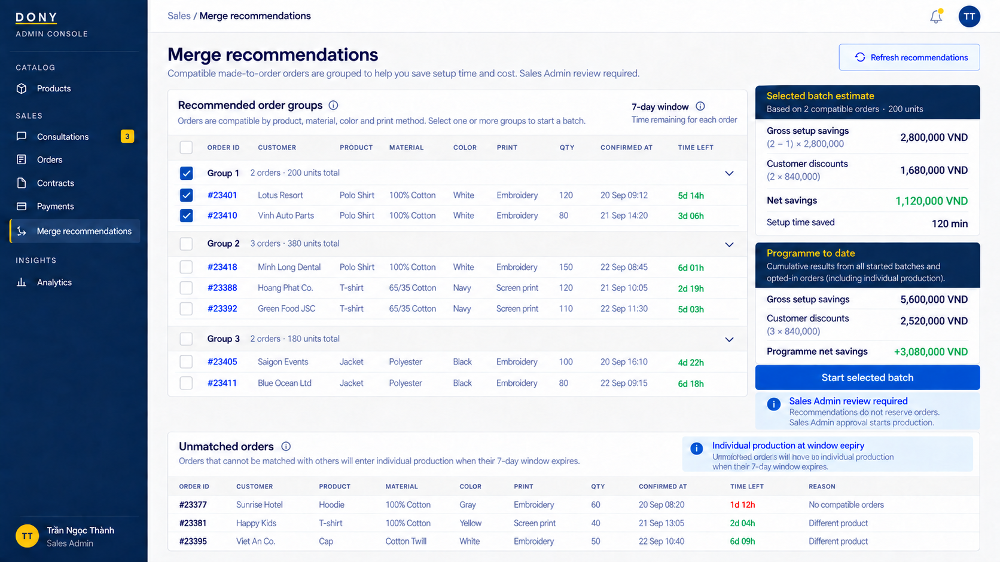

# Screen Spec: S42 Merge Recommendations and Batch Console

| Field | Value |
| --- | --- |
| Screen ID | `S42` |
| Screen name | Merge Recommendations and Batch Console |
| Actor | Sales Admin |
| Priority | P2; post-MVP module |
| Belongs to module | [MFG-10](../specs/spec-MFG-10.md) |
| Route | `/admin/merge-batches` |
| Mockup image | img/S42-merge_console_screen.png |
| Status | Draft aligned with MFG-10 v4 proposal; operational validation required |

## 1. Purpose

Sales Admin reviews compatible open sewing runs first, then flexible groups using saved product eligibility/threshold and quantity/capacity settings. Orders share garment type/material and sewing only; different print/embroidery methods remain separate downstream work. Admin approves every plan, locks and explicitly starts. Scheduler only recommends and notifies; at waiting expiry a flexible order remains flexible and Confirmed until human approval. No speculative individual slot is reserved.

## 2. Mockup

This historical screenshot is obsolete and must be recreated before submission. Written behavior and MFG-10 v4 proposal take precedence over its old timing, automatic batch start and pricing. The new console distinguishes scheduling, lock and actual production.

## 3. Element inventory

| # | Element | Type | Source / validation |
| --- | --- | --- | --- |
| 1 | Open runs and recommendations | Ordered list | Existing ScheduledOpen runs first; ready standard/flexible orders may join. Otherwise show ready flexible groups or individual plans. Suggestions reserve nothing. |
| 2 | Members and readiness | Order list | Saved garment type/material, aggregate quantity, product merge_enabled/small-order threshold, approvals/sample/contract/deposit, separate print/embroidery tasks and versions. Internal staff access only. |
| 3 | Daily capacity and calendar schedule | Feasibility panel | Shared type/material profile and saved garments/day; total quantity; required_workdays=ceil(quantity/capacity); flexible estimate=max(8,required_workdays), excluded if >14. Show residual slots after all approved profile assignments, intended start and each maximum due date. Full-wait terms: 7 working days waiting plus 8–14 production days, Monday–Friday inclusive day-1 counting. Profile editing is in S14, not a duplicate capacity input here; separate decoration needs Admin review. |
| 4 | Avoided setup and labor | Read-only estimate | Genuine avoided setup count; trial 390000 VND and 6 person-hours each. Base-run setup still exists; labor hours are not elapsed completion time. |
| 5 | Coordination / incentives / modeled net | Read-only estimate | Trial 90000 VND once per sewing run; actual immutable incentives=min(floor(subtotal*5/100),250000) per flexible order, zero for standard. Net=gross−coordination−incentives. Recompute whole-run economics after additions. Never count avoided print/embroidery setup when only sewing is shared. |
| 6 | Programme economic report | KPI panel | Started shared runs' gross−coordination−all flexible incentives on production orders, including individual fallback. Distinguish modeled value from observed cost, revenue and realized profit. Negative values remain visible. |
| 7 | Flexible waiting / approval requirement | Deadline/notice panel | Show readiness working day 1, last waiting date (day 7), production-window first date (day 8), estimated finish and accepted maximum (day 21), separately from actual human start. Earlier approved runs may finish sooner; late approval does not reset dates. Keep flexible choice while awaiting approval; no speculative individual reservation. |
| 8 | Batch lifecycle and history | Status panel | ScheduledOpen → Locked → InProduction → Completed. A base run may have one efficient order; new flexible groups need at least two. Assignment is not production. |
| 9 | Refresh / Estimate | Actions | Recompute authoritative readiness, compatibility, feasibility and aggregate run economics; separate programme report. |
| 10 | Approve schedule / Add members | Actions | Sales Admin only; exclusive assignment, order/batch expected versions and idempotency key. Add only to ScheduledOpen with feasible capacity and all existing/new deadlines preserved. |
| 11 | Lock membership | Action | Sales Admin freezes ready membership for preparation; no additions after lock. |
| 12 | Approve individual plan / Start production | Actions | Individual submission requires explicit Sales Admin approval. Starting either a locked shared plan or an approved individual plan requires explicit human confirmation and atomic readiness/quantity/capacity/deadline/version checks. Read/acknowledge notice never starts production. |

### Operational advance-warning input

Sales Admin saves `warning_lead_workdays` as an integer 1–6 for negative-benefit reminders before the seven-working-day waiting expiry. Require this operational setup before activating reminder operation; it does not edit customer incentive/duration terms or approve production. Version/audit changes and use the saved value to calculate a notice date. Scheduler sends deduplicated notices at that date and at expiry; if still unhandled or a committed promise becomes at risk/overdue, keep the item visible for Admin review. Acknowledgement/reading is distinct from plan approval and actual start.

## 4. States

| State | Behavior | Trigger |
| --- | --- | --- |
| Loading | Label progress; disable writes until authorization and authoritative versions load | Request starts |
| Empty | No feasible recommendations; show exclusions, existing run state and policy status. Preserve programme totals even when recommendations are empty | No suitable recommendation |
| Forbidden/not found | Safe 401/403/404 without leaking customer or staff data | Unauthorized access |
| Error | Show safe API code/message/field_errors/request_id and preserve inputs | Request failure |
| Retry | Retry reads; replay mutations only with identical payload/original key | Transient failure |
| Success | Show committed schedule/add/lock/start state; do not label schedule approval as production start | Mutation commits |
| Conflict | Reload authoritative order/batch versions, feasibility and economics for Admin review | Stale versions, competing assignment, cancellation or fallback |
| Approval overdue / missed schedule | Alert Admin and expose original deadline risk without changing preference, route, promise or fulfillment automatically | Unhandled waiting expiry or invalid/late approved plan |

## 5. Interactions and navigation

Refresh/Estimate stays on S42; system recomputes quantity/capacity estimates from saved inputs and decoration details. Approve/Add persists an exclusive planned sewing assignment while orders remain Confirmed. Lock freezes members; explicit start advances all members atomically. At waiting expiry, Admin reviews the notice and approves either a feasible shared plan or an individual plan; only confirmed start changes fulfillment. Negative estimates are shown and alerted before expiry, not automatically rejected. Declining/reading a notice does not approve or extend anything.

Back preserves validated origin and filters; authorized Sales Admin fallback is S28. Enforce Sales Admin authority server-side. UUIDs, integer money, UTC timestamps displayed in Asia/Ho_Chi_Minh, expected versions and idempotency keys follow shared conventions.

### 5.1 Layout and consistency with existing screens

Use the staff navigation, page heading, order table, filter/pagination patterns and role-based actions from [S28 Order List](S28-order_list_admin_screen.md). Use the order identity, read-only commercial snapshot, readiness evidence and event timeline conventions from [S29 Order Detail](S29-order_detail_admin_screen.md). Production-batch badges are separate from canonical order-status badges: ScheduledOpen/Locked must not replace Confirmed in an order row.

Keep scheduling and batch operation within S42 rather than introducing a duplicate screen. The main view shows existing open runs, candidate recommendations and waiting/fallback status. Selecting a run/recommendation opens a detail panel within the same route containing members, shared/separate work, capacity and schedule evidence, per-order deadlines, aggregate economics and audit history. Present the allowed Approve/Add, Lock and Start actions according to the selected state; do not expose edits after lock or production start. Selecting a member's order identity opens S29, subject to fresh authorization, and Back restores S42's selection and filters.

Use [S39 Configuration](S39-system_configuration_and_backup_restore_screen.md)'s read-only policy/version/status pattern for trial parameters. Use [S43 Analytics](S43-analytics_dashboard_screen.md)'s unit, as-of timestamp, coverage and estimate/observed labeling for economic panels; S42 remains the operational view, with no new analytics functionality implied. Committed notifications follow [S38 Notification Panel](S38-notification_panel_screen.md). Customer-facing terminology and promises match [S23](S23-merge_option_screen.md), [S24](S24-merge_terms_screen.md) and the immutable breakdown in [S25](S25-order_summary_screen.md); never copy the internal multi-customer member panel into customer pages.

## 6. Screen-level rules and acceptance scenarios

1. A standard small order can join an open compatible base run at unchanged price and deadline without flexible opt-in. A not-ready small order never delays the base run.
2. ScheduledOpen may receive members after capacity/deadline revalidation. Locked/InProduction/Completed reject additions. Scheduling/locking leaves order state Confirmed.
3. Approved assignments are exclusive and reserve capacity; recommendations do not. Preproduction cancellation releases assignment and invalidates the affected plan/lock for revalidation under MFG-07. InProduction membership is immutable.
4. At waiting expiry, system alerts Sales Admin and requires approval; an unhandled notice leaves the order flexible/Confirmed. Admin approval chooses a shared or individual plan; explicit human start is separate. Retain discount and promised deadline; late approval remains visible as risk rather than extending the promise.
5. Economic examples reconcile to MFG-10: two standard additions +690000; four flexible orders at the 250000 cap +80000; a pair at the cap −200000; individual production at the cap −250000 VND. Count coordination once per shared sewing run. Warn about negative benefit before waiting expiry for Admin review; losses never authorize a system production action.
6. Quantity/capacity example: 350 garments at 50/day requires 7 workdays and displays an 8-workday flexible estimate. At 20/day it requires 18 and is excluded from the 14-day policy; capacity already assigned to other runs is subtracted, not reused. Customer notifications reveal only their own order and commitment. Batch completion never substitutes for order shipping, receipt or payment completion.

## 7. Linked requirements

| FR | Screen responsibility |
| --- | --- |
| MFG-10/F-MER-004 | Existing-run-first recommendations, shared setup, readiness, workload, capacity, deadlines and exclusions |
| MFG-10/F-MER-005 | Gross, coordination, incentives, modeled benefit and all-outcome programme reporting |
| MFG-10/F-MER-006 | Admin schedule/add/lock, approval of individual production and explicit human start; read-only automatic deadline/negative-benefit notices and exclusive audited membership |
| MFG-10/F-MER-007 | Deduplicated, private committed schedule/status notifications |

## 8. Responsive and accessibility notes

Support 360px through desktop, keyboard operation, visible focus, associated labels, logical headings and aria-live errors/status. Stack feasibility panels; use labeled horizontal-scroll tables on narrow screens. Contrast is at least 4.5:1 for text, 3:1 for large text; targets at least 24px. Preserve safe input and prevent duplicate submission.

## 9. Specification status

MFG-10 remains a draft proposal. Trial values are read-only assumptions, not editable configuration or verified factory measurements. Operating parameters require confirmation before implementation.

## Completion checklist

- [x] Existing-run priority, standard/flexible distinction and lifecycle are documented.
- [x] Feasibility, economics, privacy, cancellation and concurrency are linked.
- [x] Quote incentives and fallback are preserved across outcomes.
- [x] User decisions fix daily-capacity units, separate waiting/production clocks and explicit human approval/start; factory estimates remain subject to operational validation.
- [ ] Recreate historical screenshot before submission.
