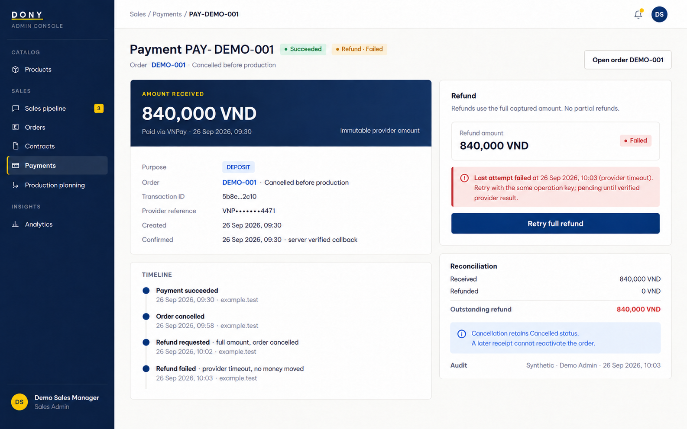

# Screen Spec: S42 Payment Transaction Detail

| Field | Value |
|---|---|
| Screen ID | `S42` |
| Screen name | Payment Transaction Detail |
| Actor | Sales Admin |
| Priority | Should (MVP); in-system refund actions are Could |
| Belongs to module | [MFG-06](../specs/spec-MFG-06.md) |
| Route | `/admin/payments/{payment_id}` |
| Mockup image | img/S42-01-payment-transaction-detail.png |
| Status | Resolved implementation specification |

## 1. Purpose

**Shown when:** The Sales Admin inspects a Dony DEPOSIT or BALANCE transaction’s immutable provider and reconciliation details and may retry only an authorized refund amount that does not exceed captured refundable funds. All identifiers and permissions come from the server session.

**The user leaves this screen when:** An authorized action in section 5 succeeds, the user follows a role-allowed global route, or they return to the validated originating route.

**MVP scope:** view and reconcile DEPOSIT/BALANCE transactions only. MVP creates no in-system refunds (MFG-06 BR-019); refund fields show `None` or the `manual_refund_required` flag, and refund actions below are Could.

## 2. Mockup

The mockup illustrates the defined workflow. Fictional sample values do not replace the field, lifecycle and release-scope rules below.

## 3. Element inventory

| # | Element | Type | Content / data source | Required | Validation |
|---|---|---|---|---|---|
| 1 | Screen heading | Heading | Payment Transaction Detail | Yes | Static route title. |
| 2 | Route | Navigation target | /admin/payments/{payment_id} | Yes | Access checked on server. |
| 3 | payment_id / buyer_organization_id | Field / control | UUID / optional server-derived UUID | As specified | Payment belongs to its Customer/order; buyer organization is contextual billing data and inaccessible IDs return 404. |
| 4 | purpose / resource_id | Field / control | DEPOSIT or BALANCE / order UUID | As specified | Immutable purpose and read-only link to originating order. |
| 5 | amount_vnd / currency | Field / control | integer / VND | As specified | Immutable provider amount; show full value to authorized Dony admin. |
| 6 | provider_reference / transaction_id | Field / control | redacted text / UUID | As specified | Mask secrets and sensitive provider references. |
| 7 | refund_status / refund_amount_vnd | Field / control | None, Pending, Succeeded, Failed / integer VND | As specified | Server derives the refundable amount from payment purpose and stored policy; it cannot exceed accepted captured funds. |
| 8 | expected_version / Idempotency-Key | Field / control | integer / UUID | As specified | Refund initiation is idempotent; retry same key/payload only after eligible provider failure. |
| 9 | Initiate/retry refund | Action (Could; hidden in MVP) | Use server-calculated refundable amount; idempotently request provider; status remains Pending until verified. | Available when authorized | Destination: S42 |
| 10 | Open related order | Action | Navigate only if company and resource authorization passes. | Available when authorized | Destination: S37 |

## 4. States

**Loading, access, errors and retry:** Show a labelled Loading state while reads resolve. A missing or inaccessible route returns a safe 401/403/404 without disclosing protected records. Error states show the API code, message, field_errors and request_id while preserving safe input. Retry transient reads; retry a mutation only with the original idempotency key and identical payload. Preserve safe user input after recoverable failures.

| State | What the user sees | Trigger |
|---|---|---|
| Empty | Not applicable to this single-record route; a missing or inaccessible record uses Forbidden/not found. | The route identifies one record. |
| Success | Refresh the committed Payment Transaction Detail data and show the next action permitted by its lifecycle and actor. | Valid action commits |
| Conflict | The Payment Transaction Detail data or lifecycle changed concurrently; reload authoritative state and do not replay a stale mutation. | Stale version, duplicate or invalid lifecycle transition |
## 5. Interactions and navigation

| # | Element | User action | System response | Goes to screen |
|---|---|---|---|---|
| 1 | Initiate/retry refund | Activate | Submit the server-calculated eligible amount; status remains Pending until verified. | S42 |
| 2 | Open related order | Activate | Navigate only if company and resource authorization passes. | S37 |

Portal: Sales Admin. Route: /admin/payments/{payment_id}. Back preserves the originating route and filters. 

## 6. Screen-level rules

| Rule ID | Rule | Source |
|---|---|---|
| SR-001 | Check access and ownership on the server; never trust submitted customer, company, role, price, stage or provider status. Apply the documented 401/403/404 behavior and field rules. | Project baseline |
| SR-002 | IDs are UUIDs; timestamps are UTC and displayed in Asia/Ho_Chi_Minh; money and quantities are integers. Mutations use expected versions and idempotency keys where specified. | Project baseline |
| SR-003 | Apply the owning module's lifecycle and validation rules; preserve immutable submitted snapshots and design versions. | Project baseline |
| SR-004 | Use documented project assumptions; do not invent factual company, author, client-approval or course identifiers. | Project baseline |

### Acceptance scenarios

1. Eligible policy-based refund moves to Pending and succeeds only on a verified provider result.
2. Client cannot choose the refund amount; an amount above captured refundable funds is impossible, and duplicate same-key request returns the same operation.

## 7. Linked requirements

| FR ID (from the module spec) | What this screen does for it |
|---|---|
| MFG-06/F-PAY-005 | **Make Payment** — Verify and deduplicate provider notifications by order and purpose; accept settlement once, perform the purpose-specific order transition, and support authorized reconciliation/refunds without resurrecting cancelled orders. |
Additional linked modules: [MFG-06](../specs/spec-MFG-06.md).

## 8. Responsive and accessibility notes

Support 360px through desktop; stack columns and use labelled horizontal-scroll tables on narrow screens. Controls are keyboard-operable with visible focus, logical headings, associated form labels, and aria-live status/error announcements. Text contrast is at least 4.5:1 (large text 3:1); pointer targets are at least 24px. Preserve user-entered data after recoverable failures. Confirm destructive actions, disable duplicate submit while pending, and enforce idempotency on the server.

## 9. Open questions

| # | Question | Blocking? | Status |
|---|---|---|---|
| 1 | No unresolved screen behavior questions remain; routes, fields, permissions, and defaults are resolved in this specification and its linked module requirements. | No | Resolved |

## Completion checklist

- [x] Route, actor, module, priority, and mockup status are identified.
- [x] Element fields, actions, validation, and data ownership are documented.
- [x] Loading, empty, forbidden, error, retry, success, and conflict states are documented.
- [x] Navigation and acceptance scenarios are explicit.
- [x] Responsive and accessibility requirements are documented in this screen.
- [x] No unresolved screen-level decisions remain.
