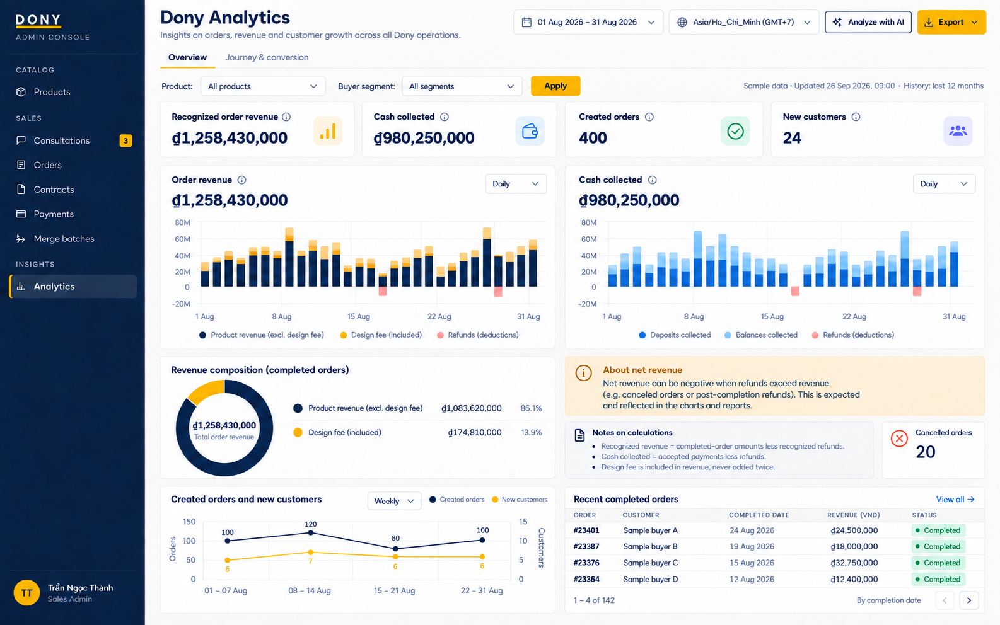
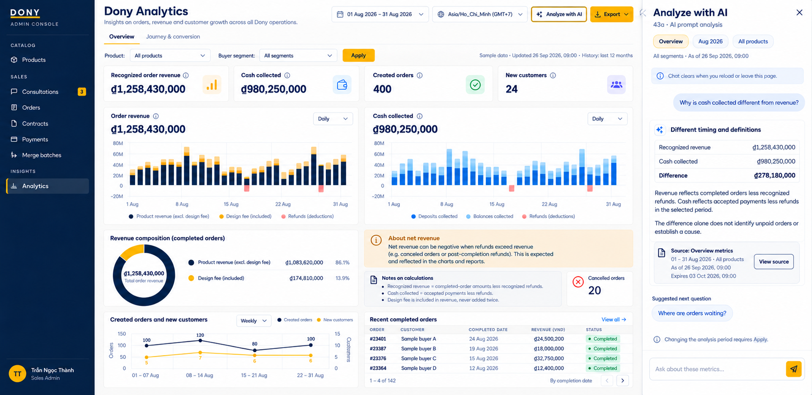
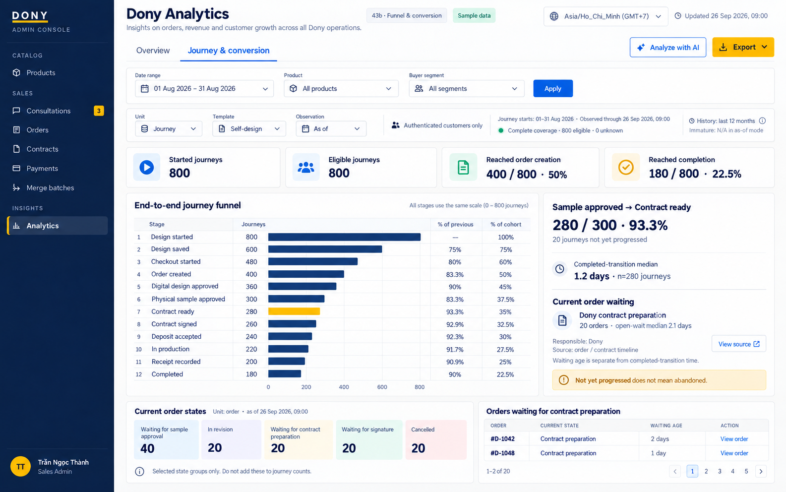

# Screen Spec: S43 Analytics Dashboard

| Field | Value |
| --- | --- |
| Screen ID | `S43` |
| Screen name | Analytics Dashboard |
| Actor | Sales Admin |
| Priority | P2; Should release target per README |
| Belongs to module | [MFG-11](../specs/spec-MFG-11.md) |
| Route | `/admin/analytics` |
| Mockup images | img/S43-overview_dashboard.png (Overview); img/S43a-ai_prompt_analysis.png (43a); img/S43b-funnel_conversion.png (43b) |
| Status | Product choices confirmed; runtime configuration follows Plan |

## 1. Purpose

Sales Admin views Dony's business performance and conversion/waiting evidence, asks supported questions and exports the selected result. Customer-behavior analysis is explicitly labeled Authenticated customers only; the dashboard does not claim to include guest browsing. S43 uses the internal Dony CRM navigation and visual identity. Customer, Sales and System Admin cannot access this screen through navigation, direct URL, API, AI result or export links.

Use two tabs, **Tổng quan / Overview** and **Hành trình & chuyển đổi / Journey & conversion**, with a header **Phân tích bằng AI / Analyze with AI** action. AI opens in a right-side panel on desktop and a dedicated full-width view on narrow screens, preserving chart/filter state. It does not replace the main dashboard or become a large persistent prompt box above the charts.

## 2. Mockups

The following mockups illustrate three states of S43: **Overview**, **43a — AI panel open**, and **43b — Journey & conversion**. The labels 43a and 43b identify view states, not additional screen IDs or routes. Sample dates, amounts and counts illustrate the layout; they do not define default filters, expected metric values or test fixtures. Sections 3–8 define the screen behavior, including states not pictured here.

### 2.1 S43 — Overview dashboard

Overview is the default tab, with the AI panel closed on initial entry. It displays recognized revenue, cash collected, created orders and new customers for the applied reporting period, with cancellations shown separately. Supporting content includes revenue and cash trends, the design-fee component of revenue, order/customer trends, metric explanations and a paginated order table whose date basis is labeled. Revenue components do not overlap or add the design fee twice. The header contains the Overview and Journey & conversion tabs, with Analyze with AI immediately to the left of Export. Date, product and buyer filters update the reporting context only when Apply succeeds.

### 2.2 43a — AI prompt analysis (F-DA-006)

Selecting Analyze with AI opens a right-side panel while retaining the active tab, applied filters and displayed result. The illustrated state starts from the Overview in section 2.1; the same action is available on Journey & conversion. Opening or closing the panel does not run a new metric query or change the dashboard data. The panel contains context chips, suggested questions, a prompt field and answers with metric definitions, source actions, snapshot time and result expiry. A notice explains that the conversation is cleared when the page is reloaded or left. The layout adapts to the available width as specified in section 8. Loading, clarification, unavailable, forbidden and expired-result states follow section 4.

### 2.3 43b — Funnel and conversion (F-DA-004)

Journey & conversion displays the selected entry cohort, measurement unit, observation mode and coverage. Horizontal bars show milestone counts, previous-step conversion and conversion from the cohort entry. Selecting a step opens its transition and waiting details. Completed-transition durations and current order waiting have separate units, sample sizes and cutoffs. The supporting table lists authorized orders in the selected current-state group. This example uses an authenticated self-design journey cohort in as-of mode; other templates, order/product-entry units and fixed-follow-up comparisons are available under the rules in sections 3–6.

## 3. Element inventory and layout

| Element | Content / behavior | Validation |
| --- | --- | --- |
| Header and tabs | Dashboard title, two tabs, Analyze with AI immediately to the left of Export | Sales Admin; selected tab and filters survive authorized back navigation |
| Shared filters | Local date range, product, supported buyer segment/organization; explicit Apply | The date picker displays both endpoint dates inclusively; the request sends start_date and exclusive end_date equal to the selected last date plus one local day. Default last 30 days within the rolling last 12 calendar months; max span 366 days; bounds from MFG-11 5.7. Historical products remain selectable; organization is not tenancy |
| Reporting context | Authenticated-only scope, unit, date basis, observation cutoff where relevant, data timestamp, timezone, coverage and result expiry | Overview period events and funnel entry cohorts have different labels; disclose missing/partial tracking |
| Overview KPI row | Recognized revenue, cash collected, created orders, new customers; cancellation count separately | Exact MFG-11 BR-001/002. Cancellations are cancelled orders from the selected created-order cohort by the result cutoff, not all cancellation events during the period. Fee revenue is included in revenue |
| Business trends | Revenue and cash as separate time series; created orders/new customers in separately labeled series or small charts | No stacked revenue-plus-cash total; no unlabeled mixed scales; negative net amounts remain visible |
| Fee component | Labeled amount/share of recognized revenue | Show amount even if zero/negative; omit misleading percentage/donut when total is nonpositive or net components do not form a valid share |
| Overview supporting orders | Authorized records for the declared metric/date basis, with pagination | A Recent completed orders table uses completed_at and is labeled accordingly; it does not reconcile the Created orders KPI or the created-order export. Prior-period-order refunds may also affect revenue. Navigate to S29 after authorization |
| Funnel controls | Authenticated product-entry cohort, explicit journey template or independent order cohort; show unit, observed-through time and as_of/fixed-follow-up mode | Service/merge availability follows owning modules; correlation rules follow MFG-11 5.3; missing historical links are unavailable, not an empty funnel; no guest option |
| Funnel summary | Full entry count, eligible count, immature count in fixed-follow-up mode, coverage exclusions, final-stage conversion and separately scoped current waiting/terminal counts | As-of mode has no maturity threshold; immature is N/A. A tracked entry with no later conversion remains in the denominator when coverage is complete. Label product entries, intents and orders separately |
| Main funnel | Horizontal bars on a common count scale with milestone labels; count, previous-step conversion and cohort conversion | Typed counts from MFG-11; N/A for denominator zero; selected step opens detail |
| Step detail | Waiting-state breakdown, responsible actor/source, completed-transition median with sample size, open-wait age and revision-cycle detail | Current states count distinct orders belonging or linked to the selected entry cohort through observed_until, including immature entries in fixed-follow-up mode. Disclose missing attribution; do not subtract these counts from historical stage counts. Distinguish sample transit, revision, Dony preparation and customer signing |
| Supporting records | Paginated authorized orders behind a selected order-state group | Preserve filter/unit/result context; journey aggregate view cannot assume one row equals one journey |
| AI panel | Context chips, prompt field, suggested questions, clarification/result state and evidence actions; notice that the conversation is not saved after leaving/reloading this page | Uses original authorized result/stage; page-memory-only conversation, no saved-history list, file upload, unrestricted record lookup or business-action controls |
| AI answer | Findings, validated metrics, denominators, as-of, source links, limitations and labeled hypotheses | No invented causes; source links resolve original context or explain unavailability |
| Export | Dataset and CSV/XLSX format, queue/status/download | Only datasets supported by the applied result context: Overview revenue/orders/customers or aggregate funnel. State the selected date basis; orders export uses created_at, not the Recent completed orders table. 100,000-row cap; private URL lasts at most 10 minutes, capped by file expiry |

## 4. States

| State | What the user sees |
| --- | --- |
| Loading | Labeled progress for the requested dataset; preserve filters and clearly label any retained older result |
| True empty | Zero counts/amounts and empty series only when source coverage is complete and nothing matches; conversion with zero denominator is N/A |
| Tracking unavailable | Explain which steps/identity links are not collected or not enabled; offer supported order analysis without claiming full end-to-end coverage |
| Partial/delayed data | Show supported period/stages, missing links, event lag and cutoff; suppress unsupported percentages |
| Invalid query | Field-level errors, request ID where applicable; do not broaden the query or discard prior valid filters |
| Unapplied filters | Edited controls are marked Not applied. Charts, AI and export retain the previous applied result until Apply succeeds; an initial query failure offers no result to export or analyze |
| Forbidden/expired session | On invalid session or lost analytics role, remove protected chart/AI content and require authorized access; never expose denied resources |
| Record not found | A safe 404 for an unknown/inaccessible source does not imply the whole session expired; preserve other authorized data and offer valid navigation |
| Read failure | Retain last successful snapshot with stale label and retry; never relabel it as current |
| AI thinking | Scoped progress and disabled duplicate submission; underlying dashboard remains usable |
| AI clarification | Ask only for ambiguous metric/unit/range; show a proposed context before Apply |
| AI insufficient/unsupported | Explain missing evidence or unsupported request; do not manufacture a narrative or number |
| AI unavailable | Retryable/configuration-safe message; chart and export capabilities remain usable |
| Older AI context | While the dashboard page is open, mark when tab/filter/stage/snapshot differs; offer rerun, keeping the original answer/source context intact until its explicit result expiry |
| Expired result | After the seven-day result lifetime, explain that the original result expired and offer a new query; never present refreshed data as the original answer |
| New page/session | Render an empty AI conversation after page reload, navigation away/return, tab close/reopen or logout; closing/reopening only the panel in the same authorized page may preserve in-memory messages |
| Export queued/running/failed/succeeded | Show job state; actionable failure; download only after success; an unavailable source snapshot requires a new explicit query |

## 5. Interactions and navigation

1. Opening S43 defaults to Overview, the last 30 local days and a closed AI panel. A picker range of 01–31 August is sent as start_date 01 August and exclusive end_date 01 September in Asia/Ho_Chi_Minh. The screen exposes the date basis and refreshed time before displaying results.
2. Switching tabs preserves compatible filter selections and loads the result for the target tab's metric/unit/template; an Overview result is not reused as a funnel result. Editing filters alone does not change the applied context. Apply validates the proposed query and commits its returned result/context on success; failures retain the prior applied result with its original labels. Unsupported dimensions require a clear correction, not silently dropped filters. A changed applied context marks earlier AI answers as referring to their original context.
3. Product-entry mode includes authenticated views that never start a design; intent mode starts at the explicit design/service/checkout intent. Show separate denominators and never label entries as unique people. Selecting a stage updates step detail and supporting data from the same result. Current waiting inventory is labeled separately from historical achieved-stage counts.
4. Selecting a supporting order rechecks access and opens S29; from there, existing authorized contract/payment navigation applies. Back returns to the same tab, filters, stage and result context.
5. Analyze with AI opens the panel with the currently applied context, without refreshing metrics. If no valid source result is available, show its loading/unavailable/expired state instead of submitting a source-based prompt. Suggested questions include “Which stage has the lowest observed conversion?”, “Where are orders currently waiting?” and “Why is cash collected different from revenue?”
6. A prompt requesting a different period/segment first previews that context. Apply runs the approved query; it does not silently rewrite dashboard filters. Comparing cohorts uses MFG-11 observation_mode and, for fixed follow-up, explicitly chosen common follow_up_days. Show eligible and immature counts, the eligible entry interval and incomplete coverage. Current waiting inventory remains labeled at observed_until, not as a residual of per-unit historical conversion.
7. Within the active page, an answer's View source action opens its exact authorized result/stage, even if dashboard filters have changed; its seven-day expiry is visible and unavailable original results are clearly reported. An arbitrary AI-produced URL is never a navigation target.
8. Export queues the selected supported dataset and result snapshot. A generated file is available for seven days after success, with fresh authorized URLs valid for at most 10 minutes and never beyond the file expiry; an expired file requires a new export. A retry preserves the original key/payload; narrowing an oversized export creates a new request.

Portal: internal Dony CRM, Sales Admin only. Route: `/admin/analytics`. Fallback for an authorized Sales Admin is S28. No AI interaction creates, cancels, signs, pays, refunds or starts production/batches.

## 6. Screen-level rules and acceptance scenarios

| Rule | Requirement |
| --- | --- |
| SR-001 | Server-derived role/scope applies equally to chart, drilldown, AI, cache and export; buyer organization never grants access |
| SR-002 | UTC storage and Asia/Ho_Chi_Minh display; integer VND/counts; rates show denominators and undefined values remain N/A |
| SR-003 | MFG-11 owns all metric/identity/coverage formulas; MFG-06/07/09 own lifecycle facts; this screen does not redefine them |
| SR-004 | One journey is not assumed to be one order or one design; versions, cycles and payment retries do not multiply conversion |
| SR-005 | “Not yet progressed” is not “abandoned”; explicit cancellation and still-waiting records are visibly different |
| SR-006 | Mockup values are illustrative; metric definitions, date defaults and source records determine the actual result |

Acceptance scenarios:

1. Deposit changes accepted cash but not recognized revenue; Completed and refunds of previously recognized revenue drive revenue. A cancellation refund before completion reduces cash only. Design fees are not added twice.
2. An explicit reorder from the same design creates a new intent: two such orders count as two orders and two independently converted journeys. If one existing intent legitimately links to multiple orders, its journey conversion counts once. Missing historical journey links do not hide valid order facts or fabricate product views.
3. A revised sample remains one order with multiple cycles; stage history and current waiting detail differ correctly.
4. Approved sample without a Ready contract is Dony preparation wait. Ready-to-Signed time uses the bound contract version. Repeated notifications are not new stages.
5. Duplicate callback/browser return does not increase accepted payment conversion. Zero-balance completion counts as Completed without requiring a BALANCE attempt.
6. True zero, zero denominator, disabled module, missing tracking and delayed events render distinct states.
7. Changing product, date or selected stage leaves a previous AI answer's context and source reproducible; expired/unavailable source does not open an unrelated current chart.
8. Sales/System Admin/Customer and revoked sessions cannot retrieve protected cached AI answers, source records or exports.
9. CSV/XLSX matches the selected snapshot including authenticated-only scope, observation mode, eligible denominators, definitions and coverage. The revenue dataset has separate recognized-revenue and cash columns; order-export settlement totals are labeled lifetime-to-cutoff for its created-order cohort. Oversized exports and expired links/files are handled explicitly.
10. Guest-only visits create no tracking rows; login does not attach their previous views. Reload/edit/requote/payment retry preserves intent; explicit new design or reorder starts another.
11. Twelve-month date boundaries, collection-start gaps and seven-day result expiry are visible. Closing/reloading/leaving the dashboard clears the AI conversation without deleting business facts; reopening the panel within the same page may preserve it.
12. Editing dates without Apply leaves chart/AI/export on the prior result; failed Apply preserves that result. Inclusive picker endpoints convert to the correct exclusive query end. Changing tabs cannot reuse a result with a different unit or template.
13. With complete coverage, a journey that has no saved design or order remains in the conversion denominator. Fixed-follow-up immature entries are disclosed separately and may have current linked orders in the independently labeled waiting inventory.

## 7. Linked requirements

| Function | Screen responsibility |
| --- | --- |
| MFG-11/F-DA-001 | Overview KPI/trends and consistent business metrics |
| MFG-11/F-DA-002 | Typed filters, cohort/unit selection, coverage and refresh |
| MFG-11/F-DA-003 | Matching asynchronous private exports |
| MFG-11/F-DA-004 | Horizontal funnel, cycle-aware step detail, waiting states and supporting records |
| MFG-11/F-DA-006 | Contextual prompt panel, grounded answers, clarification and source replay |

## 8. Responsive and accessibility notes

Support 360px through desktop. On small screens, stack KPI/trend content, keep funnel labels readable and use a full-width AI view with a return action preserving chart state. Do not shrink the chart into an unreadable strip beside the panel. Charts have accessible table equivalents; color is never the sole status indicator. Tabs, stage selection, panel open/close and evidence navigation are keyboard-operable, with visible focus and focus restoration. Use associated labels, logical headings, aria-live progress/errors, text contrast at least 4.5:1 (large text 3:1), and targets at least 24px. Put wide supporting tables in labeled scroll regions.

## 9. Confirmed decisions and implementation handoff

MFG-11 section 10 records resolved product decisions: authenticated-only tracking, explicit new/resumed intents, no time-based abandonment, rolling 12-month reporting and no persistent AI conversation. MFG-11 5.7 owns retention/result expiry. Provider/model and operational limits remain Plan tasks, not open product questions. Missing collected evidence or unconfigured AI still uses the defined unavailable states.

## Completion checklist

- [x] Route, actor, release target and the three illustrated view states are explicit.
- [x] Two tabs, chart choices, contextual AI panel and source navigation are specified.
- [x] Business-period/cohort units, coverage, timing and waiting states remain distinct.
- [x] Failure, authorization, export and accessible responsive behavior are documented.
- [x] The confirmed product choices are reflected in controls, labels, empty states and source lifetime.
- [ ] Runtime configuration and implementation acceptance scenarios pass before release.
