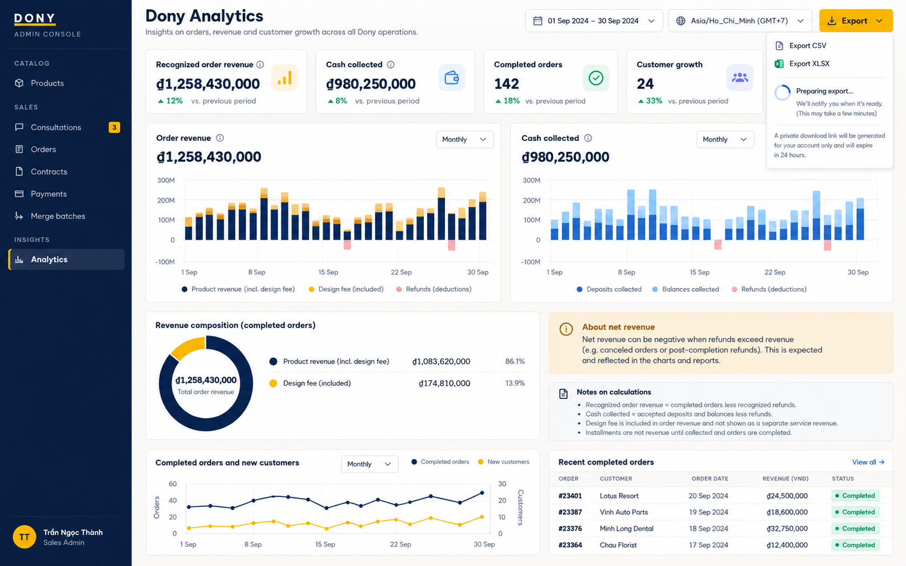

# Screen Spec: S43 Analytics Dashboard

| Field | Value |
|---|---|
| Screen ID | `S43` |
| Screen name | Analytics Dashboard |
| Actor | Sales Admin |
| Priority | P3 |
| Belongs to module | [MFG-11](../specs/spec-MFG-11.md) |
| Route | `/admin/analytics` |
| Mockup image | img/S43-analytics_dashboard_screen.png |
| Status | Resolved implementation specification |

## 1. Purpose

**Shown when:** The Sales Admin views Dony-scoped read-only metrics for the selected local date range and product filter. Exports use the same metric rules and snapshot watermark. All identifiers and permissions come from the server session; list filters are allowlisted and recoverable failures preserve entered values.

**The user leaves this screen when:** An authorized action in section 5 succeeds, the user follows a role-allowed global route, or they return to the validated originating route.

## 2. Mockup

Written behavior below takes precedence over obsolete sample content.

## 3. Element inventory

| # | Element | Type | Content / data source | Required | Validation |
|---|---|---|---|---|---|
| 1 | Screen heading | Heading | Analytics Dashboard | Yes | Static route title. |
| 2 | Route | Navigation target | /admin/analytics | Yes | Access checked on server. |
| 3 | date_start / date_end | Field / control | local dates, inclusive/exclusive | As specified | Default last 30 local calendar days; maximum 366 days; reject start >= end. |
| 4 | product_id | Field / control | optional UUID | As specified | Dony product only; filter related orders. |
| 5 | revenue_vnd / cash_collected_vnd | Field / control | integer VND aggregates | As specified | Revenue uses immutable contract total when order becomes Completed, net recognized refunds; cash collected uses accepted DEPOSIT/BALANCE by paid_at net refunds. Never count installments twice. |
| 6 | order_count / cancellation_count | Field / control | integer counts | As specified | Count orders by created_at in all states; cancellations shown separately. |
| 7 | new_customers | Field / control | integer count | As specified | Distinct Customer accounts by customer_id whose first submitted order in Dony's system falls in range. Buyer-organization context is not an authorization boundary. |
| 8 | refreshed_at / timezone | Field / control | UTC timestamp / Asia/Ho_Chi_Minh | As specified | Always display snapshot watermark and local range; zero-data metrics are zero. |
| 9 | export_format / export_limit | Field / control | CSV or XLSX / max 100000 rows | As specified | Same filters/formulas/watermark; prevent spreadsheet formula injection. |
| 10 | Apply date/product filters | Action | Recompute authoritative Dony-scoped metrics; display timezone/range/refreshed_at. | Available when authorized | Destination: S43 |
| 11 | Export CSV/XLSX | Action | Same filters/formulas and snapshot watermark; <=100000 rows; neutralize formula injection. | Available when authorized | Destination: S43 |
| 12 | Open order | Action | Navigate only to authorized Dony order detail. | Available when authorized | Destination: S29 |
| 13 | design_fee_revenue_vnd | Read-only revenue component | Design fees included in recognized revenue | Yes | Sum design_fee_vnd for orders completed in range less its component on recognized refunds; same filters/watermark/exclusions; no double-counting. |

## 4. States

| State | What the user sees | Trigger |
|---|---|---|
| Loading | Load the S43 Analytics Dashboard view model and show labelled progress; keep writes disabled until route data and authorization are resolved. | Request starts |
| Empty | Show no-data state for selected reporting period and explain which completed events populate metrics. | Screen has no eligible or matching record |
| Forbidden/not found | Return a safe 401/403/404 for S43 Analytics Dashboard without revealing inaccessible record, customer, staff or payment details. | 401/403/404 |
| Error | For S43 Analytics Dashboard, show the API code, message, field_errors and request_id; preserve safe user-entered values. | Request failure |
| Retry | Retry transient reads for S43 Analytics Dashboard; retry a mutation only with its original idempotency key and identical payload, never as a new side effect. | Recoverable failure |
| Success | Refresh the committed Analytics Dashboard data and show the next action permitted by its lifecycle and actor. | Valid action commits |
| Conflict | The Analytics Dashboard data or lifecycle changed concurrently; reload authoritative state and do not replay a stale mutation. | Stale version, duplicate or invalid lifecycle transition |
## 5. Interactions and navigation

| # | Element | User action | System response | Goes to screen |
|---|---|---|---|---|
| 1 | Apply date/product filters | Activate | Recompute authoritative Dony-scoped metrics; display timezone/range/refreshed_at. | S43 |
| 2 | Export CSV/XLSX | Activate | Same filters/formulas and snapshot watermark; <=100000 rows; neutralize formula injection. | S43 |
| 3 | Open order | Activate | Navigate only to authorized Dony order detail. | S29 |

Portal: Sales Admin. Route: /admin/analytics. Back preserves the originating route and filters. Fallback: Customer→S26; Sales Admin→S28; Sales→S20; System Admin→S41; Guest→S01. Enforce role, ownership and assignment before rendering.

## 6. Screen-level rules

| Rule ID | Rule | Source |
|---|---|---|
| SR-001 | Access and ownership are checked server-side; do not trust submitted customer, company, role, price, or provider status. Apply 401/403/404 behavior and the field rules above. | Authorization and data ownership requirements |
| SR-002 | IDs are UUIDs; timestamps are UTC and displayed in Asia/Ho_Chi_Minh; money and quantities are integers. Mutations use expected_version; significant create/sign/pay/batch operations use idempotency keys. | Data representation and concurrency requirements |
| SR-003 | Apply the module lifecycle and validation rules linked below; preserve immutable submitted snapshots. | Module specification |
| SR-004 | Selected product and technical defaults are project implementation decisions; do not invent factual company, author, client-approval, or course identifiers. | Project implementation assumptions |

### Acceptance scenarios

1. Revenue is recognized once on Completed order totals net recognized refunds; cash collected separately sums accepted DEPOSIT/BALANCE settlements net refunds.
2. Zero-data period shows zeros; export matches filter/formula/watermark and rejects >100000 rows.
3. S43 and exports show the same design-fee revenue component; a deposit alone is not revenue, Simple/repeat orders contribute 0, and recognized refunds subtract the original fee component.

## 7. Linked requirements

| FR ID (from the module spec) | What this screen does for it |
|---|---|
| MFG-11/F-DA-001 | **View Dashboard** — Return Dony-scoped recognized revenue, DEPOSIT/BALANCE cash collection, orders and customer growth with range, timezone, refreshed_at and design-fee revenue component. |
| MFG-11/F-DA-002 | **View Dashboard** — Recalculate typed dataset using the same metrics and Dony scope, including the design-fee component; return zero/empty values for empty data. |
| MFG-11/F-DA-003 | **Export Data** — Queue CSV/XLSX export including the design-fee component, report asynchronous state and expose only authorized short-lived private link on success. |

## 8. Responsive and accessibility notes

Support 360px through desktop; stack columns and use labelled horizontal-scroll tables on narrow screens. Controls are keyboard-operable with visible focus, logical headings, associated form labels, and aria-live status/error announcements. Text contrast is at least 4.5:1 (large text 3:1); pointer targets are at least 24px. Preserve user-entered data after recoverable failures. Confirm destructive actions, disable duplicate submit while pending, and enforce idempotency on the server.

## 9. Open questions

| # | Question | Blocking? | Status |
|---|---|---|---|
| 1 | No unresolved screen behavior questions remain; routes, fields, permissions, and defaults are resolved in this specification and its linked module requirements. | No | Resolved |

## Completion checklist

- [x] Route, actor, module, priority, and mockup status are identified.
- [x] Element fields, actions, validation, and data ownership are documented.
- [x] Loading, empty, forbidden, error, retry, success, and conflict states are documented.
- [x] Navigation and acceptance scenarios are explicit.
- [x] Responsive and accessibility requirements follow the shared baseline.
- [x] No unresolved screen-level decisions remain.
