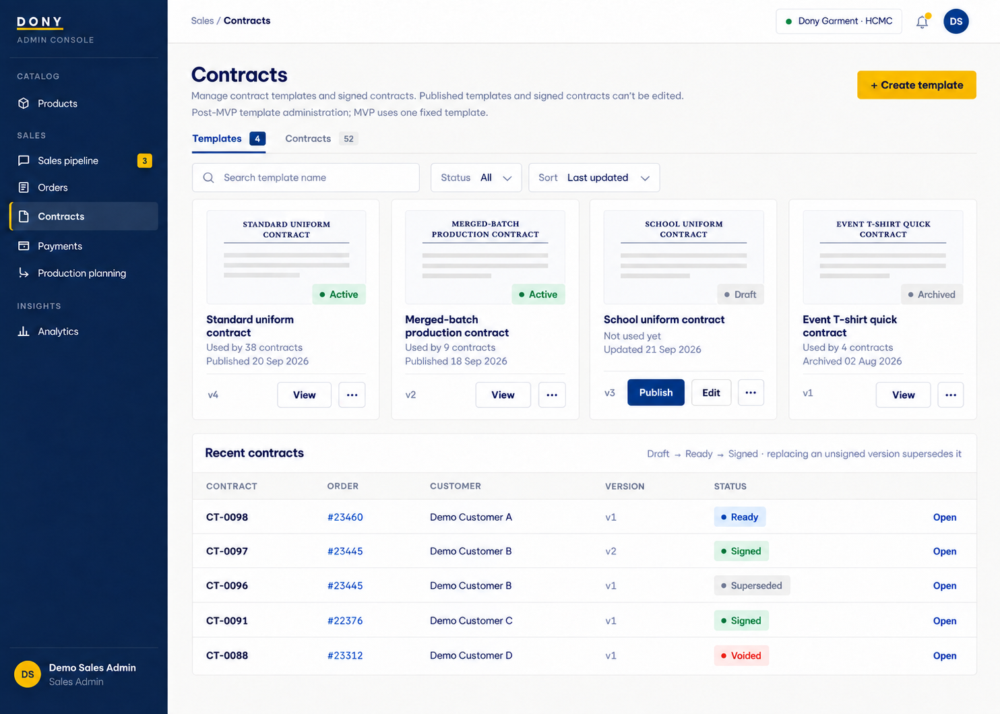

# Screen Spec: S43 Contract Templates and Contracts

| Field | Value |
|---|---|
| Screen ID | `S43` |
| Screen name | Contract Templates and Contracts |
| Actor | Sales Admin |
| Priority | Could (MVP) |
| Belongs to module | [MFG-09](../specs/spec-MFG-09.md) |
| Route | `/admin/contracts?tab=templates,contracts` |
| Mockup image | img/S43-01-contract-templates.png |
| Status | Resolved implementation specification |

## 1. Purpose

**Shown when:** The Sales Admin switches between versioned contract templates and company contracts. Signed contract versions are immutable and template changes create a new version. All identifiers and permissions come from the server session; list filters are allowlisted and recoverable failures preserve entered values.

**The user leaves this screen when:** An authorized action in section 5 succeeds, the user follows a role-allowed global route, or they return to the validated originating route.

## 2. Mockup

The mockup illustrates the defined workflow. Fictional sample values do not replace the field, lifecycle and release-scope rules below.

## 3. Element inventory

| # | Element | Type | Content / data source | Required | Validation |
|---|---|---|---|---|---|
| 1 | Screen heading | Heading | Contract Templates and Contracts | Yes | Static route title. |
| 2 | Route | Navigation target | /admin/contracts?tab=templates,contracts | Yes | Access checked on server. |
| 3 | tab | Field / control | enum: templates or contracts; default templates | As specified | Templates show template_id, name, current version and active status; contracts show contract_id, order_id, version and lifecycle status. |
| 4 | status | Field / control | enum filtered by tab | As specified | Template statuses Draft, Active, Archived; contract statuses Draft, Ready, Signed, Superseded, Voided. |
| 5 | query / page / page_size | Field / control | trimmed text / integer / integer | As specified | Search template name or contract/order ID; positive bounded paging and allowlisted sort. |
| 6 | buyer_organization_id | Field / control | optional server-derived UUID | As specified | Templates are Dony-owned; a contract may snapshot the Business Buyer or Reseller Shop legal details from its order. |
| 7 | version | Field / control | integer | As specified | Template edits create a new version; a Signed contract and its PDF snapshot cannot be edited. |
| 8 | API errors | Field / control | standard API error envelope | As specified | 400 malformed; 422 invalid filters; 403 prohibited action; 404 inaccessible contract; 409 stale version/state; 503 dependency failure. |
| 9 | Create template | Action | Open safe template form. | Available when authorized | Destination: S44 |
| 10 | Publish template | Action | Activate validated version for new contracts. | Available when authorized | Destination: S43 |
| 11 | Archive template | Action | Prevent future use while preserving referenced versions. | Available when authorized | Destination: S43 |
| 12 | Edit template | Action | Create a new version; keep previous used versions. | Available when authorized | Destination: S45 |
| 13 | Open contract | Action | Show status and generated PDF. | Available when authorized | Destination: S39 |
| 14 | Switch tabs | Action | Templates and contracts tabs are same routed screen. | Available when authorized | Destination: S43 tab |

## 4. States

**Loading, access, errors and retry:** Show a labelled Loading state while reads resolve. A missing or inaccessible route returns a safe 401/403/404 without disclosing protected records. Error states show the API code, message, field_errors and request_id while preserving safe input. Retry transient reads; retry a mutation only with the original idempotency key and identical payload. Preserve safe user input after recoverable failures.

| State | What the user sees | Trigger |
|---|---|---|
| Empty | Show no contract templates/contracts and an authorized create-template action. | Screen has no eligible or matching record |
| Success | Refresh the committed Contract Templates and Contracts data and show the next action permitted by its lifecycle and actor. | Valid action commits |
| Conflict | The Contract Templates and Contracts data or lifecycle changed concurrently; reload authoritative state and do not replay a stale mutation. | Stale version, duplicate or invalid lifecycle transition |
## 5. Interactions and navigation

| # | Element | User action | System response | Goes to screen |
|---|---|---|---|---|
| 1 | Create template | Activate | Open safe template form. | S44 |
| 2 | Publish template | Activate | Activate validated version for new contracts. | S43 |
| 3 | Archive template | Activate | Prevent future use while preserving referenced versions. | S43 |
| 4 | Edit template | Activate | Create a new version; keep previous used versions. | S45 |
| 5 | Open contract | Activate | Show status and generated PDF. | S39 |
| 6 | Switch tabs | Activate | Templates and contracts tabs are same routed screen. | S43 tab |

Portal: Sales Admin. Route: /admin/contracts?tab=templates,contracts. Back preserves the originating route and filters. 

## 6. Screen-level rules

| Rule ID | Rule | Source |
|---|---|---|
| SR-001 | Check access and ownership on the server; never trust submitted customer, company, role, price, stage or provider status. Apply the documented 401/403/404 behavior and field rules. | Project baseline |
| SR-002 | IDs are UUIDs; timestamps are UTC and displayed in Asia/Ho_Chi_Minh; money and quantities are integers. Mutations use expected versions and idempotency keys where specified. | Project baseline |
| SR-003 | Apply the owning module's lifecycle and validation rules; preserve immutable submitted snapshots and design versions. | Project baseline |
| SR-004 | Use documented project assumptions; do not invent factual company, author, client-approval or course identifiers. | Project baseline |

### Acceptance scenarios

1. Templates and contracts tabs show Dony-scoped versions and status filters.
2. Signed contract exposes no edit/version replacement action.

## 7. Linked requirements

| FR ID (from the module spec) | What this screen does for it |
|---|---|
| MFG-09/F-CONTR-001 | **Generate Contract** — List compatible active templates only for Dony PendingContract orders with a current Approved physical sample. |
| MFG-09/F-CONTR-002 | **Generate Contract** — Preview safe rendered placeholders from an authorized template version. |
| MFG-09/F-CONTR-003 | **Generate Contract** — Fill immutable draft contract from order/customer/address/item/design/sample/payment-policy snapshots, including design fee, approved sample, deposit percentage and balance formula. |
| MFG-09/F-CONTR-004 | **Generate Contract** — Render the separate snapshotted design-fee line and persist PDF/hash as Ready transactionally with idempotency and private asset access. |
| MFG-09/F-CONTR-005 | **Receive Ready contract notice** — Notify customer of Ready contract after commit using authorized review link. |
| MFG-09/F-CONTR-006 | **Update Contract** — List contracts and create/update/publish/archive versioned templates with allowlisted placeholders including design_fee_vnd and source_design_request_id. |
| MFG-09/F-CONTR-007 | **Update Contract** — Regenerate unsigned PendingContract documents only from the same approved sample and commercial snapshots; revised design/sample returns to approval instead of silently changing the contract. |

## 8. Responsive and accessibility notes

Support 360px through desktop; stack columns and use labelled horizontal-scroll tables on narrow screens. Controls are keyboard-operable with visible focus, logical headings, associated form labels, and aria-live status/error announcements. Text contrast is at least 4.5:1 (large text 3:1); pointer targets are at least 24px. Preserve user-entered data after recoverable failures. Confirm destructive actions, disable duplicate submit while pending, and enforce idempotency on the server.

## 9. Open questions

| # | Question | Blocking? | Status |
|---|---|---|---|
| 1 | No unresolved screen behavior questions remain; routes, fields, permissions, and defaults are resolved in this specification and its linked module requirements. | No | Resolved |

## Completion checklist

- [x] Route, actor, module, priority, and mockup status are identified.
- [x] Element fields, actions, validation, and data ownership are documented.
- [x] Loading, empty, forbidden, error, retry, success, and conflict states are documented.
- [x] Navigation and acceptance scenarios are explicit.
- [x] Responsive and accessibility requirements are documented in this screen.
- [x] No unresolved screen-level decisions remain.
