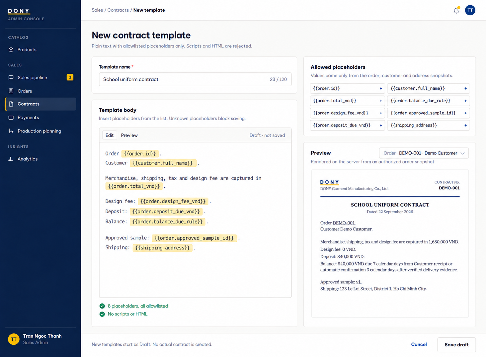

# Screen Spec: S44 Contract Template Create

| Field | Value |
|---|---|
| Screen ID | `S44` |
| Screen name | Contract Template Create |
| Actor | Sales Admin |
| Priority | Could (MVP) |
| Belongs to module | [MFG-09](../specs/spec-MFG-09.md) |
| Route | `/admin/contracts/templates/new` |
| Mockup image | img/S44-01-contract-template-create.png |
| Status | Resolved implementation specification |

## 1. Purpose

**Shown when:** The Sales Admin creates a contract template version with validated name and permitted template content; executable code and arbitrary placeholders are rejected. All identifiers and permissions come from the server session; list filters are allowlisted and recoverable failures preserve entered values.

**The user leaves this screen when:** An authorized action in section 5 succeeds, the user follows a role-allowed global route, or they return to the validated originating route.

## 2. Mockup

The mockup illustrates the defined workflow. Fictional sample values do not replace the field, lifecycle and release-scope rules below.

## 3. Element inventory

| # | Element | Type | Content / data source | Required | Validation |
|---|---|---|---|---|---|
| 1 | Screen heading | Heading | Contract Template Create | Yes | Static route title. |
| 2 | Route | Navigation target | /admin/contracts/templates/new | Yes | Access checked on server. |
| 3 | name | Field / control | required 1..120 | As specified | name: required 1..120; version assigned monotonically by server. |
| 4 | template_body | Field / control | bounded plain text with allowlisted placeholders only | As specified | template_body: bounded plain text with allowlisted placeholders only; reject scripts/HTML execution. |
| 5 | preview_source | Field / control | selected authorized order snapshot | As specified | Resolve customer/price placeholders server-side; reject arbitrary injected values. |
| 6 | initial_status | Field / control | Draft, server-set | As specified | Creation has no client expected_version; publishing is a separate validated action. |
| 7 | API errors | Field / control | standard API error envelope | As specified | 400 malformed; 422 invalid fields; 409 stale/duplicate; 429 rate limit; 503 dependency failure |
| 8 | Save template | Action | Validate placeholders, create version. | Available when authorized | Destination: S43 templates tab |
| 9 | Save draft | Action | Save a new Draft version after placeholder validation. | Available when authorized | Destination: S43 templates tab |
| 10 | Publish | Action | Activate only after complete template validation. | Available when authorized | Destination: S43 templates tab |
| 11 | Cancel | Action | Discard form. | Available when authorized | Destination: S43 templates tab |

## 4. States

**Loading, access, errors and retry:** Show a labelled Loading state while reads resolve. A missing or inaccessible route returns a safe 401/403/404 without disclosing protected records. Error states show the API code, message, field_errors and request_id while preserving safe input. Retry transient reads; retry a mutation only with the original idempotency key and identical payload. Preserve safe user input after recoverable failures.

| State | What the user sees | Trigger |
|---|---|---|
| Empty | Not applicable to this single-record route; a missing or inaccessible record uses Forbidden/not found. | The route identifies one record. |
| Success | Refresh the committed Contract Template Create data and show the next action permitted by its lifecycle and actor. | Valid action commits |
| Conflict | The Contract Template Create data or lifecycle changed concurrently; reload authoritative state and do not replay a stale mutation. | Stale version, duplicate or invalid lifecycle transition |
## 5. Interactions and navigation

| # | Element | User action | System response | Goes to screen |
|---|---|---|---|---|
| 1 | Save template | Activate | Validate placeholders, create version. | S43 templates tab |
| 2 | Save draft | Activate | Save a new Draft version after placeholder validation. | S43 templates tab |
| 3 | Publish | Activate | Activate only after complete template validation. | S43 templates tab |
| 4 | Cancel | Activate | Discard form. | S43 templates tab |

Portal: Sales Admin. Route: /admin/contracts/templates/new. Back preserves the originating route and filters. 

## 6. Screen-level rules

| Rule ID | Rule | Source |
|---|---|---|
| SR-001 | Check access and ownership on the server; never trust submitted customer, company, role, price, stage or provider status. Apply the documented 401/403/404 behavior and field rules. | Project baseline |
| SR-002 | IDs are UUIDs; timestamps are UTC and displayed in Asia/Ho_Chi_Minh; money and quantities are integers. Mutations use expected versions and idempotency keys where specified. | Project baseline |
| SR-003 | Apply the owning module's lifecycle and validation rules; preserve immutable submitted snapshots and design versions. | Project baseline |
| SR-004 | Use documented project assumptions; do not invent factual company, author, client-approval or course identifiers. | Project baseline |

### Acceptance scenarios

1. Safe allowlisted template creates a draft version.
2. Script/executable content or unknown placeholder is rejected and no template is activated.

## 7. Linked requirements

| FR ID (from the module spec) | What this screen does for it |
|---|---|
| MFG-09/F-CONTR-006 | **Update Contract** — List contracts and create/update/publish/archive versioned templates with allowlisted placeholders including design_fee_vnd and source_design_request_id. |

## 8. Responsive and accessibility notes

Support 360px through desktop; stack columns and use labelled horizontal-scroll tables on narrow screens. Controls are keyboard-operable with visible focus, logical headings, associated form labels, and aria-live status/error announcements. Text contrast is at least 4.5:1 (large text 3:1); pointer targets are at least 24px. Preserve user-entered data after recoverable failures. Confirm destructive actions, disable duplicate submit while pending, and enforce idempotency on the server.

## 9. Open questions

| # | Question | Blocking? | Status |
|---|---|---|---|
| 1 | No unresolved screen behavior questions remain; routes, fields, permissions, and defaults are resolved in this specification and its linked module requirements. | No | Resolved |

## Completion checklist

- [x] Route, actor, module, priority, and mockup status are identified.
- [x] Element fields, actions, validation, and data ownership are documented.
- [x] Loading, empty, forbidden, error, retry, success, and conflict states are documented.
- [x] Navigation and acceptance scenarios are explicit.
- [x] Responsive and accessibility requirements are documented in this screen.
- [x] No unresolved screen-level decisions remain.
