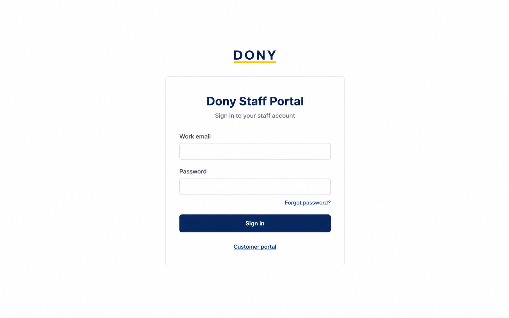

# Screen Spec: S44 Dony Staff CRM Log In

| Field | Value |
| --- | --- |
| Screen ID | `S44` |
| Screen name | Dony Staff CRM Log In and Invitation Acceptance |
| Actor | Invited Dony employee / active StaffAccount |
| Priority | P1 |
| Belongs to module | [MFG-01](../specs/spec-MFG-01.md), [MFG-03](../specs/spec-MFG-03.md) |
| Route | `/staff/login` |
| Mockup image | img/S44-staff_login_screen.png |
| Status | Resolved implementation specification |

## 1. Purpose

**Shown when:** Dony employees access the internal CRM at `/staff/login`. This interface uses internal Dony staff branding and never displays the public store navigation, shopping/cart controls, customer registration, or social login. Invitation acceptance is available only from a valid staff invitation link; staff accounts are provisioned by MFG-03 System Admins.

**The user leaves this screen when:** Authentication or invitation acceptance succeeds, or the user follows a permitted internal recovery link.

## 2. Mockup

MVP supports staff sign-in only for pre-provisioned identities; invitation acceptance is a later MFG-03 capability and is not part of the MVP UI.

## 3. Element inventory

| # | Element | Type | Content / data source | Required | Validation |
|---|---|---|---|---|---|
| 1 | Staff heading | Heading | Dony Staff Portal | Yes | Internal CRM identity only. |
| 2 | Work email | Field | StaffAccount work email | Yes | Trim and case-normalize. |
| 3 | Password | Secret field | Password | Yes | Verify stored hash; never echo or log. |
| 4 | Sign in | Action | Authenticate active StaffAccount and create secure session | Yes | Route is fixed to staff portal; allowlisted internal redirect only. |
| 5 | Forgot password | Link | Staff recovery route | Yes | Destination: S45. |
| 6 | Invitation acceptance | Post-MVP token-bound state | Staff invitation token | No (MVP) | Later MFG-03 capability: single use, 48-hour expiry; existing identity authenticates before acceptance. |
| 7 | Failed attempts | System state | Account/IP rate-limit counter | Yes | Five attempts per 15 minutes, then 429. |

## 4. States

| State | What the user sees | Trigger |
|---|---|---|
| Loading | Progress and disabled submit | Authentication begins |
| Empty | This is an authentication form, not a data-list screen; render the email/password form rather than an empty-record message. | Initial route |
| Forbidden/not found | Safe access message | Invalid invitation or unauthorized route |
| Error | Generic credential error with request ID | Failed request |
| Retry | Sign-in remains available within rate limits | Recoverable failure |
| Success | Establish the secure employee session and route Sales Admin to S28. Seeded Sales and System Admin test accounts route to S01 and have no staff-only MVP functions. | Active StaffAccount authenticated |
| Conflict | Show a safe session/version conflict, clear stale employee session state, and require sign-in again; do not create a second session from a stale challenge. | Stale or concurrently consumed authentication state |

## 5. Interactions and navigation

| # | Element | User action | System response | Goes to screen |
|---|---|---|---|---|
| 1 | Sign in | Submit credentials | Verify active StaffAccount and set secure session cookie. MVP: Sales Admin goes to S28; seeded Sales/System Admin test identities go to S01, with deferred staff-only routes unavailable. | Role landing route per README MVP slice |
| 2 | Forgot password | Activate link | Open employee-only recovery | S45 |
| 3 | Accept invitation | Post-MVP only; unavailable to pre-provisioned MVP accounts | After MFG-03 activation, consume a valid token and activate staff account atomically | S41 completion, then role landing route |

## 6. Screen-level rules

| Rule ID | Rule | Source |
|---|---|---|
| SR-001 | Route-derived staff portal context is authoritative; customer identity or a client-submitted role never grants staff access. | MFG-01 / MFG-03 |
| SR-002 | Never expose customer store header, public registration, social providers, or customer-facing order navigation in the CRM login. | Separate customer and employee experiences |
| SR-003 | Employee accounts are provisioned by System Admin; invitation acceptance is token-bound and single use. | MFG-03 |

### Acceptance scenarios

1. `/staff/login` renders the CRM staff portal design, distinct from Customer `/login`.
2. Valid credentials for an active StaffAccount establish a secure session and use only an allowlisted internal destination.
3. Public customer accounts cannot authenticate as staff; employee invitations cannot be accepted through S03.
4. No customer store navigation, public registration, Google/Facebook or other provider login is present.

## 7. Linked requirements

| FR ID (from the module spec) | What this screen does for it |
|---|---|
| MFG-01/F-USER-004 | Render the separate employee login portal and its recovery/invitation entry; invitation acceptance remains post-MVP. |
| MFG-01/F-USER-005 | Authenticate eligible active employees, enforce rate limits and establish the staff session. |
| MFG-03/F-ACC-003 | After MFG-03 activation, use the valid single-use invitation issued by authorized provisioning; acceptance follows that module's invitation lifecycle. |

## 8. Responsive and accessibility notes

Support 360px through desktop. Use labelled fields, visible keyboard focus, sufficient contrast, accessible status/error announcements, and preserve nonsecret input after recoverable failures.

## 9. Open questions

| # | Question | Blocking? | Status |
|---|---|---|---|
| 1 | No remaining open questions; CRM branding, route, role boundary and invitation entry are resolved. | No | Resolved |

## Completion checklist

- [x] Route, actor, module, priority, and mockup are identified.
- [x] Fields, validation, actions and role boundaries are explicit.
- [x] States, navigation and acceptance scenarios are explicit.
- [x] Responsive and accessibility requirements are documented.
- [x] No unresolved screen-level questions remain.
