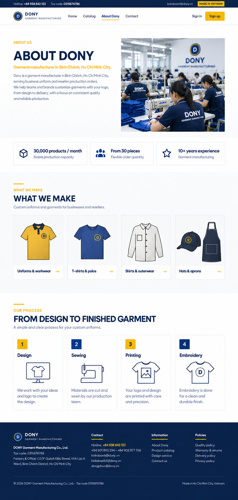

# Screen Spec: S47 About Dony

> **Status:** User-requested screen addition. Route, navigation placement, and screen-catalogue entry remain unresolved and require confirmation before implementation.

## Purpose

Introduce Dony as a made-to-order garment manufacturer and summarize its production capabilities for prospective business buyers and reseller shops.

## Mockup

## Content and layout

1. **Storefront header:** Dony wordmark and links to Home, Products, About Dony, and Contact. Treat the menu labels and link destinations as proposed until the baseline screen inventory is updated.
2. **Hero:** “Made to order. Made with care.” with a factory image showing garment production.
3. **Capability highlights:**
   - Up to 30,000 products per month.
   - Orders from 30 pieces.
   - More than 10 years of garment sewing experience (as stated in the supplied LinkedIn overview).
4. **Business areas:** Uniforms and workwear; fashion manufacturing; export garment production.
5. **Production services:** Design, sewing, printing, and embroidery.
6. **Footer:** Existing storefront footer pattern, if available.

## Content notes

- Dony produces garments to order; this page must not imply ready-made inventory.
- Do not add unsupported customer logos, testimonials, certifications, awards, sustainability claims, or delivery promises.
- Capacity and minimum order quantity are attributed to the Thanh Niên article linked below. The experience claim is taken from the LinkedIn overview supplied in the request and could not be independently fetched during this task.
- Mockup imagery is AI-generated and illustrative, not a photograph of Dony's actual facility.
- Any extra marketing copy rendered inside the generated mockup is placeholder text; only the content listed in this specification is source-backed.

## Open decisions

- Confirm the public route and add this screen to the authoritative screen catalogue if approved.
- Confirm whether “more than 10 years” should remain in public-facing copy.

## Sources

- [Thanh Niên — Đồng phục DONY - Xưởng may đồng phục chuyên nghiệp, giá tốt](https://thanhnien.vn/dong-phuc-dony-xuong-may-dong-phuc-chuyen-nghiep-gia-tot-185250521140043262.htm)
- [Dony LinkedIn overview](https://www.linkedin.com/company/dony-international-corporation/?originalSubdomain=vn) (provided by the user; inaccessible to independent verification during this task)
- [Dony Garment — products and services](https://donygarment.webflow.io/)
