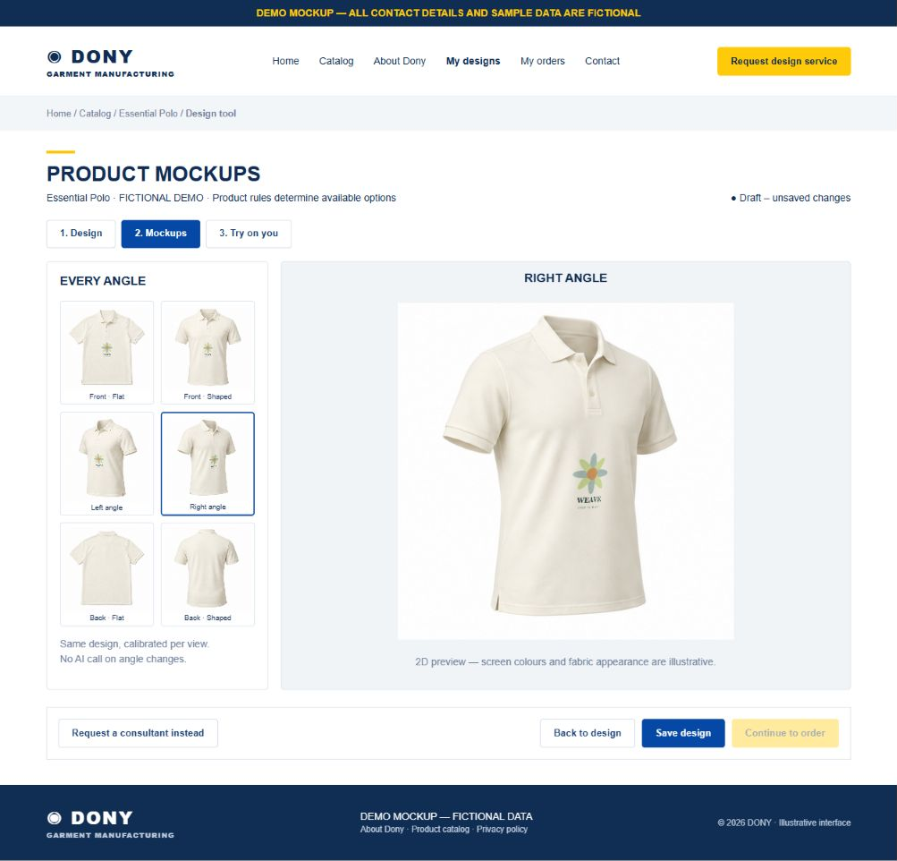

# Screen Spec: S50 Product Mockups

| Field | Value |
|---|---|
| Screen ID | `S50` |
| Screen name | Product Mockups |
| Actor | Customer owner |
| Priority | P1 |
| Belongs to module | [MFG-05](../specs/spec-MFG-05.md) |
| Route | `/designs/new?product_id={id}&mode=mockups` |
| Mockup image | img/S50-product_mockups_screen.png |
| Status | Resolved implementation specification |

## 1. Purpose

**Shown when:** Customer previews the current S13 draft as calibrated 2D garment photos. Six angles like the approved reference: front flat, front shaped, left/right angle, back flat, back shaped. Switching thumbnails is deterministic and requires no AI request. Product templates may support fewer views; show unavailable views with a reason.

**The user leaves this screen when:** They return to S13/S50/S51 within the same draft or follow the existing authorized save/order navigation. Exiting the workspace destroys personal try-on buffers; unsaved design warnings follow S13.

## 2. Mockup

Illustrative synthetic sample, using S13's Dony storefront style. Fictional polo/artwork do not add a Published catalogue product. Written requirements govern behavior; no personal photo or actual customer information appears in the PNG.

## 3. Element inventory

| # | Element | Type | Content / data source | Required | Validation |
|---|---|---|---|---|---|
| 1 | Shared mode tabs | Tabs | Design / Mockups / Try on you | Yes | Keep one draft and revision across modes. |
| 2 | Angle gallery | Six thumbnails | Product-supported template views | Yes | Accessible labels and selection; disable missing templates. |
| 3 | Large preview | Image/canvas | Current colour/material and side artwork | Yes | Physical mm positions mapped through calibrated per-view surfaces; correct side only. |
| 4 | Product/fabric summary | Read-only text | Current validated product options | Yes | Do not infer different fabric appearance from an unsupported image. |
| 5 | Back to design | Button | Return without save | Yes | Draft placements preserved. |
| 6 | Save/Continue order | Shared S13 bar | Immutable save / S22 | Yes | Current valid design; Saved version required to order. |
| 7 | Preview disclaimer | Text | Appearance only; not colour/fit/manufacturing proof | Yes | No AI or 3D claim. |

## 4. States

| State | What the user sees | Trigger |
|---|---|---|
| Loading | Template progress, selections disabled | Template load starts |
| Empty | Garment preview without artwork | Draft has no asset on that side |
| Ready/success | Thumbnail and large image match current revision | Templates/draft validate |
| Unsupported | Disabled view or option with reason | Missing product/view/colour/material template |
| Error/retry | Recoverable template error; explicit reload, draft retained | Template/render read failure |
| Conflict | Revalidate current product version before preview/save | Stale product rules or invalid placement |
| Forbidden/not found | Safe 401/403/404 | Ownership/authorization fails |

## 5. Interactions and navigation

| # | User action | System response | Goes to screen |
|---|---|---|---|
| 1 | Select angle | Render same draft into calibrated selected surface | S50 |
| 2 | Design tab | Return to physical placement controls | S13 |
| 3 | Try on you tab | Open presets/personal upload | S51 |
| 4 | Save/Continue order | Existing immutable S13 save/S22 eligibility rules | S17 / S22 |

## 6. Screen-level rules

| Rule ID | Rule | Source |
|---|---|---|
| SR-001 | Server enforces owner authorization and current product rules; private errors do not disclose other customer data. | MFG-05 |
| SR-002 | Preserve immutable saved designs; preview processing never changes an ordered snapshot or makes a draft orderable. | S13 / MFG-05 BR-001 |
| SR-003 | Personal photos/results remain session-only; template and explicitly saved artwork storage are separate. | MFG-05 BR-010–012 |

### Acceptance scenarios

1. A centred logo tracks the collar/placket-to-torso curve in both angled views, not the image bounding-box centre.
2. Chest placement stays on wearer left/right; back views do not contain front assets.
3. Cutout artwork follows perspective, folds, fabric light and placket occlusion without alpha seams.
4. Angle changes make no OpenAI request, preserve physical coordinates and share current draft revision.
5. New template geometry requires visual approval at chest, centre and print bounds before release.

## 7. Linked requirements

| FR ID (from the module spec) | What this screen does for it |
|---|---|
| MFG-05/F-DES-015 | Implements the product mockups flow and its validation/session rules. |
| MFG-05/F-DES-001..003 | Shares the validated S13 draft; preserves explicit immutable save/order boundaries. |

## 8. Responsive and accessibility notes

Follow S13: 360px through desktop, navy/gold Dony storefront shell, labelled keyboard-operable tabs/buttons, visible focus and aria-live progress/errors. On narrow screens stack panels; make thumbnails horizontally scrollable and keep primary controls reachable. Text contrast >=4.5:1; controls >=24px. Images have descriptive alt text; alpha comparisons use a labelled checkerboard. Modal focus is trapped and restored to its trigger. Do not use colour alone for status.

## 9. Open questions

| # | Question | Blocking? | Status |
|---|---|---|---|
| 1 | Remaining screen behavior decisions? | No | Resolved by MFG-05 and the user-approved add-on scope. |

## Completion checklist

- [x] Route, actor, module, priority and illustrative image identified.
- [x] Fields, actions, ownership, validation and session boundaries defined.
- [x] Loading/error/retry/conflict/success states and navigation defined.
- [x] Acceptance scenarios and accessibility requirements defined.
