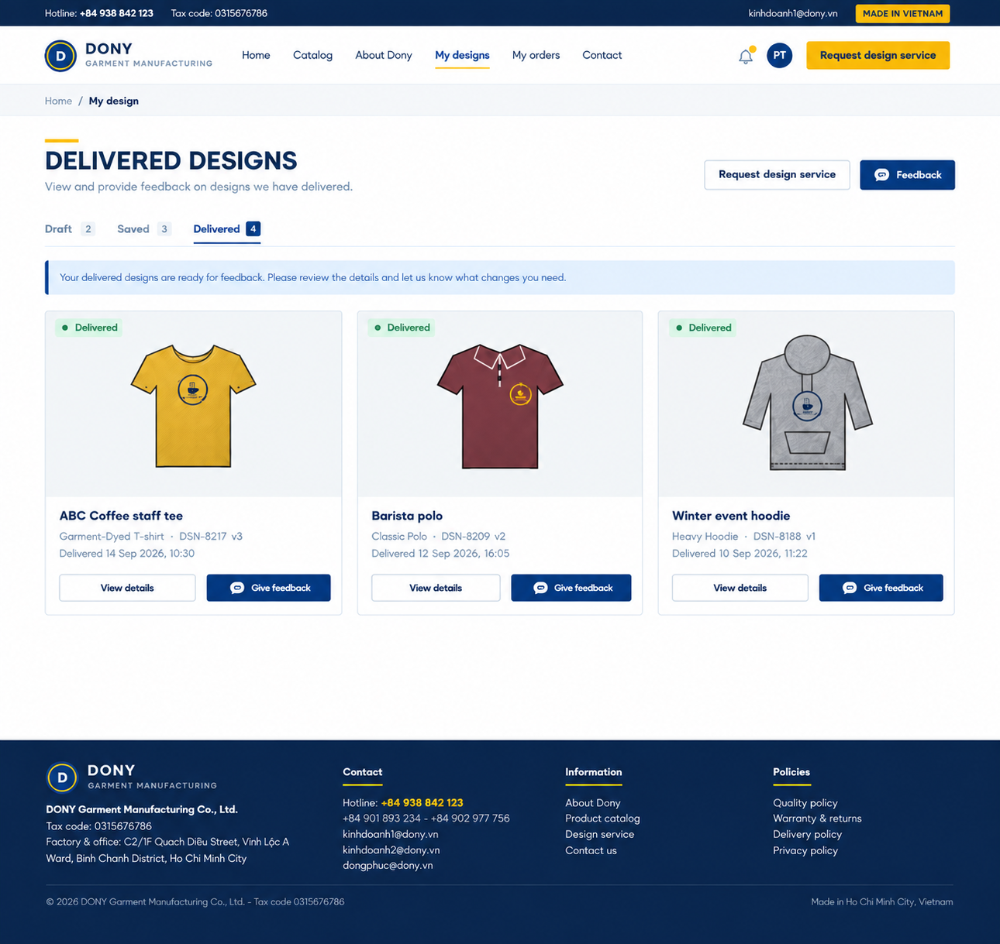
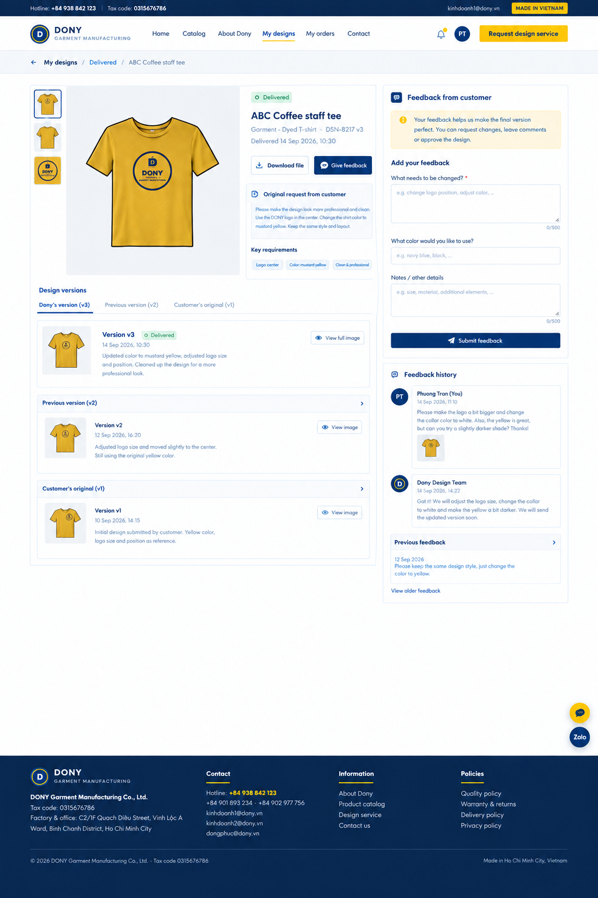

# Screen Spec: S52 Designs, Requests and Feedback

| Field | Value |
|---|---|
| Screen ID | `S52` |
| Screen name | Designs, Requests and Feedback |
| Actor | Customer owner |
| Priority | P2 |
| Belongs to module | [MFG-05](../specs/spec-MFG-05.md) |
| Route | `/designs?tab=delivered` (shared-design list), `/designs/{design_id}?tab=feedback` (design detail), `/design-requests` (request list), `/design-requests/{request_id}` (request detail before or after a design exists) |
| Mockup images | img/S52a.png (list), img/S52b.png (detail) |
| Status | Integrated with user decisions 2026-09-27; Could, outside current MVP |

## 1. Purpose

Give a Customer one authorized place to review shared designs, immutable versions, the original request/reference and the recorded exchange with Dony. The Customer approves a current proof or submits structured revision feedback; assigned staff respond in S21. S17 is the gallery and links here. S52 also preserves existing request status, fee acceptance and eligible cancellation after removal of S17's request tab, including when no Design exists yet.

A proof is not orderable until the owner approves. Unchanged customer imports have a separate source-confirmation path; staff cannot use that path to approve Dony's changes. Sharing and approval do not replace the later order-specific digital design and physical-sample approvals of MFG-06.

## 2. Mockup

Mockups are visual references. A proof under review is labelled ProofDelivered rather than final Delivered. External chat buttons, original-reference-as-V1 labels and obsolete round/fee controls in a mockup do not override the written contract. Reference attachments stay references unless explicitly imported as a validated immutable version.

## 3. Element inventory

| # | Element | Type | Content / source | Required | Validation |
|---|---|---|---|---|---|
| 1 | Shared-design list | Cards / filters | Owner's shared and approved designs; name, product, code, current version, status and shared_at | List | Allowlisted filters and bounded pagination; excludes private staff Draft versions. |
| 2 | Design summary / preview | Read-only | design_id, current shared/approved version, scanned private assets | Design detail | Foreign/unknown IDs return 404; expiring access-checked URLs. |
| 3 | Original request / reference | Read-only | Submitted requirements and reference attachments | When present | Source snapshot unchanged; no automatic promotion of an attachment to V1. |
| 4 | Version history | Read-only | Shared for review, Approved and previously shared Superseded versions; source, author/time, change note | Design detail | Newest first; immutable content; hidden staff Drafts never returned. |
| 5 | Revision feedback | Form | change_request_text 10–500 trimmed characters; preferred_colour and additional_notes each optional 0–500 | Revision only | Notes are proposals, never automatic design changes; 422 invalid. |
| 6 | Feedback attachments | Upload | 0–3 PNG/JPEG/WebP files, 10 MiB each | Optional | Actual MIME, scan result and owner checked before persistence; follow MFG-05 section 5.4. |
| 7 | Exchange history | Read-only | Customer feedback and Dony replies, author role, UTC/display timestamp, attachments, exact design_version_id | Design detail | Append-only; no internal CRM notes/interactions/reviews. |
| 8 | Approve design | Confirmed action | Current SharedForReview version | Current undecided proof | expected_version and Idempotency-Key; owner only; atomically Delivered and CustomerApproval. |
| 9 | Request revision | Action | Structured feedback for current SharedForReview version | Current undecided proof | One decision per version; repeated key replays, competing decision/stale 409; no revision cap/surcharge. |
| 10 | Confirm unchanged import | Confirmed action | Exact imported CustomerProvided version | Unchanged import only | CustomerProvidedConfirmation; cannot approve any Dony-changed version; server validates ownership/source. |
| 11 | Download / view image | Action | Selected customer-visible version | If authorized | Private expiring asset links; no staff Draft download. |
| 12 | Order this design | Link | Current Saved/Delivered version eligible under MFG-05 | If orderable | S22 independently revalidates ownership, product/rules and exact design version. |
| 13 | Request list/status | Read-only | Owned request ID, requirements/product, complexity, rationale/rejection reason, requested_deadline, committed_due_at and state | Request mode | Submitted, UnderReview, FeeProposed, Approved, Assigned, InProgress, Delivered, Cancelled, Rejected; no CRM data. Missing committed_due_at means not set, never overdue. |
| 14 | Fee proposal / acceptance | Read-only + confirmed action | null before assessment; Simple 0; Complex current integer-VND amount/proposal_version and acceptance evidence | Request mode | F-DES-012: owner accepts exact current amount/version with expected_version and key; no standalone payment. |
| 15 | Cancel request | Confirmed action | Eligible unassigned Submitted/UnderReview/FeeProposed/Approved | Request mode | F-DES-013; no refund; rejects Assigned/InProgress/Delivered/Rejected; Cancelled replay idempotent. |
| 16 | Request new service / Back | Link | S15 / validated S17 origin | If authorized | Registered Customer and Published product; source restrictions apply. |

## 4. States

| State | Behavior |
|---|---|
| Loading / empty | Labelled progress, actions disabled pending authorization; empty list retains filters and authorized navigation. |
| Request without a design | Show request status, fee/acceptance/cancellation as state permits; no design/version is fabricated. |
| Awaiting decision | ProofDelivered with current SharedForReview version offers approve/revision; no ordering. |
| Revision requested | Show feedback and waiting for staff revision; duplicate decision disabled; request remains InProgress. |
| Missing commitment | Show Not set yet without an overdue badge; owner staff remains assigned. |
| Approved / confirmed import | Delivered after CustomerApproval, or Saved after source confirmation; ordering independently revalidates current eligibility. |
| Error / retry | 400/422 invalid fields, 403 prohibited action, 404 inaccessible record, 409 stale/decided version, 429 rate limit, 503 transient failure. Preserve safe unsent feedback and original key/payload on retry. |
| Conflict | Reload authoritative version/request; never silently approve or revise a superseded proof. |

## 5. Interactions and navigation

S15 submission opens S52 request detail. S38 links to the reauthorized request or exact design/version. S17's shared-design card opens S52 design detail. From request detail, open linked designs here; before delivery the request view remains usable. Back preserves validated origin/filters with S17 as the gallery destination. The Customer storefront shell applies.

Approval locks the current version and request, records owner/time/version, makes the design Delivered, closes any active linked request and notifies staff. Revision appends structured feedback with one decision on that version, keeps a linked request InProgress and notifies staff; staff create a new immutable Draft in S21 and explicitly share it. Previous shared versions become Superseded but remain visible. Source confirmation only validates an unchanged import; it never substitutes for approval of Dony changes. Staff replies are authored in S21 and appear in this same thread.

Fee acceptance uses the existing exact proposal/amount rule and may atomically assign Approved work to the current lead owner even if no commitment exists yet. Cancellation and automatic assignment lock the same request; one wins and the stale competitor receives 409. Fees remain a separate line in the first eventual order via MFG-06 BR-008; no order means no collection.

## 6. Rules and acceptance scenarios

1. Owner approval/revision is tied to the current exact shared version; staff cannot approve for the Customer. Concurrent approval/revision yields one result and one 409; repeated identical key replays.
2. No free-round allowance, shared counter, revision surcharge or separate sample fee is introduced. There is no fixed revision-attempt cap. MFG-06 requires approval of any changed commercial quote before sample rework.
3. Shared design contents and feedback/replies are immutable/append-only; historical approval evidence remains when a new version is created, but does not approve that new version.
4. Source confirmation accepts only an unchanged customer-provided import; technical/service changes require CustomerApproval. A Superseded or private Draft cannot be approved or ordered.
5. A new share notifies the owner once and invalidates readiness based on the previous shared version; no order snapshot is rewritten.
6. Another Customer receives 404 for request/design/version/assets/thread. Reassigned staff lose access immediately; Customer thread excludes all CRM notes and review text.
7. Exact Complex fee acceptance before assignment and eligible preassignment cancellation remain available even with no Design. Cancelled/Rejected requests cannot restart through this screen.
8. A submitted reference stays a reference and is never mistaken for the customer's approved V1. Imported versions include uploader and original channel.

## 7. Linked requirements

| Function | Screen contract |
|---|---|
| MFG-05/F-DES-004 | Owned shared designs and request/version history. |
| MFG-05/F-DES-010/011 | Present explicitly shared immutable versions and delivery notices. |
| MFG-05/F-DES-012/013 | Exact fee acceptance and eligible unassigned cancellation. |
| MFG-05/F-DES-017 | Structured customer revision feedback. |
| MFG-05/F-DES-018 | Exact current version approval. |
| MFG-05/F-DES-020 | Owner confirmation of an unchanged imported source. |
| MFG-05/F-DES-021 | Present customer-visible staff replies authored in S21. |

MFG-06 owns quote, sample and order rules; MFG-08 owns staff assignment and pipeline projections. F-DES-014/015 remain background removal/mockups and are not reused for feedback.

## 8. Responsive and accessibility notes

Support 360px through desktop; stack version history and feedback on narrow screens. Use version/change-note image alternatives, labels, visible keyboard focus, logical headings, polite character counters and aria-live state/error announcements. Text contrast is at least 4.5:1, targets at least 24px. Preserve unsent feedback after recoverable failures; confirm terminal approval and cancellation; disable duplicate submit while pending.

## 9. Confirmed decisions (2026-09-27)

Customer review belongs to S52; S17 is the gallery. Main's no-fixed-cap/no-separate-sample-fee policy remains. Assignment may precede committed_due_at. References are not automatically versions; new feedback IDs begin at F-DES-017. These decisions supersede the conflicting statements in the supplied S52 draft and companion S19/S21 documents.
