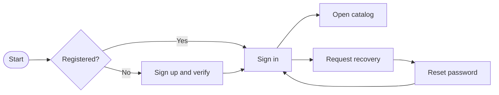
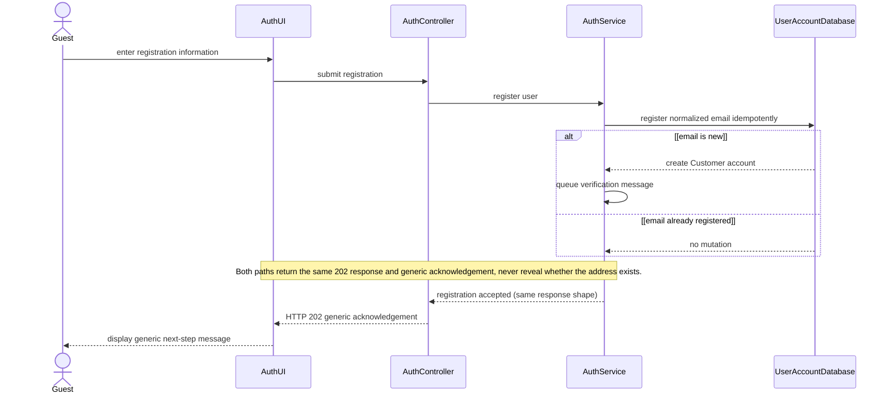
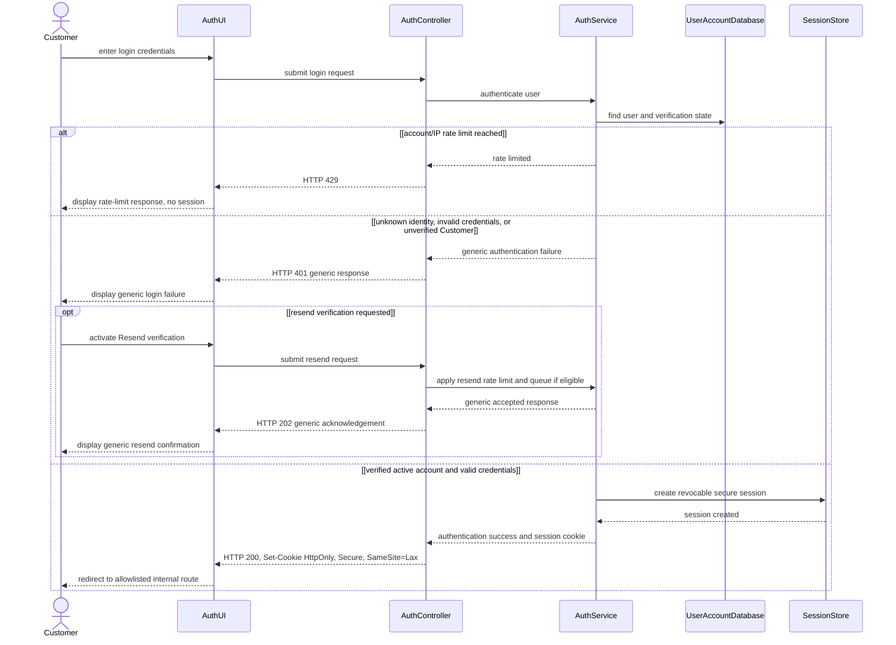

# Spec Document: Identity & Access

| Field | Value |
| --- | --- |
| Module ID | `MFG-01` |
| Module name | Identity & Access |
| Spec version | v1.0 |
| Author (team member) | Group B |
| Date | 2026-09-19 |
| Status | Final Group B demo specification; client operating approval not claimed |
| Approved by (Client role) | Client approved, 2026-09-30 |
| DBIZ2 source | Historical IDs retained: Function List MFG-01; `F-USER-001` .. `F-USER-011`; `UC-G03`, `UC-M01` .. `UC-M04`; S04, S05, S06, S07, S11 and S14. DBIZ3 extension: `F-USER-012`, `F-USER-013`, `UC-M09` (S13 notifications). External DBIZ2 comparison is not required. |

---

## 1. Purpose and scope (mandatory)

This module provides Customer registration, verification, email/password authentication, sign-out and password recovery through separate Customer storefront and Dony employee CRM portal entry points. Customer screens use the public storefront shell and navigation; staff screens use the internal Dony CRM shell and never show store/cart navigation. Public registration creates Customer capability only. A Customer may represent a company commissioning uniforms for internal use or a Reseller Shop commissioning garments from the shop's own designs for resale. This organization context does not grant an internal Dony role. Sales, Sales Admin and System Admin access is provisioned only by MFG-03 in the complete system; for MVP the named staff roles are pre-provisioned as described in the [MVP scope](../../prd.md), without an invitation or account-administration UI. Google, Facebook and other external identity-provider login are not supported.

**In scope:** register and verify a Customer; authenticate existing Customers and invited/active Dony employees through their respective portal routes; revoke a session; request and complete portal-bound email recovery; show each authenticated recipient their persisted in-app notifications (S13).

**Out of scope:** profile maintenance is MFG-02; staff provisioning is MFG-03; phone/SMS verification is disabled.

**Depends on:** a durable email outbox, secure session storage and server-side authorization.

## 2. Actors (mandatory)

| Actor | Role in this module | Where it comes from |
| --- | --- | --- |
| Guest | Registers, verifies, signs in and recovers access | MFG-01 resolved contract; UC-G03/UC-M01/UC-M02/UC-M03 |
| Invited Dony employee | Accepts a token-bound invitation, signs in and recovers access through the employee portal | MFG-01/MFG-03 boundary |
| Member | Authenticated active user; signs out | MFG-01 resolved contract; UC-M04 |
| Customer | Capability created by public registration | MFG-01 role boundary |
| System | Issues tokens, sends email and enforces limits | MFG-01 function contract |

## 3. User scenarios and acceptance criteria (mandatory)

### US-1 (Must): Register account

1. **Given** a new normalized email and valid fields, **when** submitted, **then** one pending Customer and verification event are created atomically.
2. **Given** a duplicate email, **when** registration is retried, **then** return the same generic 202 acknowledgement as a new address; do not reveal whether the address is registered and do not create another account.
3. **Given** a rate-limited resend verification request for a known or unknown email, **when** accepted, **then** return the same generic acknowledgement and queue mail only for an eligible pending account.
4. **Given** a valid unconsumed verification link, **when** opened within 24 hours, **then** activate exactly once.

### US-2 (Must): Log in

1. **Given** a verified active user, **when** credentials are correct, **then** create a revocable session with active capabilities.
2. **Given** invalid credentials or an unverified Customer account, **when** attempts one through five occur in 15 minutes, **then** return the same generic 401; later attempts in the account/IP window return 429.
3. **Given** an unverified Customer account, **when** login is attempted, **then** no session is created. After any failed login, the UI offers a rate-limited resend action and returns a generic acknowledgement without disclosing account or verification state.
4. **Given** an external redirect, **when** login succeeds, **then** discard it and use an allowlisted internal route.
5. Customer accounts use `/login` on the Dony storefront; Dony employees use `/staff/login` on the separate internal CRM. Employee accounts cannot use public registration and have no Google/Facebook or other provider sign-in.

### US-3 (Must): Forgot password

1. **Given** any valid email syntax, **when** recovery is requested, **then** return the same acknowledgement.
2. **Given** an eligible account, **when** accepted, **then** queue a single-use 30-minute reset link.

### US-4 (Must): Reset password

1. **Given** a valid token and matching compliant password, **when** reset commits, **then** consume the token, replace the hash and revoke every session atomically.
2. **Given** concurrent use of one token, **when** both submit, **then** one succeeds and the other returns 409.

### US-5 (Must): Log out

1. **Given** an active Customer session, **when** the Logout action in the storefront account menu runs, **then** revoke it, clear the cookie and route to S05; the internal CRM shell exposes its own Logout action and returns the employee to S08. Logout is a shell/header action, not the MFG-02 profile screen S11.
2. **Given** an already-revoked session, **when** repeated, **then** succeed as an idempotent no-op.

### US-6 (Must): View notifications

1. **Given** an authenticated Customer or Dony employee, **when** S13 opens, **then** return only that recipient's persisted in-app notifications, newest first, with bounded pagination; the recipient is derived from the session, never from client input.
2. **Given** an unread notification, **when** the recipient marks it read, **then** store `read_at` once; repeating the action is an idempotent no-op.
3. **Given** a notification with a target route, **when** the recipient opens it, **then** re-check authorization for the target; an inaccessible or obsolete target is hidden or returns 404 without disclosing data.
4. Notifications are created by the owning modules' committed outbox events and deduplicated per event/recipient. The in-app inbox is authoritative; email delivery is secondary and its failure never removes the in-app notification.

### Edge cases

- Expired, consumed or replaced tokens are rejected without revealing account details.
- Email failure does not roll back account/token state; delivery remains retryable.
- Recoverable errors preserve nonsecret input; passwords/tokens are never echoed.
- Missing authentication returns 401, prohibited action 403 and inaccessible object 404.

## 4. Flows (mandatory)

### 4.1 Usage flow

### 4.2 Sequence for the main flow

# UC-G03: Register account — SD-02: Sign Up

# UC-M01: Log in — SD-03: Log In

## 5. Functional requirements (mandatory)

| FR ID | DBIZ2 Subfunction ID | Requirement (system MUST ...) | Actor | Priority |
| --- | --- | --- | --- | --- |
| FR-001 | F-USER-001 | Render the registration form and verification guidance. | Guest | Must |
| FR-002 | F-USER-002 | Validate fields and atomically create one pending Customer. | Guest | Must |
| FR-003 | F-USER-003 | Issue a hashed verification token and durable email event. | Guest / System | Must |
| FR-004 | F-USER-004 | Render separate Customer and Dony Employee email/password portal modes, portal-specific recovery and invitation onboarding; do not offer external identity providers. | Guest / invited employee | Must |
| FR-005 | F-USER-005 | Authenticate, rate-limit and establish a secure server session. | Guest | Must |
| FR-006 | F-USER-006 | Revoke the current session idempotently. | Member | Must |
| FR-007 | F-USER-007 | Render the email-only recovery form. | Guest / Member | Must |
| FR-008 | F-USER-008 | Validate recovery input without exposing account existence. | Guest / Member | Must |
| FR-009 | F-USER-009 | Issue and deliver a hashed reset token. | System | Must |
| FR-010 | F-USER-010 | Verify token purpose, expiry and consumption state. | Guest | Must |
| FR-011 | F-USER-011 | Atomically replace the password and revoke sessions. | Valid token holder | Must |
| FR-012 | F-USER-012 | List the session owner's persisted in-app notifications with unread count, pagination and reauthorized target links. | Member | Must |
| FR-013 | F-USER-013 | Mark an owned notification read idempotently. | Member | Must |

### 5.1 Input / Output contract

| FR ID | Input field | Type | Required | Output field | Type | Notes / validation |
| --- | --- | --- | --- | --- | --- | --- |
| FR-001 | route/session context | Session context | Yes | registration form | View model | Name, email, password, confirmation |
| FR-002 | full_name, email, password, confirmation | Strings | Yes | generic registration acknowledgement | Object | New normalized address: create pending Customer and queue verification. Existing address: no change. Both return same generic 202 response/body; no duplicate 409 or account-existence disclosure. |
| FR-003 | server user; resend email | UUID / email | Yes | token and email event | Object | Hashed, single-use, 24 hours, rate-limited |
| FR-004 | route/session context | Session context | Yes | login model | View model | Includes recovery link |
| FR-005 | email, password, redirect | Strings / URL | Yes | session and capabilities | Object | Generic 401; later limited attempts 429; redirect allowlisted |
| FR-006 | secure-cookie session | Session | Yes | session_invalidated | Boolean | Clear cookie; repeated call succeeds |
| FR-007 | route context | Route context | Yes | recovery form | View model | Email only |
| FR-008 | email | String | Yes | accepted | Boolean/status | Three requests/account/IP/hour; generic response |
| FR-009 | server user/channel | UUID / enum | Yes | reset email event | Object | Hashed 30-minute token; retries at 1, 5, 30 minutes |
| FR-010 | reset token | Opaque token | Yes | validity status | Enum | Purpose/expiry/consumption checked; one concurrent winner |
| FR-011 | token, new_password, confirmation | Token / strings | Yes | confirmation | Object | Consume token, replace hash, revoke sessions; 409/422 as specified |
| FR-012 | session, page, page_size, unread_only? | Session / integers / boolean | Session required | notifications, unread_count, page | Paginated object | page ≥1; page_size 1–50; recipient from session only; target routes reauthorized on open |
| FR-013 | notification_id, session | UUID / session | Yes | read_at | Object | Owner only; foreign ID 404; repeated call returns the original read_at |

### 5.2 Business rules

| Rule ID | Rule | Why it exists |
| --- | --- | --- |
| BR-001 | Email is case-normalized and globally unique. | Prevent duplicate identities. |
| BR-002 | Client-supplied role, user ID or buyer-organization identifier is never authority; internal Dony roles come only from an active StaffAccount created through MFG-03. | Prevent privilege escalation. |
| BR-003 | Password is 12-128 characters, spaces allowed, stored only as a hash. | Protect credentials. |
| BR-004 | Sessions use Secure, HttpOnly, SameSite=Lax cookies, CSRF protection, 30-minute idle and 24-hour absolute expiry. | Bound session exposure. |
| BR-005 | Tokens are random, hashed, purpose-bound, single-use and replaced on resend. | Prevent token replay/leakage. |
| BR-006 | UUIDs, UTC timestamps, version checks and idempotency apply. | Make retries and concurrency deterministic. |
| BR-007 | Customer and employee recovery routes use generic responses and hashed single-use 30-minute tokens; each token is bound to the portal that issued it and returns there after reset. | Prevent enumeration and portal confusion. |
| BR-008 | Authentication is first-party email/password only. Google, Facebook and other social/third-party sign-in flows are unsupported. | Match the registration, invitation and recovery model. |

## 6. Key entities (mandatory)

| Entity | Attributes (from Input/Output fields) | Relationships |
| --- | --- | --- |
| User | id, email, full_name, password_hash, customer_capability, verified_at, active, version | No single global staff role |
| StaffAccount | id, user_id, work_email, role, status, version | Internal Dony employee role (`Sales`, `Sales Admin` or `System Admin`) provisioned by MFG-03; separate from Customer registration. |
| SystemCapability | user_id, role, active | System Admin is separate |
| Session | id, user_id, token_hash, expiries, revoked_at | Raw token not stored/logged |
| OneTimeToken | user_id, purpose, token_hash, expires_at, consumed_at | Single-use and purpose-bound |
| Notification | id, recipient_user_id, source_event_id, type, title, body, target_route?, email_delivery_state, created_at, read_at? | Unique per source event and recipient; created by owning modules' outbox events |

## 7. Screens involved

| Screen ID | Screen name | Priority | Screen Spec file |
| --- | --- | --- | --- |
| S04 | Registration | Must | `screens/S04-customer-sign-up.md` |
| S05 | Customer storefront login | Must | `screens/S05-customer-login.md` |
| S06 | Customer storefront recovery request | Must | `screens/S06-customer-forgot-password.md` |
| S07 | Customer storefront password reset | Must | `screens/S07-customer-reset-password.md` |
| S08 | Dony employee CRM login and invitation acceptance | Must | `screens/S08-staff-login.md` |
| S09 | Dony employee CRM recovery request | Must | `screens/S09-staff-forgot-password.md` |
| S10 | Dony employee CRM password reset | Must | `screens/S10-staff-reset-password.md` |
| S13 | Notifications | Must | `screens/S13-notifications.md` |
| S11 | Profile page (MFG-02, MVP Should); no separate logout page | Should | `screens/S11-profile.md` |
| Storefront / CRM shell | Logout action | Must | Header/account-menu action; no separate screen |
| S14 | Safe default catalog destination | Must | `screens/S14-product-catalog.md` |

## 8. Success criteria (mandatory)

| SC ID | Criterion | How it is measured |
| --- | --- | --- |
| SC-001 | All thirteen functions map one-to-one to FRs and retries/concurrency are deterministic. | Contract, idempotency and race tests. |
| SC-002 | Registration, login and recovery do not disclose account existence. | Compare status, body and timing class for new/existing addresses and known/unknown credentials. |
| SC-003 | Passwords, raw tokens and session secrets never appear in responses/logs/demo data. | Security and log inspection. |

## 9. Assumptions

- This is a DBIZ 3 classroom demo by Group B; no client approver is assigned.
- Organization/contact data are fictional labeled samples.
- Email is the only verification/recovery channel.

## 10. Open questions

| # | Question | Blocking? | Owner | Status |
| --- | --- | --- | --- | --- |
| 1 | Administrative project inputs | No | Group B | Group B; DBIZ 3; approved by Group B; no client approver; classroom demo with fictional labeled data. |
| 2 | Identity and access behavior | No | Group B | Resolved — no remaining open questions; roles, lifetimes, session policy, limits and email-only recovery are specified in sections 3, 5 and 9. |

## 11. Traceability to DBIZ2

Historical IDs are retained for continuity; external DBIZ2 comparison is not required.

| Spec section | DBIZ2 source | Location |
| --- | --- | --- |
| Registration | `UC-G03`; `F-USER-001` .. `003` | S04; Sections 3 and 5 |
| Login | `UC-M01`; `F-USER-004` .. `005` | S05 (Customer), S08 (employee); Sections 3 and 5 |
| Notifications | `UC-M09`; `F-USER-012` .. `013` (DBIZ3 extension) | S13; Sections 3 and 5 |
| Logout | `UC-M04`; `F-USER-006` | Storefront account menu / internal CRM shell; Sections 3 and 5; not S11 |
| Recovery | `UC-M02`, `UC-M03`; `F-USER-007` .. `011` | S06, S07 (Customer), S09, S10 (employee); Sections 3 and 5 |

## Completion checklist

- [x] Scope, actors, scenarios, flows and edge cases are defined.
- [x] Function, entity, screen and ID traceability is complete.
- [x] Assumptions and resolved decisions are explicit.
- [x] No unresolved placeholders remain.
