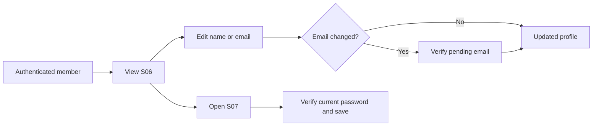
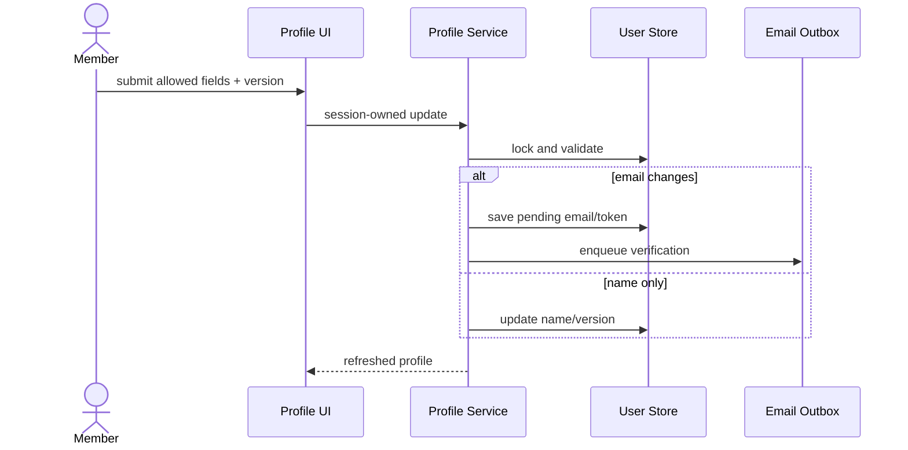

# Spec Document: Profile & Settings

| Field | Value |
| --- | --- |
| Module ID | `MFG-02` |
| Module name | Profile & Settings |
| Spec version | v1.0 |
| Author (team member) | Group B |
| Date | 2026-09-19 |
| Status | Draft |
| Approved by (Client role) | No approver assigned |
| DBIZ2 source | Historical IDs retained: Function List No. 12-16; `F-PROF-001` .. `F-PROF-005`; `UC-M05`, `UC-M07`, `UC-M08`; S06-S07. External DBIZ2 comparison is not required. |

---

## 1. Purpose and scope (mandatory)

MFG-02 describes full-system profile/settings capabilities. Its internal `Must` labels are module requirements, not MVP release commitments; README classifies MFG-02 and S06/S07 as Won't/No for MVP. Do not expose the profile/settings route or navigation link in MVP.

Authenticated active members view and maintain their own identity details and change a known password. A Customer profile may identify the representative and optional Buyer Organization for a company buying uniforms or a Reseller Shop commissioning production from its own designs. The server derives identity from the session. This module cannot assign internal Dony roles or transfer ownership.

**In scope:** view profile; edit full name; request verified email change; change password after current-password verification.

**Out of scope:** recovery without a current password is MFG-01; role/membership management is MFG-03.

## 2. Actors (mandatory)

| Actor | Role in this module | Where it comes from |
| --- | --- | --- |
| Member | Views and edits own profile/password | MFG-02 resolved contract; UC-M05/UC-M07/UC-M08 |
| System | Verifies pending email and sends notices | MFG-02 function contract |

## 3. User scenarios and acceptance criteria (mandatory)

### US-1 (Must): View profile

1. **Given** an authenticated member, **when** S06 loads, **then** return only the session owner's id, name, email, verification state, created time and version.
2. **Given** no valid session, **when** requested, **then** return 401.

### US-2 (Must): Manage profile

1. **Given** the current version, **when** the member opens edit mode, **then** S06 is prefilled from the own profile only.
2. **Given** a client submits role/company fields, **when** processed, **then** reject/ignore them and make no authorization change.

### US-3 (Must): Edit profile

1. **Given** a valid full-name update, **when** saved, **then** trim and persist it with an incremented version.
2. **Given** an email change and correct current password, **when** saved, **then** keep the old email active and issue a 24-hour single-use verification link for the globally unique pending email.
3. **Given** two edits with the same version, **when** they race, **then** one succeeds and the stale request returns 409.

### US-4 (Must): Change password

1. **Given** the correct current password and matching compliant new password, **when** committed, **then** replace the hash and revoke other sessions while keeping the current session.
2. **Given** wrong current password, weak password or mismatch, **when** submitted, **then** return field-safe 422, persist nothing and clear secret fields.

### Edge cases

- Duplicate, expired, replaced or consumed pending-email tokens return 409 and keep the old email.
- Concurrent pending-email claims serialize at commit; global uniqueness is rechecked.
- Database outage returns 503 while retaining only nonsecret form values.

## 4. Flows (mandatory)

### 4.1 Usage flow

### 4.2 Sequence for the main flow

## 5. Functional requirements (mandatory)

| FR ID | DBIZ2 Subfunction ID | Requirement (system MUST ...) | Actor | Priority |
| --- | --- | --- | --- | --- |
| FR-001 | F-PROF-001 | Return only the session owner's profile. | Member | Must |
| FR-002 | F-PROF-002 | Render the own-profile edit model. | Member | Must |
| FR-003 | F-PROF-003 | Save allowlisted name/email changes with version and verification controls. | Member | Must |
| FR-004 | F-PROF-004 | Render the secure password-change form. | Member | Must |
| FR-005 | F-PROF-005 | Verify the current password, replace the hash and revoke other sessions. | Member | Must |

### 5.1 Input / Output contract

| FR ID | Input field | Type | Required | Output field | Type | Notes / validation |
| --- | --- | --- | --- | --- | --- | --- |
| FR-001 | authenticated session | Session | Yes | own profile summary | Object | 401 unauthenticated; ignores client user_id |
| FR-002 | own profile read | Session/object | Yes | S06 edit model | View model | Full name/email only |
| FR-003 | full_name, pending_email, current_password for email, expected_version | Strings / integer | By action | updated profile or pending verification | Object | 422 invalid; 409 duplicate/stale/token replay |
| FR-004 | authenticated session | Session | Yes | S07 form model | View model | Current/new/confirmation; no secret returned |
| FR-005 | old_password, new_password, confirmation, expected_version | Strings / integer | Yes | success event | Object | CSRF-valid; replace hash; revoke other sessions |

### 5.2 Business rules

| Rule ID | Rule | Why it exists |
| --- | --- | --- |
| BR-001 | Full name is trimmed and 1-100 characters. | Keep identity data bounded. |
| BR-002 | Email is normalized/globally unique; old email remains active until verified swap. | Avoid lockout and duplicates. |
| BR-003 | Email change requires reauthentication and a hashed single-use 24-hour token. | Prove control of both account and address. |
| BR-004 | Successful email change revokes other sessions and notifies old/new addresses. | Surface sensitive change. |
| BR-005 | Password is 12-128 characters; changing it requires current password and revokes other sessions. | Protect credentials. |
| BR-006 | Mutations require optimistic version checks; optional text is null or trimmed text. | Prevent lost updates. |

## 6. Key entities (mandatory)

| Entity | Attributes (from Input/Output fields) | Relationships |
| --- | --- | --- |
| User | id, email, pending_email, full_name, password_hash, active, timestamps, version | Created time immutable; role fields not editable here |
| OneTimeToken | user_id, purpose, token_hash, expires_at, consumed_at | Pending-email token is hashed and single-use |
| Session | id, user_id, revoked_at | Other sessions revoked after sensitive change |

## 7. Screens involved

| Screen ID | Screen name | Priority | Screen Spec file |
| --- | --- | --- | --- |
| S06 | Profile view/edit and verification notice | Must | `screens/S06-user_profile_screen.md` |
| S07 | Password change | Must | `screens/S07-change_password_screen.md` |
| S38 | Notifications | Must | `screens/S38-notification_panel_screen.md` |

## 8. Success criteria (mandatory)

| SC ID | Criterion | How it is measured |
| --- | --- | --- |
| SC-001 | Every profile read/update is restricted to the session owner. | Attempt cross-user IDs and signed-out requests. |
| SC-002 | Email changes only after valid token consumption and uniqueness recheck. | Token expiry/replay/concurrent-claim tests. |
| SC-003 | Stale concurrent edits cannot overwrite a winner; all five functions map to FRs. | Version-race and traceability checks. |

## 9. Assumptions

- This is a DBIZ 3 classroom demo by Group B with no assigned approver.
- Demo identity/contact data are fictional labeled samples.
- Email delivery is asynchronous and retryable.

## 10. Open questions

| # | Question | Blocking? | Owner | Status |
| --- | --- | --- | --- | --- |
| 1 | Administrative project inputs | No | Group B | Group B; DBIZ 3; no approver; classroom demo with fictional labeled data. |
| 2 | Profile and settings behavior | No | Group B | Resolved — no remaining open questions; editable fields, verification, password and concurrency rules are specified in sections 3, 5 and 9. |

## 11. Traceability to DBIZ2

Historical IDs are retained; external DBIZ2 comparison is not required.

| Spec section | DBIZ2 source | Location |
| --- | --- | --- |
| View profile | `UC-M05`; `F-PROF-001` | S06; Sections 3 and 5 |
| Edit profile | `UC-M07`; `F-PROF-002` .. `003` | S06; Sections 3 and 5 |
| Change password | `UC-M08`; `F-PROF-004` .. `005` | S07; Sections 3 and 5 |

## Completion checklist

- [x] Scope, actors, scenarios, flows and edge cases are defined.
- [x] Function, entity, screen and ID traceability is complete.
- [x] No unresolved placeholders remain.
