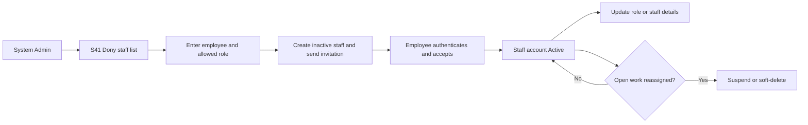
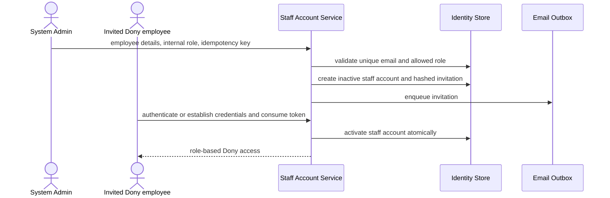

# Spec Document: Dony Staff Accounts

| Field | Value |
| --- | --- |
| Module ID | `MFG-03` |
| Module name | Dony Staff Accounts |
| Spec version | v1.2 |
| Author (team member) | Group B |
| Date | 2026-09-23 |
| Status | Draft |
| Approved by (Client role) | No approver assigned |
| DBIZ2 source | Historical IDs retained: Function List No. 17-24; `F-ACC-001` .. `F-ACC-008`; `UC-S06` .. `UC-S08`; current staff sign-in is S44 and staff administration is S41. The historical label “Company Accounts” means Dony's employee accounts in this specification, not accounts for external companies. |

---

## 1. Purpose and scope (mandatory)

MFG-03 allows a Dony System Admin to create, view, update, deactivate and soft-delete accounts for Dony employees. Typical staff roles are `Sales`, `Sales Admin` and `System Admin`.

Dony is one made-to-order garment factory. A company buying uniforms and a Reseller Shop commissioning garments from its own designs are customers of Dony; neither is provisioned as a tenant or given authority to create Dony staff accounts. Buyer-company and shop information belongs to the customer/order domain, not this module.

**In scope:** list and inspect Dony staff; invite a new employee; assign an allowed internal role; activate, suspend or reactivate an employee; update allowlisted profile and role fields; require work reassignment before deactivation; soft-delete an eligible staff account; revoke affected sessions and retain audit history.

**Out of scope:** customer self-registration (MFG-01), customer organization and billing information (MFG-02/MFG-06), product/order mutations, creation of external companies, company provisioning, tenant memberships and customer-managed employee accounts. The full staff-account administration UI is outside MVP. MVP identities are pre-provisioned: one active Sales Admin (operational owner), one active Sales employee (role/assignment testing), one active System Admin (bootstrap/recovery only), and one verified Customer test account. No employee self-registration or invitation-management UI is required for this seed setup.

## 2. Actors (mandatory)

| Actor | Role in this module | Where it comes from |
| --- | --- | --- |
| System Admin | Manages Dony employee accounts and roles | MFG-03; UC-S06/UC-S07/UC-S08 |
| Invited employee | Accepts an invitation and establishes credentials for the assigned Dony role | MFG-03 invitation contract |
| System | Sends invitation, session-revocation, notification and audit events | MFG-03 function contract |

`Sales Admin` is the current business name for the historical DBIZ2 role label `Company Admin`. `Sales` is the current business name for the historical label `Sales Consultant`.

## 3. User scenarios and acceptance criteria (mandatory)

### US-1 (Won't for MVP): Add a Dony staff account

1. Given a unique employee email and an allowed role, when a System Admin confirms creation, then the system atomically creates one inactive staff account, one hashed 48-hour invitation and one outbox event.
2. The employee becomes Active only after establishing or authenticating the matching identity and consuming the invitation once.
3. A Customer account cannot acquire an internal role through public registration; internal access requires a System Admin-issued invitation.
4. The same idempotency key and payload return the original result; a changed payload with that key returns 409.

### US-2 (Won't for MVP): Update staff information, role or status

1. A System Admin may update only allowlisted employee name, work email, role and employment status fields using the current expected version.
2. A role change takes effect only after commit, revokes obsolete sessions and is recorded in the audit log.
3. The last active System Admin cannot be demoted, suspended or deleted.
4. Suspending an employee immediately blocks new authenticated actions while preserving historical ownership and audit records.

### US-3 (Won't for MVP): Deactivate or delete a staff account

1. The confirmation view identifies the employee, current role and open-work counts.
2. An employee with active customer assignments, design requests, orders, payment reconciliation or production exceptions must have that work reassigned or resolved first.
3. Successful removal is a soft delete, revokes sessions and preserves historical records.
4. Deleting a Dony employee never deletes a Customer, Business Buyer, Reseller Shop, design, contract or order.

### US-4 (Won't for MVP): Manage Dony staff accounts

1. S41 returns a paginated staff list with allowlisted role/status/search filters and open-work counts.
2. Only an authenticated System Admin can use staff-management actions.
3. Supplying another user's identifier never bypasses server-derived authorization; inaccessible records return 404.

### Edge cases

- Expired, superseded or replayed invitations cannot activate an account.
- A Customer identity matching the invited email must authenticate before accepting the internal role.
- Duplicate active staff account or pending invitation returns 409.
- Concurrent updates use expected versions; one succeeds and stale writes return 409.
- Resending an invitation invalidates the earlier token.
- Failed email delivery leaves a visible retryable delivery state without creating another employee.

## 4. Flows (mandatory)

### 4.1 Usage flow

### 4.2 Sequence for the main flow

## 5. Functional requirements (mandatory)

| FR ID | DBIZ2 Subfunction ID | Requirement (system MUST ...) | Actor | Priority |
| --- | --- | --- | --- | --- |
| FR-001 | F-ACC-001 | List Dony staff accounts with pagination and allowlisted role, status and text filters. | System Admin | Won't |
| FR-002 | F-ACC-002 | Render the Dony employee creation form with identity and allowed internal-role fields. | System Admin | Won't |
| FR-003 | F-ACC-003 | Generate and deliver a hashed, single-use 48-hour employee invitation without exposing its raw token. | System | Won't |
| FR-004 | F-ACC-004 | Atomically create one inactive Dony staff account, invitation and outbox event with idempotency. | System Admin / System | Won't |
| FR-005 | F-ACC-005 | Return authorized staff detail with role, status and open-work counts. | System Admin | Won't |
| FR-006 | F-ACC-006 | Update allowlisted staff fields, role or status with expected-version checks, last-admin protection and audit. | System Admin | Won't |
| FR-007 | F-ACC-007 | Show identity, role and operational consequences before staff deactivation or deletion. | System Admin | Won't |
| FR-008 | F-ACC-008 | Soft-delete or deactivate an eligible employee, revoke sessions and retain historical references. | System Admin | Won't |

### 5.1 Input / Output contract

| FR ID | Input field | Type | Required | Output field | Type | Notes / validation |
| --- | --- | --- | --- | --- | --- | --- |
| FR-001 | `page`, `page_size`, `role`, `status`, `query` | Integer / Integer / Enum / Enum / String | No | `staff_accounts`, `total` | Array<StaffSummary> / Integer | System Admin only; bounded paging; role is Sales, Sales Admin or System Admin. |
| FR-002 | authenticated System Admin session | Session | Yes | `staff_creation_form` | ViewModel | Full name, work email and allowed role; no company/tax/address fields. |
| FR-003 | `staff_account_id`, `email`, `role` | UUID / Email / Enum | Yes | `invitation_id`, `expires_at`, `delivery_status` | UUID / DateTime / Enum | Token hashed, single-use and valid for 48 hours. |
| FR-004 | `full_name`, `work_email`, `role`, `idempotency_key` | String / Email / Enum / UUID | Yes | `staff_account_id`, `invitation_id`, `status` | UUID / UUID / Enum | Creates an inactive employee, not a company or tenant. |
| FR-005 | `staff_account_id` | UUID | Yes | `staff_account`, `open_work_counts` | StaffAccount / Object | Omit secrets and raw tokens; inaccessible record returns 404. |
| FR-006 | `staff_account_id`, `expected_version`, allowlisted changes | UUID / Integer / Object | Yes | `updated_staff_account`, `version` | Object / Integer | Stale version 409; protect last active System Admin; revoke obsolete sessions after role/status change. |
| FR-007 | `staff_account_id`, `expected_version`, `confirmation` | UUID / Integer / String | Yes | `eligibility`, `blocking_work`, `consequences` | Boolean / Object / Object | Confirmation identifies employee; unresolved work blocks removal. |
| FR-008 | `staff_account_id`, `expected_version`, `idempotency_key` | UUID / Integer / UUID | Yes | `status`, `revoked_session_count`, `audit_event_id` | Enum / Integer / UUID | Soft-delete only; retain history; repeated execution is idempotent. |

### 5.2 Business rules

| Rule ID | Rule | Why it exists |
| --- | --- | --- |
| BR-001 | Staff roles are `Sales`, `Sales Admin` and `System Admin`; all are internal Dony roles. | Prevent customer organizations from being treated as system tenants. |
| BR-002 | Staff lifecycle is Invited → Active ↔ Suspended → Deleted; Deleted is terminal. | Make employee access transitions deterministic. |
| BR-003 | An invitation is hashed, single-use and valid for 48 hours; resend invalidates the earlier token. | Prevent invitation replay. |
| BR-004 | Public registration creates only a Customer identity; an internal role requires a System Admin invitation. | Prevent privilege self-enrolment. |
| BR-005 | The last active System Admin is protected and operational work must be reassigned before staff removal. | Preserve continuity and accountability. |
| BR-006 | Deletion is soft; sessions are revoked and historical assignments, actions and business records remain. | Preserve audit and transaction history. |
| BR-007 | A Business Buyer or Reseller Shop is customer data and cannot be created, activated, suspended or deleted through MFG-03. | Keep account administration aligned with Dony's business model. |

## 6. Key entities (mandatory)

| Entity | Attributes (from Input/Output fields) | Relationships |
| --- | --- | --- |
| StaffAccount | id, user_id, full_name, work_email, role, status, invited_at, activated_at, deleted_at, version | One internal Dony employee identity; may own historical assignments and audit events. |
| StaffInvitation | id, staff_account_id, email, role, token_hash, expires_at, accepted_at, delivery_status, version | Single-use activation invitation for one employee. |
| StaffWorkSummary | staff_account_id, active_customer_assignments, active_design_requests, active_orders, payment_exceptions, production_exceptions | Used to determine safe reassignment and removal. |

`BuyerOrganization` is deliberately not an MFG-03 entity. It is customer/order information for a company buying uniforms or a Reseller Shop commissioning production from its own designs.

## 7. Screens involved

| Screen ID | Screen name | Priority | Screen Spec file |
| --- | --- | --- | --- |
| S44 | Dony employee CRM login and invitation acceptance | Must | `screens/S44-staff_login_screen.md` |
| S41 | Dony Staff Accounts | Won't | `screens/S41-company_and_staff_accounts_screen.md` |

## 8. Success criteria (mandatory)

| SC ID | Criterion | How it is measured |
| --- | --- | --- |
| SC-001 | No Customer, Business Buyer or Reseller Shop can self-assign an internal Dony role. | Exercise public registration and invitation authorization tests. |
| SC-002 | Every active internal role was assigned through an auditable System Admin action. | Compare active staff accounts with invitation and audit records. |
| SC-003 | Last-admin and open-work guards prevent unsafe removal while eligible removals revoke access and preserve history. | Test removal guards, session revocation and retained references. |

## 9. Assumptions

- Dony is the only manufacturer and system operator represented by WeaveLink.
- A Business Buyer orders made-to-order uniforms or garments for internal use.
- A Reseller Shop supplies its own design, branding or requirements for Dony to manufacture, then sells the resulting garments to the shop's customers; it does not resell Dony ready-made inventory.
- Legal, organization and contact values used in the classroom demo are fictional samples.
- MVP uses the pre-provisioned role-specific accounts listed in the project README; Sales Admin owns the minimum operational order path, while System Admin is bootstrap/recovery-only. Full MFG-03 remains documented for a later release.

## 10. Open questions

| # | Question | Blocking? | Owner | Status |
| --- | --- | --- | --- | --- |
| 1 | Are staff roles, customer boundaries or account lifecycle decisions still unresolved? | No | Group B | Resolved in sections 1–6. |

## 11. Traceability to DBIZ2

| Spec section | DBIZ2 source | Location |
| --- | --- | --- |
| Scope and actors | Function List MFG-03 | Rows 17–24; reinterpreted as Dony employee accounts using the confirmed business model. |
| Scenarios | UC-S06, UC-S07, UC-S08 | Add, update and delete Dony staff accounts. |
| Requirements and entities | F-ACC-001..008 | Sections 5–6 preserve the eight historical function IDs. |
| Screens | S44, S41 | Invitation acceptance and Dony staff administration. |

## Completion checklist

- [x] MFG-03 manages Dony employees only.
- [x] Business Buyers and Reseller Shops are customers, not tenants.
- [x] Sales, Sales Admin and System Admin roles are explicit.
- [x] Lifecycle, invitation, concurrency, deletion and traceability rules are complete.
- [x] No company-provisioning behavior remains.
