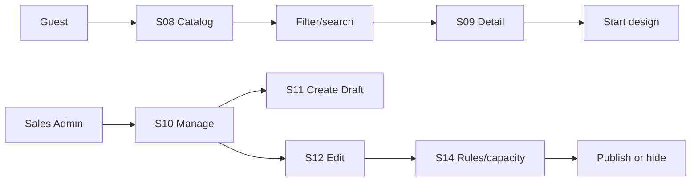
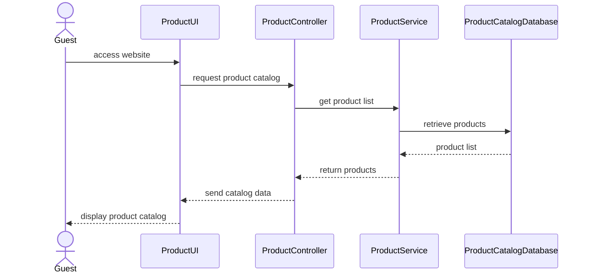
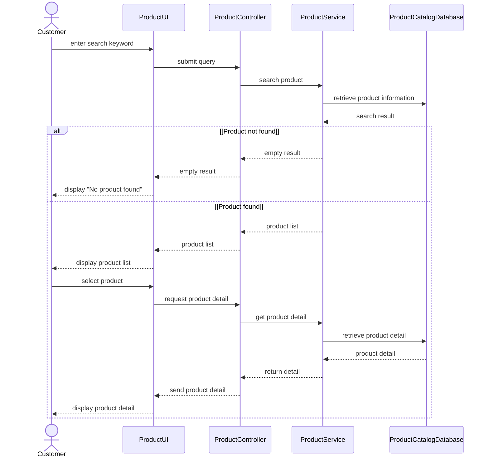

# Spec Document: Product Catalog

| Field | Value |
| --- | --- |
| Module ID | `MFG-04` |
| Module name | Product Catalog |
| Spec version | v1.2 |
| Author (team member) | Group B |
| Date | 2026-09-26 |
| Status | Draft |
| Approved by (Client role) | No approver assigned |
| DBIZ2 source | Historical IDs retained: Function List No. 25-35; `F-PROD-001` .. `F-PROD-011`; `UC-G01`, `UC-G02`, `UC-C24` .. `UC-C27`; S01, S08-S14. External DBIZ2 comparison is not required. |

---

## 1. Purpose and scope (mandatory)

Provide public discovery of Dony's Published configurable garment bases and Dony-scoped catalog/design-rule administration. Dony is a made-to-order garment factory: catalogue entries describe garment types, supported materials, colours, print or embroidery methods, price rules and production constraints. They are not finished garments held in stock or available for immediate delivery. Catalog browsing/search/detail is Must for MVP.

**In scope:** browse/search/detail; create/edit/archive; publish/hide; configure supported options, print areas and finite per-order capacity.

**Out of scope:** design creation is MFG-05; checkout/order is MFG-06; capacity is a validation limit, not inventory reservation.

## 2. Actors (mandatory)

| Actor | Role in this module | Where it comes from |
| --- | --- | --- |
| Guest/Member | Browses/searches Published products | MFG-04 resolved contract; UC-G01/UC-G02 |
| Sales Admin | Manages Dony's configurable garment bases and design rules | MFG-04 role boundary |
| System | Validates assets, versions and visibility | MFG-04 function contract |

## 3. User scenarios and acceptance criteria (mandatory)

### US-1 (Must): View product catalog

Valid page/filter returns only Dony's Published configurable garment bases with integer-VND quote inputs and accurate pagination; empty data returns an empty list. The UI does not claim that a finished item is in stock or ready to ship.

### US-2 (Must): Search products

Search accepts a trimmed keyword up to 100 characters plus allowlisted category/size/color/material/price filters; invalid range/sort returns 422/400 without broadening the query.

### US-3 (Post-MVP administration): Add product

Sales Admin creates a Draft with validated fields/assets and idempotency. Duplicate SKU anywhere in Dony's single catalogue conflicts; incomplete Draft is allowed.

### US-4 (Post-MVP administration): Update product info

Dony product-base updates use allowlisted fields and expected version. Any update increases the product version. Rule-affecting changes lazily invalidate unconsumed quotes during checkout without editing quote records directly; submitted order snapshots remain unchanged.

### US-5 (Post-MVP administration): Delete product

Archive is a soft, terminal deletion. Repeating archive succeeds; public visibility ends immediately while historical references remain. A Draft product that has never been published can be hard deleted permanently.

### US-6 (Post-MVP administration): Publish / unpublish product

Publish requires all mandatory data and safe image; hide uses an explicit target state. Archived records never transition.

### US-7 (Post-MVP administration): Manage product catalog

S10-S14 expose permission-derived actions and optimistic concurrency. Product/design rule changes increment version.

### Edge cases

- Foreign/missing/nonpublic product UUID returns 404 for the relevant actor.
- Unsafe or oversized image is rejected before reference persistence.
- Quantity beyond `max_units_per_order` returns 422 `CAPACITY_EXCEEDED`.
- Hidden or Archived product bases cannot start new design/order/payment work.

## 4. Flows (mandatory)

### 4.1 Usage flow

### 4.2 Sequence for the main flow

# UC-G01: View product catalog — SD-01: Browse Product Catalog (Guest)

# UC-G02: Search products — SD-04 – Search and View Product Detail

## 5. Functional requirements (mandatory)

### 5.1 Functional requirement I/O contract

| FR ID | DBIZ2 Subfunction ID | Requirement (system MUST ...) | Actor | Priority |
| --- | --- | --- | --- | --- |
| FR-001 | F-PROD-001 | Return a paginated grid of Dony's Published configurable garment bases using allowlisted category and sort values. | Guest/Member | Must |
| FR-002 | F-PROD-002 | Return a product detail and options for a canonical product UUID; nonpublic products return 404. | Guest/Member | Must |
| FR-003 | F-PROD-003 | Search using bounded keywords and allowlisted filters without broadening invalid queries. | Guest/Member | Must |
| FR-004 | F-PROD-004 | Show management actions only for Dony Sales Admins. | Sales Admin | Won't |
| FR-005 | F-PROD-005 | Render product creation form and upload constraints. | Sales Admin | Won't |
| FR-006 | F-PROD-006 | Save a validated Draft product with idempotency and Dony-scoped SKU uniqueness. | Sales Admin | Won't |
| FR-007 | F-PROD-007 | Render an authorized product edit model with current version. | Sales Admin | Won't |
| FR-008 | F-PROD-008 | Update allowlisted product fields atomically with expected-version checks. | Sales Admin | Won't |
| FR-009 | F-PROD-009 | Require explicit confirmation before archiving a product. | Sales Admin | Won't |
| FR-010 | F-PROD-010 | Soft-archive a product while retaining historical references, or hard-delete if it is a Draft that has never been published. | Sales Admin | Won't |
| FR-011 | F-PROD-011 | Change product visibility to an explicitly requested valid state. | Sales Admin | Won't |

### 5.2 Input / Output contract

| FR ID | Input field | Type | Required | Output field | Type | Notes / validation |
| --- | --- | --- | --- | --- | --- | --- |
| FR-001 | category, page, page_size, sort | Allowlisted values / integers | Optional | Published product grid | Paginated object | page >=1; size 1-100 |
| FR-002 | product UUID | UUID | Yes | product detail/options | Object | Nonpublic product 404 |
| FR-003 | keyword, filters, price range, page | String / allowlisted values | Optional | search results | Paginated object | Keyword <=100; invalid values rejected |
| FR-004 | authenticated Dony Sales Admin session | Session | Yes | S10 management list/actions | View model | Non-Dony-admin access prohibited |
| FR-005 | authorized session | Session | Yes | S11 creation model | View model | Includes upload constraints |
| FR-006 | name, SKU, base unit price, volume tiers, per-garment option surcharges, MOQ, attributes, capacity, image UUIDs, key | Fields / integer / arrays / key | Yes | Draft UUID/version and normalized price model | Object | VND values are nonnegative integers; 1..10 tiers; first tier starts at quantity 1; subsequent lower bounds strictly increase; capacity 1..10000; MOQ is explicit and <= capacity; invalid fields 422; duplicate SKU 409 |
| FR-007 | Dony product UUID / Sales Admin session | UUID / session | Yes | S12 edit model/version | View model | Foreign product inaccessible |
| FR-008 | allowlisted changes, expected version | Values / integer | Yes | updated product/version | Object | Atomic; stale 409; relevant quote invalidation |
| FR-009 | Dony product UUID/version | UUID / integer | Yes | confirmation/impact model | View model | Explicit confirmation |
| FR-010 | product UUID, confirmation, version | UUID / boolean / integer | Yes | archived product or 204 No Content | Object or None | Soft archive; hard delete if Draft; repeated success |
| FR-011 | product UUID, target state, version | UUID / enum / integer | Yes | visibility state | Object | Archived is terminal |

### 5.2 Business rules

| Rule ID | Rule | Why it exists |
| --- | --- | --- |
| BR-001 | SKU is unique across Dony's single product catalogue; canonical public route uses globally unique UUID. Buyer companies and Reseller Shops do not own separate product catalogues. | Avoid duplicate Dony catalog entries without implying multi-tenant product ownership. |
| BR-002 | Base prices and surcharges are nonnegative integer VND; capacity is integer 1-10000; `min_order_quantity` is an integer 10..capacity in the classroom seed policy. | Keep pricing and production quantities bounded and deterministic. |
| BR-003 | Publish requires name, SKU, volume_pricing_tiers, category, safe image, sizes, colors, materials and capacity. | Prevent incomplete public products. |
| BR-004 | Images are PNG/JPEG/WebP, actual MIME checked/scanned, <=10 MiB each and <=5/request. | Protect users and storage. |
| BR-005 | Lifecycle is Draft → Published ↔ Hidden → Archived; archive is terminal. Drafts can be hard deleted. | Make visibility transitions explicit and allow cleanup of mistakes. |
| BR-006 | Rule/product changes increase product version, lazily invalidating unsubmitted quotes at checkout; submitted orders retain immutable snapshots. | Preserve current quotes and historical order values securely without cross-module side effects. |
| BR-007 | S14 owns sizes, colors, materials, print methods/areas, surcharges and capacity; 2D preview required, 3D excluded. | Define supported customization scope. |
| BR-008 | An order's aggregate garment quantity is the sum across all sizes. Select exactly one volume tier using that aggregate; its unit price applies to every garment in the order (not marginal/progressive pricing). Each selected `option_surcharge_vnd` is per garment and is multiplied by that garment quantity. Merchandise subtotal sums all size/option combinations; shipping, tax and design fee are separate lines. MOQ validation is against aggregate quantity, not each size. | Make mixed-size quotes deterministic and prevent tier/surcharge ambiguity. |

### Analytics evidence integration (MFG-11)

For the Should analytics extension, S09 contributes a validated `product_viewed` interaction only when an eligible product detail is actually displayed to an authenticated Customer, excluding guest activity, prefetch/catalog impressions and staff previews. Product-entry identity and explicit links to new design intents follow MFG-11 5.3; an entry that never starts a design remains in the product-entry denominator. Preserve product ID and source time/version according to [MFG-11 section 5.4](spec-MFG-11.md#54-event-evidence-and-instrumentation). Analytics keeps historical hidden/archived product references independently of public Published-only catalog access. The confirmed first release collects no guest analytics and performs no guest-to-login linking, fingerprinting or guessed customer links. Public catalog access remains available; login starts eligible tracking only from authenticated displays onward, never from replayed guest views. Catalog browsing remains usable when analytics is unavailable.

## 6. Key entities (mandatory)

| Entity | Attributes (from Input/Output fields) | Relationships |
| --- | --- | --- |
| Product | id, name, sku, description, category, volume_pricing_tiers, options, design_rules, capacity, images, status, version | Dony-owned configurable garment base; Dony-wide unique SKU; immutable ordered snapshot; tiers must have at least one entry starting at quantity 1. It is not finished-goods inventory. |
| Asset | id, owner_user_id or Dony ownership, MIME, scan status, storage key | Private; customer artwork requires ownership, while Dony catalogue assets require staff authorization; served by expiring URL. |
| ProductVersion | product_id, version, rule/price snapshot | Quotes reference current version |

## 7. Screens involved

| Screen ID | Screen name | Priority | Screen Spec file |
| --- | --- | --- | --- |
| S01 | Home and catalog entry | Must | `screens/S01-home_page.md` |
| S08 | Product catalog and search | Must | `screens/S08-product_catalog_screen.md` |
| S09 | Product detail and design entry | Must | `screens/S09-product_detail_screen.md` |
| S10 | Product management | Won't | `screens/S10-product_list_company_admin_screen.md` |
| S11 | Product creation | Won't | `screens/S11-product_create_screen.md` |
| S12 | Product edit/archive | Won't | `screens/S12-product_edit_screen.md` |
| S14 | Design rules and capacity | Won't | `screens/S14-product_design_rules_screen.md` |

## 8. Success criteria (mandatory)

| SC ID | Criterion | How it is measured |
| --- | --- | --- |
| SC-001 | MVP users can browse, search and view only eligible products. | Verify Published/Active filtering and empty results. |
| SC-002 | Publish/archive/version/capacity behavior is deterministic under retry/concurrency. | Exercise lifecycle, version and capacity boundaries. |
| SC-003 | Unsafe assets and unauthorized access are blocked; all eleven functions map to FRs. | Test asset validation and authorization; compare F-PROD IDs with FRs. |

## 9. Assumptions

- DBIZ 3 classroom demo by Group B; no approver assigned; demo company/contact data are fictional samples.
- Catalog browsing/search/detail is MVP Must; pre-seed at least one complete Published Dony product base with valid sizes/variants, materials/colours/print options, pricing, media assets and compatible design rules. Product CRUD and design-rule administration remain specified for later operation.
- Classroom sample seed used to make the MVP runnable: SKU `DEMO-TEE-001`, MOQ 10, capacity 10000; supported sizes S/M/L/XL, colours White/Navy/Black, and materials 100% cotton or 65/35 cotton-polyester; total-order quantity tiers 1-49 at 150000 VND/garment, 50-199 at 130000 VND/garment, and 200-10000 at 110000 VND/garment. The first tier begins at 1 to satisfy the tier model; MOQ 10 still blocks smaller orders. Front and back each have a 300 × 400 mm printable area for every seeded size; supported print option is direct print, surcharged 15000 VND/garment on front and 25000 VND/garment on back. This is fictional course-demo data, not Dony's real product catalogue or price list. For 10 garments with front print: merchandise subtotal = 10 × (150000 + 15000) = 1650000 VND.
- Capacity is a validation ceiling and does not represent stock.

## 10. Open questions

| # | Question | Blocking? | Owner | Status |
| --- | --- | --- | --- | --- |
| 1 | Are any product lifecycle, visibility, image, capacity or quote-invalidation decisions still undecided? | No | Group B | Resolved — no remaining open questions; sections 3–6 define the complete behavior. |

## 11. Traceability to DBIZ2

Historical IDs are retained; external DBIZ2 comparison is not required.

| Spec section | DBIZ2 source | Location |
| --- | --- | --- |
| Scope and actors | Function List MFG-04 | Rows 25–35; IDs appear in FR table |
| Browse and detail | UC-G01; F-PROD-001..002 | S08-S09; sections 3 and 5 |
| Search | UC-G02; F-PROD-003 | S08; sections 3 and 5 |
| Administration | UC-C24..UC-C27; F-PROD-004..011 | S10-S14; sections 3 and 5 |

## Completion checklist

- [x] Scope, actors, scenarios, flows and edge cases are defined.
- [x] All functions, entities, screens and lifecycle rules are traceable.
- [x] MVP priority and demo assumptions are explicit.
- [x] No unresolved placeholders remain.
