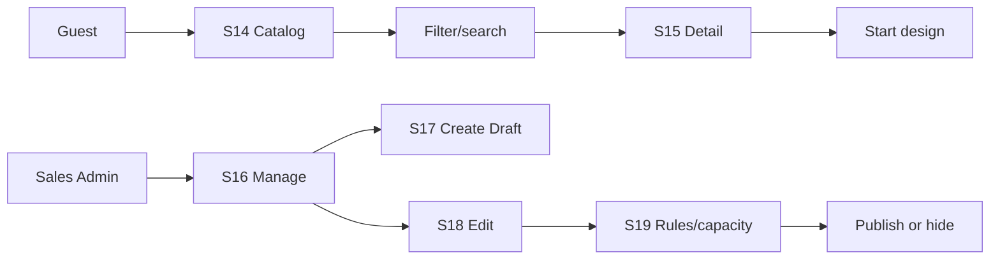
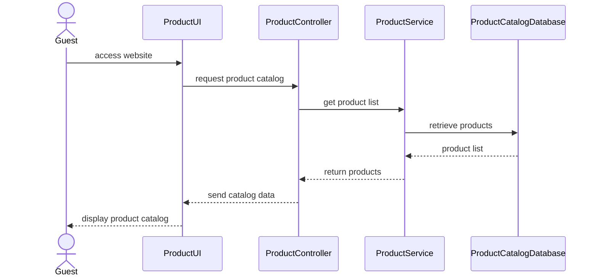
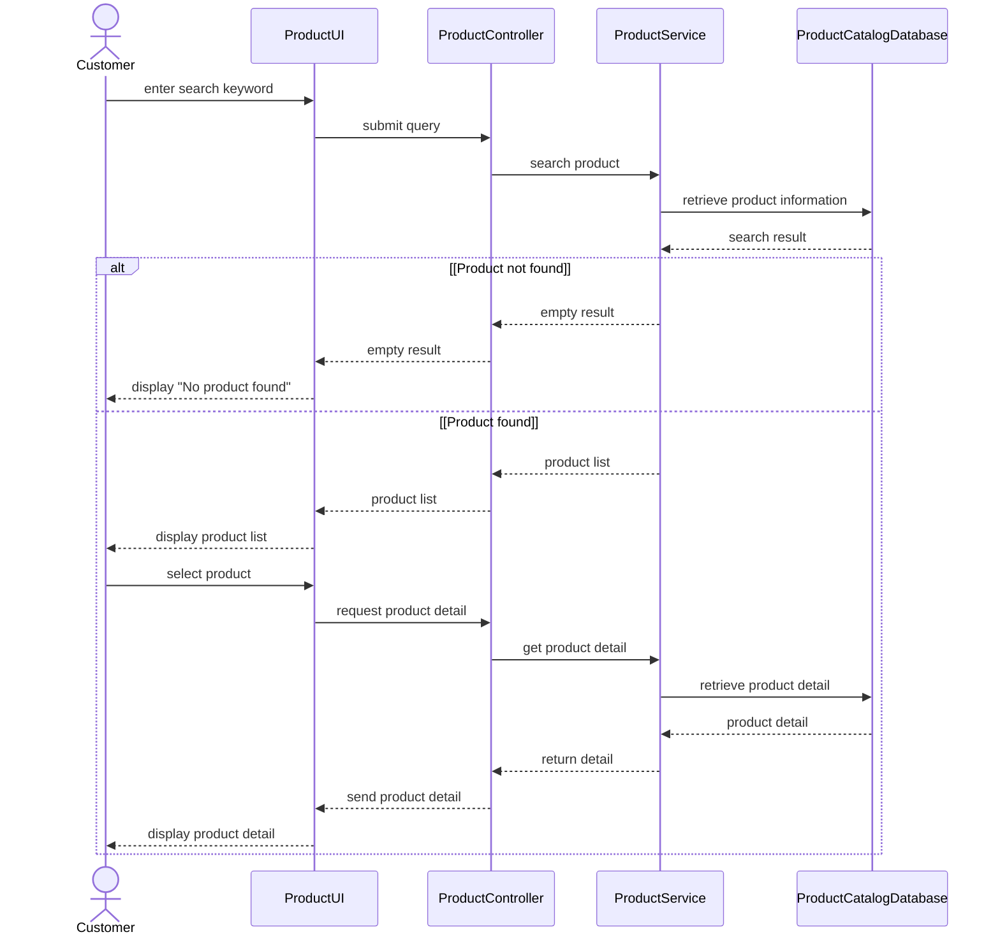
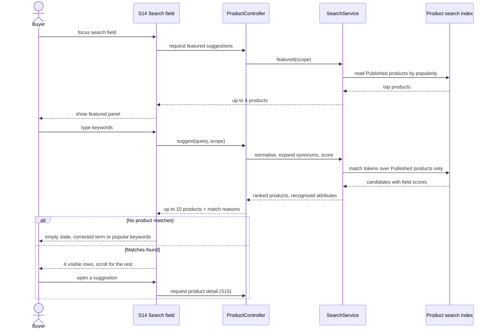

# Spec Document: Product Catalog

| Field | Value |
| --- | --- |
| Module ID | `MFG-04` |
| Module name | Product Catalog |
| Spec version | v1.4 |
| Author (team member) | Group B |
| Date | 2026-09-27 |
| Status | Final Group B demo specification; client operating approval not claimed |
| Approved by (Client role) | Client approved, 2026-09-30 |
| DBIZ2 source | Historical IDs retained: Function List MFG-04; `F-PROD-001` .. `F-PROD-011`; `UC-G01`, `UC-G02`, `UC-C24` .. `UC-C27`; S01, S14, S15, S16, S17, S18, S20, S19. External DBIZ2 comparison is not required. |

---

## 1. Purpose and scope (mandatory)

Provide public discovery of Dony's Published configurable garment bases and Dony-scoped catalog/design-rule administration. Dony is a made-to-order garment factory: catalogue entries describe garment types, supported materials, colours, print or embroidery methods, price rules and production constraints. They are not finished garments held in stock or available for immediate delivery. MVP priority (see [MVP scope](../../prd.md)): catalog browsing/detail is Must; keyword search, Product Finder, AI Compare, AI advisory and product administration (S16–S18) are Should; the design-rules editor (S19) is Could.

**In scope:** browse/search/detail; keyword search with a suggestion panel over Published products (Product Finder); AI Compare and product advisory over Published products; create/edit/archive; publish/hide; configure supported options, print areas and finite per-order capacity.

**Out of scope:** design creation is MFG-05; checkout/order is MFG-06; capacity is a validation limit, not inventory reservation. Semantic/vector retrieval and standalone AI-written product copy remain outside this module; grounded AI comparison and advisory are the Should extension defined below.

## 2. Actors (mandatory)

| Actor | Role in this module | Where it comes from |
| --- | --- | --- |
| Guest/Member | Browses/searches Published products, compares products and, after login, asks advisory/follow-up questions | MFG-04 resolved contract; UC-G01/UC-G02 |
| Sales Admin | Manages Dony's configurable garment bases and design rules | MFG-04 role boundary |
| System | Validates assets, versions and visibility; maintains the search index and the keyword synonym set | MFG-04 function contract |

## 3. User scenarios and acceptance criteria (mandatory)

### US-1 (Must): View product catalog

Valid page/filter returns only Dony's Published configurable garment bases with integer-VND quote inputs and accurate pagination; empty data returns an empty list. The UI does not claim that a finished item is in stock or ready to ship.

### US-2 (Should): Search products

Search accepts a trimmed keyword up to 100 characters plus allowlisted category/size/color/material/price filters; invalid range/sort returns 422/400 without broadening the query. How a keyword is matched against product data, and how suggestions are presented while typing, are specified in US-8 and sections 5.3–5.4.

### US-3 (Should): Add product

Sales Admin creates a Draft with validated fields/assets and idempotency. Duplicate SKU anywhere in Dony's single catalogue conflicts; incomplete Draft is allowed.

### US-4 (Should): Update product info

Dony product-base updates use allowlisted fields and expected version. Any update increases the product version. Rule-affecting changes lazily invalidate unconsumed quotes during checkout without editing quote records directly; submitted order snapshots remain unchanged.

### US-5 (Should): Delete product

Archive is a soft, terminal deletion. Repeating archive succeeds; public visibility ends immediately while historical references remain. A Draft product that has never been published can be hard deleted permanently.

### US-6 (Should): Publish / unpublish product

Publish requires all mandatory data and safe image; hide uses an explicit target state. Archived records never transition.

### US-7 (Should): Manage product catalog

S16, S17, S18, S20, S19 expose permission-derived actions and optimistic concurrency. Product/design rule changes increment version.

### US-8 (Should): Find products with everyday keywords

A buyer who does not know Dony's catalogue wording can still reach the right product base. The search accepts Vietnamese written without diacritics (`ao so mi`), shortened or partial wording (`so mi`, `polo`, `kaki`), the two combined (`polo den`, `somi trang`), joined words without spaces (`aothun`) and single-character typing mistakes (`polp`). While the buyer types, a suggestion panel shows matching Published products with the information needed to judge them, and the system states which product attributes it recognised in the query. Every keyword in the query must be satisfied by the product; the system never widens the query to return unrelated products.

**Acceptance criteria**

1. **Given** the search field is focused and empty, **when** the panel opens, **then** it shows at most four featured Published products, each with image, name, colour, material, SKU and price, and no scrolling is required.
2. **Given** a keyword is entered, **when** matches exist, **then** the panel shows at most ten Published products ranked by relevance, displays four at a time with in-panel scrolling, and states the total number of matching products.
3. **Given** a keyword written without diacritics, shortened, joined or containing one wrong character, **when** it corresponds to a catalogue term, **then** the matching products are returned with the same ranking rules as the fully written keyword.
4. **Given** a multi-keyword query, **when** one keyword has no match in a product, **then** that product is excluded.
5. **Given** the query matches nothing, **when** the panel renders, **then** it states that no product matched, offers a corrected term only when a catalogue term is within one edit of the typed term, otherwise offers popular keywords, and offers the design-service route only when that deferred service is enabled; it never lists unrelated products.
6. **Given** a category scope is selected in the search field, **when** the query runs, **then** only products of that category are considered and the scope is shown in the field.
7. **Given** products that are Draft, Hidden or Archived, **when** any query runs, **then** they never appear in suggestions or results, even when their SKU is typed in full.

### US-9 (Should): Compare product bases with AI

On S14, Guest/Member enters compare mode and selects 2-4 Published products from the same `branch`; cross-branch checkboxes are disabled and existing search/filter state remains applied. On S15, the current product is pinned and 1-3 additional Published products from its branch may be added. AI Copilot shows quantity-tier prices, material attributes, pros/cons, print compatibility and a grounded verdict. Guests can read the comparison; sending questions requires login with a safe `return_to` restoring the comparison context. Follow-ups on breathability/sweat management, wash durability, wrinkle resistance, abrasion resistance or printing use the selected products' stored fields. Context is limited to the latest five Q&A exchanges.

### US-10 (Should): Ask for product advisory

An authenticated user opens AI Copilot without entering compare mode or selecting products, describes their needs, and receives catalogue-grounded advice with four candidate suggestions by default and eight maximum. Guests must sign in before submitting free-form questions. A suggested comparison still requires 2-4 products in one branch. Missing evidence returns "Chưa đủ dữ liệu, Dony sẽ liên hệ trực tiếp." rather than an invented recommendation.

### Edge cases

- A query longer than the accepted length is rejected with 422 rather than silently truncated; the entered value is preserved.
- An empty or whitespace-only query returns the featured-product panel, not an error.
- A query that matches nothing returns an empty result set with a stated reason; the system never substitutes popular products as if they were matches.
- Unknown or unsupported scope, filter or sort values are rejected; the query is never broadened to compensate.
- A product that becomes Hidden or Archived becomes ineligible for search in the same commit; any stale physical index entry is suppressed before serving.
- Foreign/missing/nonpublic product UUID returns 404 for the relevant actor.
- Unsafe or oversized image is rejected before reference persistence.
- Quantity beyond `max_units_per_order` returns 422 `CAPACITY_EXCEEDED`.
- Hidden or Archived product bases cannot start new design/order/payment work.

## 4. Flows (mandatory)

### 4.1 Usage flow

```mermaid
flowchart LR
  Guest --> Catalog[S14 Catalog]
  Catalog --> Search[Filter/search]
  Search --> Detail[S15 Detail]
  Detail --> Design[Start design]
  Admin[Sales Admin] --> Manage[S16 Manage]
  Manage --> Draft[S17 Create Draft]
  Manage --> Edit[S18 Edit]
  Edit --> Rules[S19 Rules/capacity]
  Rules --> Publish[Publish or hide]
```

### 4.2 Sequence for the main flow

# UC-G01: View product catalog — SD-01: Browse Product Catalog (Guest)

```mermaid
sequenceDiagram
    actor Guest
    participant ProductUI
    participant ProductController
    participant ProductService
    participant ProductCatalogDatabase

    Guest->>ProductUI: access website
    ProductUI->>ProductController: request product catalog
    ProductController->>ProductService: get product list
    ProductService->>ProductCatalogDatabase: retrieve products
    ProductCatalogDatabase-->>ProductService: product list
    ProductService-->>ProductController: return products
    ProductController-->>ProductUI: send catalog data
    ProductUI-->>Guest: display product catalog
```

# UC-G02: Search products — SD-04 – Search and View Product Detail

```mermaid
sequenceDiagram
    actor Customer
    participant ProductUI
    participant ProductController
    participant ProductService
    participant ProductCatalogDatabase

    Customer->>ProductUI: enter search keyword
    ProductUI->>ProductController: submit query
    ProductController->>ProductService: search product
    ProductService->>ProductCatalogDatabase: retrieve product information
    ProductCatalogDatabase-->>ProductService: search result
    alt [Product not found]
        ProductService-->>ProductController: empty result
        ProductController-->>ProductUI: empty result
        ProductUI-->>Customer: display "No product found"
    else [Product found]
        ProductService-->>ProductController: product list
        ProductController-->>ProductUI: product list
        ProductUI-->>Customer: display product list
        Customer->>ProductUI: select product
        ProductUI->>ProductController: request product detail
        ProductController->>ProductService: get product detail
        ProductService->>ProductCatalogDatabase: retrieve product detail
        ProductCatalogDatabase-->>ProductService: product detail
        ProductService-->>ProductController: return detail
        ProductController-->>ProductUI: send product detail
        ProductUI-->>Customer: display product detail
    end
```

### 4.3 Sequence for keyword suggestions (F-PROD-012)

```mermaid
sequenceDiagram
    actor Buyer
    participant SearchUI as S14 Search field
    participant ProductController
    participant SearchService
    participant SearchIndex as Product search index

    Buyer->>SearchUI: focus search field
    SearchUI->>ProductController: request featured suggestions
    ProductController->>SearchService: featured(scope)
    SearchService->>SearchIndex: read Published products by popularity
    SearchIndex-->>SearchService: top products
    SearchService-->>SearchUI: up to 4 products
    SearchUI-->>Buyer: show featured panel

    Buyer->>SearchUI: type keywords
    SearchUI->>ProductController: suggest(query, scope)
    ProductController->>SearchService: normalise, expand synonyms, score
    SearchService->>SearchIndex: match tokens over Published products only
    SearchIndex-->>SearchService: candidates with field scores
    SearchService-->>ProductController: ranked products, recognised attributes
    ProductController-->>SearchUI: up to 10 products + match reasons
    alt No product matches
        SearchUI-->>Buyer: empty state, corrected term or popular keywords
    else Matches found
        SearchUI-->>Buyer: 4 visible rows, scroll for the rest
        Buyer->>SearchUI: open a suggestion
        SearchUI->>ProductController: request product detail (S15)
    end
```

## 5. Functional requirements (mandatory)

### 5.1 Functional requirement I/O contract

| FR ID | DBIZ2 Subfunction ID | Requirement (system MUST ...) | Actor | Priority |
| --- | --- | --- | --- | --- |
| FR-001 | F-PROD-001 | Return a paginated grid of Dony's Published configurable garment bases using allowlisted category and sort values, with public Home/About/Contact navigation. S02 /about and S03 /contact are read-only MVP pages; Contact has no form and company background facts do not override demo rules. | Guest/Member | Must |
| FR-002 | F-PROD-002 | Return a product detail and options for a canonical product UUID; nonpublic products return 404. | Guest/Member | Must |
| FR-003 | F-PROD-003 | Search using bounded keywords and allowlisted filters without broadening invalid queries. | Guest/Member | Should |
| FR-004 | F-PROD-004 | Show management actions only for Dony Sales Admins. | Sales Admin | Should |
| FR-005 | F-PROD-005 | Render product creation form and upload constraints. | Sales Admin | Should |
| FR-006 | F-PROD-006 | Save a validated Draft product with idempotency and Dony-scoped SKU uniqueness. | Sales Admin | Should |
| FR-007 | F-PROD-007 | Render an authorized product edit model with current version. | Sales Admin | Should |
| FR-008 | F-PROD-008 | Update allowlisted product fields atomically with expected-version checks. | Sales Admin | Should |
| FR-009 | F-PROD-009 | Require explicit confirmation before archiving a product. | Sales Admin | Should |
| FR-010 | F-PROD-010 | Soft-archive a product while retaining historical references, or hard-delete if it is a Draft that has never been published. | Sales Admin | Should |
| FR-011 | F-PROD-011 | Change product visibility to an explicitly requested valid state. | Sales Admin | Should |
| FR-012 | F-PROD-012 | Match a natural keyword query against Published products using diacritic-insensitive, partial, joined and single-edit tolerant matching over an allowlisted set of product fields. | Guest/Member | Should |
| FR-013 | F-PROD-012 | Return an empty-query suggestion payload of at most four featured Published products with image, name, colour, material, SKU and price. | Guest/Member | Should |
| FR-014 | F-PROD-012 | Return at most ten ranked suggestions for a non-empty query, with the total match count and the same product fields as FR-013. | Guest/Member | Should |
| FR-015 | F-PROD-012 | Return the product attributes recognised in the query (colour, category, material, feature) as match reasons, derived only from catalogue data and the versioned synonym set. | Guest/Member | Should |
| FR-016 | F-PROD-012 | Restrict a query to one category when a scope is supplied, rejecting any scope value outside the allowlist. | Guest/Member | Should |
| FR-017 | F-PROD-012 | Keep the search index consistent with product visibility and version: index on publish, refresh on version increase, remove on hide/archive. | System | Should |
| FR-018 | F-PROD-013 | Allow a Guest/Member to pick 2-4 Published products in the same `branch` from S14 or S15 and open an AI Copilot comparison table with pricing by quantity tier, material attributes, pros/cons, and a consolidated verdict. | Guest/Member | Should |
| FR-019 | F-PROD-013 | Prevent selection of products from a different `branch` at the UI level by disabling the compare checkbox before the user can submit the comparison. | Guest/Member | Should |
| FR-020 | F-PROD-013 / F-PROD-014 | Allow Guest users to view AI-generated comparison output without free-form chat, but require login before sending free-text questions with a safe `return_to` that returns to the comparison context. | Guest/Member | Should |
| FR-021 | F-PROD-014 | Support free-form advisory mode without requiring product pre-selection or compare mode by extracting intent from the Published catalog and limiting candidate suggestions to 4 by default and 8 maximum before generating a response. | Guest/Member | Should |
| FR-022 | F-PROD-013 / F-PROD-014 | When a follow-up question is asked during a comparison and matches one of five technical criteria (breathability / sweat management, wash durability, wrinkle resistance, abrasion resistance, or suitable print method), answer directly from the corresponding field on the products being compared, not from general knowledge. | Guest/Member | Should |
| FR-023 | F-PROD-013 / F-PROD-014 | When the question concerns print suitability or multi-colour/fine-detail execution, compare `PrintMethod` data against the target product `material_label`, and if the selected method is unsuitable, warn the user and suggest a replacement method. | Guest/Member | Should |
| FR-024 | F-PROD-013 / F-PROD-014 | Reuse the existing `capacity` / MOQ fields from `Product` to answer feasibility questions about quantities and timing without introducing a new factory-capacity-by-month concept. | Guest/Member | Should |
| FR-025 | F-PROD-013 / F-PROD-014 | Ground every AI conclusion (price, material, durability, printing, etc.) in `MaterialProfile`, `PrintMethod`, and `Product` data; if required data is missing, return the fixed fallback: "Chưa đủ dữ liệu, Dony sẽ liên hệ trực tiếp." | System | Should |

### 5.2 Input / Output contract

| FR ID | Input field | Type | Required | Output field | Type | Notes / validation |
| --- | --- | --- | --- | --- | --- | --- |
| FR-001 | category, page, page_size, sort | Allowlisted values / integers | Optional | Published product grid | Paginated object | page >=1; size 1-100 |
| FR-002 | product UUID | UUID | Yes | product detail/options | Object | Nonpublic product 404 |
| FR-003 | keyword, filters, price range, page | String / allowlisted values | Optional | search results | Paginated object | Keyword <=100; invalid values rejected |
| FR-004 | authenticated Dony Sales Admin session | Session | Yes | S16 management list/actions | View model | Non-Dony-admin access prohibited |
| FR-005 | authorized session | Session | Yes | S17 creation model | View model | Includes upload constraints |
| FR-006 | name, SKU, base unit price, volume tiers, per-garment option surcharges, MOQ, attributes, capacity, image UUIDs, key | Fields / integer / arrays / key | Yes | Draft UUID/version and normalized price model | Object | VND values are nonnegative integers; 1..10 tiers; first tier starts at quantity 1; subsequent lower bounds strictly increase; capacity 1..10000; MOQ is explicit and <= capacity; invalid fields 422; duplicate SKU 409 |
| FR-007 | Dony product UUID / Sales Admin session | UUID / session | Yes | S18 edit model/version | View model | Foreign product inaccessible |
| FR-008 | allowlisted changes, expected version | Values / integer | Yes | updated product/version | Object | Atomic; stale 409; relevant quote invalidation |
| FR-009 | Dony product UUID/version | UUID / integer | Yes | confirmation/impact model | View model | Explicit confirmation |
| FR-010 | product UUID, confirmation, version | UUID / boolean / integer | Yes | archived product or 204 No Content | Object or None | Soft archive; hard delete if Draft; repeated success |
| FR-011 | product UUID, target state, version | UUID / enum / integer | Yes | visibility state | Object | Archived is terminal |
| FR-012 | q | String | Optional | ranked product list | Array | Trimmed 1..100 characters; longer input 422; empty input routes to FR-013 |
| FR-013 | scope (optional) | Allowlisted category | Optional | featured products | Array, max 4 | Published only; ordered by server-owned popularity, not by price |
| FR-014 | q, scope, limit | String / enum / integer | Optional | suggestions, total_matches | Array (max 10) + integer | Client cannot raise the cap; total_matches counts all matches, not the returned page |
| FR-015 | q | String | Optional | match_reasons | Array of {type, label} | type ∈ colour, category, material, feature; label comes from catalogue values |
| FR-016 | scope | Allowlisted category | Optional | filtered result set | Array | Unknown value 422; never falls back to all categories |
| FR-017 | product_id, version, status | UUID / integer / enum | Yes | index entry state | Object | Search eligibility changes atomically with visibility/version; stale index entries must never be served |
| FR-018 | compare_selection, branch, product_ids | Array of UUIDs / enum / strings | Yes (2-4 products) | comparison view model | Object | Products must all share the same `branch`; no cross-branch compare |
| FR-019 | branch, compare_selection | Enum / array | Yes | UI state | Object | Cross-branch items disabled before submit; no invalid selection allowed |
| FR-020 | guest_session, compare_context, question, return_to | Session / object / string / string | Yes for chat question; optional for view-only comparison | comparison page / chat request | Object | Guest may view but cannot send free-form chat until login |
| FR-021 | intent_query, catalog_context | String / object | Yes | advisory candidate list + response | Object | Candidate count defaults to 4 and caps at 8 |
| FR-022 | follow_up_question, active_compare_set | String / array | Yes | direct answer | String | Must answer against selected products only; no generic answer |
| FR-023 | print_question, selected_material_label, print_method | String / string / string | Yes | method recommendation | Object | Warn if selected method is incompatible with `material_label` and propose alt |
| FR-024 | quantity_request, product, time_horizon | String / object / string | Optional | feasibility response | String | Uses `capacity` / MOQ from Product; no new factory-capacity field |
| FR-025 | compare_data, product_data, material_data, print_data | Object / arrays | Yes | AI verdict / response | Object | Must ground in Product + MaterialProfile + PrintMethod; if data incomplete use fallback text |

### 5.2 Business rules

| Rule ID | Rule | Why it exists |
| --- | --- | --- |
| BR-001 | SKU is unique across Dony's single product catalogue; canonical public route uses globally unique UUID. Buyer companies and Reseller Shops do not own separate product catalogues. | Avoid duplicate Dony catalog entries without implying multi-tenant product ownership. |
| BR-002 | Base prices and surcharges are nonnegative integer VND; capacity is integer 1-10000; `min_order_quantity` is an integer 10..capacity in the classroom seed policy. | Keep pricing and production quantities bounded and deterministic. |
| BR-003 | Publish requires name, SKU, volume_pricing_tiers, category, safe image, sizes, colors, materials and capacity. | Prevent incomplete public products. |
| BR-004 | Images are PNG/JPEG/WebP, actual MIME checked/scanned, <=10 MiB each and <=5/request. | Protect users and storage. |
| BR-005 | Lifecycle is Draft → Published ↔ Hidden → Archived; archive is terminal. Drafts can be hard deleted. | Make visibility transitions explicit and allow cleanup of mistakes. |
| BR-006 | Rule/product changes increase product version, lazily invalidating unsubmitted quotes at checkout; submitted orders retain immutable snapshots. | Preserve current quotes and historical order values securely without cross-module side effects. |
| BR-007 | S19 owns sizes, colors, materials, print methods/areas, surcharges and capacity; 2D preview required, 3D excluded. | Define supported customization scope. |
| BR-008 | An order's aggregate garment quantity is the sum across all sizes. Select exactly one volume tier using that aggregate; its unit price applies to every garment in the order (not marginal/progressive pricing). Each selected `option_surcharge_vnd` is per garment and is multiplied by that garment quantity. Merchandise subtotal sums all size/option combinations; shipping, tax and design fee are separate lines. MOQ validation is against aggregate quantity, not each size. | Make mixed-size quotes deterministic and prevent tier/surcharge ambiguity. |
| BR-009 | Only current `Published` products are eligible for search; a visibility change removes or restores eligibility immediately. Stale physical index entries are suppressed before serving, even if index maintenance is asynchronous. | Keep non-public catalogue data out of discovery (aligned with BR-005). |
| BR-010 | Relevance never overrides a hard constraint: category scope, allowlisted filters and price bounds constrain eligible matches server-side before counts and result limits are calculated. MOQ and per-order capacity remain order validation rules; discovery does not assume an order quantity. | Ranking is a presentation order, not an authorisation or validation rule. |
| BR-011 | The keyword synonym set is server-owned and versioned; every published change records `synonym_set_version` and is validated against the search test set before release. | An uncontrolled synonym edit can silently break search quality. |
| BR-012 | Search results and suggestions read current catalogue data; the index stores `product_version` so a stale entry can be detected and refreshed. | Prevent showing outdated names, materials or prices. |
| BR-013 | Search never generates product wording; match reasons and highlighted text are derived from stored catalogue values and the synonym set only. | Avoid fabricated product claims in a made-to-order context. |
| BR-014 | AI Copilot may read only Published products; it must not analyze or display Draft, Hidden, or Archived items. | Prevent AI from reasoning over non-public catalog data or stale product states. |
| BR-015 | Comparison is only allowed among products in the same `branch`; a single compare session supports at most 4 products. | Preserve meaningful comparison scope and align with product grouping rules. |
| BR-016 | `available_colors` is a product variant attribute, not a separate Product record per color; all colors on one product share the same price table in MVP. | Keep color variation simple and consistent with the price model. |
| BR-017 | AI conversation context is limited to the most recent 5 Q&A exchanges in a sliding window to control token growth. | Bound conversational memory and keep the feature responsive. |

### 5.3 Keyword matching model (F-PROD-012)

**Normalisation.** Both the query and the indexed text are lowercased, stripped of Vietnamese diacritics (`đ` → `d`) and split on non-alphanumeric characters. Each product keeps an accented and an unaccented copy of its indexed text, so `trang` and `trắng` reach the same products.

**Indexed fields and weights.** Matching runs over an allowlisted set of product fields. No free-text field outside this list is indexed.

| Field | Weight | Content |
| --- | --- | --- |
| `sku` | 12 | SKU with and without separators |
| `name` | 9 | Stored product name and existing translations, if present |
| `category` | 7 | Stored category label and existing translations, if present |
| `keywords` | 6 | Curated trade terms and use cases for the product |
| `colour` | 6 | Supported colour names |
| `material` | 5 | Fabric and composition |

**Match types.** Typo tolerance is limited to one insertion, deletion or substitution (edit distance <=1) on an unknown token of at least four characters; two-edit tolerance is excluded to keep US-8 and FR-012 consistent with the supplied proposal. For each query token the highest-scoring match across fields is taken; the field weight is multiplied by the factor below.

| Match type | Factor | Example |
| --- | --- | --- |
| Whole token equal | 1.00 | `polo` → Polo |
| Token is the start of an indexed word | 0.86 | `phan` → `phản`, `so` → `sơ` |
| Token inside an indexed word | 0.62 | `mi` → `sơ mi` |
| Token equals an indexed phrase written without spaces | 0.58 | `somi` → `sơ mi`, `aothun` → `áo thun` |
| One character wrong, token ≥ 4 characters | 0.50 | `polp` → `polo` |

**Rules that govern matching.**

1. **All tokens must match (AND).** `polo den` returns only polo products that also offer black; a product missing either token is excluded.
2. **No spelling correction for known terms.** If the token already exists as an indexed word anywhere in the catalogue, the typo rule is skipped for that token. Without this rule `polo` is treated as a misspelling of `poly` in a fabric name and unrelated products enter the result set.
3. **Synonym expansion is one level and versioned.** A token may expand to catalogue terms (`somi`/`sm` → `sơ mi`; `bh` → `bảo hộ`; `pq` → `phản quang`; `mu` → `nón`; `white` → `trắng`). Expansions never widen the AND rule: an expanded token still has to match. Alternatives are OR within that token; every word in a multiword expansion must match the same product. Different original query tokens remain AND.
4. **Ranking.** Product score = sum of the per-token scores + a server-owned popularity component. An exact full SKU match is ranked first. Ties are broken by popularity, then by name.
5. **Caps.** The suggestion payload returns at most ten products; the full result page uses the module's normal pagination. The client cannot raise either cap.
6. **Scope and filters.** A category scope and the allowlisted S14 filters are applied as hard constraints before counts, pagination and suggestion limits; an invalid filter value is rejected with 422 (malformed input or unsupported sort: 400). Counts, featured products and suggestions use the same active constraints as the grid.

### 5.4 Suggestion panel states and content (F-PROD-012)

| State | Trigger | What the panel shows |
| --- | --- | --- |
| Featured | Field focused, query empty | Header with the number of Published products, a row of popular keywords, recent searches from the current session, then **up to four** featured products, sized so no scrolling is needed |
| Results | Query has at least one match | Header with the query, the total match count and a notice that the list scrolls; recognised-attribute chips; up to **ten** products in a viewport **four rows** tall; footer link to the full result page |
| No match | Query has no match | Statement that nothing matched, a corrected term when one is within a single edit of a catalogue term, otherwise popular keywords, plus the design-service route only when that deferred service is enabled |
| Rejected input | Query longer than the accepted length, or invalid scope/filter | Field-level error; the entered value is preserved and no query is run |

**Row content (identical in both product states):** product image, product name with the matched part highlighted, secondary name line if already stored, colour swatches with colour names (a colour that matched the query is listed first and emphasised), material, SKU and price, plus minimum order quantity.

**Same-screen boundary.** The suggestion panel is attached to the existing S14 catalogue search input. A filled query does not create a Product Finder page, new route or replacement heading/layout. Keep the catalogue grid and filters behind the expanded panel.

**Interaction requirements.** Arrow keys move the active row and scroll it into view; Enter opens the active suggestion (S15) or runs the full search when no row is active; Escape closes the panel; a clear control empties the field. The active row is distinguished by background colour, not by border alone. Suggestions are requested only after the query settles (input debounce), and the panel renders within 150 ms of the response.

**Viewport rule.** Keep four visible product rows out of at most ten suggestions, with an explicit total count, visible scrollbar, list-edge fade and keyboard scrolling. This does not change the normal paginated grid.

**Consistency with the existing catalogue.** F-PROD-012 is a Should extension; F-PROD-003 remains the Must paginated search. When enabled, both use the same matching rules and active category/size/colour/material/price constraints; full results default to relevance, while an explicit existing allowlisted sort changes presentation only. A suggestion total counts all eligible matches before the ten-row cap. An empty query applies the same constraints to featured products. Search and suggestions require no login and introduce no new analytics collection.

**Current-data and UI boundary.** Publication/version changes must affect public search eligibility in the same commit; an asynchronous physical index must verify current visibility/version and suppress stale entries until refreshed. A delayed response for a previous query/filter must not replace the current panel. Selecting a product rechecks Published status through [S15](../screens/S15-product-detail.md). Prices use current MFG-04 merchandise pricing as catalogue information, not a quote; MOQ and per-order capacity are validated later. The optional design-service link follows [S24](../screens/S24-design-service-request.md) and its authentication/release rules; hiding that deferred route must not prevent ordinary search. Recent searches stay in the current browser session, are cleared with that session, and are not sent to MFG-11.

### 5.5 AI Compare and advisory (F-PROD-013 / F-PROD-014)

Product Finder remains F-PROD-012 with FR-012..017. AI Compare uses F-PROD-013 and UC-G04; advisory uses F-PROD-014 and UC-G05. FR-018..025 add the new requirements without renumbering existing IDs; these are new DBIZ3 identifiers, not asserted DBIZ2 mappings. FR-025 is a mandatory grounding constraint when this Should extension is enabled, not an independent Must AI release target.

Recheck current Published visibility and same-branch selection at the application boundary before serving comparison data; disabled UI controls alone are insufficient. Ground conclusions in Product, MaterialProfile and PrintMethod. A Product may offer multiple materials: use the relevant supported material and its matching profile, and do not apply one profile's claims to every option. Unavailable profiles use the fixed fallback. Colours are variants of one product and share the same price table in MVP; colour selection adds no surcharge. Other existing material/print surcharges and aggregate quantity tiers remain governed by BR-008. Display catalogue prices and assumptions, not a confirmed quote.

The five technical follow-up criteria are answered from the corresponding fields of the active comparison set. For multi-colour/fine-detail printing, check material compatibility and warn about an unsuitable method, suggesting a supported alternative only when evidenced. Existing MOQ/per-order capacity can establish quantity limits; they cannot establish factory availability or promise a delivery date without supporting product data. This feature does not change MFG-10 throughput/scheduling policy.

Keep the latest five Q&A exchanges as conversation context. ChatSession/ChatMessage are logical context entities; persistence and ownership are Plan decisions. Restoring a guest comparison after login does not authorize guest analytics collection or guest-to-customer stitching; MFG-11's existing authenticated-only evidence boundary remains unchanged. Webhook configuration, payload/data handoff and runtime errors must be defined at Plan before implementation.

### Deferred merge product policy (MFG-10)

After MFG-10 activation, Sales Admin maintains `merge_enabled` per product and an inclusive `small_order_max_quantity` for eligible flexible quotes. A disabled product has no flexible option. When enabled, the threshold must be an integer between the product MOQ and its existing per-order capacity; quantity is aggregated across sizes. These fields do not change ordinary MOQ, volume pricing or order quantity bounds. Product/rule edits use the existing expected-version check, invalidate unsubmitted quotes and preserve submitted commercial snapshots.

Sales Admin also enters `daily_output_capacity` as a positive integer garments per Monday–Friday working day for a saved production-type/material capacity profile. Same-profile products share the profile rather than multiplying factory capacity by SKU. This throughput is different from existing per-order capacity and small-order quantity threshold. An absent/zero/invalid profile cannot produce a flexible quote or feasible scheduling estimate; show the missing configuration and reject invalid writes with 422. Capacity edits increment the profile/version and require revalidation of unstarted proposed/approved allocations, without rewriting accepted customer price or maximum due date. Started assignments retain their audit snapshot. MFG-10 calculates quantities, required workdays and residual scheduled slots; Admin reviews separate decoration and approves actual production.

Maintain a production-type identity for matching garments of the same type and the selected material identity; MFG-10 matches the shared sewing stage using these identities, not print/embroidery method or artwork. Decoration remains per-order work. The product edit contract accepts merge_enabled, inclusive small_order_max_quantity, production-type/material profile linkage and its positive daily_output_capacity after feature activation; require both expected product and profile versions for a joint update. Disabled products may omit the flexible settings; enabling requires valid threshold and saved capacity profile. Keep type/material identities canonical rather than comparing free-form labels. Expose the merge fields through [S19 Product Design Rules](../screens/S19-product-design-rules.md), reached from S18; MFG-10 owns recommendation, benefit and human approval rules. This extension remains outside standard-order MVP and adds no data-file changes.

### Analytics evidence integration (MFG-11)

For the Should analytics extension, S15 contributes a validated `product_viewed` interaction only when an eligible product detail is actually displayed to an authenticated Customer, excluding guest activity, prefetch/catalog impressions and staff previews. Product-entry identity and explicit links to new design intents follow MFG-11 5.3; an entry that never starts a design remains in the product-entry denominator. Preserve product ID and source time/version according to [MFG-11 section 5.4](spec-MFG-11.md#54-event-evidence-and-instrumentation). Analytics keeps historical hidden/archived product references independently of public Published-only catalog access. The confirmed first release collects no guest analytics and performs no guest-to-login linking, fingerprinting or guessed customer links. Public catalog access remains available; login starts eligible tracking only from authenticated displays onward, never from replayed guest views. Catalog browsing remains usable when analytics is unavailable.

## 6. Key entities (mandatory)

| Entity | Attributes (from Input/Output fields) | Relationships |
| --- | --- | --- |
| Product | id, name, sku, description, category, branch, sub_type, material_label, available_colors, volume_pricing_tiers, options, design_rules, capacity, images, status, version | Dony-owned configurable garment base; Dony-wide unique SKU; immutable ordered snapshot; tiers must have at least one entry starting at quantity 1. It is not finished-goods inventory. `branch` groups products into `Đồng phục` or `Đồ bảo hộ lao động`; `sub_type` refines the branch, and `material_label` is the exact join key to `MaterialProfile`. Material-specific grounding applies to the selected supported option; existing multi-material product options remain valid. |
| Asset | id, owner_user_id or Dony ownership, MIME, scan status, storage key | Private; customer artwork requires ownership, while Dony catalogue assets require staff authorization; served by expiring URL. |
| ProductVersion | product_id, version, rule/price snapshot | Quotes reference current version |
| ProductSearchIndex | product_id, product_version, indexed_text (accented and unaccented), field weights, popularity, updated_at | Logical derived search projection of current Published product data, not a mandated physical table. Visibility/version checks suppress stale entries before serving; publish/edit/hide/archive update search eligibility atomically. Physical indexing is a Plan decision |
| SearchSynonymSet | version, entries (input terms → catalogue terms), updated_by, updated_at | Server-owned and versioned; referenced by every suggestion response so a result can be reproduced |
| ChatMessage | id, chat_session_id, sender_type, message, response, created_at, question_type, product_ids[] | Stores the recent 5-turn sliding window for follow-up questions and grounded answers. |
| ChatSession | id, customer_id, guest_session_id, created_at, updated_at, context_window_limit, active_compare_product_ids[] | Tracks the latest conversation context for AI-assisted comparison and advisory mode; `customer_id` is null for guests, who can view only but cannot free-text chat. |
| PrintMethod | name, multicolor_support, fine_detail_support, compatible_materials[], incompatible_materials[], notes | Used to validate whether a requested print method fits a product's material; consult `material_label` and `Product` when generating recommendations. |
| MaterialProfile | material_label (key), durability, breathability, wash_durability, wrinkle_resistance, abrasion_resistance, stain_resistance, suited_occupations[], suited_seasons[], pros[], cons[], printable_methods[] | Provides the technical grounding for AI comparison, pricing context, and print suitability; must align exactly with Product.material_label. |

## 7. Screens involved

| Screen ID | Screen name | Priority | Screen Spec file |
| --- | --- | --- | --- |
| S01 | Home and catalog entry | Must | `screens/S01-home-page.md` |
| S14 | Product catalog, Product Finder, AI Compare and advisory | Must (search/Finder/AI: Should) | `screens/S14-product-catalog.md` |
| S15 | Product detail, design entry and pinned AI Compare | Must (AI: Should) | `screens/S15-product-detail.md` |
| S16 | Product management | Should | `screens/S16-admin-products.md` |
| S17 | Product creation | Should | `screens/S17-product-create.md` |
| S18 | Product edit/archive | Should | `screens/S18-product-edit.md` |
| S19 | Design rules and capacity | Could | `screens/S19-product-design-rules.md` |

## 8. Success criteria (mandatory)

| SC ID | Criterion | How it is measured |
| --- | --- | --- |
| SC-001 | MVP users can browse and view only eligible products; search (Should) applies the same eligibility. | Verify Published/Active filtering and empty results. |
| SC-002 | Publish/archive/version/capacity behavior is deterministic under retry/concurrency. | Exercise lifecycle, version and capacity boundaries. |
| SC-003 | Unsafe assets and unauthorized access are blocked; all fourteen functions map to FRs. | Test asset validation and authorization; compare F-PROD IDs with FRs. |
| SC-004 | Everyday keyword input reaches the right product base. | Run the agreed keyword test set (unaccented, shortened, joined, one-character typo, colour plus category, SKU) and record the expected product in the first five suggestions for each case. |
| SC-005 | Search never exposes non-public products and never widens a rejected query. | Include Draft/Hidden/Archived products in the test catalogue and assert they are absent from every suggestion and result, including a full-SKU query; assert invalid scope/filter values return 422. |
| SC-006 | Suggestions are fast enough to type against, and unproductive searches are visible. | Measure response/render latency and zero-result share on an agreed controlled keyword test set; report against section 9 targets. Intentional no-match/security cases are correctness checks, not successful-discovery queries. This does not authorize runtime query analytics. |
| SC-007 | AI Compare/advisory honors scope, access and evidence boundaries. | Check 2-4 same-branch Published products, S15 pinning, guest chat gating/return context, candidate caps, five-exchange context, colour-invariant pricing, technical/print grounding and missing-data fallback. |

## 9. Assumptions

- AI Compare and product advisory call an external AI workflow service from the backend; the service, AI provider and runtime contract are chosen at Plan. Group B manages that workflow, which processes questions and generates grounded answers.
- DBIZ 3 classroom demo by Group B; approved by Group B; no client approver; demo company/contact data are fictional samples.
- Catalog browsing/detail is MVP Must; pre-seed at least one complete Published Dony product base with valid sizes/variants, materials/colours/print options, pricing, media assets and compatible design rules. Seed data remains the demo source even after product administration (Should) is released; design-rule administration (S19) is Could.
- Classroom sample seed used to make the MVP runnable: SKU `DEMO-TEE-001`, MOQ 10, capacity 10000; supported sizes S/M/L/XL, colours White/Navy/Black, and materials 100% cotton or 65/35 cotton-polyester; total-order quantity tiers 1-49 at 150000 VND/garment, 50-199 at 130000 VND/garment, and 200-10000 at 110000 VND/garment. The first tier begins at 1 to satisfy the tier model; MOQ 10 still blocks smaller orders. Front and back each have a 300 × 400 mm printable area for every seeded size; supported print option is direct print, surcharged 15000 VND/garment on front and 25000 VND/garment on back. This is fictional course-demo data, not Dony's real product catalogue or price list. For 10 garments with front print: merchandise subtotal = 10 × (150000 + 15000) = 1650000 VND.
- Capacity is a validation ceiling and does not represent stock.
- Product Finder targets for the classroom release: panel rendering below 150 ms after receiving the response and below 500 ms end to end, zero-result rate below 5% of queries, and the keyword test set passing before each synonym-set release.
- The supplied search proposal reports a browser prototype using fictional demo data; no prototype or test results accompany this merge. Treat SC-004 to SC-006 as verification targets, not completed validation. Catalogue scale and physical index storage are Plan decisions.
- Curated `keywords` per product are catalogue content maintained by Sales Admin, not free text written by the system.

- The Should AI Compare demo extension requires at least roughly 20-25 and up to 50 Published demo products, split across two branches (`Đồng phục` and `Đồ bảo hộ lao động`) with varied garment types × material options to make the AI comparison meaningful. The AI Compare demo keeps the uniform branch intentionally narrow with four garment types: Thun, Polo, Sơ mi, and Khoác; additional categories such as Ba Lỗ, Mũ Nón, Tạp Dề, and Váy-Đầm are not included in this phase. Confirmed for the AI Compare demo in this merge; retain DEMO-TEE-001 for the original catalogue flow. Protective gloves and masks are excluded from this MaterialProfile-based fabric comparison phase. This documentation update does not modify data/ or claim the expanded seed already exists.

## 10. Open questions

| # | Question | Blocking? | Owner | Status |
| --- | --- | --- | --- | --- |
| 1 | Are any product lifecycle, visibility, image, capacity or quote-invalidation decisions still undecided? | No | Group B | Resolved for the original catalogue lifecycle; search-specific implementation questions are listed below. |
| 2 | Where does keyword matching run: database full-text search with an unaccent extension, or an in-application index? | No | Group B (Plan step) | Open — both satisfy sections 5.3–5.4; the choice must preserve visibility/version guarantees and meet the agreed scale and latency targets. |
| 3 | Who owns the synonym set and where is it stored: repository file or an administered table with a screen? | No | Group B | Open — section 5.3 rule 3 requires versioning either way. |
| 4 | What popularity metric, score contribution, debounce interval and latency measurement load will be used? | Yes, before implementing F-PROD-012 | Group B (Plan step) | Open — the supplied proposal gives no reproducible popularity formula or measurement load; settle these before ranking/performance verification. |
| 5 | What webhook contract, catalogue handoff, configuration, timeout/error behavior and conversation storage will the integration use? | Yes, before implementing F-PROD-013/014 | Group B (Plan step) / workflow owner | Open — runtime contract remains to be defined at Plan. |

## 11. Traceability to DBIZ2

Historical IDs are retained; external DBIZ2 comparison is not required.

| Spec section | DBIZ2 source | Location |
| --- | --- | --- |
| Scope and actors | Function List MFG-04 | Function entries; IDs appear in FR table |
| Browse and detail | UC-G01; F-PROD-001..002 | S14, S15; sections 3 and 5 |
| Search | UC-G02; F-PROD-003 | S14; sections 3 and 5 |
| Keyword search and suggestions | New in DBIZ 3; `F-PROD-012` (no DBIZ2 predecessor) | S14; US-8, sections 4.3, 5.1–5.4 |
| AI Compare / advisory | New in DBIZ3; F-PROD-013/014, UC-G04/G05 (no asserted DBIZ2 predecessor) | S14, S15; US-9/10, FR-018..025, BR-014..017, section 5.5 |
| Administration | UC-C24..UC-C27; F-PROD-004..011 | S16, S17, S18, S20, S19; sections 3 and 5 |

## Completion checklist

- [x] Scope, actors, scenarios, flows and edge cases are defined.
- [x] All functions, entities, screens and lifecycle rules are traceable.
- [x] MVP priority and demo assumptions are explicit.
- [x] Keyword search is specified end to end: scenario, flow, functional requirements, matching model, panel states and measurable criteria.
- [ ] Resolve search ranking configuration and synonym administration in section 10 before implementing F-PROD-012; the original catalogue and MFG-10 policy remain unchanged.
