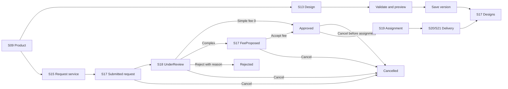
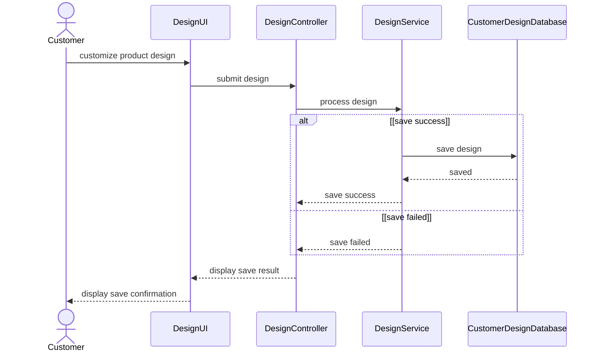
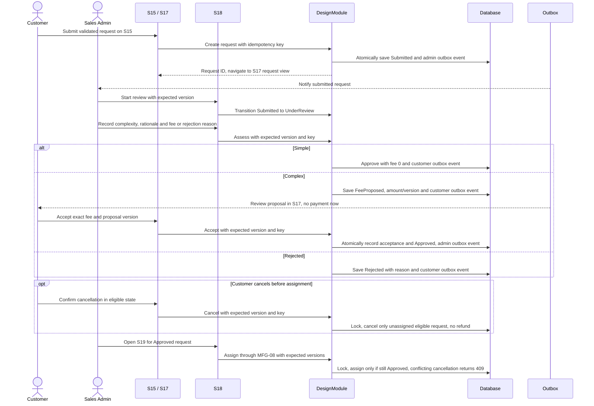
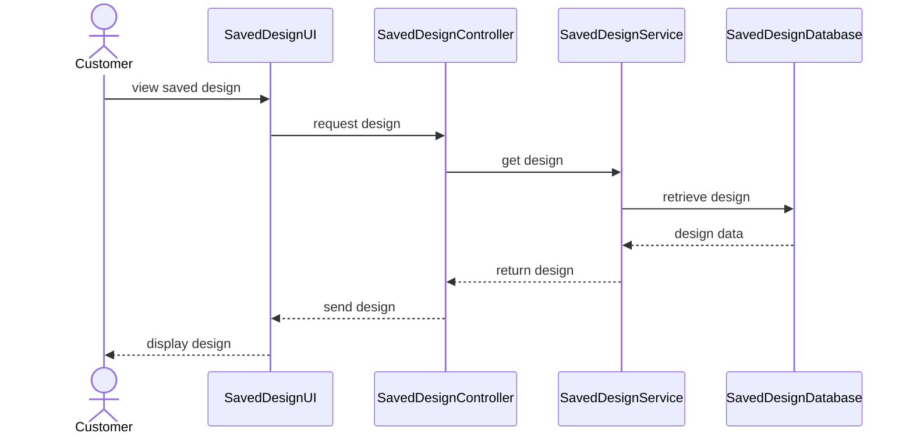

# Spec Document: Product Design

| Field | Value |
| --- | --- |
| Module ID | `MFG-05` |
| Module name | Product Design |
| Spec version | v1.3 |
| Author (team member) | Group B |
| Date | 2026-09-26 |
| Status | Draft |
| Approved by (Client role) | No approver assigned |
| DBIZ2 source | Historical IDs retained: Function List No. 36-46; `F-DES-001` .. `F-DES-011`; `UC-C02` .. `UC-C04`, `UC-S03`; S09, S13, S15-S22, S38. External DBIZ2 comparison is not required. |

---

## 1. Purpose and scope (mandatory)

Customers configure, preview and save versioned made-to-order garment designs and may request Dony design assistance with assessment-based pricing. For a Business Buyer, the design commonly represents uniforms or garments for internal use. For a Reseller Shop, it represents the shop's own artwork, branding or specifications that Dony will manufacture for the shop to sell to its customers. Dony does not supply ready-made resale inventory. Self-design/upload/preview/save is MVP Must; assessed design service is MVP Could.

**In scope:** validate product options/assets; save immutable design versions; list owned designs; create/cancel requests; assess complexity and accept deferred fees; assign via MFG-08; deliver consultant design and notify owner.

**Out of scope:** payment callback processing is MFG-06; product-rule authoring is MFG-04; order creation is MFG-06.

## 2. Actors (mandatory)

| Actor | Role in this module | Where it comes from |
| --- | --- | --- |
| Customer | Creates own designs/requests and views own results | MFG-05 resolved contract; UC-C02/UC-C03/UC-C04 |
| Sales | Works assigned approved requests | MFG-05 role boundary |
| Sales Admin | Assesses complexity, proposes fees/rejects, assigns, sets committed due date, may deliver | MFG-05 role boundary |
| System | Sends durable request and delivery notifications | MFG-05 function contract |

## 3. User scenarios and acceptance criteria (mandatory)

### US-1 (Must): Design product

Customer configures product-supported colour, material and print method, then edits artwork on the existing 2D front/back garment canvas. Size is deliberately not part of a design; the Customer selects one or more sizes and quantities later on S22. Each supported side has its own printable area; the customer may upload up to five safe PNG/JPEG/WebP assets (10 MiB each), place and resize each asset using X/Y/width/height in millimetres relative to that area's top-left, and preview/save the configuration. Every placement must fit wholly inside its selected printable area. At S22, all selected order sizes must support the design and printable-area geometry; if size-specific product rules make any placed asset invalid, reject the quote with 422 and require an adjusted/new design before order submission. Saving creates an immutable Saved version; edits create a new version and never overwrite an ordered snapshot. Incompatible or stale rules return actionable 422/409 and persist nothing. Only Saved/Delivered versions are orderable. The existing workflow does not imply text layers, 3D editing or artwork rotation controls.

### US-2 (Must): Product customization

Every non-size option and print asset is validated against the current Published product version, ownership, actual MIME, scan result and print-area bounds. Front/back selection, upload list, zoom, drag/resize and numeric placement fields edit the same draft configuration; zoom changes only the view and not physical placement values. Size selection and quantity remain order-level data on S22, enabling one design to cover multiple sizes when current product rules permit it.

### US-3 (Must): View saved design

Customer receives only own Saved/Delivered designs with pagination; empty result is successful. Editing an ordered design forks a version.

### US-4 (Could): Request design service

Valid submission creates Submitted, persists an administrator notification and navigates from S15 to S17 at `/designs?tab=requests&request_id={id}`. No fee is displayed or snapshotted at submission and no payment transaction is created. Sales Admin starts UnderReview in S18, then approves Simple with fee 0, proposes a positive Complex fee, or rejects with a customer-visible reason. Customer explicitly accepts the current Complex fee/version in S17 before Approved becomes assignable through S19.

The owner may cancel Submitted, UnderReview, FeeProposed or unassigned Approved, including after fee acceptance, without refund. Assigned/InProgress/Delivered reject cancellation; Rejected cannot become Cancelled; repeated cancellation returns the Cancelled result. Cancellation and assignment lock the same request: one wins and a stale/state conflict returns 409. Assessment, acceptance and cancellation require expected_version and Idempotency-Key.

The request stands alone until its delivered design is ordered. The accepted fee is collected only as a separate line in the first order created from that design lineage under MFG-06 BR-008 and rendered by MFG-09; no order means no invoice, charge or collection.

### US-5 (Could): Send design to customer

Assigned consultant/Admin validates and stores an immutable Delivered version, atomically updates request and sends an authorized notification. Delivery records source_design_request_id; every derived copy/version retains it. Assigned may advance to InProgress before delivery; only Assigned/InProgress may deliver. Concurrent deliveries yield one success and one 409.

### Edge cases

- Another customer or unassigned consultant receives 404/403 without data leakage.
- Requests do not expire automatically; obsolete request AwaitingPayment/Paid/Expired states are removed. Payment-attempt expiry remains in MFG-06.
- Submitted/UnderReview fee is null; stale fee acceptance or assessment after cancellation returns 409 without side effects.
- Email outage leaves in-app notification/state intact.
- Unsafe/oversized attachments are rejected before persistence.

## 4. Flows (mandatory)

### 4.1 Usage flow

### 4.2 Sequence for the main flow

# UC-C02: Design product — SD-05A: Self Design Product

# UC-C04: Request design service — SD-05B: Request Design Service

# UC-C03: View saved design — SD-06: View Saved Design

## 5. Functional requirements (mandatory)

### 5.1 Functional requirement I/O contract

| FR ID | DBIZ2 Subfunction ID | Requirement (system MUST ...) | Actor | Priority |
| --- | --- | --- | --- | --- |
| FR-001 | F-DES-001 | Render the design workspace using current Published product rules and options. | Customer | Must |
| FR-002 | F-DES-002 | Validate compatibility/assets and produce a nonpersistent 2D preview. | Customer | Must |
| FR-003 | F-DES-003 | Save an immutable design version transactionally with idempotency; preserve source_design_request_id on derived copies/versions. | Customer | Must |
| FR-004 | F-DES-004 | List only the customer's Saved/Delivered designs and a separate owned-request status/detail view with pagination. | Customer | Must (designs); Could (requests) |
| FR-005 | F-DES-005 | Render the design-service request form without a submission fee or payment step. | Customer | Could |
| FR-006 | F-DES-006 | Create a validated Submitted request with idempotency and return S17 request navigation; no submission fee/payment. | Customer | Could |
| FR-007 | F-DES-007 | Start UnderReview and assess complexity: approve Simple with fee 0, propose a Complex fee or reject with a reason, using version checks and idempotency. | Sales Admin | Could |
| FR-008 | F-DES-008 | Notify Dony Sales Admins after submission/acceptance/cancellation and the owner after assessment outcomes/cancellation, using committed outbox events. | System | Could |
| FR-009 | F-DES-009 | List Dony assessment/approved requests for Admin and assigned work for consultants; enforce state-specific authorization. | Sales / Sales Admin | Could |
| FR-010 | F-DES-010 | Deliver an immutable validated design for an Assigned/InProgress request atomically, recording source_design_request_id. | Sales / Sales Admin | Could |
| FR-011 | F-DES-011 | Notify the owning customer after design delivery. | System | Could |
| FR-012 | F-DES-012 | Accept the exact current proposed fee/version for an owned FeeProposed request and atomically record acceptance and Approved. | Customer | Could |
| FR-013 | F-DES-013 | Cancel an owned unassigned Submitted/UnderReview/FeeProposed/Approved request without refund; reject after assignment and replay repeated cancellation. | Customer | Could |

### 5.2 Input / Output contract

| FR ID | Input field | Type | Required | Output field | Type | Notes / validation |
| --- | --- | --- | --- | --- | --- | --- |
| FR-001 | product UUID, session | UUID / session | Yes | S13 workspace model | View model | Published Dony configurable product base |
| FR-002 | product/design/options/assets | IDs / configuration | Yes | compatibility and preview UUID | Object | Current rules, ownership, MIME and bounds; 422 incompatible |
| FR-003 | configuration, versions, idempotency key | Object / integers / key | Yes | saved design ID/version and source_design_request_id | Object | Immutable provenance; stale/key conflict 409 |
| FR-004 | page, filters, sort, tab, request_id, session | Integers / values / UUID / session | Optional | own designs or request status/detail | Paginated object / object | Owned requests only; no CRM notes; Saved/Delivered designs; empty success |
| FR-005 | product UUID, session | UUID / session | Yes | S15 request form | View model | Published product; no fee amount or payment action |
| FR-006 | product UUID, requirements, attachments, deadline, key | UUID / strings / assets / date / key | Yes | Submitted request ID/version and S17 route | Object | Requirements 20-5000; 0-5 attachments; deadline >=3 days; fee null |
| FR-007 | request_id, action, complexity, rationale, fee_vnd or rejection_reason, expected_version, key | UUID / enum / text / integer VND / version / key | By action | UnderReview, Approved, FeeProposed or Rejected request | Object | Sales Admin; rationale/rejection reason 1-500 chars; Simple 0; Complex 1..9999999999; proposal immutable |
| FR-008 | committed submission/assessment/acceptance/cancellation event | Internal event | Yes | durable notification | Object | In-app authoritative; event/recipient deduplicated; private S17/S18 link |
| FR-009 | buyer_organization/assignment/state filters, session | Values / session | Optional | authorized requests | Paginated object | Dony Admin assessment queue; consultant assigned work only |
| FR-010 | request/design/assets/version/key | IDs / values / key | Yes | Delivered immutable design with source_design_request_id | Object | Assigned/InProgress; current rules; stale 409 |
| FR-011 | delivery event | Internal event | Yes | notification/outbox ID | UUID | Owner only; private expiring link |
| FR-012 | request_id, proposal_version, accepted_fee_vnd, expected_version, key | UUID / integers / key | Yes | Approved request and acceptance evidence | Object | Owner; FeeProposed only; exact amount/version; repeat key replays; stale/state 409 |
| FR-013 | request_id, expected_version, key | UUID / version / key | Yes | Cancelled request | Object | Owner; preassignment only; repeated cancellation no-op; no refund |

### 5.2 Business rules

| Rule ID | Rule | Why it exists |
| --- | --- | --- |
| BR-001 | Design status is Draft, Saved or Delivered; every save is immutable and ordered designs fork on edit while retaining source_design_request_id. | Preserve designs and fee provenance. |
| BR-002 | Submitted → UnderReview; Simple → Approved; Complex → FeeProposed → Approved on acceptance; Approved → Assigned → InProgress → Delivered (Assigned may deliver directly); UnderReview → Rejected; eligible unassigned states → Cancelled. Delivered/Cancelled/Rejected are terminal; no automatic expiry. | Define service request lifecycle. |
| BR-003 | First assignment requires Approved; owner cancellation is allowed only in Submitted/UnderReview/FeeProposed/unassigned Approved, never after assignment. Lock and version-check all competing transitions. | Prevent unaccepted work and cancellation races. |
| BR-004 | Fee is null before assessment, 0 for Simple, or integer 1..9999999999 VND for Complex. The configurable design_service_fee_vnd (default 200000) is suggested at assessment and confirmed/overridden by Admin. Accepted fee is collected only through MFG-06 order pricing, never a standalone transaction. | Keep assessed pricing explicit. |
| BR-005 | Attachments are 0-5 PNG/JPEG/WebP files <=10 MiB each, actual MIME checked/scanned. | Protect users and storage. |
| BR-006 | Consultation CRM state is independent and never changes order status. | Keep sales workflow separate from fulfillment. |
| BR-007 | Customer accepts exact Complex proposal amount/version; store customer_id, accepted_fee_vnd, accepted_fee_version equal to proposal_version, and accepted_at. Proposal/approval is immutable; changed work/fee requires eligible cancellation and a new request. All mutations use expected_version and idempotency; no request payment/refund. | Preserve explicit consent and concurrency safety. |

### Analytics evidence integration (MFG-11)

For MFG-11/F-DA-004, S13 contributes workspace-ready evidence and successful immutable-save evidence; failed saves and preview requests are not conversions. Service submission, approval (Simple or accepted Complex), delivery, rejection and cancellation are projected from committed request/design records with source identity, version and provenance. Preserve sample-related design revisions as versions, not new customer orders. A delivered design is not delivered merchandise; one design lineage can support multiple orders and does not define a journey. S17 re-entry may start an existing-design checkout without a fresh product view or design save; do not manufacture those earlier stages. Journey entry route remains separate from `source_design_request_id`. An explicit new design creates a fresh intent; editing/resuming the same work, saving versions and sample revision retain it. An explicit new order/reorder from S17 creates a new checkout intent, while continuing an existing draft checkout retains its reference. Replays and shared same-intent tabs deduplicate; authorization/account changes cannot attach another customer's work. Product-entry links are explicit navigation evidence, not a guessed match by customer/product. Follow [MFG-11 sections 5.3/5.4](spec-MFG-11.md#53-funnel-templates-identity-and-formulas) for correlation and unknown coverage; no service analytics branch is enabled before the assessed-service feature itself.

## 6. Key entities (mandatory)

| Entity | Attributes (from Input/Output fields) | Relationships |
| --- | --- | --- |
| Design | customer/product IDs and optional buyer_organization_id, product/design versions, status, options, assets, preview, source_design_request_id nullable, timestamps | Immutable saved versions; customer-owned and Dony staff-authorized; server-derived provenance retained on copies; client cannot clear/replace it |
| DesignRequest | customer_id, buyer_organization_id?, product_id, requirements, attachments, requested_deadline, committed_due_at, complexity, rationale/rejection_reason, assessed_by/at, fee_vnd, proposal_version, accepted_fee_version, accepted_fee_vnd, accepted_by/at, fee_order_id nullable, fee_allocation_version, state, assignee, version | Standalone until order creation; optional organization identifies a Business Buyer or Reseller Shop but grants no authority; Approved before assignment; MFG-06 BR-008 owns fee allocation. |
| Consultation | customer_id, buyer_organization_id?, sales_user_id, notes, related IDs, CRM status | Internal notes visible only to assigned Sales and Sales Admin. |
| Notification | event/recipient/type/payload/delivery state | Deduplicated; in-app record authoritative |

## 7. Screens involved

| Screen ID | Screen name | Priority | Screen Spec file |
| --- | --- | --- | --- |
| S09 | Product detail and design entry | Must | `screens/S09-product_detail_screen.md` |
| S13 | Product design workspace | Must | `screens/S13-product_design_tool_screen.md` |
| S17 | Customer designs and requests | Must | `screens/S17-customer_designs_screen.md` |
| S15 | Design service request | Could | `screens/S15-design_service_request_screen.md` |
| S18/S19 | Assessment queue and assignment | Could | `screens/S18-consultation_requests_and_customers_screen.md` |
| S20/S21 | Consultant tasks and delivery | Could | `screens/S20-consultant_tasks_and_customers_screen.md` |
| S22 | Order eligible design | Must | `screens/S22-create_order_screen.md` |
| S38 | Notifications | Could | `screens/S38-notification_panel_screen.md` |

## 8. Success criteria (mandatory)

| SC ID | Criterion | How it is measured |
| --- | --- | --- |
| SC-001 | MVP self-design safely saves versioned, orderable work. | Verify rule validation, saved versions and order eligibility. |
| SC-002 | Simple approval or explicit Complex fee acceptance makes a request assignable; cancellation is limited to preassignment states. | Verify both assessment branches, fee consent, cancellation/assignment races and deferred order fee. |
| SC-003 | Ownership, assignment, idempotency and concurrent delivery are enforced; all functions map to FRs. | Exercise authorization/retry/race cases and compare F-DES IDs with FRs. |

## 9. Assumptions

- DBIZ 3 classroom demo by Group B; no approver; demo business/contact data are fictional samples.
- Self-design is Must; assessed design service and consultant workflow are Could.
- Sales Admin assesses; S17 owns acceptance/cancellation. There is no S16 screen or standalone design-service payment route; legacy URLs must not create payment side effects.
- FR-007/F-DES-007 replaces obsolete settlement with assessment; FR-012/F-DES-012 adds fee acceptance; FR-013/F-DES-013 formalizes existing US-4/BR-002/BR-003 cancellation, not a second cancellation function.
- No order means no collection; first-order fee allocation and subsequent-order rules are MFG-06 BR-008.
- 2D preview is required; 3D preview is outside this scope.

## 10. Open questions

| # | Question | Blocking? | Owner | Status |
| --- | --- | --- | --- | --- |
| 1 | Are any design/request state, fee, deadline, cancellation, refund or delivery decisions still undecided? | No | Group B | Resolved — no remaining open questions; sections 3–6 define the complete behavior. |

## 11. Traceability to DBIZ2

Historical IDs are retained; external DBIZ2 comparison is not required.

| Spec section | DBIZ2 source | Location |
| --- | --- | --- |
| Scope and actors | Function List MFG-05 | Rows 36–46 plus new rows 95–96; IDs appear in FR table |
| Design/customize | UC-C02; F-DES-001..003 | S13; sections 3 and 5 |
| Saved designs | UC-C03; F-DES-004 | S17; sections 3 and 5 |
| Service request/delivery | UC-C04, UC-S03; F-DES-005..013 | S15, S17-S21; SD-05B; sections 3 and 5 |

## Completion checklist

- [x] Scope, actors, scenarios, flows and edge cases are defined.
- [x] Function, state, entity, screen and ID traceability is complete.
- [x] MVP priorities and demo assumptions are explicit.
- [x] No unresolved placeholders remain.
