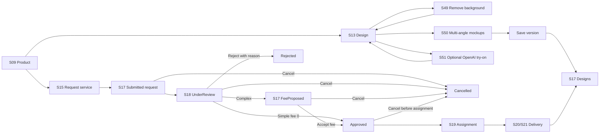
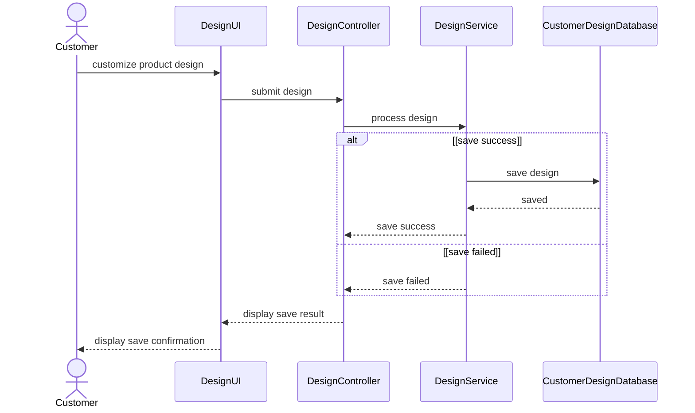
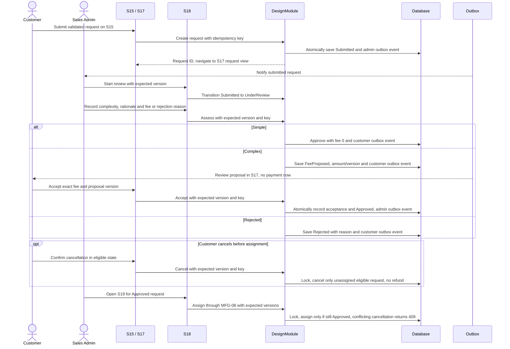
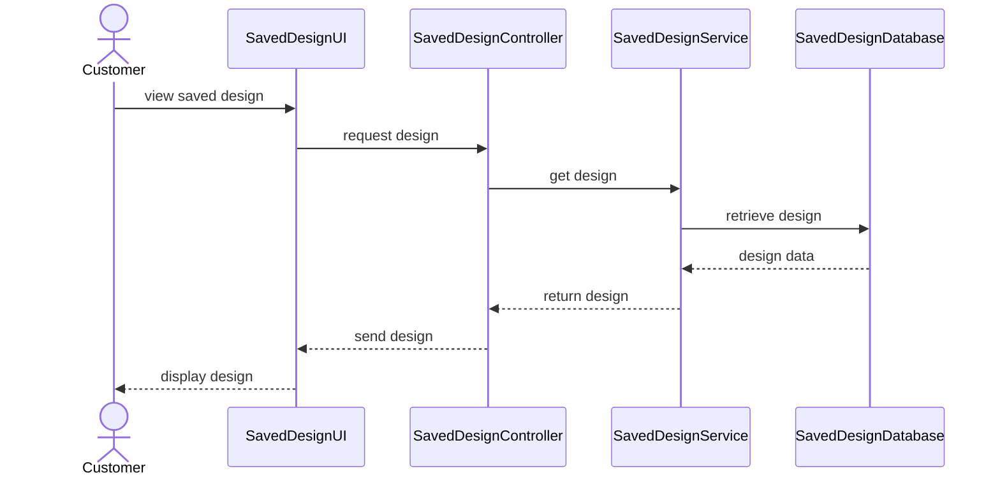

# Spec Document: Product Design

| Field | Value |
| --- | --- |
| Module ID | `MFG-05` |
| Module name | Product Design |
| Spec version | v1.2 |
| Author (team member) | Group B |
| Date | 2026-09-27 |
| Status | Draft |
| Approved by (Client role) | No approver assigned |
| DBIZ2 source | Historical IDs retained: Function List No. 36-46; `F-DES-001` .. `F-DES-011`; `UC-C02` .. `UC-C04`, `UC-S03`; S09, S13, S15-S22, S38. External DBIZ2 comparison is not required. |

---

## 1. Purpose and scope (mandatory)

Customers configure, preview and save versioned made-to-order garment designs and may request Dony design assistance with assessment-based pricing. For a Business Buyer, the design commonly represents uniforms or garments for internal use. For a Reseller Shop, it represents the shop's own artwork, branding or specifications that Dony will manufacture for the shop to sell to its customers. Dony does not supply ready-made resale inventory. Self-design/upload/preview/save is MVP Must; assessed design service is MVP Could.

**In scope:** background removal with reversible review; deterministic multi-angle 2D mockups; session-only OpenAI virtual try-on; validate product options/assets; save immutable design versions; list owned designs; create/cancel requests; assess complexity and accept deferred fees; assign via MFG-08; deliver consultant design and notify owner.

**Out of scope:** payment callback processing is MFG-06; product-rule authoring is MFG-04; order creation is MFG-06.

## 2. Actors (mandatory)

| Actor | Role in this module | Where it comes from |
| --- | --- | --- |
| Customer | Creates own designs/requests and views own results | MFG-05 resolved contract; UC-C02/UC-C03/UC-C04 |
| Sales | Works assigned approved requests | MFG-05 role boundary |
| Sales Admin | Assesses complexity, proposes fees/rejects, assigns, sets committed due date, may deliver | MFG-05 role boundary |
| System | Sends durable request and delivery notifications | MFG-05 function contract |

## 3. User scenarios and acceptance criteria (mandatory)

### US-1 (Must): Design product

Customer configures product-supported colour, material and print method, then edits artwork on the existing 2D front/back garment canvas. Size is deliberately not part of a design; the Customer selects one or more sizes and quantities later on S22. Each supported side has its own printable area; the customer may upload up to five safe PNG/JPEG/WebP assets (10 MiB each), place and resize each asset using X/Y/width/height in millimetres relative to that area's top-left, and preview/save the configuration. Every placement must fit wholly inside its selected printable area. At S22, all selected order sizes must support the design and printable-area geometry; if size-specific product rules make any placed asset invalid, reject the quote with 422 and require an adjusted/new design before order submission. Saving creates an immutable Saved version; edits create a new version and never overwrite an ordered snapshot. Incompatible or stale rules return actionable 422/409 and persist nothing. Only Saved/Delivered versions are orderable. The existing workflow does not imply text layers, 3D editing or artwork rotation controls.

### US-2 (Must): Product customization

Every non-size option and print asset is validated against the current Published product version, ownership, actual MIME, scan result and print-area bounds. Front/back selection, upload list, zoom, drag/resize and numeric placement fields edit the same draft configuration; zoom changes only the view and not physical placement values. Size selection and quantity remain order-level data on S22, enabling one design to cover multiple sizes when current product rules permit it.

### US-3 (Must): View saved design

Customer receives only own Saved/Delivered designs with pagination; empty result is successful. Editing an ordered design forks a version.

### US-4 (Could): Request design service

Valid submission creates Submitted, persists an administrator notification and navigates from S15 to S17 at `/designs?tab=requests&request_id={id}`. No fee is displayed or snapshotted at submission and no payment transaction is created. Sales Admin starts UnderReview in S18, then approves Simple with fee 0, proposes a positive Complex fee, or rejects with a customer-visible reason. Customer explicitly accepts the current Complex fee/version in S17 before Approved becomes assignable through S19.

The owner may cancel Submitted, UnderReview, FeeProposed or unassigned Approved, including after fee acceptance, without refund. Assigned/InProgress/Delivered reject cancellation; Rejected cannot become Cancelled; repeated cancellation returns the Cancelled result. Cancellation and assignment lock the same request: one wins and a stale/state conflict returns 409. Assessment, acceptance and cancellation require expected_version and Idempotency-Key.

The request stands alone until its delivered design is ordered. The accepted fee is collected only as a separate line in the first order created from that design lineage under MFG-06 BR-008 and rendered by MFG-09; no order means no invoice, charge or collection.

### US-5 (Could): Send design to customer

Assigned consultant/Admin validates and stores an immutable Delivered version, atomically updates request and sends an authorized notification. Delivery records source_design_request_id; every derived copy/version retains it. Assigned may advance to InProgress before delivery; only Assigned/InProgress may deliver. Concurrent deliveries yield one success and one 409.

### US-6 (Must): Remove artwork background

On S13, Customer selects one artwork and opens S49. For a solid background, remove only border-connected pixels within the chosen tolerance, preserving disconnected matching colours inside the artwork. For complex subject backgrounds, provide subject segmentation. Show original and transparent result on a checkerboard before applying. Apply preserves asset ID, selected side and physical X/Y/width/height; it changes only the artwork pixels and increments the draft revision. Cancel leaves the draft unchanged. Restore original is available within the current draft session. Transparent PNG output retains detail and alpha; an already transparent upload is accepted. No operation automatically saves a design.

### US-7 (Must): Preview every supported angle

S50 shares the current S13 draft and shows six prepared 2D views where the selected product has templates: front flat lay, front shaped, left angle, right angle, back flat lay, back shaped. Thumbnail selection displays a large matching preview. Render the same physical print coordinates across views; the centre follows the collar/placket-to-torso curve, chest logos follow the selected wearer side, and back views contain only back artwork. Use calibrated per-template surfaces, perspective, clipping, occlusion and fabric shading to attach ink to the garment. Never call image-generation AI on angle changes. Unsupported template/colour/material combinations must be clearly unavailable rather than illustrated with another product. Mockups show appearance, not measured colour, fit or manufacturing proof.

### US-8 (Could): Try the designed polo on a person

S51 offers labelled synthetic male, female and child presets immediately, and a customer-uploaded PNG/JPEG/WebP photo. Presets are deterministic mockups; uploading does not generate or send images to OpenAI automatically. Customer reviews a disclosure, explicitly consents to sending their photo and designed polo image to OpenAI, then activates Try on me. Backend validates current design and calls OpenAI image edits; a real AI result replaces the top while aiming to preserve identity, pose, background and logo. Offer original/result comparison and replacement/removal of the photo. The result is illustrative and may alter lettering/details; it is never a design asset, saved version, size recommendation, order attachment or manufacturing source.

Personal uploads, try-on inputs/results and removal review buffers are session-only in application storage: no localStorage, sessionStorage, database, object store or image file persistence. Clear on session end, logout, navigation that destroys the workspace or reload. Provider processing/retention is separate and disclosed before consent; do not promise remote deletion at browser close. Consent is unchecked initially and revoked when the photo is replaced or removed. A changed design/photo/session invalidates pending results. Failed or cancelled generation preserves the design and must not trigger automatic paid retries.

### Edge cases

- Another customer or unassigned consultant receives 404/403 without data leakage.
- Requests do not expire automatically; obsolete request AwaitingPayment/Paid/Expired states are removed. Payment-attempt expiry remains in MFG-06.
- Submitted/UnderReview fee is null; stale fee acceptance or assessment after cancellation returns 409 without side effects.
- Email outage leaves in-app notification/state intact.
- Unsafe/oversized attachments are rejected before persistence.

## 4. Flows (mandatory)

### 4.1 Usage flow

```mermaid
flowchart LR
  Product[S09 Product] --> Workspace[S13 Design]
  Workspace --> Remove[S49 Remove background]
  Remove --> Workspace
  Workspace --> Preview[S50 Multi-angle mockups]
  Workspace --> TryOn[S51 Optional OpenAI try-on]
  TryOn --> Workspace
  Preview --> Save[Save version]
  Save --> Gallery[S17 Designs]
  Product --> Request[S15 Request service]
  Request --> Status[S17 Submitted request]
  Status --> Review[S18 UnderReview]
  Review -->|Simple fee 0| Approved[Approved]
  Review -->|Complex| Proposal[S17 FeeProposed]
  Proposal -->|Accept fee| Approved
  Review -->|Reject with reason| Rejected[Rejected]
  Status -->|Cancel| Cancelled[Cancelled]
  Review -->|Cancel| Cancelled
  Proposal -->|Cancel| Cancelled
  Approved -->|Cancel before assignment| Cancelled
  Approved --> Assign[S19 Assignment]
  Assign --> Deliver[S20/S21 Delivery]
  Deliver --> Gallery
```

### 4.2 Sequence for the main flow

# UC-C02: Design product — SD-05A: Self Design Product

```mermaid
sequenceDiagram
    actor Customer
    participant DesignUI
    participant DesignController
    participant DesignService
    participant CustomerDesignDatabase

    Customer->>DesignUI: customize product design
    DesignUI->>DesignController: submit design
    DesignController->>DesignService: process design
    alt [save success]
        DesignService->>CustomerDesignDatabase: save design
        CustomerDesignDatabase-->>DesignService: saved
        DesignService-->>DesignController: save success
    else [save failed]
        DesignService-->>DesignController: save failed
    end
    DesignController-->>DesignUI: display save result
    DesignUI-->>Customer: display save confirmation
```

# UC-C04: Request design service — SD-05B: Request Design Service

```mermaid
sequenceDiagram
    actor Customer
    actor CompanyAdmin as Sales Admin
    participant RequestUI as S15 / S17
    participant AdminUI as S18
    participant DesignModule
    participant Database
    participant Outbox

    Customer->>RequestUI: Submit validated request on S15
    RequestUI->>DesignModule: Create request with idempotency key
    DesignModule->>Database: Atomically save Submitted and admin outbox event
    DesignModule-->>RequestUI: Request ID, navigate to S17 request view
    Outbox-->>CompanyAdmin: Notify submitted request
    CompanyAdmin->>AdminUI: Start review with expected version
    AdminUI->>DesignModule: Transition Submitted to UnderReview
    CompanyAdmin->>AdminUI: Record complexity, rationale and fee or rejection reason
    AdminUI->>DesignModule: Assess with expected version and key
    alt Simple
        DesignModule->>Database: Approve with fee 0 and customer outbox event
    else Complex
        DesignModule->>Database: Save FeeProposed, amount/version and customer outbox event
        Outbox-->>Customer: Review proposal in S17, no payment now
        Customer->>RequestUI: Accept exact fee and proposal version
        RequestUI->>DesignModule: Accept with expected version and key
        DesignModule->>Database: Atomically record acceptance and Approved, admin outbox event
    else Rejected
        DesignModule->>Database: Save Rejected with reason and customer outbox event
    end
    opt Customer cancels before assignment
        Customer->>RequestUI: Confirm cancellation in eligible state
        RequestUI->>DesignModule: Cancel with expected version and key
        DesignModule->>Database: Lock, cancel only unassigned eligible request, no refund
    end
    CompanyAdmin->>AdminUI: Open S19 for Approved request
    AdminUI->>DesignModule: Assign through MFG-08 with expected versions
    DesignModule->>Database: Lock, assign only if still Approved, conflicting cancellation returns 409
```

# UC-C03: View saved design — SD-06: View Saved Design

```mermaid
sequenceDiagram
    actor Customer
    participant SavedDesignUI
    participant SavedDesignController
    participant SavedDesignService
    participant SavedDesignDatabase

    Customer->>SavedDesignUI: view saved design
    SavedDesignUI->>SavedDesignController: request design
    SavedDesignController->>SavedDesignService: get design
    SavedDesignService->>SavedDesignDatabase: retrieve design
    SavedDesignDatabase-->>SavedDesignService: design data
    SavedDesignService-->>SavedDesignController: return design
    SavedDesignController-->>SavedDesignUI: send design
    SavedDesignUI-->>Customer: display design
```

## 5. Functional requirements (mandatory)

### 5.1 Functional requirement I/O contract

| FR ID | DBIZ2 Subfunction ID | Requirement (system MUST ...) | Actor | Priority |
| --- | --- | --- | --- | --- |
| FR-001 | F-DES-001 | Render the design workspace using current Published product rules and options. | Customer | Must |
| FR-002 | F-DES-002 | Validate compatibility/assets and produce a nonpersistent 2D preview. | Customer | Must |
| FR-003 | F-DES-003 | Save an immutable design version transactionally with idempotency; preserve source_design_request_id on derived copies/versions. | Customer | Must |
| FR-004 | F-DES-004 | List only the customer's Saved/Delivered designs and a separate owned-request status/detail view with pagination. | Customer | Must (designs); Could (requests) |
| FR-005 | F-DES-005 | Render the design-service request form without a submission fee or payment step. | Customer | Could |
| FR-006 | F-DES-006 | Create a validated Submitted request with idempotency and return S17 request navigation; no submission fee/payment. | Customer | Could |
| FR-007 | F-DES-007 | Start UnderReview and assess complexity: approve Simple with fee 0, propose a Complex fee or reject with a reason, using version checks and idempotency. | Sales Admin | Could |
| FR-008 | F-DES-008 | Notify Dony Sales Admins after submission/acceptance/cancellation and the owner after assessment outcomes/cancellation, using committed outbox events. | System | Could |
| FR-009 | F-DES-009 | List Dony assessment/approved requests for Admin and assigned work for consultants; enforce state-specific authorization. | Sales / Sales Admin | Could |
| FR-010 | F-DES-010 | Deliver an immutable validated design for an Assigned/InProgress request atomically, recording source_design_request_id. | Sales / Sales Admin | Could |
| FR-011 | F-DES-011 | Notify the owning customer after design delivery. | System | Could |
| FR-012 | F-DES-012 | Accept the exact current proposed fee/version for an owned FeeProposed request and atomically record acceptance and Approved. | Customer | Could |
| FR-013 | F-DES-013 | Cancel an owned unassigned Submitted/UnderReview/FeeProposed/Approved request without refund; reject after assignment and replay repeated cancellation. | Customer | Could |
| FR-014 | F-DES-014 | Remove a selected artwork background with before/after review, apply, cancel and session restore; preserve physical placement. | Customer | Must |
| FR-015 | F-DES-015 | Render calibrated deterministic 2D multi-angle mockups from the current validated draft and product template version. | Customer | Must |
| FR-016 | F-DES-016 | Provide synthetic presets and consent-gated OpenAI try-on for an uploaded photo; discard stale results and keep personal images session-only. | Customer | Could |

### 5.2 Input / Output contract

| FR ID | Input field | Type | Required | Output field | Type | Notes / validation |
| --- | --- | --- | --- | --- | --- | --- |
| FR-001 | product UUID, session | UUID / session | Yes | S13 workspace model | View model | Published Dony configurable product base |
| FR-002 | product/design/options/assets | IDs / configuration | Yes | compatibility and preview UUID | Object | Current rules, ownership, MIME and bounds; 422 incompatible |
| FR-003 | configuration, versions, idempotency key | Object / integers / key | Yes | saved design ID/version and source_design_request_id | Object | Immutable provenance; stale/key conflict 409 |
| FR-004 | page, filters, sort, tab, request_id, session | Integers / values / UUID / session | Optional | own designs or request status/detail | Paginated object / object | Owned requests only; no CRM notes; Saved/Delivered designs; empty success |
| FR-005 | product UUID, session | UUID / session | Yes | S15 request form | View model | Published product; no fee amount or payment action |
| FR-006 | product UUID, requirements, attachments, deadline, key | UUID / strings / assets / date / key | Yes | Submitted request ID/version and S17 route | Object | Requirements 20-5000; 0-5 attachments; deadline >=3 days; fee null |
| FR-007 | request_id, action, complexity, rationale, fee_vnd or rejection_reason, expected_version, key | UUID / enum / text / integer VND / version / key | By action | UnderReview, Approved, FeeProposed or Rejected request | Object | Sales Admin; rationale/rejection reason 1-500 chars; Simple 0; Complex 1..9999999999; proposal immutable |
| FR-008 | committed submission/assessment/acceptance/cancellation event | Internal event | Yes | durable notification | Object | In-app authoritative; event/recipient deduplicated; private S17/S18 link |
| FR-009 | buyer_organization/assignment/state filters, session | Values / session | Optional | authorized requests | Paginated object | Dony Admin assessment queue; consultant assigned work only |
| FR-010 | request/design/assets/version/key | IDs / values / key | Yes | Delivered immutable design with source_design_request_id | Object | Assigned/InProgress; current rules; stale 409 |
| FR-011 | delivery event | Internal event | Yes | notification/outbox ID | UUID | Owner only; private expiring link |
| FR-012 | request_id, proposal_version, accepted_fee_vnd, expected_version, key | UUID / integers / key | Yes | Approved request and acceptance evidence | Object | Owner; FeeProposed only; exact amount/version; repeat key replays; stale/state 409 |
| FR-013 | request_id, expected_version, key | UUID / version / key | Yes | Cancelled request | Object | Owner; preassignment only; repeated cancellation no-op; no refund |
| FR-014 | selected asset, mode, tolerance, draft revision | Asset / enum / integer / version | Yes | transparent PNG review; applied draft revision | Image / version | Solid tolerance 5–100, default 35; subject failure offers solid mode; original immutable in session. |
| FR-015 | product/template version, options, side placements, view ID, revision | IDs / object / integer | Yes | current angle preview | Image/view model | Validated product templates; unsupported views disabled; no paid AI call. |
| FR-016 | person image, derived polo image, explicit external consent, design revision, session/job token | Images / boolean / versions | Yes for generation | generated result, matching design revision, safe error | Session image/object | <=10 MiB/image and <=16 million pixels; server-only API key; no image/secret logging; no automatic paid retry. |

### 5.2 Business rules

| Rule ID | Rule | Why it exists |
| --- | --- | --- |
| BR-001 | Design status is Draft, Saved or Delivered; every save is immutable and ordered designs fork on edit while retaining source_design_request_id. | Preserve designs and fee provenance. |
| BR-002 | Submitted → UnderReview; Simple → Approved; Complex → FeeProposed → Approved on acceptance; Approved → Assigned → InProgress → Delivered (Assigned may deliver directly); UnderReview → Rejected; eligible unassigned states → Cancelled. Delivered/Cancelled/Rejected are terminal; no automatic expiry. | Define service request lifecycle. |
| BR-003 | First assignment requires Approved; owner cancellation is allowed only in Submitted/UnderReview/FeeProposed/unassigned Approved, never after assignment. Lock and version-check all competing transitions. | Prevent unaccepted work and cancellation races. |
| BR-004 | Fee is null before assessment, 0 for Simple, or integer 1..9999999999 VND for Complex. The configurable design_service_fee_vnd (default 200000) is suggested at assessment and confirmed/overridden by Admin. Accepted fee is collected only through MFG-06 order pricing, never a standalone transaction. | Keep assessed pricing explicit. |
| BR-005 | Attachments are 0-5 PNG/JPEG/WebP files <=10 MiB each, actual MIME checked/scanned. | Protect users and storage. |
| BR-006 | Consultation CRM state is independent and never changes order status. | Keep sales workflow separate from fulfillment. |
| BR-007 | Customer accepts exact Complex proposal amount/version; store customer_id, accepted_fee_vnd, accepted_fee_version equal to proposal_version, and accepted_at. Proposal/approval is immutable; changed work/fee requires eligible cancellation and a new request. All mutations use expected_version and idempotency; no request payment/refund. | Preserve explicit consent and concurrency safety. |
| BR-008 | Material/fabric choices come from Published product rules; selecting a fabric never implies unsupported catalogue additions or different geometry. Size stays on S22. | Keep product validation authoritative. |
| BR-009 | Chest shortcuts use wearer left/right; default 70 mm width and <=90 mm height with aspect ratio retained, clamped to current print bounds. Centre uses the physical print area's centre; users may refine numeric placement. | Make common corporate logo placement usable. |
| BR-010 | Processed artwork may become a scanned private design asset only on explicit design save; session-only personal try-on images/results are excluded from all save/order payloads. Preserve original/processed distinction and immutable saved versions. | Separate reusable production artwork from personal previews. |
| BR-011 | OpenAI credentials remain backend-only in an ignored secret file or secret manager; never return keys/provider raw errors or log request images/headers. Production requires authenticated owner authorization, request quotas and concurrency limits. | Protect credentials and control provider costs. |
| BR-012 | User photo replacement/removal revokes consent; stale job results are ignored. One active generation per customer session; no automatic retries. Cancelling UI work cannot promise cancellation of provider billing/processing. | Prevent wrong-photo results and accidental repeated charges. |

## 6. Key entities (mandatory)

| Entity | Attributes (from Input/Output fields) | Relationships |
| --- | --- | --- |
| Design | customer/product IDs and optional buyer_organization_id, product/design versions, status, options, assets, preview, source_design_request_id nullable, timestamps | Immutable saved versions; customer-owned and Dony staff-authorized; server-derived provenance retained on copies; client cannot clear/replace it |
| DesignRequest | customer_id, buyer_organization_id?, product_id, requirements, attachments, requested_deadline, committed_due_at, complexity, rationale/rejection_reason, assessed_by/at, fee_vnd, proposal_version, accepted_fee_version, accepted_fee_vnd, accepted_by/at, fee_order_id nullable, fee_allocation_version, state, assignee, version | Standalone until order creation; optional organization identifies a Business Buyer or Reseller Shop but grants no authority; Approved before assignment; MFG-06 BR-008 owns fee allocation. |
| Consultation | customer_id, buyer_organization_id?, sales_user_id, notes, related IDs, CRM status | Internal notes visible only to assigned Sales and Sales Admin. |
| Notification | event/recipient/type/payload/delivery state | Deduplicated; in-app record authoritative |
| DesignAsset variant | Original/processed artwork reference, side, X/Y/width/height mm, processing method | Owned scanned asset on explicit save; preserves original artwork lineage. |
| ProductMockupTemplate | Product/version, view ID, base image, calibrated surface grid, masks, material/colour support | Per-product rendering assets; no personal data. |
| TryOn session job | Session/job token, design revision, consent, processing state, transient photo/result | Application memory only; no persisted personal photo/result entity. |

## 7. Screens involved

| Screen ID | Screen name | Priority | Screen Spec file |
| --- | --- | --- | --- |
| S09 | Product detail and design entry | Must | `screens/S09-product_detail_screen.md` |
| S13 | Product design workspace | Must | `screens/S13-product_design_tool_screen.md` |
| S17 | Customer designs and requests | Must | `screens/S17-customer_designs_screen.md` |
| S15 | Design service request | Could | `screens/S15-design_service_request_screen.md` |
| S18/S19 | Assessment queue and assignment | Could | `screens/S18-consultation_requests_and_customers_screen.md` |
| S20/S21 | Consultant tasks and delivery | Could | `screens/S20-consultant_tasks_and_customers_screen.md` |
| S22 | Order eligible design | Must | `screens/S22-create_order_screen.md` |
| S38 | Notifications | Could | `screens/S38-notification_panel_screen.md` |
| S49 | Remove artwork background | Must | `screens/S49-remove_background_screen.md` |
| S50 | Product multi-angle mockups | Must | `screens/S50-product_mockups_screen.md` |
| S51 | Virtual try-on | Could | `screens/S51-virtual_try_on_screen.md` |

## 8. Success criteria (mandatory)

| SC ID | Criterion | How it is measured |
| --- | --- | --- |
| SC-001 | MVP self-design safely saves versioned, orderable work. | Verify rule validation, saved versions and order eligibility. |
| SC-002 | Simple approval or explicit Complex fee acceptance makes a request assignable; cancellation is limited to preassignment states. | Verify both assessment branches, fee consent, cancellation/assignment races and deferred order fee. |
| SC-003 | Ownership, assignment, idempotency and concurrent delivery are enforced; all functions map to FRs. | Exercise authorization/retry/race cases and compare F-DES IDs with FRs. |
| SC-004 | Removal preserves interior colours, original recovery and coordinates. | Compare border-connected/subject inputs; apply/cancel/restore and save/reopen tests. |
| SC-005 | Multi-angle prints follow calibrated garment surfaces and matching side. | Visually approve all angles and chest/centre/bounds cases per product template; no provider request on switching. |
| SC-006 | Personal images and secrets do not enter persistent application storage or client credentials. | Inspect save payloads/storage/logs; test no-consent, quota/failure, stale result and session disposal paths. |

## 9. Assumptions

- DBIZ 3 classroom demo by Group B; no approver; demo business/contact data are fictional samples.
- Self-design is Must; assessed design service and consultant workflow are Could.
- Sales Admin assesses; S17 owns acceptance/cancellation. There is no S16 screen or standalone design-service payment route; legacy URLs must not create payment side effects.
- FR-007/F-DES-007 replaces obsolete settlement with assessment; FR-012/F-DES-012 adds fee acceptance; FR-013/F-DES-013 formalizes existing US-4/BR-002/BR-003 cancellation, not a second cancellation function.
- No order means no collection; first-order fee allocation and subsequent-order rules are MFG-06 BR-008.
- 2D preview is required; 3D preview is outside this scope.

## 10. Open questions

| # | Question | Blocking? | Owner | Status |
| --- | --- | --- | --- | --- |
| 1 | Are any design/request state, fee, deadline, cancellation, refund or delivery decisions still undecided? | No | Group B | Resolved — no remaining open questions; sections 3–6 define the complete behavior. |

## 11. Traceability to DBIZ2

Historical IDs are retained; external DBIZ2 comparison is not required.

| Spec section | DBIZ2 source | Location |
| --- | --- | --- |
| Scope and actors | Function List MFG-05 | Rows 36–46 plus new rows 95–96; IDs appear in FR table |
| Design/customize | UC-C02; F-DES-001..003 | S13; sections 3 and 5 |
| Saved designs | UC-C03; F-DES-004 | S17; sections 3 and 5 |
| Service request/delivery | UC-C04, UC-S03; F-DES-005..013 | S15, S17-S21; SD-05B; sections 3 and 5 |
| Design add-ons | User-approved 2026-09-27 extension of UC-C02; F-DES-014..016 (new, not historical DBIZ2 IDs) | S13, S49-S51; US-6..8; FR-014..016 |

## Completion checklist

- [x] Scope, actors, scenarios, flows and edge cases are defined.
- [x] Function, state, entity, screen and ID traceability is complete.
- [x] MVP priorities and demo assumptions are explicit.
- [x] No unresolved placeholders remain.

## 12. Design add-on implementation handoff

The user validated the OpenAI try-on demo as feasible on 2026-09-27. This is feasibility acceptance, not a client signature or a guarantee of exact identity/logo preservation. Polo is the first demo product; it does not amend MFG-04 catalogue/seed data. Self-design saving/order rules remain unchanged. S49/S50 are Must extensions; S51 is Could, following the existing preview as Must and advanced AI as optional. No local try-on fallback is required.

Production source of truth is this module and S13/S49/S50/S51. Reusable prototype code remains in `demo/polo`: `web/render.js` (calibrated grids and wearer chest geometry), `web/geometry.js`, `web/print-surface.js` (single-assignment alpha-safe rasterization and fabric light), `web/session-guard.js`/`app.js` (revision/session invalidation), `server.py` (validation, connected background removal), `ai.py` (OpenAI multipart image edits with person first, polo second). The prototype uses gpt-image-1 with high input fidelity, medium quality and no retries; model selection belongs in backend configuration in production. It is not a sizing engine.

The approved left/right demo grids were manually calibrated against collar alignment. Their numeric values belong to the current synthetic template only; reuse the algorithm and verify new templates rather than copying offsets across products. Keep client physical coordinates independent of preview geometry. Subject background removal is separate from virtual try-on; local rembg in part 01 is permitted, while part 03 exclusively uses OpenAI.

For this local demo only, backend resolves `docs/env/.env`; never include it in the documentation-only branch. Environment OPENAI_API_KEY takes precedence. Production uses server secrets, owner-authenticated endpoints, private asset storage and bounded jobs; do not copy the loopback demo security boundary as production authorization. Provider retention must be disclosed separately from session-only application storage.
