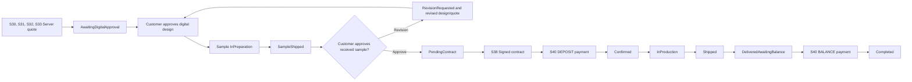
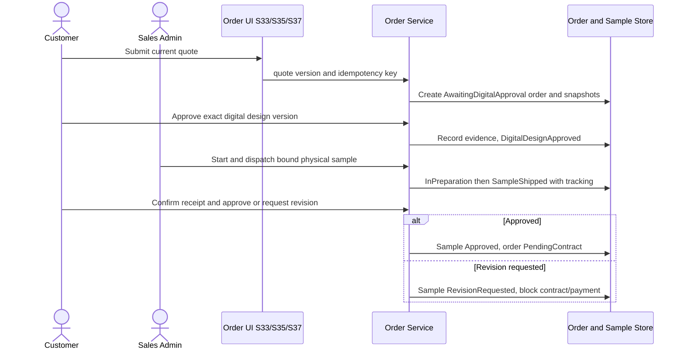
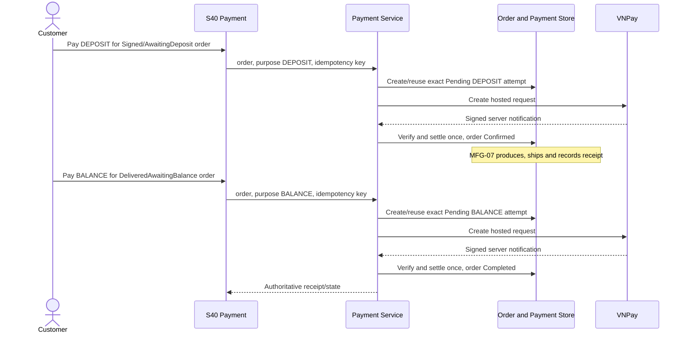

# Spec Document: Order & Payment

| Field | Value |
| --- | --- |
| Module ID | `MFG-06` |
| Module name | Order & Payment |
| Spec version | v2.1 |
| Author (team member) | Group B |
| Date | 2026-09-26 |
| Status | Final Group B demo specification; client operating approval not claimed |
| Approved by (Client role) | Client approved, 2026-09-30 |
| DBIZ2 source | Historical IDs retained: Function List MFG-06; `F-PAY-001` .. `F-PAY-006`; `UC-C05`, `UC-C12`; active screens S30, S31, S32, S33, S34, S35, S36, S37 and S39, S38, S40, S41, S42, S13. |

---

## 1. Purpose and scope (mandatory)

MFG-06 manages the commercial lifecycle of a made-to-order Dony order. Dony does not sell ready-made inventory. Every order binds a Customer-owned digital design, garment specifications, size quantities, delivery details and an immutable price version.

The required business sequence is:

**approve digital design → prepare and send physical sample → approve received sample → sign the sample-bound contract → pay deposit → produce and deliver/receive goods → pay remaining balance → complete order.**

The Customer may represent a Business Buyer ordering uniforms or garments for internal use, or a Reseller Shop commissioning Dony to manufacture the shop's own design for resale. Buyer Organization data is descriptive customer/billing information, not a tenant or authorization boundary.

**In scope:** server quote; idempotent order creation; explicit digital-design approval; physical-sample preparation, dispatch, receipt, approval or revision; transition to contract; separate deposit and balance payment purposes; signed VNPay notification validation; reconciliation; refund of captured funds; customer receipt acknowledgement; payment receipt and order completion.

**Out of scope:** authoring product rules is MFG-04; creating/delivering designs is MFG-05; production/shipping operations and cancellation are MFG-07; contract rendering/signature is MFG-09; merge matching is MFG-10. In the MVP, only Sales Admin may start/dispatch samples or advance orders to InProduction/Shipped. Sample manufacturing cost is included in the signed order price unless a later reviewed specification introduces a separate charge; there is no standalone sample or design-service payment screen.

**MVP boundary:** merge is not part of the MFG-06 MVP path. For every MVP quote/order, `merge_opt_in=false`, `merge_discount_vnd=0`, and no merge policy acceptance/version is requested or applied. FR-002 remains Must for the standard quote; its MFG-10 v4 final demo policy merge branch is dormant until MFG-10 is implemented after the MVP. Do not render merge choices or discounts in MVP checkout.

**MVP release rules:** BR-019 simplifies cancellation, refund, receipt auto-confirmation and overdue handling for the MVP. Where BR-007, BR-013, BR-014 or the transition table describe the full behavior, BR-019 takes precedence for the MVP; the full behavior is MVP Could (see [MVP scope](../../prd.md)).

## 2. Actors (mandatory)

| Actor | Role in this module | Where it comes from |
| --- | --- | --- |
| Customer | Reviews quote; approves digital design and received physical sample; pays deposit and balance; confirms receipt | UC-C05/UC-C12 and confirmed business flow |
| Sales Admin | Oversees all Dony orders, records sample preparation/dispatch evidence and reconciles/refunds payments | MFG-06/MFG-07 role boundary |
| Sales | Read-only access to assigned-customer order progress in the MVP; no sample, dispatch, InProduction or Shipped mutations. | MFG-07 MVP boundary |
| VNPay | Hosts each payment attempt and sends signed server notifications | Payment integration contract |
| System | Locks versions, calculates amounts, deduplicates callbacks, persists state and sends outbox events | MFG-06 function contract |
| MFG-09 | Generates and signs a contract only after physical-sample approval | Contract boundary |

## 3. User scenarios and acceptance criteria (mandatory)

### US-1 (Must): Create order and approve the digital design

1. Given an owned orderable Saved or Delivered design, aggregate quantity at or above the product MOQ, valid quantities and address, when the Customer requests a quote, then the server returns a complete integer-VND breakdown with 30-minute expiry. In MVP, merge is always opted out and discount is zero; after MFG-10 activation, an eligible accepted flexible quote uses the incentive defined in BR-011; standard internal batching gives no incentive.
2. Given a current quote, when submitted with an idempotency key, then one order is created as `AwaitingDigitalApproval` with immutable product, design, quantities, buyer-organization, address, price and policy snapshots.
3. Given `AwaitingDigitalApproval`, when the Customer approves the exact design version, then the approval evidence and timestamp are recorded and the order becomes `DigitalDesignApproved`.
4. If the design or price-driving rule changes before approval, the Customer must receive a replacement quote and explicitly review the new snapshot; the previous snapshot is never silently edited.

### US-2 (Must): Send and approve the physical sample

1. Given `DigitalDesignApproved`, when Sales Admin begins the sample, then one versioned sample record becomes `InPreparation` and the order becomes `SampleInPreparation`; duplicated commands replay the same result.
2. When the sample is dispatched, carrier, tracking number, sent timestamp and the bound design version are required; the order becomes `SampleShipped`.
3. When the Customer confirms receipt and approves the sample, the server records approval evidence and the approved sample/design version, then advances the order to `PendingContract`.
4. When the Customer requests revision with a reason, the sample becomes `RevisionRequested`; no contract or payment can proceed. The existing order returns to `AwaitingDigitalApproval` for a new immutable design/quote version, while prior order/sample/design evidence remains retained. The classroom flow has no fixed revision-attempt cap and no separate sample fee; any commercial-total change requires explicit quote approval before another physical sample is prepared.
5. A sample tied to an obsolete design/order version cannot be approved; stale requests return 409 without a partial transition.

### US-3 (Must): Sign contract and pay the deposit

1. MFG-09 may generate a contract only for a `PendingContract` order whose current physical sample is Approved and whose contract snapshot references the same design, sample and total.
2. Valid contract acknowledgement atomically changes the order from `PendingContract` to `AwaitingDeposit`.
3. `deposit_due_vnd = floor(contract_total_vnd × deposit_percent / 100)`, where `deposit_percent` is a versioned integer policy snapshotted in the signed contract; the current classroom policy is 50%.
4. A DEPOSIT payment can be initiated only for the owner of a Signed contract and an `AwaitingDeposit` order. One active Pending attempt exists for this purpose.
5. A valid signed VNPay server notification with matching merchant, provider reference, purpose, amount and currency settles the deposit once and changes the order to `Confirmed`.
6. Browser return only reads or polls server state. Failed/expired payment keeps `AwaitingDeposit` and permits a new attempt; duplicate callbacks never double-settle.

### US-4 (Must): Deliver, collect the balance and complete

1. After deposit settlement, MFG-07 owns `Confirmed → InProduction → Shipped` and requires production/shipping evidence.
2. Given a Shipped order, when the Customer confirms receipt, then `received_at` is stored and the order becomes `DeliveredAwaitingBalance`; when Sales Admin records verified delivery evidence, the order remains `Shipped` and a 3-calendar-day auto-confirmation timer starts. If the Customer does not confirm before expiry, the scheduled system event records receipt and advances the order to `DeliveredAwaitingBalance`. **MVP (BR-019):** there is no timer; after recording verified delivery evidence, Sales Admin may confirm receipt on the Customer's behalf.
3. `balance_due_vnd = contract_total_vnd − accepted_deposit_vnd − accepted_order_credit_vnd`. It must be at least zero and is calculated only from authoritative stored amounts.
4. A BALANCE payment can be initiated only for the owner of a `DeliveredAwaitingBalance` order. A zero balance completes automatically without creating a provider attempt.
5. A verified BALANCE settlement changes the order to `Completed` exactly once and issues a receipt showing contract total, deposit, credits, balance and total settled.
6. Balance is due 7 calendar days from recorded Customer receipt or BR-007 automatic receipt confirmation under BR-014. When that deadline passes, the order remains `DeliveredAwaitingBalance` with payment substate `Overdue`; notify Customer and Sales Admin without a late fee, auto-cancellation or false completion. **MVP (BR-019):** `balance_due_at` is displayed only; there is no `Overdue` substate or overdue notification.

### US-5 (automatic reconciliation Must; S41/S42 manual reconciliation Should; refund Could): Reconcile and refund captured payments

**MVP (BR-019):** cancellation is only possible before a deposit succeeds, so no in-system refund exists. A late successful deposit on a Cancelled order is recorded, the order is flagged `manual_refund_required`, Sales Admin is notified, and the refund is handled outside the system. Criteria 2–4 below describe the full behavior.

1. Reconciliation treats DEPOSIT and BALANCE as separate purposes and never applies one callback to the other.
2. Cancellation/refund returns no more than the sum of accepted captured amounts minus successful refunds. It never refunds an unpaid balance.
3. A late successful payment for a Cancelled order records the received funds and starts an idempotent refund without resurrecting the order.
4. Refund failure remains visible and retryable to Sales Admin; an email failure never rolls back payment/order state.

### Edge cases

- Invalid address, quantities, sample evidence or stale versions return 422/409 without partial writes.
- Design approval, sample approval, contract signing, deposit settlement, production start, cancellation and merge assignment lock the order/version so only one conflicting transition commits.
- Provider outage returns 503 without a false success; unresolved attempts are reconciled.
- Customer receipt confirmation is idempotent; a foreign order/sample/payment ID returns 404.
- A Business Buyer or Reseller Shop name never grants access; Customer ownership comes from the authenticated session.

## 4. Flows (mandatory)

### 4.1 Usage flow

### 4.2 Sequence for the main flow

The first sequence covers digital-design and physical-sample approval; section 4.3 continues with the two payment gates.

### 4.3 Sequence for deposit and balance payment

## 5. Functional requirements (mandatory)

| FR ID | DBIZ2 Subfunction ID | Requirement (system MUST ...) | Actor | Priority |
| --- | --- | --- | --- | --- |
| FR-001 | F-PAY-001 | Render the Customer's made-to-order checkout and current order workflow, including digital-design, physical-sample, contract, deposit, delivery and balance gates. | Customer | Must |
| FR-002 | F-PAY-002 | Recompute a 30-minute quote from authoritative product/design versions, quantities and address, with deposit preview. MVP quotes always set `merge_opt_in=false` and `merge_discount_vnd=0`; the dormant post-MVP MFG-10 v4 final demo policy branch applies the accepted flexible discount defined in BR-011 only after reviewed MFG-10 activation; standard internal batching creates no discount. | Customer | Must |
| FR-003 | F-PAY-003 | Atomically create one `AwaitingDigitalApproval` order and control idempotent digital-design and physical-sample approval transitions using immutable versioned evidence. | Customer / Sales Admin | Must |
| FR-004 | F-PAY-004 | Initiate one payable DEPOSIT or BALANCE attempt only when the matching order gate is satisfied and return hosted-provider redirect details. | Customer | Must |
| FR-005 | F-PAY-005 | Verify and deduplicate provider notifications by payment purpose, settle deposit/balance once, and automatically reconcile unresolved attempts with the provider (Must). Sales Admin manual reconciliation through S41/S42 is Should; refund of captured funds is Could (BR-019). | VNPay / Sales Admin / System | Must (manual reconciliation Should; refund Could) |
| FR-006 | F-PAY-006 | Show the owner authoritative workflow, payment, receipt, refund and outstanding-balance state; browser return remains read-only. | Customer | Must |

### 5.1 Input / Output contract

| FR ID | Input field | Type | Required | Output field | Type | Notes / validation |
| --- | --- | --- | --- | --- | --- | --- |
| FR-001 | session, product_id, design_id | Session / UUID / UUID | Yes | S30/S35 workflow model | ViewModel | Owned Saved/Delivered design; Published Dony product base; no ready-made stock. |
| FR-002 | quantities (aggregate >= product MOQ), delivery address, buyer_type and conditional legal details, current design/product versions; post-MVP only: merge choice/version | Integers / address / enum / conditional strings / versions | Yes | quote, price breakdown, deposit preview, expiry | Object | MVP: reject below MOQ; Business Buyer/Reseller Shop require legal name, tax ID and billing address. No merge input; persist `merge_opt_in=false`, `merge_discount_vnd=0`, no merge policy version. Post-MVP MFG-10 activation: quote uses immutable policy snapshot. 30 minutes; money is integer VND; stale rules require replacement quote. |
| FR-003 | action, order_id/quote_id, buyer_type/legal snapshot, design/sample/order expected versions, evidence, tracking, Idempotency-Key | Enum / UUIDs / versions / object / key | By action | order, sample, timeline and next gate | Object | Actions: create_order, approve_digital, start_sample, dispatch_sample, approve_sample, request_revision; revision reuses the order with new immutable design/quote versions; lock and revalidate atomically. create_order assigns `order_number` under BR-017; dispatch_sample accepts the optional BR-018 estimated delivery range. |
| FR-004 | order_id, purpose, expected order/payment versions, Idempotency-Key | UUID / DEPOSIT or BALANCE / versions / key | Yes | attempt_id, purpose, exact amount, expires_at, redirect | Object | DEPOSIT requires Signed/AwaitingDeposit; BALANCE requires DeliveredAwaitingBalance; one active Pending attempt per order/purpose. |
| FR-005 | signed provider query or authorized reconcile/refund request | Query / IDs / versions / key | Yes | payment/refund state and order transition | Object | Verify signature, merchant, reference, purpose, amount and VND; refund captured funds only. |
| FR-006 | order_id or attempt_id, session | UUID / session | Yes | workflow timeline, two-purpose payment summary, receipt/refund state | Object | Owner or authorized Dony staff; secrets omitted; browser return cannot settle. |

### 5.2 Business rules

| Rule ID | Rule | Why it exists |
| --- | --- | --- |
| BR-001 | Order progression is `AwaitingDigitalApproval → DigitalDesignApproved → SampleInPreparation → SampleShipped → PendingContract → AwaitingDeposit → Confirmed → InProduction → Shipped → DeliveredAwaitingBalance → Completed`; sample revision returns through a new immutable design/quote approval cycle. | Make every customer and production commitment explicit. |
| BR-002 | Digital approval binds the exact design/product versions. Physical-sample approval binds the exact sample and design versions; only then may a contract be generated. | Prevent production or payment against an unapproved design/sample. |
| BR-003 | Contract signature moves `PendingContract → AwaitingDeposit`; verified deposit moves `AwaitingDeposit → Confirmed`; verified balance moves `DeliveredAwaitingBalance → Completed`. The only completion exception is the authoritative zero-balance path in US-4 and the transition table; staff cannot manually perform a paid/completed transition. | Separate legal acknowledgement, deposit and final settlement. |
| BR-004 | Deposit uses the signed contract's versioned `deposit_percent` (current classroom value 50%). Balance is contract total less accepted deposit and accepted credits; the client never supplies either amount. | Prevent amount manipulation and rounding drift. |
| BR-005 | DEPOSIT and BALANCE use distinct immutable attempts and provider references. One active Pending attempt exists per order/purpose; same key/payload replays and changed payload returns 409. | Prevent double collection and purpose confusion. |
| BR-006 | Provider server notification and reconciliation are authoritative; browser return is read-only. Late success on a Cancelled order is recorded and refunded without restoring the order. | Preserve financial truth. |
| BR-007 | Delivery evidence is either a carrier tracking event/status showing delivered, independently checked by Sales Admin, or a signed proof-of-delivery asset/reference recorded by Sales Admin with verified-delivered timestamp. Recording verified evidence does not itself change the order from `Shipped`; it starts a 3-calendar-day auto-confirmation timer and the Customer is notified. Customer confirmation before expiry immediately records `received_at` and advances to `DeliveredAwaitingBalance`; otherwise a scheduled system event does so at expiry. MVP has no dispute action, dispute state, timer pause or Sales Admin dispute-review flow. `Shipped` alone never enables BALANCE payment. | Separate delivery evidence, receipt and the balance-payment gate. |
| BR-008 | The accepted Complex design fee is allocated once to the first order from its delivered design lineage. It is included as a separate, non-discountable line in `contract_total_vnd`, deposit and balance proportions. While the fee-bearing order has not reached `InProduction`, another order from that design lineage is blocked with `409 DESIGN_FEE_ORDER_PENDING`; after `InProduction`, later orders from that lineage have fee 0. Cancellation releases allocation only after captured funds and refunds resolve. | Prevent duplicate design-fee collection or bypass while preserving the S33 pending-order rule. |
| BR-009 | There is no standalone SERVICE, sample or design payment. Active payment purposes are DEPOSIT and BALANCE for an Order. | Keep payment aligned with the agreed commercial flow. |
| BR-010 | Each committed lifecycle or financial transition appends an order timeline event and durable notifications; notification failure never rolls back the transition. | Provide traceability and reliable communication. |
| BR-011 | MVP merge remains disabled with zero discount and the existing 7-calendar-day standard commitment. After reviewed MFG-10 activation, eligible saved merge-enabled small orders without a fitting open run may accept flexible terms. Discount follows the formula below and excludes shipping, tax and design fee: `min(floor(merchandise_subtotal_vnd*5/100),250000)`; standard internal batching adds no incentive. Snapshot 7 working days waiting followed by 8–14 separate production working days, Monday–Friday inclusive readiness-day-1 counting and the maximum completion promise (working day 21 at full wait). Standard post-activation promise remains 5 working days. Before readiness, show relative terms rather than invented absolute dates; after all readiness gates, derive dates under MFG-10 5.3. Daily-output inputs yield estimates and require human feasibility review; no scheduler conversion/start. Preserve previously accepted snapshots. | Keep price, calendar and commercial promise consistent. |
| BR-012 | `merchandise_subtotal_vnd` uses MFG-04's aggregate-quantity volume tier and per-garment option surcharges. Classroom demo `shipping_vnd` is a flat 30000 VND per order; `tax_vnd=0` for this classroom demo only and is not a claim about statutory tax/VAT obligations. MVP excludes assessed design service, so `design_fee_vnd=0`; later eligible delivered designs use the accepted MFG-05 fee snapshot. `total_vnd = merchandise_subtotal_vnd - merge_discount_vnd + shipping_vnd + tax_vnd + design_fee_vnd`; merge is zero in MVP. Persist each line as an immutable quote/order/contract snapshot. | Define each checkout amount independently of MFG-12, which is excluded from MVP. |
| BR-013 | A cancellation before deposit has no refund because no payment was captured. If a deposit was captured while the order remains cancellable before `InProduction` (including a late success on a Cancelled order), refund 100% of all accepted captured order payments to the original method; deduct no cancellation fee. Cancellation is prohibited from `InProduction` onward. Create the provider refund request on the same business day; provider/bank settlement time is outside the application guarantee. | Provide deterministic classroom refund behavior without inventing an operational settlement SLA. |
| BR-014 | `balance_due_at = delivered_at + 7 calendar days`; `delivered_at` is the verified customer receipt or the BR-007 auto-confirmation timestamp. At the deadline, set payment substate `Overdue`, notify Customer and Sales Admin, do not add late fees and do not auto-cancel or mark Completed. | Overdue is a payment substate, not cancellation or completion. |
| BR-015 | Physical-sample revision requests carry a reason and create a new immutable design/quote/sample cycle on the same order; the previous sample and design remain auditable. The classroom flow has no fixed revision-attempt cap and no separate sample fee. Any revised design that changes the commercial total requires a replacement quote and Customer approval before another sample is made. | Make revision and price-change behavior deterministic while preserving the agreed order. |
| BR-016 | MVP standard checkout uses the active pre-seeded Dony catalog data; for demo quotes `shipping_vnd=30000` and `tax_vnd=0` as defined by BR-012. No MFG-12 settings UI/runtime dependency is required. | Keep the MVP quote runnable without deferred system configuration. |
| BR-017 | Each order receives a customer-visible `order_number` in the same transaction that creates it. Format: `SO-{YYYY}-{NNNN}`, where `YYYY` is the Asia/Ho_Chi_Minh year of `created_at` and `NNNN` is a per-year ascending sequence zero-padded to at least four digits (for example `SO-2026-0428`; `SO-2026-10000` after 9999). The number is globally unique, immutable, never reused (including after cancellation) and may contain gaps. An idempotent create replay returns the original number, and a sample-revision cycle keeps it. `order_number` is for display, exact-match search and correspondence only; routes, APIs and authorization always use `order_id`. | Give people a readable order reference without replacing the UUID authority. |
| BR-018 | When dispatching a physical sample, and when shipping goods under MFG-07, Sales Admin may record an optional informational `estimated_delivery_from`/`estimated_delivery_to` date range (Asia/Ho_Chi_Minh dates; `from` ≥ dispatch/shipment date; `to` ≥ `from`). It may be updated while that shipment is `SampleShipped` or `Shipped`, with expected version and audit. It never drives order status, the BR-007 receipt timer, the BR-014 balance deadline, analytics or any commercial commitment. Screens label it "Estimated by Dony" and omit it when absent; the system never computes or infers it. | Show carrier guidance without inventing a production or delivery lead-time rule. |
| BR-019 | **MVP release rules** (take precedence over BR-007, BR-013, BR-014 and the transition table for the MVP only): (a) the owning Customer or Sales Admin may cancel only from `AwaitingDigitalApproval`, `DigitalDesignApproved`, `SampleInPreparation`, `SampleShipped`, `PendingContract` or `AwaitingDeposit` while no DEPOSIT has succeeded; from `Confirmed` onward cancellation returns 409. (b) A DEPOSIT that succeeds after cancellation is recorded as captured, the order stays Cancelled with `manual_refund_required=true`, Sales Admin is notified through S13, and the refund is performed outside the system; no provider refund request is created. (c) There is no 3-day auto-confirmation timer: after recording verified delivery evidence (BR-007), Sales Admin may confirm receipt on the Customer's behalf, which records `received_at`, the acting staff ID and the evidence reference, and advances `Shipped→DeliveredAwaitingBalance`. (d) `balance_due_at` is computed and displayed, but no `Overdue` substate, scheduler or overdue notification exists. | Deliver the end-to-end MVP path without a refund workflow or scheduler; the full rules remain MVP Could. |

**Order transition reference (canonical for order status; payment-attempt status is separate):**

| From | To | Event / actor | Guard and effect |
|---|---|---|---|
| `AwaitingDigitalApproval` | `DigitalDesignApproved` | Approve digital design / Customer | Confirm exact current design and quote version; append approval evidence. |
| `DigitalDesignApproved` | `SampleInPreparation` | Start sample / Sales Admin (MVP); assigned Sales only outside MVP per MFG-07 | Verify current order and design; create bound sample cycle. |
| `SampleInPreparation` | `SampleShipped` | Dispatch sample / Sales Admin (MVP); assigned Sales only outside MVP per MFG-07 | Record carrier, tracking and dispatch timestamp for the bound sample; optional BR-018 estimated delivery range. |
| `SampleShipped` | `PendingContract` | Approve received sample / Customer | Confirm sample receipt and approval for the exact current sample/design. |
| `SampleShipped` | `AwaitingDigitalApproval` | Request sample revision / Customer | Require reason; mark sample `RevisionRequested`; create a new immutable design/quote cycle on the same order; retain prior evidence and block contract/deposit. |
| `PendingContract` | `AwaitingDeposit` | Acknowledge current contract / Customer | MFG-09 records required release-scope evidence against current contract and approved sample. |
| `AwaitingDeposit` | `Confirmed` | Deposit settles / Payment service | Valid, deduplicated VNPay server notification for exact DEPOSIT amount. |
| `Confirmed` | `InProduction` | Explicit human start / Sales Admin (MVP); assigned Sales only outside MVP per MFG-07 | Revalidate readiness, approved plan and versions. Shared batches require Sales Admin start through MFG-10. Flexible individual production requires prior Sales Admin approval, then explicit human start. Scheduler has no production-transition authority. Scheduled/Locked/approval-required are not InProduction. |
| `InProduction` | `Shipped` | Ship goods / Sales Admin (MVP); assigned Sales only outside MVP per MFG-07 | Record carrier, tracking and shipment timestamp; optional BR-018 estimated delivery range. |
| `Shipped` | `DeliveredAwaitingBalance` | Confirm receipt / Customer | Immediate transition; record customer-confirmed receipt timestamp. |
| `Shipped` | `DeliveredAwaitingBalance` | Confirm receipt on Customer's behalf / Sales Admin (MVP only, BR-019) | Requires previously recorded verified delivery evidence; record `received_at`, acting staff ID and evidence reference; audited. |
| `Shipped` | `DeliveredAwaitingBalance` | Auto-confirm / scheduled system event (post-MVP) | Only after Sales Admin records verified delivery evidence and 3 calendar days elapse without Customer confirmation; record auto-confirmation as `received_at`. There is no MVP dispute branch. |
| `DeliveredAwaitingBalance` | `Completed` | Balance settles / Payment service | Valid, deduplicated VNPay BALANCE settlement; zero balance completes without provider attempt. |
| `AwaitingDigitalApproval` | `Cancelled` | Cancel / owning Customer or Sales Admin | Allowed per MFG-07 US-2; Sales Admin supplies a reason; preserve evidence/refund captured funds under BR-013. |
| `DigitalDesignApproved` | `Cancelled` | Cancel / owning Customer or Sales Admin | Allowed per MFG-07 US-2; Sales Admin supplies a reason; preserve evidence/refund captured funds under BR-013. |
| `SampleInPreparation` | `Cancelled` | Cancel / owning Customer or Sales Admin | Allowed per MFG-07 US-2; Sales Admin supplies a reason; preserve evidence/refund captured funds under BR-013. |
| `SampleShipped` | `Cancelled` | Cancel / owning Customer or Sales Admin | Allowed per MFG-07 US-2; this is cancellation, not the separate sample-revision transition; preserve evidence/refund captured funds under BR-013. |
| `PendingContract` | `Cancelled` | Cancel / owning Customer or Sales Admin | Allowed per MFG-07 US-2; Sales Admin supplies a reason; preserve evidence/refund captured funds under BR-013. |
| `AwaitingDeposit` | `Cancelled` | Cancel / owning Customer or Sales Admin | Allowed per MFG-07 US-2; Sales Admin supplies a reason; if a late deposit succeeds after cancellation, record and refund it under BR-006/BR-013 without reopening the order (MVP: record it and set `manual_refund_required` under BR-019). |
| `Confirmed` | `Cancelled` | Cancel / owning Customer or Sales Admin (post-MVP; MVP returns 409 under BR-019) | Allowed before production under MFG-07; release any scheduled/locked assignment atomically and invalidate the affected plan for revalidation. Sales Admin supplies a reason; refund captured funds under BR-013. Sales employees cannot cancel. |

### Analytics evidence integration (MFG-11)

For MFG-11/F-DA-004, successful eligible S30 rendering supplies `checkout_started`; quote requests, stale quotes and validation failures do not create orders. When a validated journey reference exists, carry it through quote retries and committed order creation under MFG-11's attribution contract; missing or invalid analytics correlation is recorded as unknown and must not block a valid commercial operation or grant ownership. Payment/idempotency/quote rules remain authoritative.

Project committed digital/sample approval, cycle revision, accepted deposit/balance, receipt, completion and refund evidence with original event ID/time and bound versions. Keep sample-cycle identity for rework duration. Browser return, Pending/Failed attempts, repeated notifications and duplicate/late receipts are not additional conversions. Zero balance still emits authoritative completion without a provider attempt; receipt source distinguishes Customer confirmation from the existing scheduled auto-confirmation. Verified delivery proof starts the timer and is not itself receipt. Analytics consumes timeline/outbox evidence asynchronously; no metric/model request participates in settlement or changes the order lifecycle. See [MFG-11](spec-MFG-11.md#54-event-evidence-and-instrumentation).

## 6. Key entities (mandatory)

| Entity | Attributes (from Input/Output fields) | Relationships |
| --- | --- | --- |
| Quote | id, customer_id, originating_journey_id? (validated analytics correlation), buyer_type, buyer_organization_snapshot, design/product IDs and versions, quantities, address, merge/policy, merchandise subtotal, shipping, tax, design fee, total, deposit preview, expiry, version | Server-computed, customer-owned and consumed once; every order has exactly one Business Buyer or Reseller Shop snapshot, never authorization or tenant scope. |
| BuyerOrganization snapshot | buyer_type, legal_name, tax_id, billing_address | Every order is either Business Buyer or Reseller Shop; S30 requires these fields for both and copies them immutably to Quote, Order and Contract. They are customer-provided commercial context, not login, role, tenant or authorization data. |
| Order | id, order_number, customer_id, originating_journey_id? (immutable validated analytics attribution), buyer_type, buyer_organization_snapshot, design/product/quote versions, status, price/address/quantity snapshots, approved_sample_id?, contract_id?, deposit_percent, contract_total_vnd, accepted_deposit_vnd, accepted_order_credit_vnd, balance_due_vnd, balance_due_at, received_at?, received_by_staff_id?, manual_refund_required (MVP, BR-019), version, timestamps | Made-to-order aggregate linked to required buyer snapshot, sample, contract, two payment purposes, fulfilment and optional merge batch. `order_number` follows BR-017. Optional BR-018 delivery estimates are recorded per shipment: on ProductionSample for the sample and with the MFG-07 goods-shipment fields for the order; there is no computed order-level estimate. |
| ProductionSample | id, order_id, design_id/version, status InPreparation/Shipped/Approved/RevisionRequested, carrier?, tracking_number?, sent_at?, estimated_delivery_from?, estimated_delivery_to?, received_at?, approved_at?, feedback?, evidence, version | One current version per sample cycle; contract must reference the Approved version. |
| PaymentTransaction | id, order_id, customer_id, purpose DEPOSIT/BALANCE, amount_vnd, currency VND, status Pending/Succeeded/Failed/Expired, provider references, paid_at?, refund_status, version | One active Pending attempt per order/purpose; provider events deduplicated. |
| OrderTimelineEvent | event_id, order_id, prior_status, target_status, actor/event source, bound entity version/sample cycle where applicable, evidence reference, occurred_at | Append-only audit of business transitions. |

## 7. Screens involved

| Screen ID | Screen name | Priority | Screen Spec file |
| --- | --- | --- | --- |
| S30 | Create made-to-order order and quote | Must | `screens/S30-create-order.md` |
| S31, S32 | Production option and terms (post-MFG-10) | Could | `screens/S31-production-option.md`, `screens/S32-production-terms.md` |
| S33 | Quote and order summary | Must | `screens/S33-order-summary.md` |
| S34 | Customer order list with workflow status | Must | `screens/S34-customer-orders.md` |
| S35 | Customer order detail, design/sample approval, receipt and payment gates | Must | `screens/S35-customer-order-detail.md` |
| S36 | Staff order list | Must | `screens/S36-staff-orders.md` |
| S37 | Dony order detail, sample dispatch and fulfilment evidence | Must | `screens/S37-staff-order-detail.md` |
| S39, S38 | MVP minimum: fixed-template contract generation/review and Customer acknowledgement after sample approval | Must (template administration is Could) | MFG-09 boundary |
| S40 | Deposit or balance payment | Must | `screens/S40-order-payment.md` |
| S41, S42 | Payment list, detail and reconciliation; in-system refund is Could | Should | `screens/S41-payment-transactions.md`, `screens/S42-payment-transaction-detail.md` |
| S13 | Lifecycle/payment notifications | Must | Shared notification panel |

## 8. Success criteria (mandatory)

| SC ID | Criterion | How it is measured |
| --- | --- | --- |
| SC-001 | No contract, deposit, production, balance or completion occurs before its preceding design/sample/delivery gate. | Exercise every transition and skipped-transition attempt. |
| SC-002 | Deposit plus balance and credits reconcile exactly to the signed contract total without duplicate settlement. | Compare stored integer-VND amounts and provider events for success, retry, duplicate and refund cases. |
| SC-003 | Every approved physical sample is traceable to the exact design and signed contract version used for production. | Compare sample, order and contract snapshot IDs/hashes. |
| SC-004 | Delivery is recorded before balance collection, and Completed means the balance is zero and all accepted settlements are authoritative. | Test Shipped, receipt, zero-balance, successful, failed and overdue balance cases. |

## 9. Assumptions

- Dony manufactures only after customer-specific design and physical-sample approval; no finished-goods inventory is sold.
- Current classroom deposit policy is 50%, stored as a versioned contract snapshot rather than a hard-coded client value.
- Physical-sample production/shipping cost is included in the signed order total; no separate sample payment is collected.
- The classroom balance deadline is 7 calendar days from recorded Customer receipt or automatic receipt confirmation per BR-014; it is snapshotted into the contract.
- VNPay sandbox/configured credentials and durable outbox/reconciliation workers are available.

## 10. Open questions

| # | Question | Blocking? | Owner | Status |
| --- | --- | --- | --- | --- |
| 1 | Is the required commercial order of digital approval, physical sample, deposit, delivery and balance payment decided? | No | Group B | Resolved in sections 1, 3 and 5.2. |
| 2 | Is a separate sample/design-service payment required? | No | Group B | Resolved: no standalone payment; costs are represented in the order total. |

## 11. Traceability to DBIZ2

The repository DBIZ2 baseline is [`docs/spec/docs/function-list.md`](../docs/function-list.md), section VI MFG-06. Each historical function ID below identifies a concrete source-table row and its linked use case/screen reference.

| Spec section | DBIZ2 source | Location |
| --- | --- | --- |
| Scope and actors | MFG-06 Function List MFG-06 | `F-PAY-001`–`F-PAY-006`; expanded with the confirmed sample/deposit/balance flow. |
| Scenarios | UC-C05, UC-C12 | Order finalization and payment, now expressed as two payment purposes. |
| Flow | SD-07 and SD-09 | Sections 4.1–4.3; companion architecture sequences require the same lifecycle. |
| Requirements/entities | `F-PAY-001`–`F-PAY-006` | Sections 5–6 preserve all six historical function IDs. |
| Screens | S30, S31, S32, S33, S34, S35, S36, S37, S39, S38, S40, S41, S42, S13 | Section 7. |

## Completion checklist

- [x] Digital design, physical sample, contract, deposit, delivery and balance gates are explicit.
- [x] Status transitions, evidence, retries, concurrency and failure outcomes are defined.
- [x] DEPOSIT and BALANCE payment purposes reconcile to the signed contract total.
- [x] Business Buyer and Reseller Shop remain Customer contexts rather than tenants.
- [x] Standalone SERVICE/sample payment is excluded.
