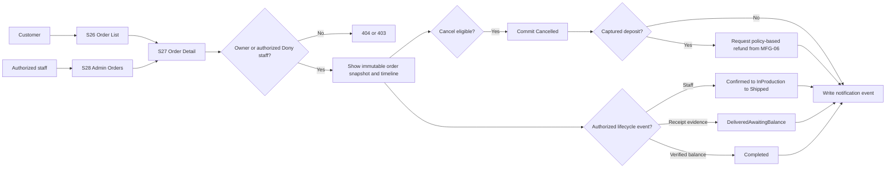
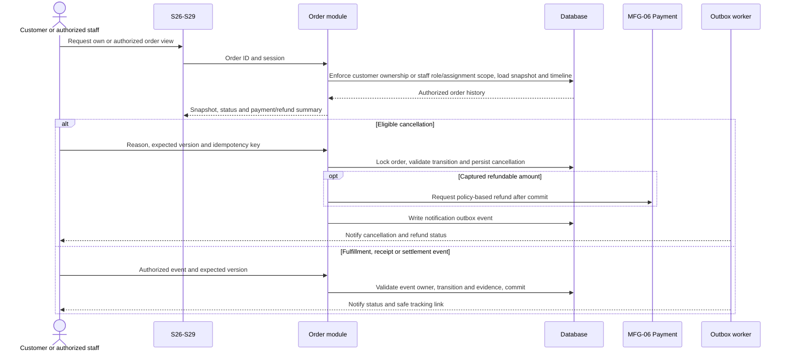

# Spec Document: Order Management

| Field | Value |
| --- | --- |
| Module ID | `MFG-07` |
| Module name | Order Management |
| Spec version | v2.0 |
| Author (team member) | Group B |
| Date | 2026-09-23 |
| Status | Draft |
| Approved by (Client role) | No approver identified |
| DBIZ2 source | Function List `MFG-07`, No. 53–59, `F-ORD-001`–`F-ORD-007`; use cases UC-C08 Track Order, UC-C07 Cancel Order, UC-S04 Update Status; screens S26, S27, S28, S29, S30, S38 |

---

## 1. Purpose and scope (mandatory)

Customers can view their made-to-order orders and follow every commitment from digital-design approval through sample, deposit, production, receipt and final settlement. Sales Admins and an assigned Sales employee can perform the operational transitions assigned to Dony; an owning Customer or Sales Admin can cancel only when the lifecycle permits. This module consumes design/sample, contract, payment, refund and batch events; it does not price orders, settle payments, or generate contracts.

MVP priority: **Should** for the complete module, per the project MVP Scope. The MVP still includes only the order-critical minimum: Customer sample receipt/approval and delivery receipt, plus manual Sales Admin transitions through InProduction and Shipped; MFG-06 retains payment gating and cancellation/refund rules. Advanced fulfillment automation and assignment queues are deferred. Order creation/payment belongs to MFG-06; contract generation/signature to MFG-09; production batches to MFG-10. MFG-07 function IDs must be qualified with `MFG-07/` because MFG-08 independently reuses `F-ORD-001`–`F-ORD-007`.

## 2. Actors (mandatory)

| Actor | Role in this module | Where it comes from |
| --- | --- | --- |
| Customer | Views own orders/details and cancels own eligible order | MFG-07 resolved contract; UC-C07/UC-C08 |
| Sales Admin | Views Dony orders, cancels with reason, advances fulfillment | MFG-07 resolved contract; UC-S04 |
| Sales | Advances fulfilment only for Customers actively assigned to that Dony employee; cannot cancel | MFG-07 resolved contract |
| System / MFG-06 / MFG-09 / MFG-10 | Supplies verified payment/refund, contract and batch events; not an interactive actor | Inter-module contracts |

## 3. User scenarios and acceptance criteria (mandatory)

### US-1: Track order status (Should)

As a Customer, I can list and inspect my own orders, status timeline, immutable price/address snapshot, payment/refund summary and shipment details. Dony staff views are restricted by internal role and active customer assignment.

1. **Given** the customer has no orders, **when** the list is loaded, **then** an empty paginated result is returned.
2. **Given** an order ID is not accessible to the actor, **when** its detail is requested, **then** the response is 404 and discloses no object data.
3. **Given** catalog prices or address data later change, **when** an old order is viewed, **then** the stored snapshot is shown without recalculation.

### US-2: Cancel order (Should)

An owning Customer or Sales Admin can cancel in an allowed state. A Sales Admin supplies a reason. Sales employees cannot cancel.

1. **Given** an order is in a pre-deposit state from `AwaitingDigitalApproval` through `AwaitingDeposit`, **when** an authorized actor cancels it, **then** it becomes `Cancelled`; sample revision itself is not cancellation.
2. **Given** an order is `Confirmed`, **when** production has not started and no active batch exists, **then** an authorized actor may cancel it.
3. **Given** a deposit was captured before cancellation commits, **then** the order remains `Cancelled` and MFG-06 requests a 100% refund of all accepted captured order payments to the original method, without a cancellation deduction, under MFG-06 BR-013; the order and made-to-order evidence are retained.
4. **Given** an order is `InProduction`, `Shipped`, `DeliveredAwaitingBalance`, `Completed`, or linked to a Sales Admin-started active batch, **when** cancellation is attempted, **then** it is rejected with 409. A recommendation alone does not reserve the order and does not prevent eligible cancellation.
5. **Given** cancellation races with production or batch assignment, **when** both mutations contend, **then** one commits and the other returns 409.

### US-3: Update order status (Should)

Sales Admin or the Dony Sales employee actively assigned to the Customer advances fulfilment through valid successive states.

1. **Given** a verified deposit and a `Confirmed` order, **when** authorized staff advance it, **then** only `Confirmed→InProduction→Shipped` is accepted as a staff fulfillment transition.
2. **Given** the target is Shipped, **when** carrier and tracking number are valid, **then** the server records shipped_at and makes the tracking information available.
3. **Given** delivery evidence is verified, **when** the Customer confirms receipt or the MFG-06 three-calendar-day auto-confirmation timer expires, **then** the order advances `Shipped→DeliveredAwaitingBalance`; recording staff evidence alone starts the timer and does not enable final payment. MVP has no dispute action or review flow.
4. **Given** MFG-06 verifies the full remaining balance, **when** settlement commits, **then** the order advances `DeliveredAwaitingBalance→Completed` and staff cannot perform this transition manually.
5. **Given** a status event commits, **when** notification delivery is delayed or fails, **then** committed status remains visible in the inbox and email is retryable.
6. Duplicate commands are idempotent; stale versions and skipped transitions return 409.

### Edge cases

- Invalid pagination/filter input returns 400; invalid cancellation fields return 422.
- Unauthorized object identifiers return 404; authenticated but prohibited actions return 403.
- Email failure never rolls back committed order or notification state.

## 4. Flows (mandatory)

### 4.1 Usage flow

### 4.2 Sequence for the main flow

## 5. Functional requirements (mandatory)

FR identifiers are local to MFG-07. Access is server-checked: customers require ownership and staff require internal role or assignment authorization. Unauthenticated, prohibited and inaccessible requests return 401, 403 and 404 respectively. Mutations use UUIDs, UTC timestamps, expected-version checks and idempotency. Notifications use a transactional outbox, retry policy, and do not roll back committed state.

| FR ID | DBIZ2 Subfunction ID | Requirement (system MUST ...) | Actor | Priority |
| --- | --- | --- | --- | --- |
| FR-001 | F-ORD-001 | List own orders with pagination and allowlisted status/date filters; default newest first; empty results are valid. | Customer | Should |
| FR-002 | F-ORD-002 | Return an authorized order snapshot, timeline, contract/payment/refund summaries and tracking details without recalculating historical prices. | Customer / authorized Dony staff | Should |
| FR-003 | F-ORD-003 | Cancel eligible pre-production orders with trimmed 1–500 character reason, expected_version and Idempotency-Key; retain evidence and request a policy-based refund through MFG-06 for captured funds. | Owning Customer / Sales Admin | Should |
| FR-004 | F-ORD-004 | Notify customer and Dony Sales Admins after cancellation commit; deduplicate recipients/events and include refund status when relevant. | System | Should |
| FR-005 | F-ORD-005 | Provide paginated Dony order dashboard with allowlisted status/date/customer filters and counts. | Sales Admin | Should |
| FR-006 | F-ORD-006 | Enforce lifecycle transitions: Sales Admin or actively assigned Sales may advance `Confirmed→InProduction→Shipped`; `Shipped→DeliveredAwaitingBalance` requires Customer confirmation or the MFG-06 scheduled event after verified delivery proof plus 3 calendar days; only verified MFG-06 balance settlement advances to `Completed`. | Sales Admin / assigned Sales / Customer / System | Should |
| FR-007 | F-ORD-007 | Notify order owner after committed status change with timestamp and safe tracking link; suppress duplicates and retry email. | System | Should |

### 5.1 Input / Output contract

| FR ID | Input field | Type | Required | Output field | Type | Notes / validation |
| --- | --- | --- | --- | --- | --- | --- |
| FR-001 | page, page_size, filters, sort | Integer / allowlisted values | Optional | order summaries, total, page, page_size | Paginated object | page ≥1; page_size 1–100 |
| FR-002 | order_id, session | UUID / session | Yes | authorized order snapshot and timeline | Object | Own customer or authorized Dony staff; inaccessible ID 404 |
| FR-003 | order_id, reason_for_cancellation, expected_version, Idempotency-Key | UUID, string, integer, key | Yes | status, refund workflow reference | Object | Valid transitions only; duplicate key replays |
| FR-004 | committed cancellation event | Internal event | Yes | notification/outbox IDs | UUIDs | After commit; deduplicated |
| FR-005 | filters, page, page_size | Allowlisted values / integers | Optional | Dony order list and counts | Paginated object | Dony operations only |
| FR-006 | order_id, lifecycle_event, carrier, tracking_number, delivery_evidence?, expected_version, Idempotency-Key | UUID, enum, conditional strings/evidence, integer, key | By transition | updated order and timeline | Object | Carrier/tracking required only for Shipped; delivery evidence required only for `Shipped→DeliveredAwaitingBalance`; payment event is server-authenticated; 3-day timer comes from MFG-06 BR-007 |
| FR-007 | committed status event | Internal event | Yes | durable notification/outbox IDs | UUIDs | After commit; inbox authoritative |

### 5.2 Business rules

| Rule ID | Rule | Why it exists |
| --- | --- | --- |
| BR-001 | Canonical order progression and exceptional transitions are in the MFG-06 Order transition reference; this module's US-1–US-3 define order ownership, cancellation and fulfillment authorization. Sample revision loops to a new immutable design/quote approval cycle. Only pre-deposit states and eligible unbatched `Confirmed` orders can be cancelled. | Preserve design, sample, contract, deposit, production, receipt and final-payment gates. |
| BR-002 | A merge recommendation does not reserve an order. Before a Sales Admin starts a batch, otherwise eligible Confirmed orders can be cancelled normally. Starting a batch atomically assigns membership and advances every selected order to InProduction; linked orders cannot then be cancelled. If no Admin-started batch includes an order by its seven-day merge-window deadline, scheduler starts its individual production and records fallback. | Preserve Admin final approval, avoid stranded orders, and keep membership auditable. |
| BR-003 | Cancellation/refund amounts and timing follow MFG-06 BR-013; MFG-07 only records eligibility and requests the refund. No inventory restock occurs because Dony manufactures to order. | Made-to-order production and payment ownership. |
| BR-004 | Every access is checked server-side; customers require ownership and staff require an internal Dony role or active assignment. | Prevent cross-customer access and privilege escalation. |
| BR-005 | Staff cannot manually mark an order `Completed`; completion requires an accepted BALANCE transaction, and receipt must be recorded before that transaction becomes payable. | Prevent false delivery and revenue completion. |

## 6. Key entities (mandatory)

| Entity | Attributes (from Input/Output fields) | Relationships |
| --- | --- | --- |
| Order | UUID, customer_id, buyer_type, buyer_organization_snapshot, design_id/version, quote_id, approved_sample_id?, policy_version, status, merge_opt_in, contract_id, batch_id?, immutable address/quantity/price snapshots, tracking_number?, carrier?, shipped_at?, delivery_evidence_verified_at?, auto_confirm_at?, received_at?, completed_at?, version, timestamps | Belongs to its Customer and one required Business Buyer/Reseller Shop order snapshot; linked to quote, approved physical sample, contract and optional batch; emits payment/refund/status events. Buyer details are commercial data, never tenant authority. |
| Order timeline event | Order ID, prior/target status, actor, timestamp, request/idempotency reference | Belongs to one order; append-only. |
| Notification/outbox event | Order ID, event type, recipients, delivery state | Created transactionally after order mutation. |

## 7. Screens involved

| Screen ID | Screen name | Priority | Screen Spec file |
| --- | --- | --- | --- |
| S26 | Customer order history | Should | `screens/S26-customer_order_list_screen.md` |
| S27 | Customer order detail and refund status | Should | `screens/S27-customer_order_detail_screen.md` |
| S28 | Sales Admin order dashboard | Should | Module screen; Dony order list and filters |
| S29 | Production management | Should | Module screen; status progression |
| S30 | Contract tab | Should | MFG-09 contract boundary |
| S38 | Notifications | Should | Shared notification screen |

## 8. Success criteria (mandatory)

| SC ID | Criterion | How it is measured |
| --- | --- | --- |
| SC-001 | Every order read is limited to the actor's customer ownership or staff role/assignment scope and returns the stored snapshot. | Verify authorized and unauthorized customer/staff requests; inaccessible IDs return 404. |
| SC-002 | Only valid cancellation and fulfillment transitions commit, including under concurrent requests. | Exercise state-transition matrix and race tests; one winner, stale loser 409. |
| SC-003 | Notifications and refund requests are durable and deduplicated after order commit. | Inspect outbox/inbox and refund event for retries and duplicate commands. |

## 9. Assumptions

- Orders are made to order; cancellation does not restock inventory.
- MFG-06 is authoritative for settlement/refunds, and MFG-10 is authoritative for batch membership.
- Delivery proof/timer and refund policy are authoritative in MFG-06 BR-007/BR-013; this module must not restate different amounts or deadlines.
- The complete module remains Should, but the minimum transitions needed to finish the MFG-06 MVP order path are required in the MVP implementation slice in README. Manual Sales Admin updates are the defined MVP behavior, not an optional fallback.

## 10. Open questions

| # | Question | Blocking? | Owner | Status |
| --- | --- | --- | --- | --- |
| 1 | Resolved decisions: Group B author; course DBIZ 3; no approver identified; demo/course use only; MVP priority Should. | No | Group B | Resolved |
| 2 | No remaining open questions. | No | Group B | Resolved |

## 11. Traceability to DBIZ2

| Spec section | DBIZ2 source | Location |
| --- | --- | --- |
| 1–2 Scope and actors | Function List MFG-07 | Rows 53–59; source identifiers retained in each FR |
| 3 Scenarios | UC-C08, UC-C07, UC-S04 | Use-case identifiers; resolved behavior in this specification |
| 4 Flow | Order lifecycle and MFG-06/MFG-10 events | Current module contracts described inline above |
| 5–6 FRs and entities | F-ORD-001..007 | Function List MFG-07; IDs are module-qualified because MFG-08 reuses local IDs |
| 7 Screens | S26–S30, S38 | Screen list and current MFG-07 contract |

## Completion checklist

- [x] All seven MFG-07 functions are represented by FR rows and contracts.
- [x] Resolved access, cancellation, refund, batch, status and notification rules are recorded.
- [x] MVP priority and answered administrative inputs are reflected.
- [x] No unresolved placeholders remain.
- [x] Traceability identifies source module and local ID namespace.

Template source: DBIZ3 Product Design Package specification template.

DBIZ3, FTU.
