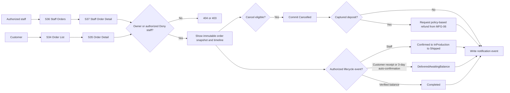
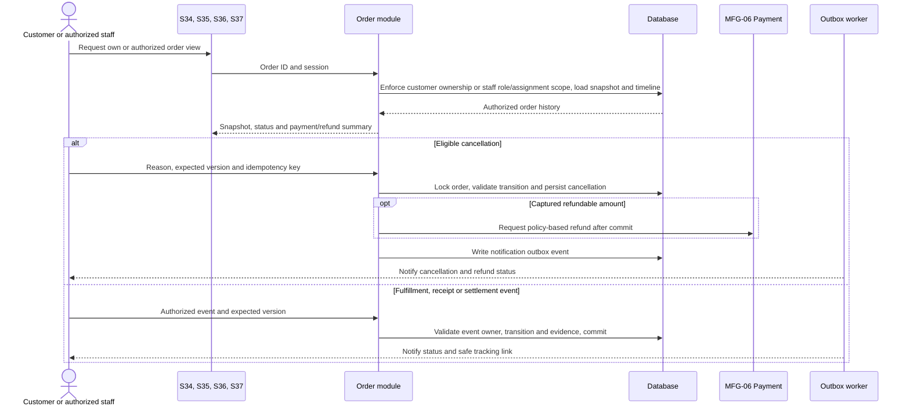

# Spec Document: Order Management

| Field | Value |
| --- | --- |
| Module ID | `MFG-07` |
| Module name | Order Management |
| Spec version | v2.1 |
| Author (team member) | Group B |
| Date | 2026-09-26 |
| Status | Final Group B demo specification; client operating approval not claimed |
| Approved by (Client role) | Group B (team approval, 2026-09-28); no client approver |
| DBIZ2 source | Function List MFG-07, `F-ORD-001`–`F-ORD-007`; use cases UC-C08 Track Order, UC-C07 Cancel Order, UC-S04 Update Status; screens S34, S35, S36, S37, S43, S13 |

---

## 1. Purpose and scope (mandatory)

Customers can view their made-to-order orders and follow every commitment from digital-design approval through sample, deposit, production, receipt and final settlement. Sales Admin performs Dony operational transitions; in the complete system, assigned Sales may perform the fulfillment transitions already permitted by this module. In the MVP, assigned Sales has read-only access to assigned-customer order progress. An owning Customer or Sales Admin can cancel only when the lifecycle permits. This module consumes design/sample, contract, payment, refund and batch events; it does not price orders, settle payments, or generate contracts.

MVP priority: **Must** (see [MVP scope](../mvp-scope-proposal.md)). The MVP includes order tracking (S34/S35), pre-deposit cancellation, Customer sample receipt/approval and delivery receipt, and manual Sales Admin transitions through InProduction and Shipped. Sales has read-only S36/S37 progress for current assigned-customer orders, with empty success when no orders are assigned; assignments are seeded (MFG-08 is Could) and Sales cannot start/dispatch samples, change fulfillment status or cancel. MFG-06 BR-019 applies in the MVP: cancellation only before a successful deposit, no in-system refund, no 3-day auto-confirmation timer (Sales Admin may confirm receipt on the Customer's behalf after verified delivery evidence) and no Overdue automation. Post-deposit cancellation with refund, the auto-confirmation timer and Overdue handling are MVP Could. Order creation/payment belongs to MFG-06; contract generation/signature to MFG-09; production batches to MFG-10. Always include the module prefix when referring to a function ID.

## 2. Actors (mandatory)

| Actor | Role in this module | Where it comes from |
| --- | --- | --- |
| Customer | Views own orders/details and cancels own eligible order | MFG-07 resolved contract; UC-C07/UC-C08 |
| Sales Admin | Views Dony orders, cancels with reason, advances fulfillment | MFG-07 resolved contract; UC-S04 |
| Sales | Reads assigned-customer order progress; existing assigned-customer fulfillment permissions apply outside the MVP. Cannot cancel. | MFG-07 resolved contract|
| System / MFG-06 / MFG-09 / MFG-10 | Supplies verified payment/refund, contract and batch events; not an interactive actor | Inter-module contracts |

## 3. User scenarios and acceptance criteria (mandatory)

### US-1: Track order status (Must)

As a Customer, I can list and inspect my own orders, status timeline, immutable price/address snapshot, payment/refund summary and shipment details. Dony staff views are restricted by internal role and active customer assignment.

1. **Given** the customer has no orders, **when** the list is loaded, **then** an empty paginated result is returned.
2. **Given** an order ID is not accessible to the actor, **when** its detail is requested, **then** the response is 404 and discloses no object data.
3. **Given** catalog prices or address data later change, **when** an old order is viewed, **then** the stored snapshot is shown without recalculation.

### US-2: Cancel order (Must; post-deposit cancellation is Could)

An owning Customer or Sales Admin can cancel in an allowed state. A Sales Admin supplies a reason. Sales employees cannot cancel. **MVP:** only criterion 1 applies; `Confirmed` orders return 409 and criteria 2–3 are post-MVP (MFG-06 BR-019).

1. **Given** an order is in a pre-deposit state from `AwaitingDigitalApproval` through `AwaitingDeposit`, **when** an authorized actor cancels it, **then** it becomes `Cancelled`; sample revision itself is not cancellation.
2. **Given** an order is `Confirmed`, **when** production has not started, **then** an authorized actor may cancel; any scheduled/locked assignment is released atomically and the affected plan requires revalidation.
3. **Given** a deposit was captured before cancellation commits, **then** the order remains `Cancelled` and MFG-06 requests a 100% refund of all accepted captured order payments to the original method, without a cancellation deduction, under MFG-06 BR-013; the order and made-to-order evidence are retained.
4. **Given** an order is `InProduction`, `Shipped`, `DeliveredAwaitingBalance` or `Completed`, **when** cancellation is attempted, **then** reject with 409. A recommendation reserves nothing; scheduled/locked membership alone is not InProduction and follows the preproduction cancellation rule.
5. **Given** cancellation races with production or batch assignment, **when** both mutations contend, **then** one commits and the other returns 409.

### US-3: Update order status (Must)

Sales Admin or, outside the MVP, the Dony Sales employee actively assigned to the Customer advances fulfilment through valid successive states. In the MVP, only Sales Admin performs these transitions.

1. **Given** a verified deposit and a `Confirmed` order, **when** authorized staff advance it, **then** only `Confirmed→InProduction→Shipped` is accepted as a staff fulfillment transition.
2. **Given** the target is Shipped, **when** carrier and tracking number are valid, **then** the server records shipped_at and makes the tracking information available.
3. **Given** delivery evidence is verified, **when** the Customer confirms receipt or the MFG-06 three-calendar-day auto-confirmation timer expires, **then** the order advances `Shipped→DeliveredAwaitingBalance`; recording staff evidence alone starts the timer and does not enable final payment. MVP has no dispute action or review flow. **MVP:** there is no timer; after recording verified delivery evidence, Sales Admin may confirm receipt on the Customer's behalf (MFG-06 BR-019).
4. **Given** MFG-06 verifies the full remaining balance, **when** settlement commits, **then** the order advances `DeliveredAwaitingBalance→Completed` and staff cannot perform this transition manually.
5. **Given** a status event commits, **when** notification delivery is delayed or fails, **then** committed status remains visible in the inbox and email is retryable.
6. Duplicate commands are idempotent; stale versions and skipped transitions return 409.

### Edge cases

- Invalid pagination/filter input returns 400; invalid cancellation fields return 422.
- Unauthorized object identifiers return 404; authenticated but prohibited actions return 403.
- Email failure never rolls back committed order or notification state.

## 4. Flows (mandatory)

### 4.1 Usage flow

```mermaid
flowchart LR
  Customer[Customer] --> History[S34 Order List]
  Staff[Authorized staff] --> Dashboard[S36 Staff Orders]
  History --> Detail[S35 Order Detail]
  Dashboard --> StaffDetail[S37 Staff Order Detail]
  StaffDetail --> Scope
  Detail --> Scope{Owner or authorized Dony staff?}
  Scope -->|No| Denied[404 or 403]
  Scope -->|Yes| Snapshot[Show immutable order snapshot and timeline]
  Snapshot --> Cancel{Cancel eligible?}
  Cancel -->|Yes| Cancelled[Commit Cancelled]
  Cancelled --> Refund{Captured deposit?}
  Refund -->|Yes| RequestRefund[Request policy-based refund from MFG-06]
  Refund -->|No| Notify[Write notification event]
  RequestRefund --> Notify
  Snapshot --> Advance{Authorized lifecycle event?}
  Advance -->|Staff| Next[Confirmed to InProduction to Shipped]
  Advance -->|Customer receipt or 3-day auto-confirmation| Received[DeliveredAwaitingBalance]
  Advance -->|Verified balance| Complete[Completed]
  Next --> Notify
  Received --> Notify
  Complete --> Notify
```

### 4.2 Sequence for the main flow

```mermaid
sequenceDiagram
    actor OrderActor as Customer or authorized staff
    participant OrderUI as S34, S35, S36, S37
    participant OrderModule as Order module
    participant Database as Database
    participant PaymentModule as MFG-06 Payment
    participant OutboxWorker as Outbox worker
    OrderActor->>OrderUI: Request own or authorized order view
    OrderUI->>OrderModule: Order ID and session
    OrderModule->>Database: Enforce customer ownership or staff role/assignment scope, load snapshot and timeline
    Database-->>OrderModule: Authorized order history
    OrderModule-->>OrderUI: Snapshot, status and payment/refund summary
    alt Eligible cancellation
        OrderActor->>OrderModule: Reason, expected version and idempotency key
        OrderModule->>Database: Lock order, validate transition and persist cancellation
        opt Captured refundable amount
            OrderModule->>PaymentModule: Request policy-based refund after commit
        end
        OrderModule->>Database: Write notification outbox event
        OutboxWorker-->>OrderActor: Notify cancellation and refund status
    else Fulfillment, receipt or settlement event
        OrderActor->>OrderModule: Authorized event and expected version
        OrderModule->>Database: Validate event owner, transition and evidence, commit
        OutboxWorker-->>OrderActor: Notify status and safe tracking link
    end
```

## 5. Functional requirements (mandatory)

FR identifiers are local to MFG-07. Access is server-checked: customers require ownership and staff require internal role or assignment authorization. Unauthenticated, prohibited and inaccessible requests return 401, 403 and 404 respectively. Mutations use UUIDs, UTC timestamps, expected-version checks and idempotency. Notifications use a transactional outbox, retry policy, and do not roll back committed state.

| FR ID | DBIZ2 Subfunction ID | Requirement (system MUST ...) | Actor | Priority |
| --- | --- | --- | --- | --- |
| FR-001 | F-ORD-001 | List own orders with pagination and allowlisted status/date filters; default newest first; empty results are valid. | Customer | Must |
| FR-002 | F-ORD-002 | Return an authorized order snapshot, timeline, contract/payment/refund summaries and tracking details without recalculating historical prices. | Customer / authorized Dony staff | Must |
| FR-003 | F-ORD-003 | Cancel eligible pre-production orders with trimmed 1–500 character reason, expected_version and Idempotency-Key; retain evidence and request a policy-based refund through MFG-06 for captured funds. MVP: pre-deposit states only, no refund (MFG-06 BR-019). | Owning Customer / Sales Admin | Must |
| FR-004 | F-ORD-004 | Notify customer and Dony Sales Admins after cancellation commit; deduplicate recipients/events and include refund status when relevant. | System | Must |
| FR-005 | F-ORD-005 | Provide the shared S36/S37 staff order views: Sales Admin has Dony-wide rows/counts; Sales has only current assigned-customer orders and their progress, with allowlisted status/date/customer filters and server-enforced assignment scope. | Sales Admin / assigned Sales (read-only in MVP) | Must |
| FR-006 | F-ORD-006 | Enforce lifecycle transitions: In the MVP, only Sales Admin may advance `Confirmed→InProduction→Shipped`; outside the MVP, retain the existing assigned-Sales fulfillment permission. `Shipped→DeliveredAwaitingBalance` requires Customer confirmation or the MFG-06 scheduled event after verified delivery proof plus 3 calendar days; only verified MFG-06 balance settlement or its authoritative zero-balance path advances to `Completed`. MVP replaces the timer with Sales Admin receipt confirmation on the Customer's behalf (MFG-06 BR-019). | Sales Admin / assigned Sales (outside MVP) / Customer / System | Must |
| FR-007 | F-ORD-007 | Notify order owner after committed status change with timestamp and safe tracking link; suppress duplicates and retry email. | System | Must |

### 5.1 Input / Output contract

| FR ID | Input field | Type | Required | Output field | Type | Notes / validation |
| --- | --- | --- | --- | --- | --- | --- |
| FR-001 | page, page_size, filters, sort | Integer / allowlisted values | Optional | order summaries including order_number, total, page, page_size | Paginated object | page ≥1; page_size 1–100; optional exact, case-insensitive `order_number` filter within the owner's orders (MFG-06 BR-017) |
| FR-002 | order_id, session | UUID / session | Yes | authorized order snapshot and timeline | Object | Own customer or authorized Dony staff; inaccessible ID 404 |
| FR-003 | order_id, reason_for_cancellation, expected_version, Idempotency-Key | UUID, string, integer, key | Yes | status, refund workflow reference | Object | Valid transitions only; duplicate key replays |
| FR-004 | committed cancellation event | Internal event | Yes | notification/outbox IDs | UUIDs | After commit; deduplicated |
| FR-005 | filters, page, page_size | Allowlisted values / integers | Optional | role-scoped order list and counts | Paginated object | Sales Admin: Dony-wide; Sales: current assigned customers only; scope also applies to counts and detail reads; optional exact, case-insensitive `order_number` filter never widens that scope |
| FR-006 | order_id, lifecycle_event, carrier, tracking_number, estimated_delivery_from?, estimated_delivery_to?, delivery_evidence?, expected_version, Idempotency-Key | UUID, enum, conditional strings/evidence, integer, key | By transition | updated order and timeline | Object | Carrier/tracking required only for Shipped; the estimated delivery range is optional, informational and validated under MFG-06 BR-018; staff-verified delivery evidence required for the auto-confirmation timer; Customer receipt confirmation may occur before that timer and records receipt immediately; payment event is server-authenticated; 3-day timer comes from MFG-06 BR-007 |
| FR-007 | committed status event | Internal event | Yes | durable notification/outbox IDs | UUIDs | After commit; inbox authoritative |

### 5.2 Business rules

| Rule ID | Rule | Why it exists |
| --- | --- | --- |
| BR-001 | Canonical progression is in MFG-06. Sample revision requires a new immutable design/quote approval cycle. Only eligible preproduction orders may be cancelled; assigned Confirmed orders release their MFG-10 schedule/lock atomically for plan revalidation. | Preserve approval, deposit, production, receipt and final-payment gates. |
| BR-002 | MFG-10 recommendations reserve nothing. Approved ScheduledOpen/Locked assignments are exclusive while orders remain Confirmed; cancellation releases assignment and invalidates the affected plan/lock for Admin revalidation. Only explicit Sales Admin shared-batch start advances all members atomically to InProduction. Standard orders may join an open sewing run without flexible consent or incentive; same garment type/material is required, while print/embroidery stays separate per order. At flexible waiting expiry, system notifies Sales Admin and requires approval; the order stays flexible/Confirmed until a human approves an individual plan and explicitly starts production. No automatic conversion/start or speculative individual slot reservation. | Human-controlled scheduling, auditable production and retained customer commitments. |
| BR-003 | Cancellation/refund amounts and timing follow MFG-06 BR-013; MFG-07 only records eligibility and requests the refund. No inventory restock occurs because Dony manufactures to order. | Made-to-order production and payment ownership. |
| BR-004 | Every access is checked server-side; customers require ownership and staff require an internal Dony role or active assignment. | Prevent cross-customer access and privilege escalation. |
| BR-005 | Staff cannot manually mark an order `Completed`; completion requires accepted BALANCE settlement or the authoritative zero-balance path in MFG-06; receipt must be recorded before balance becomes payable. | Prevent false delivery and revenue completion. |

### Analytics evidence integration (MFG-11)

MFG-11 consumes the append-only order timeline and committed cancellation/fulfilment events, never reconstructs stage history from current status alone. Preserve actor/source, occurrence time, source identity, version and evidence references needed to distinguish revision, explicit cancellation, production, shipment, receipt and completion. A later cancellation does not erase a previously reached milestone; current waiting state is a separate measure. Repeated commands/outbox deliveries count once. Supporting S47 order links recheck existing order permissions; analytics/AI cannot execute the state-change actions exposed here. Completion includes MFG-06's zero-balance exception, and shipment or delivery proof alone is not completion.

## 6. Key entities (mandatory)

| Entity | Attributes (from Input/Output fields) | Relationships |
| --- | --- | --- |
| Order | UUID, order_number (MFG-06 BR-017), customer_id, originating_journey_id? (MFG-11 validated attribution), buyer_type, buyer_organization_snapshot, design_id/version, quote_id, approved_sample_id?, policy_version, status, merge_opt_in, contract_id, batch_id?, immutable address/quantity/price snapshots, tracking_number?, carrier?, shipped_at?, estimated_delivery_from?, estimated_delivery_to? (MFG-06 BR-018), delivery_evidence_verified_at?, auto_confirm_at?, received_at?, completed_at?, version, timestamps | Belongs to its Customer and one required Business Buyer/Reseller Shop order snapshot; linked to quote, approved physical sample, contract and optional batch; emits payment/refund/status events. Buyer details are commercial data, never tenant authority. |
| Order timeline event | Event ID, Order ID, prior/target status, actor/source, bound entity version/sample cycle where applicable, timestamp, request/idempotency reference | Belongs to one order; append-only. |
| Notification/outbox event | Order ID, event type, recipients, delivery state | Created transactionally after order mutation. |

## 7. Screens involved

| Screen ID | Screen name | Priority | Screen Spec file |
| --- | --- | --- | --- |
| S34 | Customer order history | Must | `screens/S34-customer-orders.md` |
| S35 | Customer order detail and refund status | Must | `screens/S35-customer-order-detail.md` |
| S36 | Shared Sales / Sales Admin order dashboard | Must | Module screen; Dony order list and filters |
| S37 | Production management | Must | Module screen; status progression |
| S43 | Contract tab | Could | MFG-09 contract boundary |
| S13 | Notifications | Must | Shared notification screen |

## 8. Success criteria (mandatory)

| SC ID | Criterion | How it is measured |
| --- | --- | --- |
| SC-001 | Every order read is limited to the actor's customer ownership or staff role/assignment scope and returns the stored snapshot. | Verify authorized and unauthorized customer/staff requests; inaccessible IDs return 404. |
| SC-002 | Only valid cancellation and fulfillment transitions commit, including under concurrent requests. | Exercise state-transition matrix and race tests; one winner, stale loser 409. |
| SC-003 | Notifications and refund requests are durable and deduplicated after order commit. | Inspect outbox/inbox and refund event for retries and duplicate commands. |

## 9. Assumptions

- Orders are made to order; cancellation does not restock inventory.
- MFG-06 is authoritative for settlement/refunds, and MFG-10 is authoritative for batch membership.
- Delivery proof/timer and refund policy are authoritative in MFG-06 BR-007/BR-013; this module must not restate different amounts or deadlines.
- The module is MVP Must with the MFG-06 BR-019 simplifications. Manual Sales Admin updates are the defined MVP behavior, not an optional fallback.

## 10. Open questions

| # | Question | Blocking? | Owner | Status |
| --- | --- | --- | --- | --- |
| 1 | Resolved decisions: Group B author; course DBIZ 3; approved by Group B; no client approver; demo/course use only; MVP priority Must (with MFG-06 BR-019 simplifications). | No | Group B | Resolved |
| 2 | No remaining open questions. | No | Group B | Resolved |

## 11. Traceability to DBIZ2

| Spec section | DBIZ2 source | Location |
| --- | --- | --- |
| 1–2 Scope and actors | Function List MFG-07 | Function entries; source identifiers retained in each FR |
| 3 Scenarios | UC-C08, UC-C07, UC-S04 | Use-case identifiers; resolved behavior in this specification |
| 4 Flow | Order lifecycle and MFG-06/MFG-10 events | Current module contracts described inline above |
| 5–6 FRs and entities | F-ORD-001..007 | Function List MFG-07; qualify cross-module function references with their module. |
| 7 Screens | S34, S35, S36, S37, S43, S13 | Screen list and current MFG-07 contract |

## Completion checklist

- [x] All seven MFG-07 functions are represented by FR rows and contracts.
- [x] Resolved access, cancellation, refund, batch, status and notification rules are recorded.
- [x] MVP priority and answered administrative inputs are reflected.
- [x] No unresolved placeholders remain.
- [x] Traceability identifies source module and local ID namespace.

Template source: DBIZ3 Product Design Package specification template.

DBIZ3, FTU.

### Shared staff status visibility

Use S36/S37 for both Sales Admin and assigned Sales. Assigned Sales can read the status and timeline of their current assigned-customer orders, including sample/design, contract, deposit/balance, production/shipping and receipt progress. In the MVP, Sales is read-only; only Sales Admin may start/dispatch samples or advance `Confirmed→InProduction→Shipped`. Outside the MVP, retain the existing assigned-Sales fulfillment permission. Filter counts and all deep links enforce the same assignment at read time; reassignment immediately removes prior access. Read visibility adds no cancellation, contract administration, payment settlement, proof-verification or production-plan approval authority. This does not introduce an assignment-queue dependency into the standard MVP path.
