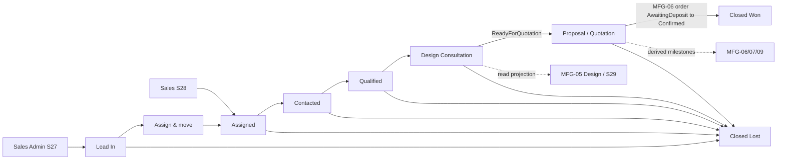
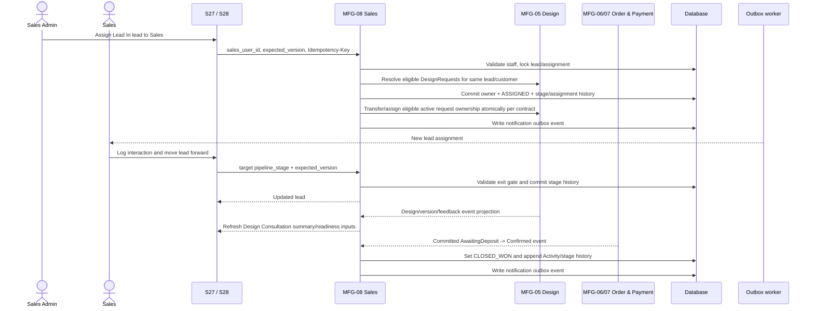

# Spec Document: Sales

| Field | Value |
| --- | --- |
| Module ID | `MFG-08` |
| Module name | Sales |
| Spec version | v1.3 |
| Author (team member) | Group B |
| Date | 2026-09-27 |
| Status | Final Group B demo specification; client operating approval not claimed |
| Approved by (Client role) | Group B (team approval, 2026-09-28); no client approver |
| DBIZ2 source | Function List MFG-08, `F-SALES-001`–`F-SALES-008`; UC-S01, UC-S02, UC-C19; active screens S27, S28 and S13. S29 is an MFG-05 Design Workspace linked from the pipeline. |

---

## 1. Purpose and scope (mandatory)

MFG-08 owns Dony's **Sales Pipeline and CRM orchestration**. A lead is represented by one open Consultation record for a Customer/prospective customer and moves through one canonical pipeline shared by B2B Business Buyers and B2B2C Reseller Shops. Sales Admins see the Dony-wide pipeline, assign/reassign Sales owners, manage Admin Reviews and the Sales-side Design Consultation checkpoint; Sales sees only leads currently assigned to them and advances those leads when the server-side gates are met.

Canonical pipeline:

`Lead In → Assigned → Contacted → Qualified → Design Consultation → Proposal / Quotation → Closed Won / Closed Lost`

There is **no Negotiation stage**. The Design Consultation stage uses one canonical value but a different UI label/validation profile by customer model: B2B uses **Design & Spec Alignment**; B2B2C uses **Design & Spec Alignment**.

MFG-08 owns `pipeline_stage`, assignment, lead/customer-model fields, design source/readiness/checklist, lead–design commercial scope (`InScope` / `Dropped`), Activity, logged external interactions, Internal Notes, Admin Reviews, stage history and loss reasons. It does **not** own DesignRequest/Design/DesignVersion lifecycle data, orders, contracts or payments. MFG-05 remains source of truth for design data and projects important design events/state into S27/S28; MFG-06/MFG-07/MFG-09 remain source of truth for order/payment/contract milestones. S29 is the MFG-05 staff Design Workspace and is not an MFG-08 write surface for CRM data.

MVP priority: **Could** (see [MVP scope](../mvp-scope-proposal.md)). Complete-system target includes all eight DBIZ2 functions. Until MFG-08 is released, the MVP seeds one `CustomerAssignment` linking the demo Customer to the demo Sales employee; that seeded assignment alone scopes Sales read-only access on S36/S37, and no assignment UI or S27/S28 screen is built. Always include the `MFG-08/` prefix when referring to a function ID.

## 2. Actors (mandatory)

| Actor | Role in this module | Where it comes from |
| --- | --- | --- |
| Sales Admin | Sees the Dony-wide pipeline; assigns/reassigns Sales; may reopen closed leads, decide Admin Reviews and perform the MFG-05 DesignRequest administrative assessment exposed in S27 | MFG-08 permissions; UC-C19; S27 |
| Sales | Sees only currently assigned leads; advances them through allowed stages, records external interactions/notes, manages Sales-side design readiness/scope and requests Admin Reviews | MFG-08 permissions; UC-S01/UC-S02; S28 |
| Customer | Does not access MFG-08 CRM data; customer-facing design/order actions stay in their owning modules | MFG-05/MFG-06 boundary |
| System | Persists stage/assignment events, consumes authorized lifecycle events from other modules, derives milestones and sends notifications | MFG-08 function contract |

## 3. User scenarios and acceptance criteria (mandatory)

### US-1: Assign or reassign Sales (Could)

As a Sales Admin, assign an eligible **Lead In** lead to an active Dony Sales employee, or reassign an open owned lead, while keeping CRM ownership and eligible active DesignRequest ownership consistent.

1. **Given** a Lead In lead and an active Sales employee, **when** Admin confirms **Assign & move**, **then** owner and `pipeline_stage = ASSIGNED` commit in one transaction and the new Sales is notified once.
2. **Given** Approved design requests for that lead/customer that are waiting for an owner, **when** assignment commits, **then** they are assigned to the same Sales according to the MFG-05 eligibility rule; no DesignRequest fields are entered in the assign popup.
3. **Given** an open lead is reassigned, **when** commit succeeds, **then** `pipeline_stage` does not change and affected active Assigned/InProgress DesignRequests transfer atomically while keeping their existing `committed_due_at`.
4. **Given** inactive staff, prohibited access, stale versions or duplicate assignment, **when** submitted, **then** the operation is rejected with no partial assignment/stage change.

### US-2: Work the Sales Pipeline (Could)

As an assigned Sales employee, view only my own leads and advance them through the canonical pipeline when each exit gate is met. Sales Admin sees the same records company-wide.

1. **Given** an Assigned lead, **when** there is no logged post-assignment customer interaction, **then** moving to Contacted is rejected.
2. **Given** a Contacted lead, **when** requirement/product/quantity/requested-deadline fields are incomplete, **then** moving to Qualified is rejected.
3. **Given** a Qualified lead, **when** allowed `design_source` is not set, **then** moving to Design Consultation is rejected.
4. **Given** a lead in Design Consultation, **when** `design_readiness != ReadyForQuotation`, **then** moving to Proposal / Quotation is rejected.
5. **Given** a linked order changes `AwaitingDeposit → Confirmed`, **when** MFG-08 consumes that committed event, **then** the lead moves to Closed Won automatically; manual Closed Won is rejected.

### US-3: Sales context, interactions, notes and Admin Reviews (Could)

As an assigned Sales employee or Sales Admin, inspect authorized lead context and maintain an auditable staff timeline without building real-time customer chat.

1. **Given** an external phone/email/Zalo/Messenger/meeting happened, **when** Sales uses Log interaction, **then** an append-only interaction with type/channel/time/summary is recorded and appears in Activity.
2. **Given** durable internal knowledge is needed, **when** a staff user adds an Internal Note, **then** full text stays in Internal Notes and Activity records only the event; up to three notes may be pinned.
3. **Given** Sales needs an Admin decision, **when** they create an Admin Review, **then** it is Pending until Sales Admin Approves/Rejects it; the decision record itself does not silently change quote/order/pricing data.
4. **Given** a design event occurs in MFG-05, **when** S27/S28 are read, **then** they show the authoritative projection/summary without copying DesignVersion state into MFG-08.

### Edge cases

- Inaccessible object IDs return 404; authenticated but prohibited actions return 403.
- Pipeline/assignment/review/note/interaction writes use expected-version checks and idempotency where specified by the screen contract; stale state returns 409.
- External conversations are recorded as summaries only. MFG-08 provides no customer-facing realtime chat or external inbox.
- A lead may link several MFG-05 designs. Each lead–design link has commercial scope `InScope` or `Dropped`; Dropped designs retain history but do not block the quotation-readiness gate.
- If all linked designs are Dropped, `ReadyForQuotation` is rejected.

## 4. Flows (mandatory)

### 4.1 Usage flow

### 4.2 Sequence for the main flow

## 5. Functional requirements (mandatory)

| FR ID | DBIZ2 Subfunction ID | Requirement (system MUST ...) | Actor | Priority |
| --- | --- | --- | --- | --- |
| FR-001 | F-SALES-001 | Provide the Sales Admin pipeline including Lead In, pagination/board loading and allowlisted filters; Lead In identifies leads without an active Sales owner. | Sales Admin | Could |
| FR-002 | F-SALES-002 | Return authorized lead/customer context, current owner, pipeline stage, linked order/design summaries and the Design Consultation projection without copying authoritative MFG-05 design state. | Sales Admin | Could |
| FR-003 | F-SALES-003 | Assign/reassign an active Dony Sales employee with version checks/idempotency; assignment sets Lead In→Assigned, and reassignment preserves `pipeline_stage`; eligible/active MFG-05 DesignRequest ownership follows the lead owner according to the linked MFG-05 rule. | Sales Admin | Could |
| FR-004 | F-SALES-004 | Notify newly assigned/reassigned staff after commit; notify affected recipients for committed Admin Review/stage events as specified; deduplicate and retry delivery. | System | Could |
| FR-005 | F-SALES-005 | Provide My Sales Pipeline containing only the current Sales' actively assigned leads with allowlisted filters and the canonical stage model, excluding Lead In. | Sales / Sales Admin | Could |
| FR-006 | F-SALES-006 | Return authorized lead context and chronological Activity, including system events and manual interactions, without exposing unassigned leads or staff-only data to customers. | Assigned Sales / Sales Admin | Could |
| FR-007 | F-SALES-007 | Show canonical `pipeline_stage`, Design Consultation summary/readiness, Internal Notes, Admin Reviews and linked-record summaries to authorized staff; MFG-05 design projection remains read-only. | Assigned Sales / Sales Admin | Could |
| FR-008 | F-SALES-008 | Apply valid pipeline moves/gates, Closed Lost, Admin-only reopen, external interaction logging, Internal Notes, lead–design scope changes and Admin Review lifecycle with version checks/audit/idempotency as specified by S27/S28. | Assigned Sales / Sales Admin | Could |

### 5.1 Input / Output contract

| FR ID | Input field | Type | Required | Output field | Type | Notes / validation |
| --- | --- | --- | --- | --- | --- | --- |
| FR-001 | model, view, page/page_size or board cursor, q, owner/stage/label/source/product/design-readiness/requested-deadline filters | Allowlisted values / integers | Optional | Dony pipeline leads and per-stage counts | Board/paginated object | Admin only; invalid filters 400/422; Lead In included. |
| FR-002 | consultation_id | UUID | Yes | lead identity/contact, owner, customer_model, requirements, linked summaries, design projection, milestone | Object | Authorized Dony lead; MFG-05 detail remains authoritative. |
| FR-003 | consultation_id, sales_user_id, expected_version, Idempotency-Key | UUIDs/version/key | Yes | assignment, updated lead/stage history, affected request-owner results | Object | Active Sales only; no `committed_due_at` in the lead assign popup. Stale 409. |
| FR-004 | committed assignment/reassignment/review/stage event | Internal event | Yes | durable notification/outbox IDs | UUID(s) | In-app inbox authoritative; deduplicated. |
| FR-005 | model, page/page_size or board cursor, q, stage/label/source/product/design-readiness/requested-deadline filters | Allowlisted values / integers | Optional | current Sales' lead summaries and per-stage counts | Board/paginated object | Own active assignments only; Lead In excluded. |
| FR-006 | consultation_id, activity filter/page | UUID / allowlisted values | Yes/Optional | authorized lead context and Activity | Object/chronological array | Current owner or Sales Admin; customer APIs never receive staff-only interactions/notes/reviews. |
| FR-007 | consultation_id | UUID | Yes | pipeline stage/path, Design Consultation summary, Notes/Reviews/link summaries | Object | Current owner or Sales Admin; DesignVersion state is projected, not copied. |
| FR-008 | action-specific payload: target_stage/lost reason; interaction type/channel/occurred_at/summary; note/pin; design_id scope; Admin Review request/decision; expected_version and Idempotency-Key where applicable | Structured values | Per action | updated lead/timeline/review/note/scope | Object | Enforce S27/S28 role and transition gates; 403/404/409/422 as specified. |

### 5.2 Business rules

| Rule ID | Rule | Why it exists |
| --- | --- | --- |
| BR-001 | One active Sales assignment exists per Customer/open lead; assignment history is retained. Lead In is Sales-Admin-only and has no owner. Unclassified leads remain there in an Admin-only triage view until explicitly classified; no guessed B2B/B2B2C assignment is allowed. | Preserve accountable ownership. |
| BR-002 | Approved DesignRequest ownership follows the current lead owner automatically when eligible, even while committed_due_at is null; only Sales Admin sets/changes that commitment; reassignment transfers active Assigned/InProgress requests atomically without changing their state or `committed_due_at`. | Keep CRM ownership and design-service accountability consistent without creating a second owner selector. |
| BR-003 | Activity, external interactions, Internal Notes and Admin Reviews are staff-only. A Sales sees only their current leads; Sales Admin sees Dony-wide. Customers never receive internal CRM data. | Protect internal CRM records. |
| BR-004 | Manual interaction logs, Internal Notes and Admin Review records are append-only/audited. External conversations are summaries only and never send a message. | Preserve audit history without building chat. |
| BR-005 | `pipeline_stage` is the only Sales stage field; every pipeline column, gate and stage-history entry uses it. | One canonical stage field keeps columns, gates and history unambiguous. |
| BR-006 | Forward moves from Assigned through Proposal / Quotation require the exit gate of every passed stage. Backward moves are outside this version, including Sales Admin; guarded reopening of a closed lead remains a separate action. | Keep stage history/gates deterministic. |
| BR-007 | Design Consultation has one canonical stage. B2B and B2B2C differ only in UI label, allowed design source and checklist. `ReadyForQuotation` requires at least one `InScope` design and every `InScope` design to satisfy the authoritative MFG-05/S30 orderable-design rule plus the CRM checklist/technical-adjustment gate; Dropped designs are ignored. | Keep the CRM gate useful without duplicating MFG-05 design state. |
| BR-008 | `design_scope` (`InScope`/`Dropped`) belongs to the MFG-08 lead–design link. Dropping a design never deletes/unlinks its MFG-05 history. | Commercial scope is lead-specific, not a design lifecycle state. |
| BR-009 | Closed Won is system-only when a linked order commits `AwaitingDeposit → Confirmed`. Contract signing is a derived Proposal milestone. A later cancellation/refund does not rewrite the historical Sales outcome; order outcome remains in MFG-06/MFG-07. | Avoid false wins before financial commitment and keep sales/order outcomes separate. |
| BR-010 | Closed Lost requires a structured reason; it is blocked while a linked active order is not cancelled. Sales Admin alone may reopen a closed lead to an eligible open stage. | Preserve controlled closure/reopen history. |
| BR-011 | Admin Reviews use Pending→Approved/Rejected decision records. An approval records the decision only and does not by itself override price, MOQ, quote or order state and no commercial override is supported in this version. | Avoid hidden cross-module side effects. |

### 5.3 Canonical pipeline gates

| Stage | Exit gate |
| --- | --- |
| Lead In | Sales Admin assigns an eligible active Sales through S27 Assign & move. |
| Assigned | At least one logged customer interaction after assignment. |
| Contacted | `requirement_summary`, product interest, positive estimated quantity and requested deadline are present and the need is an eligible made-to-order garment job. |
| Qualified | Allowed `design_source` is set; B2B2C is fixed to CustomerProvided. |
| Design Consultation | `design_readiness = ReadyForQuotation`; MFG-08 validates the readiness rule against authoritative MFG-05 design eligibility plus CRM scope/checklist flags. |
| Proposal / Quotation | No manual Won gate; system waits for the linked order `AwaitingDeposit → Confirmed` event. |
| Closed Won / Closed Lost | Closed states; Admin-only reopen per S27. |

### 5.4 Interaction, note and review model

- **Log interaction** fields: type `General` or `DesignDiscussion`; channel `Phone`, `Email`, `Zalo`, `Messenger`, `Meeting`, `Other`; `occurred_at` not in the future; summary 1–5000 characters; optional `design_version_id` reference for a design discussion. Entries are append-only and staff-only.
- **Internal Note**: 1–5000 characters, append-only, up to three pinned per lead. It is internal knowledge, not a customer-interaction log and not the Admin decision channel.
- **Admin Review**: Pending→Approved/Rejected; request type is Committed due date change or Other (internal decision); decision note is required when rejecting. Approval cannot override MOQ, price or production deadlines; a design commitment change uses the separate authorized MFG-05 action.

### Analytics evidence integration (MFG-11)

Sales outcome and order outcome remain separate. Consultation `ClosedWon`/`ClosedLost`, DesignRequest outcomes and order lifecycle statuses must not be substituted for one another. MFG-11 must not infer causal loss reasons from free-form CRM notes. Existing Sales assignment permissions do not grant access to S47. If a future approved metric attributes historical work to Sales, it uses assignment evidence at the event time rather than today's assignment.

## 6. Key entities (mandatory)

| Entity | Attributes | Relationships |
| --- | --- | --- |
| CustomerAssignment | customer_id, sales_user_id, assigned_by, assigned_at, version, history | One active assignment per customer/open lead; current Sales owner for S28 authorization. |
| Consultation (Lead) | consultation_id, customer_id, `pipeline_stage`, `customer_model`, owner, contact/requirement fields, design_source, technical_adjustment_required, design_readiness, design_checklist, proposal_milestone, lost_reason/note, stage_entered_at, version, timestamps | One open lead per customer; links MFG-05 designs/requests and MFG-06/07 orders by references only. |
| LeadDesignLink | consultation_id, design_id, `design_scope` (`InScope`/`Dropped`), version/timestamps | MFG-08 commercial-scope relationship to an authoritative MFG-05 Design. |
| StageHistory | consultation_id, from_stage, to_stage, actor/system source, occurred_at, reason/reference | Append-only pipeline history. |
| InteractionLog | interaction_id, consultation_id, type, channel, occurred_at, summary, author, design_version_id? | Staff-only external customer-contact summary; optional reference to MFG-05 version. |
| InternalNote | note_id, consultation_id, text, author, pinned, created_at | Staff-only durable lead knowledge; append-only; max three pinned. |
| AdminReview | review_id, consultation_id, type, requested_value, reason, status, requester, requested_at, decider?, decided_at?, decision_note? | Structured Sales→Sales Admin decision record. |

## 7. Screens involved

| Screen ID | Screen name | Relationship to MFG-08 | Screen Spec file |
| --- | --- | --- | --- |
| S27 | Sales Pipeline (Sales Admin) | Canonical Admin pipeline, assignment, CRM and Admin Review surface | `screens/S27-admin-sales-pipeline.md` |
| S28 | My Sales Pipeline (Sales) | Same pipeline records scoped to current Sales ownership | `screens/S28-sales-pipeline.md` |
| S29 | Design Workspace | MFG-05 integration surface opened from a lead/design; MFG-08 interactions are read-only there | `screens/S29-staff-design-workspace.md` |
| S13 | Notification Panel | Shared persisted notification inbox/deep links | `screens/S13-notifications.md` |

## 8. Success criteria (mandatory)

| SC ID | Criterion | How it is measured |
| --- | --- | --- |
| SC-001 | Assignment/reassignment updates ownership without partial CRM/design-request ownership state. | Verify commit/rollback, stale versions and S27↔S28 visibility. |
| SC-002 | Sales sees only currently assigned leads; Sales Admin sees Dony-wide pipeline; customers receive no staff CRM data. | Verify own/other/unassigned/Customer access and safe 404/403 behavior. |
| SC-003 | Pipeline columns, gates and stage history use canonical `pipeline_stage`. | Verify each gate, skip validation, Closed Lost and system-only Closed Won. |
| SC-004 | Design Consultation uses authoritative MFG-05 design projection without copying DesignVersion state into MFG-08. | Change version/feedback in MFG-05 and verify S27/S28 projection/readiness checks update. |
| SC-005 | Interaction, note and Admin Review histories are auditable and duplicate/stale writes do not lose data. | Verify append-only behavior, idempotency and 409 conflict handling. |

## 9. Assumptions

- Staff role and authorization are resolved server-side; optional buyer-organization context is not an authorization tenant.
- Manual interaction summaries do not send messages or imply live chat integration.
- MFG-05 remains authoritative for DesignRequest/Design/DesignVersion and customer feedback/approval; this specification does not redefine those lifecycles.
- MFG-06/MFG-07/MFG-09 remain authoritative for order/payment/contract states; MFG-08 consumes committed events/milestones without changing their business logic.
- MVP priority is Could; the full module remains in the complete-system specification.

## 10. Open questions

The user resolved the consolidated Sales-domain questions as follows.

| # | Question | Blocking? | Status |
| --- | --- | --- | --- |
| 1 | No first-contact SLA/timer; assignment and interaction history only. | No | Resolved |
| 2 | Unknown-model leads use Unclassified; Admin classifies before assignment or assessment. | No | Resolved |
| 3 | Customer-only request creation at S24 and fee acceptance at S26; staff guide or import artwork. | No | Resolved |
| 4 | No commercial overrides. Committed due date change / Other are internal review types; a due-date change requires a separate authorized action. | No | Resolved |
| 5 | Reassign only; no Unassign, backward moves, Archive or deletion. Closed records remain readable/filterable; guarded Admin reopening remains. | No | Resolved |
| 6 | Verified Customer email plus explicit audited Sales Admin confirmation; never automatic name/phone matching. | No | Resolved |

## 11. Traceability to DBIZ2

| Spec section | DBIZ2 source | Location |
| --- | --- | --- |
| 1–2 Scope and actors | MFG-08 Function List MFG-08 | `F-SALES-001`–`F-SALES-008`; module-qualified namespace |
| 3 Scenarios | UC-S01, UC-S02, UC-C19 | Updated Sales Pipeline presentation while retaining the eight DBIZ2 function slots |
| 4 Flow | Assignment and consultation lifecycle | S27/S28 canonical pipeline; linked MFG-05/MFG-06 events |
| 5–6 FRs and entities | `F-SALES-001`–`F-SALES-008` | Function List MFG-08; always use the module-qualified ID |
| 7 Screens | S27, S28, S29, S13 | S27/S28 active CRM including design-service assessment; S29 MFG-05 integration |

## Completion checklist

- [x] All eight MFG-08 functions have FR rows and contracts.
- [x] Canonical pipeline, gates, assignment, privacy, interaction history, Internal Notes, Admin Reviews and design-scope boundary are included.
- [x] MFG-qualified function identity is used for cross-module references.
- [x] Closed Won consumes existing deposit-confirmed order state without changing MFG-06 logic.
- [x] DesignVersion state remains authoritative in MFG-05 and is projected, not copied.
- [x] Blocking classification/version integration is resolved; optional actions in section 10 remain disabled.

Template source: DBIZ3 Product Design Package specification template.

DBIZ3, FTU.

## 12. Confirmed integration contract

customer_model is B2B, B2B2C or Unclassified. Unknown sign-up/request leads use Unclassified in Sales-Admin-only triage, with pipeline_stage=LEAD_IN and no owner; they are excluded from B2B/B2B2C counts and S28. Only Admin can classify with expected_version, Idempotency-Key and an Activity event. Classify before assignment or assessment; known order buyer_type is evidence, never permission to silently overwrite contradictory classification. Manual prospective leads require verified Customer email and explicit audited Sales Admin matching before linking; no automatic name/phone matching; staff design creation requires a linked registered Customer.

MFG-05 section 5.4 owns DesignVersion, import confirmation, customer approval, revision and staff-reply records. S25 is the gallery; S26 is request status/fee and customer collaboration. Version/feedback events are projected, not copied, into S27/S28. Eligible Approved requests automatically follow the current owner without waiting for committed_due_at. Missing commitments are visible to Admin and never treated as overdue. This change retains the first-order fee allocation and unlimited no-separate-fee sample-revision policy of MFG-06.

The canonical stage enum is LEAD_IN, ASSIGNED, CONTACTED, QUALIFIED, DESIGN_CONSULTATION, PROPOSAL_QUOTATION, CLOSED_WON, CLOSED_LOST as defined by S27. Unclassified is not a stage. Assignment and affected request ownership changes commit or roll back together. Closed Won consumes the committed deposit-confirmed event idempotently; a later refund remains an order outcome and does not erase the historical sales outcome. The out-of-scope actions listed in section 10 remain disabled; verified-email/manual-confirmation linkage is now resolved.

### Final CRM/design authorization decisions

Verified email and explicit audited Sales Admin confirmation are required to link a prospective lead to a Customer; conflicting links or duplicate open leads are rejected. Name/phone never trigger automatic matching. Unlinked leads remain internal CRM only and cannot create/share Customer-owned designs. Customer alone creates requests at S24 and accepts the current assessed fee/version at S26; staff can guide or import supplied artwork, without acting as requester/fee acceptor. Admin Review cannot override commercial terms or production deadlines. Committed due date change and Other are internal review types; an approved date change still requires the separate Sales Admin operation. No first-contact SLA, Unassign, backward moves, Archive or lead deletion is included; existing reassign and guarded reopen remain.
