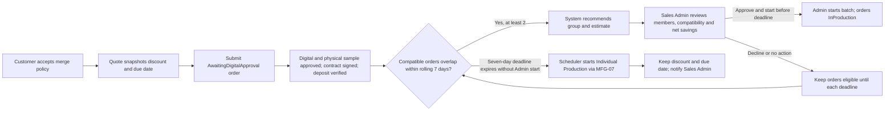
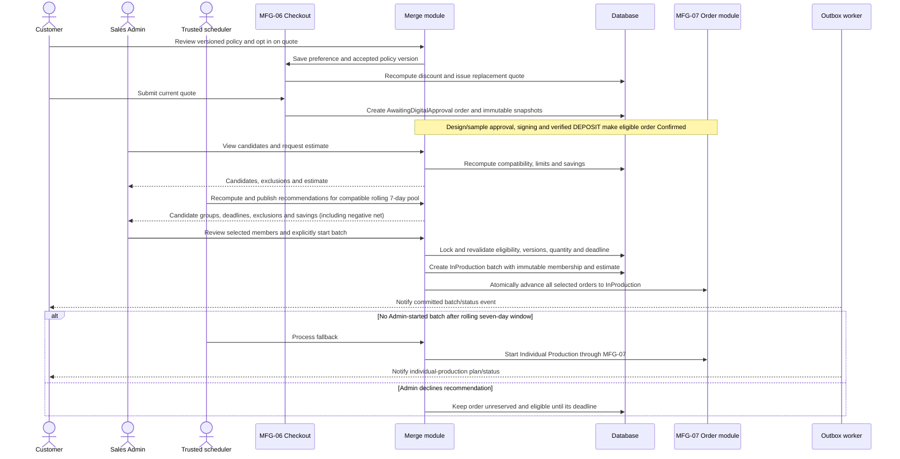

# Spec Document: Order Optimization (Merge)

| Field | Value |
| --- | --- |
| Module ID | `MFG-10` |
| Module name | Order Optimization (Merge) |
| Spec version | v3.1 |
| Author (team member) | Group B |
| Date | 2026-09-26 |
| Status | Draft |
| Approved by (Client role) | No approver identified |
| DBIZ2 source | Function List MFG-10, No. 77–83, `F-MER-001`–`F-MER-007`; UC-C06, UC-C17, UC-C18, UC-C16; screens S23–S25, S29, S38, S42 |

---

## 1. Purpose and scope (mandatory)

Customers commissioning made-to-order garments from Dony may opt into merge production and accept a versioned policy. This applies both to companies ordering employee uniforms and Reseller Shops commissioning garments from their own designs for resale; Dony does not sell ready-made wholesale stock. The system continuously identifies and recommends compatible candidate groups. A Sales Admin reviews the candidates, sees the savings estimate (including negative values), makes the final decision and explicitly starts each batch. A trusted scheduler maintains recommendations and automatically starts individual-production fallback when an order's seven-day merge window expires without an Admin-started batch. The module manages recommendations, batches and auditable events; MFG-06 owns quotes, orders and payment/refund snapshots, and MFG-07 owns fulfillment states.

MVP priority: **Could**. This specification is the canonical source for MFG-10 policy numbers and formulas; other specs, screens and checklists must reference its active version rather than redefine the policy. Opt-in terms apply even if no batch forms. Per opted-in order, discount is 840,000 VND (30% of the 2,800,000 VND setup-cost assumption), capped at order subtotal. Each additional order in a batch saves an assumed 2,800,000 VND setup cost and 120 setup minutes. Standard production is due seven calendar days after deposit; merged production is due ten calendar days after deposit. These are production-completion commitments, not carrier delivery promises. No batch is created at checkout or automatically by the scheduler.

## 2. Actors (mandatory)

| Actor | Role in this module | Where it comes from |
| --- | --- | --- |
| Customer | Views merge option/terms and opts in or out on a quote | MFG-10 resolved contract; UC-C06 |
| Sales Admin | Reviews system-recommended compatible groups and the business-value estimate, then explicitly starts or declines each proposed batch | MFG-10 resolved contract; UC-C17/UC-C18 |
| System / scheduler | Evaluates rolling seven-day windows, refreshes compatible-order recommendations, automatically starts individual fallback at expiry, and emits durable status events | MFG-10 module contract |
| MFG-06 / MFG-07 | Owns quote/order/payment and order fulfillment state | Module boundaries |

## 3. User scenarios and acceptance criteria (mandatory)

### US-1: Choose merge option (Could)

Customer sees standard and merge price/deadline, accepts the current policy version and saves the preference. A preference change supersedes the prior quote and issues a fresh immutable quote for 30 minutes.

1. **Given** the customer opts in, **when** the quote is issued, **then** the discount (up to 840,000 VND, capped at subtotal) and ten-day-after-deposit production commitment appear consistently on S23/S25.
2. **Given** the quote is submitted, **when** the order is created, **then** preference and policy version are snapshotted and no batch is assigned.
3. **Given** the customer changes preference, **when** it is saved, **then** a new quote ID and refreshed breakdown are issued; the prior quote is not mutated.

### US-2: View eligible orders and estimate (Could)

Sales Admin sees Dony candidates and exclusion reasons. The estimate shows gross setup savings, customer discount, estimated net savings, saved setup minutes, total quantity and production due date.

1. **Given** candidates differ by Dony production compatibility key, are not Confirmed after a verified deposit, are not opted in, are batched/cancelled/fallback-marked, or have non-overlapping seven-day windows, **when** eligibility is recomputed, **then** they are excluded.
2. **Given** a compatible group exists, **when** the recommendation service evaluates the pool, **then** it shows the proposed group, eligibility, deadline and savings estimate to Sales Admin without creating or starting a batch.
3. **Given** no Sales Admin starts a batch by an order's seven-day window end, **when** the scheduler runs fallback, **then** it starts Individual Production through MFG-07 and alerts Sales Admin if the start fails.
4. **Given** estimate net savings are negative, **when** estimate is shown, **then** the negative value remains clearly visible as a business measurement; it does not block or require a separate acknowledgement to start the batch.

### US-3: Confirm and operate batch (Could)

At least two eligible orders with overlapping seven-day windows and matching production keys are presented as a system recommendation. Only Sales Admin can make the final decision and explicitly start the selected batch. Starting revalidates all selected orders and atomically creates an InProduction batch and advances its orders through MFG-07; the system never auto-starts a batch. If no Admin-started batch includes an order before that order's seven-day window expires, the scheduler automatically starts its individual production through MFG-07. A recommendation is not a reservation and does not prevent cancellation before batch start.

1. **Given** the system recommends a valid compatible group, **when** a Sales Admin reviews its members and estimate, **then** a recommendation is shown without reserving orders or changing their state.
2. **Given** an authorized Sales Admin explicitly starts the selected group before its members' window expires, **when** server-side eligibility and versions are revalidated, **then** one InProduction batch is committed atomically and every member order advances to InProduction.
3. **Given** no Sales Admin starts a batch for an order by its rolling seven-day window end, **when** fallback runs, **then** the scheduler starts Individual Production through MFG-07 and the order retains its discounted price and promised due date.
4. **Given** concurrent cancellation, Admin batch start, fallback or state changes, **when** mutations contend, **then** one wins and no partial batch membership is committed.

### Edge cases

- Minimum batch is two orders; aggregate quantity cannot exceed 10,000.
- Negative net savings are displayed transparently and do not block operation.
- Production completion does not mark individual orders shipped or delivered.

## 4. Flows (mandatory)

### 4.1 Usage flow

### 4.2 Sequence for the main flow

## 5. Functional requirements (mandatory)

| FR ID | DBIZ2 Subfunction ID | Requirement (system MUST ...) | Actor | Priority |
| --- | --- | --- | --- | --- |
| FR-001 | F-MER-001 | Show standard versus merge price/deadline and eligibility summary for saved eligible designs; do not create a batch. | Customer | Could |
| FR-002 | F-MER-002 | Display versioned merge policy text and record accepted policy version. | Customer | Could |
| FR-003 | F-MER-003 | Save preference on owned quote, compute the versioned capped discount server-side and issue a new immutable 30-minute quote. | Customer | Could |
| FR-004 | F-MER-004 | Recommend compatible Dony order groups and show exclusion reasons using server-recomputed eligibility, without reserving or starting orders. | System / Sales Admin | Could |
| FR-005 | F-MER-005 | Compute selected-batch gross setup savings, member discounts, net savings, setup minutes, quantity and due date, and separately report programme-to-date net savings including discounts on fallback orders. | Sales Admin / System | Could |
| FR-006 | F-MER-006 | Refresh compatible-order recommendations; allow only Sales Admin to explicitly start a selected batch after final review; automatically start individual fallback at each order's seven-day window expiry; retain immutable membership history. | System / Sales Admin | Could |
| FR-007 | F-MER-007 | Notify each customer and production planning after committed batch events, deduplicating recipients. | System | Could |

### 5.1 Input / Output contract

| FR ID | Input field | Type | Required | Output field | Type | Notes / validation |
| --- | --- | --- | --- | --- | --- | --- |
| FR-001 | product/design and session | IDs/session | Yes | comparison view model | Object | Merge option only for eligible saved design |
| FR-002 | policy_version | Version | Yes | readable policy | Text/object | Read-only versioned terms |
| FR-003 | quote_id, merge_opt_in, policy_version, expected quote version | UUID, boolean, version | Yes | new quote and breakdown | Object | Stale 409; invalid option 422 |
| FR-004 | authenticated Sales Admin session, filters, pagination | Session/allowlisted values | Optional | recommended candidate groups, deadlines and exclusion reasons | Paginated object | Dony data only; suggestions do not reserve orders |
| FR-005 | candidate order IDs | UUID array | Yes | selected_batch_gross_setup_saving_vnd, selected_batch_discount_total_vnd, selected_batch_net_setup_saving_vnd, setup_minutes_saved, total_quantity, earliest_due_at, window_end_at, programme_to_date_gross_saving_vnd, programme_to_date_discount_vnd, programme_to_date_net_saving_vnd | Estimate/report object | Selected batch net=gross−its member discounts; programme net=actual gross savings from started batches−discounts on all opted-in orders reaching production, including individual fallback. Programme net may be negative and must remain visible. |
| FR-006 | Sales Admin start action; selected order IDs; expected versions; Idempotency-Key | Enum, IDs, versions, key | By action | started batch/fallback state, immutable membership snapshot, affected orders | Object | 2≤members≤10,000 orders; aggregate quantity≤10,000; Admin authorization and all windows unexpired; system scheduler cannot invoke Admin start |
| FR-007 | committed batch event and member IDs | Internal event | Yes | customer/planning outbox IDs | UUID array | Recipients resolved from persisted membership |

### 5.2 Business rules

| Rule ID | Rule | Why it exists |
| --- | --- | --- |
| BR-001 | Discount = min(order subtotal, 30% × 2,800,000 VND setup cost) = at most 840,000 VND per order. Standard due = deposit_at + 7 calendar days; merge due = deposit_at + 10 calendar days. The discount, policy version, rolling window and due date are immutable quote/order snapshots. | Protect Dony's setup-cost margin and make customer commitment explicit. |
| BR-002 | Merge catalogue is limited to MFG-04 products/variant combinations marked `merge_enabled`. Eligibility requires the same Dony facility, product/material/color/print-method key; verified deposit and Confirmed state; opt-in; unbatched, uncancelled, not fallback-marked; and before `window_end_at`. | Batch only compatible paid made-to-order work. |
| BR-003 | `window_end_at=confirmed_at+7 days`. The system refreshes live compatible-order recommendations at least every five minutes. At least two eligible orders with overlapping seven-day windows and aggregate quantity ≤10,000 may be recommended. Only a Sales Admin can explicitly start a recommended batch; server-side revalidation and batch creation/order transitions commit atomically. No calendar-day or fixed-clock cutoff is used. | Increase opportunities to combine compatible orders while preserving human final approval. |
| BR-004 | For n members, gross setup saving=(n−1)×2,800,000 VND; total customer discount=sum of immutable member discounts; net savings=gross−discount; setup minutes saved=(n−1)×120. At the full 840,000 VND discount per order, a pair nets 1,120,000 VND and a triple nets 3,080,000 VND before other operating costs. At batch size k, programme break-even requires at least `30%×k/(k−1)` of opted-in orders to be batched (60% for pairs; 45% for triples). Show negative net as a measured result, not a confirmation gate. Programme net = gross savings for started batches minus discounts on all opted-in orders reaching production, including fallback. | Quantify business value honestly, including subsidy cost and batch-rate threshold. |
| BR-005 | At `window_end_at`, if no Sales Admin-started batch includes the order, the scheduler records fallback and immediately starts the order as Individual Production through MFG-07; notify Customer and Sales Admin. Retry transient failures with backoff and flag/alert operational failure. | Avoid stranded orders and keep made-to-order production moving when the Admin does not approve a batch in time. |
| BR-006 | Recommendations reserve no orders and have no durable Planned batch state. A Sales Admin start action locks and revalidates all selected members, creates the batch directly in InProduction with immutable membership/estimate snapshots, and advances every order atomically. A batch production due date is the earliest member due date. Orders not started together remain eligible until their own window expires. | Make final approval/launch authority explicit and eliminate unstarted batches that can strand orders. |

Duplicate IDs, unsupported variants and incompatible production keys are rejected with 422; stale candidate/order versions return 409. Mutations are idempotent. There is one Dony factory/system boundary, not tenant-by-customer-company authorization. The scheduler only recommends groups and starts individual fallback; Sales Admin alone authorizes and starts a batch. MFG-07 owns resulting order transitions.

### Analytics evidence integration (MFG-11)

MFG-11 may segment active order analysis by the immutable merge opt-in/policy and actual batch/individual-fallback events only after this module is activated. The allowed waiting window is operational context, not automatic abandonment; production_due_at is a production promise, not a delivery SLA. Batch Completed is not order Completed. Preserve the distinction between selected-batch estimates, programme-to-date setup savings and actual business revenue; never present an estimate as realized profit. AI remains read-only and cannot start/decline a batch or change discount policy. The v3 commercial policy and all numeric assumptions in this module are unchanged by this documentation revision.

## 6. Key entities (mandatory)

| Entity | Attributes (from Input/Output fields) | Relationships |
| --- | --- | --- |
| MergePreference | quote_id, merge_opt_in, policy_version, accepted_at | Quote preference/version is copied into immutable order snapshot at submission. |
| MergeRecommendation | candidate order IDs, compatibility key, exclusions, estimated gross/discount/net savings, setup minutes, total quantity, earliest window_end_at, refreshed_at | Recomputed suggestion only; does not reserve orders, mutate order state, or authorize a batch. |
| ProductionBatch | UUID, compatibility key, state InProduction/Completed, approved_by, started_at, immutable membership and approved estimate snapshots, timestamps/version | Created only by an authorized Sales Admin start action after server-side revalidation; contains at least two compatible orders. Buyer organizations do not define the batch authorization boundary. |
| Order merge snapshot | preference, policy version, discount, production due date, batch_id? | MFG-06 owns order snapshot; MFG-07 owns fulfillment progression. |

Distinct customer artwork remains distinct inside a shared production batch.

## 7. Screens involved

| Screen ID | Screen name | Priority | Screen Spec file |
| --- | --- | --- | --- |
| S23 | Quote and merge choice | Could | [S23](../screens/S23-merge_option_screen.md) |
| S24 | Merge policy | Could | [S24](../screens/S24-merge_terms_screen.md) |
| S25 | Checkout summary | Could | Module boundary |
| S29 | Production management | Could | Shared operations screen |
| S38 | Notifications | Could | Shared notification screen |
| S42 | Merge Recommendations and Batch Console | Could | [S42](../screens/S42-merge_console_screen.md) |

## 8. Success criteria (mandatory)

| SC ID | Criterion | How it is measured |
| --- | --- | --- |
| SC-001 | Every opt-in quote and order preserves the fixed discount and deadline through batch or individual fallback. | Compare quote/order snapshots and resulting production due date. |
| SC-002 | Batch membership and order transitions are all-or-nothing and meet eligibility limits. | Verify candidate matrix, limits, concurrent mutations and idempotent replay. |
| SC-003 | Only Sales Admin starts a recommended group; a committed batch records approved_by, started_at, and immutable membership/estimate snapshots. | Exercise unauthorized/system start rejection and inspect the committed batch audit record. |

## 9. Assumptions

- Estimates assume 2,800,000 VND setup cost and 120 minutes saved per additional order; label these as classroom planning assumptions, not audited factory results.
- Setup minutes do not shorten the promised production due date.
- MVP priority is Could; policy values are versioned and cannot be edited as ordinary System Admin configuration.

## 10. Open questions

| # | Question | Blocking? | Owner | Status |
| --- | --- | --- | --- | --- |
| 1 | Resolved decisions: Group B; course DBIZ 3; no approver identified; course/demo use only; MVP priority Could. | No | Group B | Resolved |
| 2 | No remaining open questions. | No | Group B | Resolved |

## 11. Traceability to DBIZ2

| Spec section | DBIZ2 source | Location |
| --- | --- | --- |
| 1–2 Scope and actors | MFG-10 Function List No. 77–83 | `F-MER-001`–`F-MER-007` |
| 3 Scenarios | UC-C06, UC-C17, UC-C18, UC-C16 | Use-case labels and resolved flow |
| 4 Flow | Preference, quote, batch and fallback lifecycle | Current MFG-10 resolved contract |
| 5–6 FRs and entities | `F-MER-001`–`F-MER-007` | Function List MFG-10 |
| 7 Screens | S23–S25, S29, S38, S42 | Screen List and module contract |

## Completion checklist

- [x] All seven MFG-10 functions have FR rows and contracts.
- [x] Discount, production commitments, eligibility, estimate and fallback logic are explicit.
- [x] Batch transitions, membership, idempotency and concurrency rules are recorded.
- [x] Resolved inputs are recorded and no unresolved placeholders remain.
- [x] Traceability identifies use cases, functions and screens.

Template source: DBIZ3 Product Design Package specification template.

DBIZ3, FTU.
