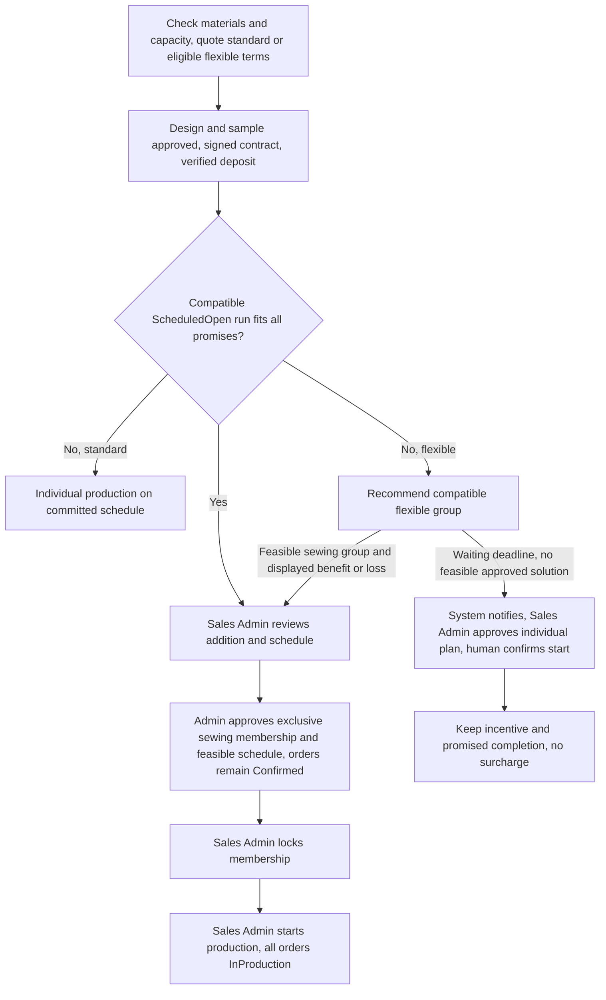
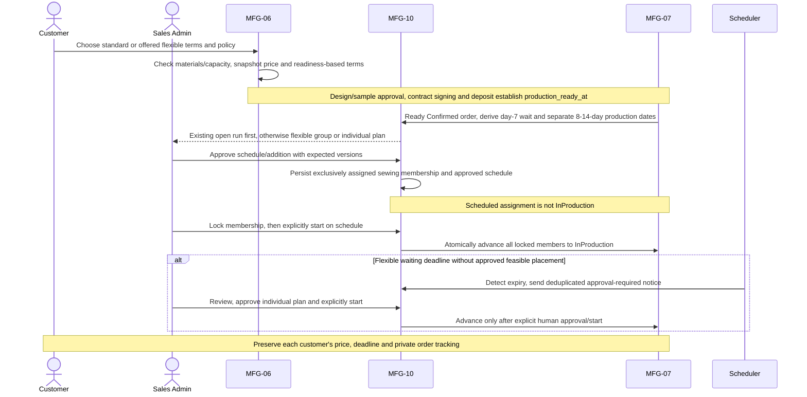

# Spec Document: Production Scheduling and Flexible Orders (Merge)

| Field | Value |
| --- | --- |
| Module ID | `MFG-10` |
| Module name | Order Optimization (Merge) |
| Spec version | v4.2 |
| Author (team member) | Group B |
| Date | 2026-09-27 |
| Status | Final Group B demo policy; Could/post-MVP; not Dony-approved operating policy |
| Approved by (Client role) | Client approved, 2026-09-30 |
| DBIZ2 source | Function List MFG-10, `F-MER-001`–`F-MER-007`; UC-C06, UC-C17, UC-C18, UC-C16; screens S31, S32, S33, S37, S13, S46 |

---

## 1. Purpose and scope (mandatory)

Dony produces made-to-order garments for Business Buyers and Reseller Shops, rather than selling ready-made wholesale stock. MFG-10 prioritizes compatible orders joining production runs that already have a committed schedule. Where extra waiting is useful, eligible customers may accept flexible production terms in exchange for a published incentive. Orders without an approved shared-production plan run individually within their original commitments.

The commercial principle is **discount in exchange for customer time flexibility**. Internal batching within a standard order's original commitment creates no additional discount. Quantity pricing remains MFG-06's normal quote policy. An independently efficient order can anchor a scheduled run and never waits for another customer to approve a sample, sign or pay.

MVP priority remains **Could**, outside standard-order MVP. Until reviewed activation, the existing standard MVP terms remain governed by MFG-06 BR-011; the five-working-day standard promise below belongs to the final post-MVP demo policy. This policy replaces the v3.1 merge model for future MFG-10 planning; it does not activate the module, change existing signed terms, or claim Dony approval. MFG-06 owns immutable quotes, orders and payment/refund snapshots; MFG-07 owns order fulfillment transitions; MFG-09 renders the same contract terms. MFG-10 owns production recommendations, schedules, membership and economic estimates.

Flexible incentive is 5% of merchandise subtotal capped at 250000 VND. Flexible terms allow seven Monday–Friday working days to find an approved sewing run, followed by a separate 8–14-working-day production window; waiting is not included in that production window. The full-wait completion horizon is therefore 15–21 working days, counting the first eligible working date as day 1. Production readiness requires current design/sample approval, signed contract and verified deposit. If readiness occurs on a weekend, day 1 is the next Monday–Friday date. A ready early match may start sooner with human approval; retain the incentive and original deadline. Shipping is separate. Admin enters saved product capacity in garments per working day; the system computes quantity-based duration/capacity estimates, never starts production automatically.

## 2. Actors (mandatory)

| Actor | Role | Source |
| --- | --- | --- |
| Customer | Reviews standard/flexible terms, explicitly accepts flexible policy when offered, and follows only their own order | UC-C06; final demo commercial policy |
| Sales Admin | Reviews feasibility and economics; approves scheduling, member additions, membership lock and batch start | UC-C17/UC-C18 |
| System / scheduler | Recommends compatible sewing runs, calculates estimates and notifies Sales Admin about negative benefit and waiting expiry; cannot approve/assign/lock/start production or convert flexible orders to individual production | User decisions; MFG-10 boundary |
| MFG-06 / MFG-07 / MFG-09 | Own commercial snapshots, order transitions and contract rendering | Module boundaries |

## 3. User scenarios and acceptance criteria (mandatory)

### US-1: Choose production terms (Could)

1. Given a product is not merge-enabled or aggregate quantity exceeds its Sales Admin-set inclusive small-order threshold, when quoting, then use normal quantity pricing and standard terms; do not offer a flexible incentive. Threshold is per product, separate from normal MOQ and per-order quantity bounds.
2. Given a small standard order can fit an existing open run within all commitments, when assigned, then retain its quoted price and standard deadline; internal assignment requires no flexible opt-in.
3. Given a merge-enabled product within its saved small-order threshold and no suitable open run at quote/requote time, when the customer chooses flexible terms before quote confirmation, then compare prices, waiting limit, completion promise, fallback requiring Admin approval and separate shipping. Saving a choice issues a fresh immutable 30-minute quote; stale/expired quotes revalidate eligibility. Later plan changes never claw back an accepted incentive.
4. Given flexible terms were accepted, when an immediate match or individual fallback occurs, then retain the confirmed incentive and deadline; do not reclaim the incentive or charge a fallback fee.
5. Given any shared run, when a customer views their order, then do not reveal other customers' artwork, identities, quantities or commercial data.

### US-2: Prioritize existing scheduled production (Could)

1. Given ready orders have the same garment production type and material, even with different logos or print/embroidery methods, when recommending an open run, then share compatible sewing only and preserve separate decoration operations; check full sewing-plus-decoration completion feasibility for each order.
2. Given a base order has a firm schedule, when a proposed small order is not ready, then run the base order on schedule without waiting for it.
3. Given a run is Locked, InProduction or Completed, when addition is requested, then reject it. Quantity alone cannot prove spare capacity across different designs/processes.
4. Given an existing run with 300 polo shirts and allocated capacity equivalent to 360 of those shirts, when ready compatible orders of 30 and 20 shirts are added, then 350 fits only if the workload and all deadlines also remain feasible. Neither 300 nor 360 is a general policy threshold.

### US-2a: Calculate calendar and capacity (Could)

1. Given readiness on a working date, when dates are derived, then that date is day 1; weekend readiness rolls to the next working date. Day 7 is the last waiting date and day 8 begins the separate production window, whose 8–14 workdays end on readiness days 15–21.
2. Given 350 garments and a saved capacity of 50/day, when estimating a flexible plan without competing allocations, then required_workdays=7 and the policy estimate=8; at 20/day the estimate exceeds 14 and is marked infeasible.
3. Given two proposals consume the same profile/date slots, when concurrent Admin approvals commit, then version/allocation revalidation allows only feasible exclusive allocations; a recommendation alone consumes no slots.
4. Given an open run is amended, when totals/allocations are recalculated, then include its base quantities once and replace/credit its existing ledger allocation once, preserving its firm start and all accepted deadlines.
5. Given Admin approves/starts after waiting expiry, when the customer sees dates, then original maximum due stays fixed and lateness/risk remains visible; the system does not create a fresh 7-day wait or 14-day promise.

### US-3: Form a flexible group or fall back (Could)

1. Given no existing run fits, when at least two ready flexible orders share sewing preparation and have a feasible schedule, then show the candidate group and its benefit or loss for Sales Admin review. A negative estimate is flagged and warned, not automatically rejected; do not wait for a target group size.
2. Given an Admin approves a schedule, when membership is persisted, then reserve capacity and record assignment while orders remain Confirmed; a recommendation alone makes no reservation and does not start production.
3. Given a flexible order reaches its waiting deadline without an approved shared plan, when the system checks it, then notify Sales Admin and expose an approval-required operational flag. The order remains flexible and Confirmed; only a human Admin approval submits an individual plan and only explicit human start advances fulfillment through MFG-07.
4. Given an approved schedule becomes invalid or threatens a member deadline, when detected, then alert Sales Admin with the affected commitments and alternatives; never automatically convert an order, start production, extend a promise or reset waiting.
5. Given concurrent human assignment, cancellation, approval, lock or start, when actions contend, then one commits and no partial membership/fulfillment transition occurs; a scheduler notice cannot itself mutate the production plan.

### Edge cases

- Standard orders are never held for the flexible waiting window.
- Display negative economic values, including fallback subsidies. Economic evaluation does not override capacity, readiness or deadline gates.
- Batch Completed does not mean its orders are shipped, received, paid or Completed.

## 4. Flows (mandatory)

### 4.1 Usage flow

```mermaid
flowchart TD
  Quote[Check materials and capacity, quote standard or eligible flexible terms] --> Ready[Design and sample approved, signed contract, verified deposit]
  Ready --> Existing{Compatible ScheduledOpen run fits all promises?}
  Existing -->|Yes| Review[Sales Admin reviews addition and schedule]
  Existing -->|No, standard| Individual[Individual production on committed schedule]
  Existing -->|No, flexible| Pool[Recommend compatible flexible group]
  Pool -->|Feasible sewing group and displayed benefit or loss| Review
  Pool -->|Waiting deadline, no feasible approved solution| Fallback[System notifies, Sales Admin approves individual plan, human confirms start]
  Review --> Approve[Admin approves exclusive sewing membership and feasible schedule, orders remain Confirmed]
  Approve --> Lock[Sales Admin locks membership]
  Lock --> Start[Sales Admin starts production, all orders InProduction]
  Fallback --> Terms[Keep incentive and promised completion, no surcharge]
```

### 4.2 Sequence for the main flow

```mermaid
sequenceDiagram
    actor Customer
    actor Admin as Sales Admin
    participant Checkout as MFG-06
    participant Merge as MFG-10
    participant Order as MFG-07
    participant Scheduler
    Customer->>Checkout: Choose standard or offered flexible terms and policy
    Checkout->>Checkout: Check materials/capacity, snapshot price and readiness-based terms
    Note over Checkout,Order: Design/sample approval, contract signing and deposit establish production_ready_at
    Order->>Merge: Ready Confirmed order, derive day-7 wait and separate 8-14-day production dates
    Merge-->>Admin: Existing open run first, otherwise flexible group or individual plan
    Admin->>Merge: Approve schedule/addition with expected versions
    Merge->>Merge: Persist exclusively assigned sewing membership and approved schedule
    Note over Merge,Order: Scheduled assignment is not InProduction
    Admin->>Merge: Lock membership, then explicitly start on schedule
    Merge->>Order: Atomically advance all locked members to InProduction
    alt Flexible waiting deadline without approved feasible placement
        Scheduler->>Merge: Detect expiry, send deduplicated approval-required notice
        Admin->>Merge: Review, approve individual plan and explicitly start
        Merge->>Order: Advance only after explicit human approval/start
    end
    Note over Customer,Order: Preserve each customer's price, deadline and private order tracking
```

## 5. Functional requirements (mandatory)

| FR ID | DBIZ2 ID | System MUST | Actor | Priority |
| --- | --- | --- | --- | --- |
| FR-001 | F-MER-001 | Compare standard and eligible flexible terms before quote confirmation; existing-run assignment does not create a discount or expose other customers. | Customer | Could |
| FR-002 | F-MER-002 | Show versioned flexible terms and record explicit acceptance on S31, not on a terms-page view. | Customer | Could |
| FR-003 | F-MER-003 | Save standard/flexible choice on an owned quote and issue a replacement immutable 30-minute quote with the applicable incentive and time basis. | Customer | Could |
| FR-004 | F-MER-004 | Recommend existing ScheduledOpen runs first, then compatible flexible groups; show readiness, shared preparation, workload, capacity, deadlines and exclusions. | System / Sales Admin | Could |
| FR-005 | F-MER-005 | Estimate genuinely avoided preparation, coordination cost, committed incentives and economic benefit; report all programme outcomes including individual fallback. | Sales Admin / System | Could |
| FR-006 | F-MER-006 | Allow Sales Admin to approve schedules/additions, lock, approve individual fallback and explicitly start production; system only recommends and notifies, preserving audited approval and membership history. | Sales Admin / System | Could |
| FR-007 | F-MER-007 | Notify owners and planning after committed schedule/status events via deduplicated outbox messages; reveal only the recipient's order. | System | Could |

### 5.1 Input / Output contract

| FR | Input field | Type | Required | Output field | Type | Validation / expected result |
| --- | --- | --- | --- | --- | --- |
| FR-001 | `quote_id` | UUID | Yes | eligibility | Object | Quote belongs to the Customer and has an eligible saved design; result distinguishes standard and flexible availability. |
| FR-001 | session | Authenticated session | Yes | standard terms | View model | Standard terms never add a flexible discount or batch at checkout. |
| FR-002 | `policy_version` | Version string | Yes | policy text | Text / view model | Read-only final demo terms; opening terms does not record consent. |
| FR-003 | `quote_id` | UUID | Yes | replacement quote | Immutable quote object | Customer owns quote; prior quote is not mutated. |
| FR-003 | `merge_opt_in` | Boolean | Yes | `merge_discount_vnd` | Integer VND | `true` requires the accepted policy version and creates the promised incentive; `false` sets no flexible incentive. |
| FR-003 | `accepted_policy_version` | Version string | Conditional: required when `merge_opt_in=true` | `policy_version` | Version string / null | Must equal a currently eligible policy version when consent is given; omitted for standard choice. |
| FR-003 | `expected_version` | Integer | Yes | quote version | Integer | Stale quote returns 409; ineligible choice returns 422. |
| FR-004 | session | Authenticated Sales Admin session | Yes | recommendations | Array | Other roles cannot receive planning recommendations. |
| FR-004 | filters | Allowlisted object | Optional | candidate quantities and exclusions | Array / object | Unknown filter values are rejected. |
| FR-004 | capacity profile ID and version | UUID / integer | Yes | workday and residual-slot estimates | Integer / allocation object | Uses saved positive capacity and approved allocations; estimate beyond 14 workdays is excluded. |
| FR-005 | target batch ID | UUID | Optional | avoided setup count and labor hours | Integer / decimal hours | Omitted only for a new-group estimate. |
| FR-005 | proposed order IDs | Array of UUID | Yes | gross, coordination, incentives, modeled net | Integer VND fields | Orders are authorized and eligible; coordination is counted once per run. |
| FR-005 | cost/workload assumption version | Version string | Yes | assumption provenance | Object | Output labels modeled values separately from measured values. |
| FR-006 | `action` | Enum: schedule, add, lock, approve_individual, start | Yes | plan or membership history | Object / array | Only Sales Admin may act; action is explicit and auditable. |
| FR-006 | order ID / batch ID | UUID | Required by action | approval or start evidence | Object | The action determines which identifier is required. |
| FR-006 | expected order / batch version | Integer | Required by action | committed version | Integer | Concurrent or stale human action returns 409. |
| FR-006 | `Idempotency-Key` | UUID | Yes | replayed or committed result | Object | Same key and payload replay; changed payload conflicts. |
| FR-007 | committed event | Internal event | Yes | outbox notification IDs | Array of UUID | Events are schedule, membership, start, fallback or completion only; recipients receive only their own authorized order context. |

### 5.2 Business rules

| Rule ID | Rule | Reason |
| --- | --- | --- |
| BR-001 | Standard internal batching retains ordinary price and deadline. Flexible discount=min(floor(merchandise_subtotal_vnd*5/100),250000), applied once after normal quantity pricing, excluding shipping, tax and design fee. Calculate server-side in integer VND, snapshot policy/amount and display the cap with the percentage. Retain the accepted amount on immediate match or individual production; no reclaim, second discount or fallback fee. | Stronger selective time-flexibility incentive without blanket discounting. |
| BR-002 | Use Monday–Friday local dates in Asia/Ho_Chi_Minh. production_ready_at records all approval/signing/deposit gates; readiness_day_1 is its local date if a working date, otherwise the next working date, counted inclusively as day 1. Flexible waiting ends after working day 7; the separate production window begins on working day 8 and lasts 8–14 working days. Full-wait completion is on working day 15–21. Quote/order/contract snapshot durations, incentive and calendar/counting basis; derive absolute due dates when readiness is known. Earlier approved production can finish earlier; a late human approval never resets waiting or pushes the accepted due date. Standard post-activation terms retain the existing five-working-day commitment; MVP and previously signed snapshots remain MFG-06-owned. | Separate waiting from production and preserve fixed commercial promises. |
| BR-003 | Check materials and schedule feasibility before committing terms. A flexible order remains flexible while waiting; do not preassign or reserve a speculative individual slot. At waiting expiry notify Sales Admin and request approval; Admin must approve submission to production, shared or individual. Plans cover separate decoration and every due date. If approval is late, show the original deadline risk/overdue condition and escalate without silently extending it. System does not approve, convert or start anything. | Human-controlled production with honest deadline risk. |
| BR-004 | Sales Admin enables merge only for selected products and sets each inclusive small_order_max_quantity in MFG-04/S19. Flexible eligibility requires merge_enabled, aggregate quantity from normal MOQ through the threshold, a saved positive daily-output profile producing a quantity estimate no longer than 14 production workdays, and no fitting ScheduledOpen run at quote/requote. Matching requires the same garment production type and material; print/embroidery method, logo and artwork may differ. Share only sewing preparation/operations, leaving decoration/tooling/inspection separate per order. Include their time in completion feasibility. Standard orders may join fitting open runs without flexible consent or a discount. Preserve each design and customer privacy. | Product-specific eligibility and sewing-only sharing. |
| BR-005 | A base run may begin with one independent order on a firm schedule and receive ready compatible orders while ScheduledOpen without delaying its members. New flexible sewing groups need at least two; negative benefit receives human review rather than automatic rejection. Sales Admin saves daily_output_capacity (positive integer garments/working day) per product production-type/material planning profile. System sums garment quantities, calculates ceil(total_quantity/daily_output_capacity) workdays and residual daily slots, accounting for approved assignments against the same profile. Product per-order quantity/MOQ bounds remain distinct. Proposed flexibility production duration is at least 8 and at most 14 working days; an estimate beyond 14 is infeasible, never silently clamped. Admin also reviews separate decoration and materials before approval. | Use saved daily throughput rather than inventing run limits or automatic production. |
| BR-006 | Batch lifecycle: ScheduledOpen → Locked → InProduction → Completed. Only Sales Admin approves schedules/additions, locks and submits plans; only explicit human confirmation starts production. Recommendations reserve nothing; approved assignments are exclusive. Lock freezes the sewing list; start revalidates and atomically advances all members to InProduction. No additions after lock. Individual production requires separate Admin approval and human start; flexible consent is not production approval. Scheduler has no production-transition authority. | Distinguish commercial choice, approval, submission and actual start. |
| BR-007 | Confirmed orders remain cancellable before production under MFG-07. Cancellation atomically releases scheduled/locked membership and invalidates the affected plan/lock for Admin revalidation; started membership is immutable. Human approvals/cancellation/starts contend on expected versions; notices cannot commit production mutations. | Preserve cancellation and prevent double production. |
| BR-008 | Modeled net = genuinely avoided shared sewing preparation cost − incremental coordination cost − committed flexible incentives. Trial gross for m additions to a base run=m*390000 if m sewing setups are avoided; new n-order group=(n−1)*390000 if n−1 are avoided. Coordination=90000 once per shared run, including later addition actions; recompute the aggregate estimate. Avoided sewing labor=avoided setups*6 person-hours. Printing/embroidery setup remains per order and is not counted as saved. | Count only genuinely shared sewing benefits. |
| BR-009 | Programme modeled net sums started shared-run gross minus run-level coordination and all accepted flexible discounts on orders actually reaching production, including Admin-approved individual production. An unmatched order merely awaiting approval contributes no started-production benefit. Individual production has zero avoided sewing setup and negative impact equal to its retained discount, before unmodeled waiting administration. Estimates are not realized profit or guaranteed cash savings. | Include subsidy cost without misreporting pending plans as production. |
| BR-010 | Negative selected-run benefit is visible and does not automatically reject the plan. Notify Sales Admin a few days before the waiting deadline, using the saved positive Sales Admin-set warning_lead_workdays (1–6 working days), for review/rearrangement. At expiry without a feasible approved solution, require explicit Admin approval to submit the order for production; show retained incentive and loss estimate. Deduplicate warnings by order/waiting deadline and distinguish negative-benefit warning, waiting-expiry notice, Admin approval and actual start in the audit. | Give humans time to resolve losses while retaining final authority. |

UUIDs, UTC timestamps displayed in Asia/Ho_Chi_Minh, integer VND, expected versions and idempotency keys follow shared contracts. Unauthorized actors return 401/403; stale/concurrent human actions return 409; incompatible/infeasible plans return 422. Durable outbox notices follow persisted events; notifications are permitted automatic side effects, never production approvals.

### 5.3 Calendar and daily-capacity calculation

Define `working_date(d)` as Monday–Friday and `wd(d,k)` as the kth working date on or after d, with k=1 inclusive. Calendar calculations use local dates before UTC storage; monetary calculations use integer VND. The demo calendar has no additional public-holiday rule; any later holiday calendar is a reviewed version, not an implicit change to accepted promises.

For a flexible order:

- `readiness_day_1 = wd(local_date(production_ready_at),1)`.
- `last_waiting_date = wd(readiness_day_1,7)`; the waiting window includes all of that local date. `wait_end_exclusive_at` is midnight at the beginning of the next local calendar date, converted to UTC.
- `production_window_first_date = wd(readiness_day_1,8)`.
- The published completion range is from `wd(production_window_first_date,8)` through `wd(production_window_first_date,14)`: readiness working days 15–21. The latter date is the maximum contractual production-completion date, inclusive; display its end-of-date boundary consistently. The estimated date within that range is operational context and cannot silently shorten or extend the snapshotted maximum promise.
- Readiness does not mean actual production start. Human start has its own timestamp. A feasible early shared run may complete earlier; an approval after waiting expiry leaves the original maximum due date unchanged and must visibly disclose remaining capacity/time or overdue risk.

For a candidate run, `Q` is total garment quantity across all its sizes/orders and `C` is the saved positive daily throughput for its garment-type/material profile. `required_workdays = ceil(Q/C)` is a quantity-based estimate at full allocated capacity. `estimated_production_workdays = max(8,required_workdays)` for the flexible policy; if that exceeds 14, exclude that proposal as infeasible rather than replacing the result with 14. Never interpret 6 saved person-hours as elapsed production days or deduct them from the promise.

Allocate Q against residual capacity of actual Monday–Friday dates at the intended start, after subtracting already approved assignments using that same profile. The quantity-only sewing finish is the date by which accumulated allocation covers Q. Recompute the allocated workday span and the flexible production estimate as max(8,allocated_workday_span), then review separate decoration against that date; a span beyond 14 is infeasible even when the empty-ledger ceil estimate was within 14. Keep sewing finish, complete-order estimate and accepted maximum due date distinct. For an existing run, preserve its firm scheduled start and existing members commitments. Recompute the amended whole-run allocation against the ledger with that run own prior allocations credited back exactly once; include base quantities exactly once and subtract other runs assignments. Alternatively allocate only additions against the unused slots of that scheduled run. Never subtract the base allocation then charge its quantity a second time, or count an added order as both individually assigned and shared. Commit release/replacement atomically only after Admin approval; do not allocate full capacity again to each run/order. For a new flexible group, choose a feasible start and allocation fitting all accepted due dates; unused individual fallback slots are not reserved in advance. Confirmation locks profile/allocation versions so competing approvals cannot double-book them.

Keep profile capacity separate from per-order `max_units_per_order` and from the small-order eligibility threshold. Products that represent the same production type/material must reference the same capacity profile instead of creating duplicate independent capacity for the same resource. Treat the saved throughput as a planning estimate for the declared product/material scope; quantity-only math does not prove decoration completion. Sales Admin must review the separate printing/embroidery workload against the proposed complete-order date before approving. This feature supplies a quantity-based plan with human feasibility review, not an automatic detailed machine/stage optimizer.

Example: readiness on Monday 2026-09-28 gives waiting day 7 on Tuesday 2026-10-06 and post-wait production day 1 on Wednesday 2026-10-07. The 8–14-working-day production range ends between Friday 2026-10-16 and Monday 2026-10-26. Readiness on Saturday 2026-10-03 instead makes Monday 2026-10-05 day 1. For 350 garments at 50/day, required_workdays=7 and the flexible estimate is 8 working days, subject to existing allocations and separate decoration review. At 20/day the quantity-only requirement is 18 working days, so that candidate cannot be advertised as a feasible 14-day run.

The negative-benefit advance-warning interval is a Sales Admin-set operational integer warning_lead_workdays from 1 through 6. Derive warning_date by stepping that many working dates backward from last_waiting_date; send at/on that notice date and immediately on the next check if the warning condition is first detected later. Send an independent approval-required notice once wait_end_exclusive_at is reached. Its value must be present before enabling reminder operation; use its saved version to derive the notice date. The system sends notices and deduplicates them; notice expiry/read/acknowledgement never constitutes production approval.

### 5.4 Evaluation assumptions and examples

All numbers below are classroom trial assumptions, pending Dony validation. Six person-hours may be parallel labor; they are not six elapsed production hours. Each shared run retains its own setup. Additional artwork/tooling/inspection effort is not automatically avoided.

| Parameter | Trial assumption |
| --- | --- |
| Shared sewing preparation for one separate run | 6 person-hours |
| Converted labor value | 65,000 VND/person-hour |
| Shared sewing preparation cost | 390,000 VND/run |
| Incremental coordination | 90,000 VND/shared run, counted once |
| Flexible incentive | 5% of merchandise subtotal, rounded down to integer VND, capped at 250000 VND/order; accepted policy |
| Standard internal batching incentive | 0 VND |

| Scenario | Avoided setup cost | Coordination | Incentives | Modeled net | Avoided labor |
| --- | --- | --- | --- | --- | --- |
| A: two standard small orders join a base run | 2×390000=780000 | 90000 | 0 | 690000 VND | 12 person-hours |
| B: four flexible orders at the discount cap form a new sewing run | 3×390000=1170000 | 90000 | 4×250000=1000000 | 80000 VND | 18 person-hours |
| C: one flexible order at the cap is approved and started individually | 0 | Shared-run coordination absent; waiting administration unmodeled | 250000 | −250000 VND | 0 |

A 100-small-order scenario has 40 standard orders on 20 base runs, 40 flexible orders on ten four-order sewing runs and 20 flexible orders approved/started individually. Assume all 60 flexible orders reach the 250000 VND cap; base orders are outside the 100. Gross=27300000, coordination=2700000, discounts=15000000, net=9600000 VND (13800000+800000−5000000). Lower subtotals generate smaller actual discounts; always sum immutable amounts. The separate/no-incentive baseline excludes software, decoration costs not avoided and waiting administration; this is modeled economic benefit, not a validated profit forecast.

### Analytics evidence integration (MFG-11)

Keep commercial choice (standard/flexible), actual routing (base-run addition/new shared run/individual), waiting, schedule/lock/start and fallback events distinct. A standard order may be batched without flexible opt-in; an opted-in order may run individually. Batch Completed is not order Completed. Report assumption-based estimates separately from measured setup time, cost, production timeliness and revenue. AI remains read-only and cannot approve, lock, start or change policy.

## 6. Key entities (mandatory)

| Entity | Attributes | Relationships |
| --- | --- | --- |
| FlexiblePreference / production plan | quote_id, merge_opt_in, accepted policy_version, accepted_at, snapshotted incentive; actual production route?, individual_approved_by/at?, human_started_by/at? | Flexible choice remains unchanged while awaiting review; actual shared/individual route is set only by human approval, never a notice. Preserve original flexible commercial terms after individual routing. |
| ProductionReadiness | production_ready_at, readiness_day_1, calendar version, waiting_workdays=7, production_window_min_workdays=8, production_window_max_workdays=14, wait_end_exclusive_at, production_window_first_date, production_due_at | Day 7 is the last waiting date; full-wait production starts counting on day 8; accepted date promises are not reset by late approval |
| MergeRecommendation | target run/new group, member IDs/versions, type/material profile, saved capacity/version, total_quantity, required_workdays, per-working-date allocations/residuals, planned start/completion, decoration feasibility, due dates, exclusions, costs/incentives, refreshed_at | Nonbinding, calculated with approved profile allocations; no speculative individual reservation or automatic assignment |
| ProductionCapacityProfile | id, production_type_key, material_id, daily_output_capacity, expected/version, updated_by/at | Shared saved garments-per-working-day scope; approved date allocations consume its finite daily slots; editing is in MFG-04/S19 |
| ProductionBatch | UUID, same garment production type/material, base/new-sewing-group kind, ScheduledOpen/Locked/InProduction/Completed, scheduled_start_at, planned_completion_at, saved capacity inputs, quantity totals, approved_by/approved_at, locked_at?, started_at?, version | One efficient base order allowed; exclusive approved assignment and separately audited human start; decoration jobs remain per member |
| BatchMembership | batch_id, order_id, assignment/release history, lock/start version | One active production assignment per order; immutable started membership; cancellation revalidates preproduction plan |

## 7. Screens involved

| Screen | Behavior | Reference |
| --- | --- | --- |
| S18 / S19 | Sales Admin sets enabled products, inclusive small-order threshold and shared daily throughput | [S18](../screens/S18-product-edit.md) / [S19](../screens/S19-product-design-rules.md) |
| S31 | Standard/flexible comparison and explicit consent when offered | [S31](../screens/S31-production-option.md) |
| S32 | Versioned flexibility terms, no consent on view | [S32](../screens/S32-production-terms.md) |
| S33 / S40 | Immutable quote/payment breakdown, no batch-triggered incentive | MFG-06 |
| S35 / S37 / S13 | Private customer dates, human operational progress and safe committed notices | [S35](../screens/S35-customer-order-detail.md) / [S37](../screens/S37-staff-order-detail.md) / [S13](../screens/S13-notifications.md) |
| S46 | Existing run first, group economics, schedule/add/lock/start and fallback | [S46](../screens/S46-production-planning.md) |

## 8. Success criteria (mandatory)

| SC ID | Criterion | Measurement |
| --- | --- | --- |
| SC-001 | Every standard/flexible outcome retains committed price and deadline | For immediate assignment, later shared grouping and approved individual fallback, compare the stored quote/order snapshots with the result; all three must match exactly. |
| SC-002 | Every assignment/start satisfies readiness, saved daily-output allocation and full sewing-plus-decoration promises | Test disabled/threshold products, zero capacity, shared-profile overbooking, >14-workday estimates, early/late approvals, different decoration methods and concurrent assignment/start; each invalid case returns 422 or 409 and commits no allocation. |
| SC-003 | Scheduled/locked membership is never mistaken for production start | Verify that schedule, add, lock and approval leave the Order outside `InProduction`; only an explicit audited start can perform that transition. |
| SC-004 | Programme reports include fallback cost and distinguish modeled from observed benefit | Recompute scenarios A, B, C and the 100-order illustration from the stated inputs; every displayed gross, coordination, incentive and net value must equal the formula. |
| SC-005 | Trial evidence supports parameter selection | Record setup labor, coordination cost, flexible uptake, Admin approval response time, batching outcomes and on-time production with date, source and sample count before changing a policy parameter. |

## 9. Assumptions

- Numeric prices, costs, durations, 300/360-shirt capacities and scenario mix are illustrations, not universal product rules or Dony commitments.
- Normal quantity discounts remain normal quote policy; flexible incentives are separate and selective.
- Dietl, Voigt and Kuhn (2024), [From rush to responsibility: Evaluating incentives on online fashion customers willingness to wait](https://edoc.ku.de/id/eprint/34085/1/1-s2.0-S1361920924002372-main.pdf), Transportation Research Part D 133, 104280, examines incentives for German-speaking online retail customers. It supports testing incentives for waiting; it does not establish that 5%/250000 VND or the proposed schedule is optimal for Dony business buyers/resellers. The earlier Bowers & Agarwal (2007) and Textile and Apparel (2018) references remain contextual leads pending full verification; no case-study percentage is asserted as Dony savings.
- Existing signed policy snapshots are preserved; v4 adoption requires review rather than retroactive rewriting.

## 10. Open questions

| # | Question | Blocking? | Owner | Status |
| --- | --- | --- | --- | --- |
| 1 | [NEEDS CLARIFICATION: What measured factory throughput, setup cost and coordination cost support changing the classroom trial assumptions?] | Yes, before operational use or any policy-parameter change | Group B | Open — the current values remain explicitly labeled classroom trial assumptions. |
| 2 | Is any product behavior, lifecycle, approval boundary or data field unresolved for this classroom specification? | No | Group B | Resolved — sections 1–9 define the current classroom scope. |

## 11. Traceability to DBIZ2

| Section | Repository DBIZ2 source / location |
| --- | --- |
| 1–3 | [`function-list.md` §X MFG-10](../docs/function-list.md): rows `F-MER-001`–`F-MER-007`, `UC-C06`, `UC-C17`, `UC-C18`; supplied production-priority proposal is a DBIZ3 extension input. |
| 4–6 | `F-MER-001`–`F-MER-007` rows above; revised contracts preserve the historical function IDs while defining the approved standard/flexible lifecycle. |
| 7 | Screen specifications S31, S32, S33, S37, S13 and S46, linked in section 7. |

## Completion checklist

- [x] All seven function IDs remain traceable.
- [x] Standard routing and flexible commercial choice are distinct.
- [x] Scheduled/add/lock/start, individual fallback and concurrency boundaries are explicit.
- [x] Illustrative arithmetic includes coordination and fallback incentives.
- [x] User decisions define the duration basis, Monday–Friday counting, daily-capacity unit and human approval boundary.
- [ ] Validate factory throughput/cost assumptions before operational use and finish verification of any additional academic claims.
- [x] Calendar/capacity equations and boundary examples are documented for implementation planning.

Template source: DBIZ3 Product Design Package specification template.

DBIZ3, FTU.
