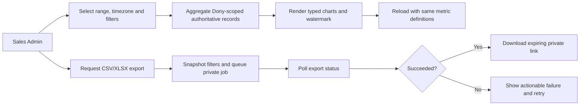
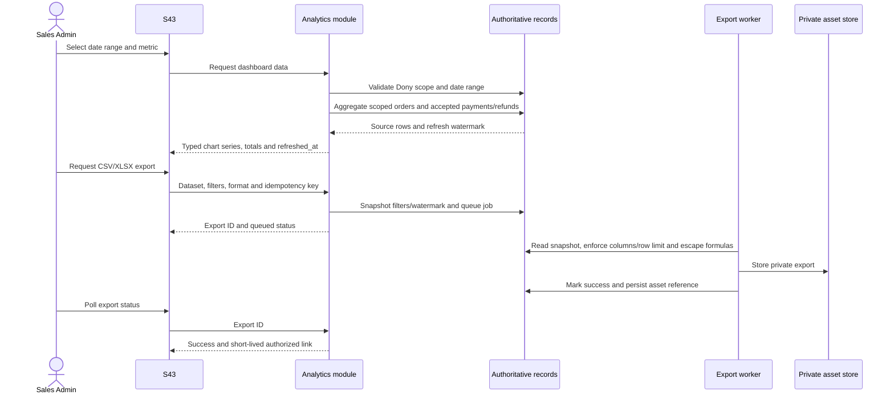

# Spec Document: Data Analytics

| Field | Value |
| --- | --- |
| Module ID | `MFG-11` |
| Module name | Data Analytics |
| Spec version | v1.1 |
| Author (team member) | Group B |
| Date | 2026-09-22 |
| Status | Draft |
| Approved by (Client role) | No approver identified |
| DBIZ2 source | Function List MFG-11, No. 84–86, `F-DA-001`–`F-DA-003`; UC-C21 View Dashboard, UC-C22 Export Data, UC-C20 Data Analytics; screen S43 |

---

## 1. Purpose and scope (mandatory)

Sales Admins receive read-only, Dony-wide performance analytics and may export matching filtered data. WeaveLink has one manufacturer/system boundary, not company-scoped product tenants; buyer companies and Reseller Shops are optional customer-analysis dimensions only. Analytics cannot mutate business records or grant access to customer accounts. System Admin has no implicit access to commercial analytics. MVP priority: **Won't**; the functions remain specified for the complete system and are excluded from MVP release.

Inputs use `start_date` inclusive and `end_date` exclusive in Asia/Ho_Chi_Minh calendar time. Default range is the last 30 local calendar days; maximum is 366 days. An optional product filter must refer to a Dony product; an optional buyer-organization filter is an analysis dimension and never an authorization boundary. Empty data returns zero totals and empty series.

Cash collected sums accepted `DEPOSIT` and `BALANCE` settlements by paid_at minus successful refunds by refunded_at. Sales revenue is recognized once when the order becomes `Completed`, using the immutable contract total less later recognized refunds; deposits are liabilities until completion and must not be counted twice. Duplicate/late receipts and their offsetting refunds are excluded from both metrics and shown only in reconciliation. Design fees are included once in completed-order revenue; S43 separately shows design_fee_revenue_vnd as a component, never an additional total. Pending/failed attempts are excluded.

## 2. Actors (mandatory)

| Actor | Role in this module | Where it comes from |
| --- | --- | --- |
| Sales Admin | Views Dony-scoped metrics and requests/ downloads exports | MFG-11 resolved permissions; UC-C21/UC-C22 |
| System | Aggregates authoritative records and runs asynchronous export jobs | MFG-11 function contract |
| System Admin | No implicit access to Dony commercial analytics | MFG-11 access rule |

## 3. User scenarios and acceptance criteria (mandatory)

### US-1: View dashboard (Won't for MVP)

Sales Admin views metric cards/charts with filters, timezone and refresh watermark. Charts have accessible tabular equivalents and loading, empty, error and retry states.

1. **Given** valid filters, **when** the dashboard loads, **then** the response identifies inclusive start/exclusive end and timezone and applies the defined revenue/order/customer metrics.
2. **Given** no source rows exist, **when** charts load, **then** totals are zero and series are empty; no sample values are fabricated.
3. **Given** product filter belongs to a different system operator, **when** submitted, **then** 404/422 is returned without disclosing unauthorized values.
4. **Given** invalid date range or range longer than 366 days, **when** submitted, **then** 422 field errors appear and prior chart data remains visible.
5. **Given** aggregation is unavailable, **when** S43 refreshes, **then** no stale values appear as current without watermark; retryable 503 is returned with filters preserved.

### US-2: Export data (Won't for MVP)

Sales Admin requests CSV/XLSX for allowed datasets and filters. The export is asynchronous, private, watermark-bearing and limited to 100,000 rows.

1. **Given** an export is queued, **when** status is polled, **then** it moves Queued→Running→Succeeded/Failed and only Succeeded returns a private link expiring in 10 minutes.
2. **Given** the same idempotency key and payload is retried, **when** submitted, **then** the same job is returned; changed payload with that key returns 409.
3. **Given** a row exceeds the limit or a dependency fails, **when** export runs, **then** an actionable failure is shown and a retry with the same key/payload is supported.
4. **Given** customer-controlled text begins with `=`, `+`, `-` or `@`, **when** written to CSV/XLSX, **then** it is escaped as text.

### Edge cases

- Refunds may exceed recognized revenue in a selected period; display the resulting negative net revenue explicitly and never clamp it to zero.
- Customer exports may include display name and masked email only; never export credentials, full payment data, or unnecessary personal details.

- Export contains only allowlisted columns; no emails, addresses, notes, payment references or secrets.
- A failed download or expired URL does not expose a public asset.
- Filtered order/product data remains Dony-scoped at query construction.

## 4. Flows (mandatory)

### 4.1 Usage flow

### 4.2 Sequence for the main flow

## 5. Functional requirements (mandatory)

| FR ID | DBIZ2 Subfunction ID | Requirement (system MUST ...) | Actor | Priority |
| --- | --- | --- | --- | --- |
| FR-001 | F-DA-001 | Return Dony-scoped chart view model for recognized completed-order revenue, cash collected by DEPOSIT/BALANCE, orders and customer growth with range, timezone, refreshed_at, points and totals, including design_fee_revenue_vnd within revenue. | Sales Admin | Won't (MVP) |
| FR-002 | F-DA-002 | Recalculate typed dataset using the same metrics and Dony scope, including the design-fee component; return zero/empty values for empty data. | Sales Admin | Won't (MVP) |
| FR-003 | F-DA-003 | Queue CSV/XLSX export including the design-fee component and approved customer labels (display name, masked email), report asynchronous state and expose only authorized short-lived private link on success. | Sales Admin | Won't (MVP) |

### 5.1 Input / Output contract

| FR ID | Input field | Type | Required | Output field | Type | Notes / validation |
| --- | --- | --- | --- | --- | --- | --- |
| FR-001 | date_range, metric_type | Dates / enum | Optional | visual_charts | Typed object | `{range,timezone,refreshed_at,metrics:[{name,unit,points,total}]}` |
| FR-002 | start_date, end_date, product_id, metric_type, page fields | Dates, UUID, enum, integers | Optional | refreshed_dataset_for_charts | Typed data | End exclusive; max 366 days; invalid range/product 422 |
| FR-003 | dataset_selection, file_format, date/product filters, Idempotency-Key; export_id for polling | Enum, filters, key, UUID | Yes | export_id/status; successful private link/format/row_count/watermark | Job/object | CSV/XLSX; maximum 100,000 rows; URL expires in 10 minutes; masked email/display name only |

### 5.2 Business rules

| Rule ID | Rule | Why it exists |
| --- | --- | --- |
| BR-001 | Revenue is recognized once from the immutable contract total when an order becomes Completed, less recognized refunds; DEPOSIT and BALANCE settlements separately measure cash collected. Duplicate/late receipts and their offsetting refunds are excluded. Design fees are an included revenue component, never added again. | Prevent double-counting installments or recognizing deposits prematurely. |
| BR-002 | Orders use created_at and include all statuses; cancellations are separate; customer growth counts distinct Customer accounts by customer_id whose first submitted order falls in range. Buyer-organization segmentation, when requested, is descriptive only. | Define customer growth without treating buyer organizations as tenants. |
| BR-003 | All commercial aggregates/exports are scoped to Dony's single system boundary. Product filters must reference a Dony product; buyer-organization filters only segment Dony customer records and never confer or restrict access. | Preserve single-operator authorization while supporting useful customer analysis. |
| BR-004 | Only allowlisted columns export; customer labels are display name and masked email only; spreadsheet formula-leading cells are escaped; exports cap at 100,000 rows. | Reduce data exposure and formula injection. |
| BR-005 | Export is asynchronous, idempotent and available through a private URL that expires in 10 minutes. | Support reliable large exports. |

Export datasets are `revenue`, `orders` and `customers` (or an explicitly documented combination). Allowlisted columns are: aggregate revenue date/value/design_fee_revenue_vnd/currency; orders UUID/created_at/status/product UUID/name/quantity/subtotal/discount/shipping/design_fee_vnd/total/accepted-settled amount/accepted refund amount; customers UUID/display_name/masked_email/first order date/order count. Duplicate/late receipts and their offsetting refunds are excluded together from sales exports. Product filters apply to related order product. A `File` selection means CSV/XLSX format, never a client-uploaded file.

Design-fee revenue is the sum of design_fee_vnd snapshots for orders becoming Completed in range, minus the fee component of later recognized refunds by refunded_at. Apply the same filters, watermark and duplicate/late-receipt exclusions as total revenue. A deposit alone creates no revenue; Simple and repeat orders contribute 0. S43 labels it "Design fees included in recognized revenue"; exports show the same component without double-counting.

## 6. Key entities (mandatory)

| Entity | Attributes (from Input/Output fields) | Relationships |
| --- | --- | --- |
| Analytics result | range, timezone, refreshed_at, optional buyer segment/organization filter, metric series and aggregate values | Dony-wide read-only aggregate from authoritative order/payment/customer records. Buyer filters do not grant access. |
| ExportRequest | id, actor_id, filters, format CSV/XLSX, watermark, created_at, status, asset_id?, row_count?, error_code? | Dony Sales Admin request; Queued/Running/Succeeded/Failed; private asset on success. |

## 7. Screens involved

| Screen ID | Screen name | Priority | Screen Spec file |
| --- | --- | --- | --- |
| S43 | Dony Analytics Dashboard | Won't (MVP) | Module screen; accessible charts and tabular equivalents |

## 8. Success criteria (mandatory)

| SC ID | Criterion | How it is measured |
| --- | --- | --- |
| SC-001 | Dashboard metrics follow the named settlement, refund, order and customer definitions. | Compare aggregation against authoritative records including duplicate/late receipts and refunds. |
| SC-002 | No Dony business data or non-allowlisted sensitive fields leak through dashboard or export. | Test unauthorized filters and inspect exported columns. |
| SC-003 | Export state, idempotency, row cap, formula escaping and URL expiry behave as specified. | Verify job lifecycle, retries, generated files and asset authorization. |

## 9. Assumptions

- Authoritative payment and order events carry timestamps needed for metric definitions.
- Export jobs can read a consistent snapshot and record its watermark.
- MVP priority is Won't; implementation is deferred while complete-system requirements remain documented.

## 10. Open questions

| # | Question | Blocking? | Owner | Status |
| --- | --- | --- | --- | --- |
| 1 | Resolved decisions: Group B; course DBIZ 3; no approver identified; course/demo use only; MVP priority Won't. | No | Group B | Resolved |
| 2 | No remaining open questions. | No | Group B | Resolved |

## 11. Traceability to DBIZ2

| Spec section | DBIZ2 source | Location |
| --- | --- | --- |
| 1–2 Scope and actors | MFG-11 Function List No. 84–86 | `F-DA-001`–`F-DA-003` |
| 3 Scenarios | UC-C21, UC-C22, UC-C20 | Use-case labels and resolved behavior |
| 4 Flow | S43 dashboard and asynchronous export | Current MFG-11 contract |
| 5–6 FRs and entities | `F-DA-001`–`F-DA-003` | Function List MFG-11 |
| 7 Screen | S43 | Current MFG-11 module contract |

## Completion checklist

- [x] All three MFG-11 functions have FR rows and typed contracts.
- [x] Metric definitions, privacy, filtering and export rules are explicit.
- [x] MVP exclusion is reflected without removing complete-system requirements.
- [x] Resolved inputs are recorded and no unresolved placeholders remain.
- [x] Traceability identifies functions, use cases and screen.

Template source: DBIZ3 Product Design Package specification template.

DBIZ3, FTU.
