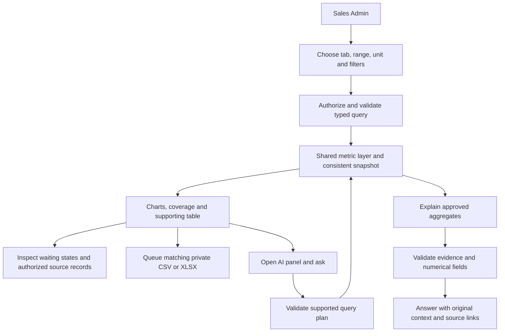
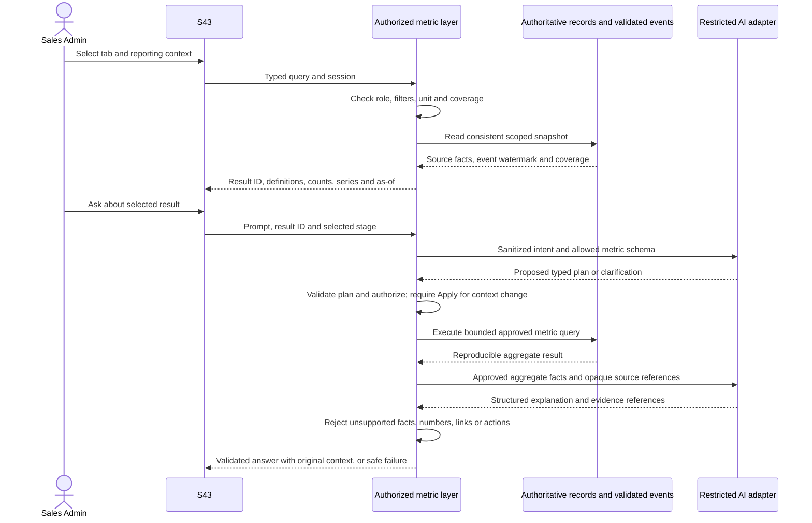

# Spec Document: Data Analytics

| Field | Value |
| --- | --- |
| Module ID | `MFG-11` |
| Module name | Data Analytics |
| Spec version | v1.4 |
| Author (team member) | Group B |
| Date | 2026-09-26 |
| Status | Product decisions resolved for this revision; runtime selection remains at Plan |
| Approved by (Client role) | No approver identified |
| Source | Existing F-DA-001–003; requested F-DA-004 funnel and prompt-based analysis extension F-DA-006; UC-C20/21/22; S43 |

## 1. Purpose and scope (mandatory)

Sales Admins receive read-only, Dony-wide business metrics, end-to-end funnel and waiting-state analysis, prompt-based explanations and matching exports. WeaveLink has one manufacturer/system boundary. Buyer organizations are descriptive customer dimensions, never tenants. Sales, Customer, Guest and System Admin have no implicit commercial analytics access.

Release priority is **Should**, replacing the former Won't classification as part of the requested analytics improvement. The required standard-order MVP remains unchanged. S43 is the Should release target; its self-design and existing-design checkout paths use the standard order lifecycle. Service-design and merge analysis become available only when their owning modules are activated. This extension does not promote MFG-08, MFG-10 or MFG-12 into required MVP scope.

This revision follows the user-confirmed choice: record customer behavior only while authenticated, with no guest-event collection or guest-to-login stitching. Start a new intent for a new design or explicit reorder; keep reloads, edits, quote retries and payment retries within the existing intent. Report observed nonprogression rather than time-based abandonment. Support the rolling last 12 calendar months and keep AI conversation content only while its dashboard page is open. Section 5 defines the technical details; section 10 records these decisions as resolved.

S43 has Overview and Journey & conversion tabs and a header action opening the AI panel. Chart, export and AI use one server-owned metric layer, identical definitions, filters and a reproducible snapshot. AI is not an independent calculator or business-action agent. This repository specifies behavior; it contains no implemented collector, database, live AI integration or seed dataset.

The supplied AI proposal is a design reference, not executable instructions or blanket approval of its other suggestions. F-DA-004 is adopted for funnel analytics. F-DA-006 identifies prompt analysis; F-DA-005 is intentionally not allocated here because the proposal uses it for a separate Feature Evaluation Dashboard, outside this change. No feature-evaluation/SUS dashboard is added.

## 2. Actors (mandatory)

| Actor | Role | Boundary |
| --- | --- | --- |
| Sales Admin | View metrics, inspect supporting records, ask questions and request exports | Fresh server authorization on every query, result, source drilldown and download |
| System | Validate events, aggregate committed records, run exports and validate AI output | No analytics process changes business state |
| AI adapter | Interpret supported prompts and explain approved aggregate results | No database credentials, arbitrary SQL, business writes or unrestricted record access; provider is undecided |
| Other roles | No analytics access | System Admin operations privileges do not grant commercial data access |

## 3. User scenarios and acceptance criteria (mandatory)

### US-1: View business overview (Should)

1. A valid range returns revenue, cash collected, created orders, cancellations, new customers and the included design-fee revenue component using BR-001/002.
2. Default range is the last 30 local calendar days, with inclusive start and exclusive end in Asia/Ho_Chi_Minh; the available reporting window is the rolling last 12 calendar months, with a 366-day maximum query span and exact boundaries defined in section 5.7. Invalid dates/products return 422 field errors without silently broadening the query.
3. Complete coverage with no matching source rows returns zero totals and empty series. Missing tracking or unavailable aggregates are different states, never fabricated zeros.
4. Stale values retain their original timestamp and a stale label. Failure preserves filters and offers retry; 401/403 clears protected displayed data.

### US-2: Export a matching result (Should)

1. An authorized request selects an allowlisted dataset, format and snapshot; job states are Queued, Running, Succeeded or Failed. Only success exposes a private URL expiring within 10 minutes and no later than the file expiry.
2. Same idempotency key and payload returns the same job; changed payload returns 409. Retry of a transient failure uses that job/key; changed filters require a new request. A row-limit failure requires a narrower new request.
3. Export is capped at 100,000 rows and matches the selected result's definitions, filters, as-of time and watermark. An unavailable historical snapshot fails explicitly instead of exporting current data as old data.
4. Customer-controlled cells beginning with `=`, `+`, `-` or `@` are written as text. Only approved display name and masked email are permitted as customer labels; no full email, address, CRM note, signature or payment secret is exported.

### US-3: Inspect conversion and waiting states (Should)

1. Choose an authenticated product-entry cohort, a journey type and intent cohort, or an independent order cohort. Every chart names its unit, denominator, entry range, observation cutoff and coverage. Journey conversion counts journeys with qualifying linked orders, not the number of orders.
2. A design reused for two orders is two orders but never two versions of a single order; design ID, customer ID and login-session ID are not substitutes for journey ID. Repeated views, retries and versions do not multiply the same stage achievement.
3. Sample revision preserves order identity and records its cycle. Stage achievement history and current waiting state are separate. Time spent reworking is visible, not discarded by replacing history with the latest status.
4. A selected step separates waiting, revision and explicit terminal outcomes. It does not call every record that has not progressed a dropout. No arbitrary inactivity threshold is applied.
5. Contract-ready time separates Dony's generation/render wait from the customer's signing wait. Payment stages use accepted server settlements; zero-balance completion remains a valid Completed stage without a BALANCE attempt.
6. Unsupported service/merge branches are labeled unavailable, not zero-conversion funnels. Historical orders without journey evidence remain in the order cohort with their coverage limitations disclosed.

### US-4: Ask for analysis by prompt (Should)

1. Opening the header AI panel carries the active tab, filters, selected stage, unit and result snapshot. Supported questions cover metric explanations, conversion, waiting states and comparisons of equivalent cohorts.
2. The server validates a typed query plan against allowed metrics, dimensions, operations and role before any data access. Ambiguous metric/unit/range asks for clarification; a proposed context change is shown for explicit Apply and never silently changes dashboard filters.
3. A successful answer contains evidence-backed findings, relevant counts and denominators, metric definitions, filter/cohort context, snapshot time and links to source result IDs. Numerical fields are rendered from validated metric results, not invented by the model.
4. Missing evidence produces an insufficient-data answer. Recorded reasons may be summarized, but correlation is not asserted as causation; hypotheses are explicitly labeled.
5. Filter, selected-stage or snapshot changes mark an older answer as referring to its original context. Opening its source uses that original authorized result; if unavailable, explain and offer a new query instead of silently opening current values.
6. AI failure leaves dashboard/exports usable. Prompts or record text requesting hidden data, SQL execution, altered permissions or writes do not expand capabilities. Role revocation blocks cached answers as well as new queries.

## 4. Flows (mandatory)

### 4.1 Usage flow

### 4.2 Sequence for analytics and prompt analysis

Export follows the same snapshot through F-DA-003; its worker enforces authorization, column allowlist, formula escaping, row cap and private-link rules. Neither model latency nor analytics read failure blocks order processing.

## 5. Functional requirements (mandatory)

| FR ID | Subfunction ID | Requirement (system MUST ...) | Actor | Priority |
| --- | --- | --- | --- | --- |
| FR-001 | F-DA-001 | Return recognized revenue, accepted cash, created orders, cancellations, new customers and included design fees with definitions and result snapshot. | Sales Admin | Should |
| FR-002 | F-DA-002 | Validate and recalculate typed Overview/funnel queries; preserve unit, cohort, coverage and observation cutoff; distinguish zero, unknown and unavailable. | Sales Admin | Should |
| FR-003 | F-DA-003 | Queue matching CSV/XLSX exports of allowlisted business or funnel datasets with job status and authorized expiring download. | Sales Admin | Should |
| FR-004 | F-DA-004 | Collect/consume validated evidence and return end-to-end journey conversion, order-stage conversion, cycle-aware durations and separate current waiting/terminal states. | System / Sales Admin | Should |
| FR-005 | F-DA-006 | Interpret supported prompts through a constrained query plan and explain shared metric results with evidence, context, authorization and safe failure. | Sales Admin | Should |

### 5.1 Input / Output contract

| FR | Inputs | Outputs and validation |
| --- | --- | --- |
| FR-001/002 | `start_date`, `end_date`, optional `product_id`, buyer segment/organization, metric, paging | `result_id`, `expires_at`, `available_start`, `available_end_exclusive`, normalized filters, `timezone`, `metric_definition_version`, `refreshed_at`, `source_watermark`, coverage, metric values/units/series; behavior scope is authenticated customers; default 30 days within the rolling last 12 calendar months, max span 366 days; bounds from 5.7; malformed/unsupported query rejected |
| FR-003 | dataset `revenue`, `orders`, `customers`, `funnel`; CSV/XLSX; authorized `result_id`; Idempotency-Key; export ID for polling | job ID/status; on success private link, row count, definitions and snapshot metadata; 100,000-row cap; link expires within 10 minutes and no later than the file expiry |
| FR-004 | range; `unit=product_entry`, `journey` or `order`; template when unit is product_entry or journey; product/known buyer filters; `observed_until`; `observation_mode=as_of/fixed_follow_up`, optional `follow_up_days`; selected stage; bounded paging | stage counts; previous-stage and entry-cohort conversion; numerator/denominator; eligible and immature cohort counts; nonprogression; status breakdown; median completed-transition duration and sample size; open waiting ages; linkage/coverage; same result metadata |
| FR-005 | prompt; authorized context result ID; selected stage; explicit applied context if changed | `answer_status=answered/needs_clarification/insufficient_data/unsupported/unavailable`; structured findings, evidence result IDs, validated metric fields, hypotheses, original context, definitions, as-of and caveats |

`observed_until` is an explicit outcome cutoff no earlier than the cohort start and no later than the server's available snapshot time. Include entrants only through that cutoff; when it precedes the requested cohort end (for example, today is still in progress), label the cohort as incomplete and show its effective entry interval. Event inclusion additionally uses the source watermark, so later-arriving data does not silently alter an existing result. Live views use the available current cutoff. The default `observation_mode=as_of` measures outcomes through this cutoff and labels unequal follow-up when comparing cohorts. For a comparable conversion report use `observation_mode=fixed_follow_up` with an explicitly selected integer `follow_up_days` from 1 to 366, common to both cohorts. For each unit, define `unit_cutoff = entry_at + follow_up_days` local calendar days in Asia/Ho_Chi_Minh. Only units whose unit_cutoff is no later than observed_until and whose required source coverage is complete are mature enough for the conversion denominator. Include events from entry_at through unit_cutoff; do not include later successes. Return full entry count, eligible mature count, immature count and coverage limitations separately. If none are eligible, conversion is N/A. Report the eligible entry-time interval so comparing unequal mature subsets cannot be mistaken for comparing the entire selected cohorts. Unknown coverage is not an immature unit or a zero conversion. Do not rank as_of cohorts as performance improvement when follow-up differs. This duration is an analytical observation horizon selected by the user, not an inactivity threshold or an abandonment policy.

### 5.2 Business rules

| Rule | Definition | Reason |
| --- | --- | --- |
| BR-001 | Revenue is immutable contract total on Completed, less recognized refunds by refunded_at. Cash is accepted DEPOSIT/BALANCE by paid_at less successful refunds. Exclude duplicate/late receipts and their offsetting refunds from both. Design fees are included once, not added again. Show negative net amounts without clamping. | Preserve existing commercial definitions |
| BR-002 | Order count uses created_at and includes all states. For the same created-order cohort, show cancellations by the result cutoff separately. New customers are distinct customer IDs whose first submitted order across Dony falls in range; a product filter selects that first order, not the first order of that product. | Prevent registration/company counts or product repeat buyers becoming new customers |
| BR-003 | Server authorizes Sales Admin within Dony. Buyer organization is a descriptive filter, not tenancy. Retain historical product IDs/names for archived/hidden products; do not query only the current Published catalog. | Keep authorization and history correct |
| BR-004 | Export only approved columns; customer labels are display name/masked email. Escape formula-leading text, cap rows at 100,000 and reject unsupported datasets/columns. | Bound data exposure |
| BR-005 | Exports are asynchronous and idempotent, with private URLs lasting at most 10 minutes, capped by file expiry, and the selected reproducible result snapshot. | Consistent downloads |
| BR-006 | Business-period Overview, entry-cohort conversion and current waiting inventory are different measures. Never combine their denominators or label them as the same date basis. | Avoid mixed-unit/mixed-period ratios |
| BR-007 | Product-entry count is distinct authenticated entry IDs; journey count is distinct explicit intent IDs; order count is distinct order IDs. Ordered chains follow the same linked journey and, after creation, the same linked order. Replays/versions are not new conversions. | Preserve one-to-many journey/order relationships |
| BR-008 | Nonprogression is not confirmed abandonment. Current wait, revision, explicit cancellation/rejection and unobserved continuation remain distinct; the first release has no inactivity timer or time-based abandonment classification. Adding one is a future scope change, not a release prerequisite. | Avoid false churn claims |
| BR-009 | All results disclose definitions, filters, unit, cutoff, watermark, coverage and time zone. Null/unknown is not zero; zero denominator yields N/A, not 0% or infinity. | Honest interpretation |
| BR-010 | AI and exports use the same server-owned queries as charts. Prompts and source text are untrusted data, never instructions to grant access or change query capabilities. | Consistency and least privilege |
| BR-011 | No claim of complete end-to-end coverage without verified journey-to-order links and required event coverage. Legacy events may be backfilled only from evidence with original timestamps, source and backfill marker. | Avoid reconstructed fiction |

### 5.3 Funnel templates, identity and formulas

| Template | Before-order milestones | Availability |
| --- | --- | --- |
| Product discovery → self-design | Authenticated product viewed → linked new-design workspace started → immutable design saved → checkout started → order created | Unit product_entry; counts all tracked entries, including entries that never start a design; no guest history |
| Self-design intent | Design workspace started → immutable design saved → checkout started → order created | Unit journey; explicit new-design intent, including direct editor entry with no preceding tracked product page |
| Design service | Request submitted → request approved → design delivered → checkout started → order created | Unit journey; only after assessed service is active; expose assessment, fee acceptance when applicable and assignment as detail; Simple requests do not require fee acceptance |
| Existing-design checkout | Checkout started from an owned Saved/Delivered design → order created | Unit journey; standard path; do not force a new product view/editor/save; identify a repeat order only from prior order evidence |

Each template continues through the common order milestones: order created → digital design approved → physical sample approved → contract Ready → contract Signed → accepted deposit → InProduction → receipt recorded → Completed. Expand sample preparation/dispatch, shipment, receipt source, payment attempts and revision cycles in step detail. Design `Delivered` is not order receipt; batch `Completed` and CRM `ClosedWon` are not order `Completed`.

A journey is a server-correlated authenticated customer intent, not an authentication session, design lineage, quote or payment attempt. An explicit new-design action creates a fresh `journey_id`, even for the same product. Opening/resuming an existing draft/design for editing retains its originating intent while it remains a continuation of that work. An explicit order-again/new-order action from an existing Saved/Delivered design creates a new existing-design-checkout intent. Continuing an unsubmitted checkout or correcting its quote retains its intent. Reloads, design-version saves, sample revisions, quote refreshes and payment retries never create a new journey.

Record a new intent at the first eligible rendered workspace/checkout after that action, not on a failed navigation or unauthenticated button click. An explicit new design-service request, when that feature is active, creates a new service intent on committed submission; retrying that submission reuses its idempotency-bound intent. Current draft/quote/order routes carry a validated continuation reference. Same-intent tabs share that reference; independently invoking New design or Order again produces separate intents. There is no inactivity-expiry rule for a journey. On a later authenticated visit, resume only through an explicitly linked owned draft/design/quote/order; an invalid or missing reference is unknown coverage, not a guessed join.

Persist validated attribution on quote/order creation. An order has at most one originating journey; one journey may link to multiple orders, so conversion uses existence of a qualifying linked order rather than order count. Attribution stays immutable. A fresh reorder is nevertheless a new intent, not an extension of the old order merely because it reuses the design. Design-service provenance remains separate from entry route. Business authorization never trusts client customer/organization IDs and never depends on analytics success.

Authenticated product discovery uses a separate `product_entry_id` because people who only view a product must remain in the top-of-funnel denominator. Create it when an authenticated S09 detail is actually displayed for a new navigation entry. Reload/back navigation that restores that entry reuses its ID; a distinct navigation to the product creates a new entry. Each eligible new-design action carries its explicit originating entry if present; do not select the latest view by customer/product heuristics. One entry may lead to several explicit design intents, but counts once in a product-entry funnel. Direct editor entry has no invented view. This unit measures product-page entries, not unique people; show it separately from intent and order units.

Guest browsing and unauthenticated authentication attempts are not collected by analytics. A later login does not replay or attach earlier guest views. A product detail displayed after successful login may start a new authenticated entry at that time. Authenticate each interaction server-side; reject events submitted without a current valid Customer context. A staff session is not customer behavior. On logout, account switch or session invalidation, clear browser continuation pointers and pending interaction buffers; never submit one account's events under another account. Server-linked owned draft/order continuation may resume after login, including on another device, but there is no anonymous or heuristic cross-device stitching. Failed/blocked collection shows a coverage limitation without blocking shopping. No analytics anonymous cookie, fingerprint, or name/email/IP matching is introduced.

Product-entry cohorts use their first authenticated display time; journey cohorts use their first qualifying intent event; order cohorts use order creation time. For selected cohort C and ordered milestone i, `N_i` is the number of distinct eligible cohort units achieving the qualifying prefix through i by the applicable cutoff (observed_until in as_of mode, each unit_cutoff in fixed_follow_up mode). `N_0` is the eligible entry count; show excluded immature and incomplete-coverage populations separately. `step_conversion_i = N_i / N_(i-1)`; `overall_conversion_i = N_i / N_0`. Display both denominators. `N_(i-1) - N_i` is not-yet-progressed in this observation, not proven abandonment. In journey mode, after-order milestones require at least one linked order achieving the entire relevant chain on that same order; never splice stages from different orders. Show linked-order count separately. For product-entry mode, a qualifying downstream chain must occur within one explicitly linked journey and then one linked order; never combine milestones from sibling intents. Entry count, linked-intent count and linked-order count remain separate. Templates are not merged into one funnel with incompatible entry stages.

Order-stage achievement is historical; later cancellation/revision does not erase a reached stage. Current operational state at observed_until is a separate breakdown. A fixed-follow-up conversion chart uses historical per-unit cutoffs, so current waiting inventory at observed_until must have its own label/denominator and cannot be subtracted from those conversion counts. In order mode, each order occupies one current state. In product-entry or journey mode, do not sum order states as if they were exclusive entry/journey states: one journey may have both cancelled and active linked orders; show those counts as order detail. Request rejection/cancellation is a service-request outcome, not cancellation of an order that does not yet exist.

Transition median uses only eligible cohort units completing that transition by their applicable observation cutoff and reports sample size. Pair version/cycle-bound events correctly. For orders, total create-to-sample-approved time includes all sample rework; per-cycle timings are additional detail. For journey duration to a milestone, use the earliest linked order that completes the qualifying prefix, not timestamps borrowed from different orders. For product-entry duration, use the earliest qualifying child-journey chain with its own order. Open waiting age is cutoff minus entry into the current waiting state/cycle; return its own count/distribution. Do not present completed-transition median as the wait time of still-open records.

Contract wait splits sample approval→Ready (Dony generation/render) and Ready→Signed (customer action on the current bound version). Superseded contract versions remain historical; never pair a signature with a different version's Ready timestamp. Sample transit is not customer approval delay. Receipt may be customer-confirmed or system-confirmed under MFG-06; verified delivery proof alone does not advance receipt. Completion includes the zero-balance path. Preserve MFG-10's legitimate wait and production deadline semantics without inventing a shipping SLA.

### 5.4 Event evidence and instrumentation

| Owner / surface | Evidence | Counting boundary |
| --- | --- | --- |
| MFG-04 / S09 | `product_viewed` | Valid product detail actually displayed to an authenticated Customer; product_entry_id identifies the navigation entry; no guest history, catalog impression, prefetch or staff preview |
| MFG-05 / S13 | `design_started`, `design_saved` | Workspace ready for a new or resumed explicit intent; preserve its journey_id and optional originating product_entry_id; save counts only committed immutable version; preview/autosave requests are not successful saves unless they commit a qualifying version |
| MFG-05 / S15–S21 | `design_request_submitted`, `design_request_approved`, `design_delivered`, request terminal outcomes | Committed service records, request/design provenance and assignment/fee substeps; no standalone service payment |
| MFG-06 / S22, S25 | `checkout_started`, `order_created` | Eligible checkout rendered; order only on committed creation; quote generation and validation errors are not orders |
| MFG-06/07 / S27, S29 | Digital/sample approvals, sample-cycle revisions, dispatch, production, shipment, receipt, cancellation and completion | Authoritative append-only timeline with actor/source and bound version/cycle; not current status alone |
| MFG-09 / S33, S34 | `contract_ready`, `contract_signed` | Persisted Ready PDF and accepted signature for exact contract version/hash; notification delivery is not the milestone |
| MFG-06 / S35–S37 | Accepted deposit/balance and successful refunds | Validated server settlement/reconciliation; browser return, failed/pending or duplicate/late payment is not conversion |
| MFG-10 / S42 | Merge opt-in/policy, batch start or individual fallback | Optional diagnostic context; scheduler does not start a batch on behalf of Sales Admin |

Event envelope: `event_id`, `schema_version`, `event_name`, `source_kind` (validated interaction or committed business event), `entity_type`, `entity_id`, `occurred_at`, `received_at`, actor kind, server-derived actor/customer reference when applicable, optional validated product-entry/journey IDs, product ID, bound design/quote/order/request/contract IDs and versions, sample cycle, allowlisted outcome/reason code, source event ID, and explicit dataset/backfill flags. These are conceptual contracts, not a selected database schema or technology.

Business events are recorded with their successful transaction through the existing timeline/outbox patterns; analytics consumers retry/deduplicate by source event identity. UI interactions cannot assert payments, approvals or completion. Validate the interaction context and use server-accepted occurrence times rather than arbitrary client times for ordering. Duplicate delivery/reload does not multiply a stage. Invalid, out-of-order or uncorrelated evidence is reported as a coverage/data-quality issue; never repaired by fabricating earlier actions. The business operation does not wait for the analytics consumer or model.

Exclude staff browsing, bots where identified and explicitly tagged test data from customer-behavior datasets. Do not discard staff/system business events that legitimately advance a customer's order. Synthetic classroom datasets are selectable and clearly labeled, not silently mixed with operational data. Metadata excludes free-form design requirements, addresses, contact details, CRM notes, uploaded content, contract/signature evidence, tokens and raw provider payloads.

Coverage reports tracking availability by template/stage, collection start, event lag/gaps, unknown attribution and requested range support. Old orders may provide valid order facts without product-view/checkout evidence. Coverage always says Authenticated customers only. Guest activity is outside this release, not measured as zero. Account identity never implies that separate intents or devices share a journey; only an explicitly owned continuation reference permits resumption. Buyer type/organization often becomes known only at checkout; show Unknown for earlier unknown dimensions and do not silently filter the denominator to buyers who eventually converted. A buyer-filtered early funnel is unavailable unless its attribution basis is explicitly supportable.

### 5.5 AI query and evidence boundary

Allowlisted plan operations: retrieve a named business metric, group its time series, inspect a named funnel/step/waiting breakdown, compare equivalent named cohorts, or explain a metric definition. Validate dimensions, identifiers, range, unit, dataset flags, denominator and requested follow-up before execution. Queries have bounded result size, execution time and concurrency, configured at implementation; unsupported arbitrary SQL, arbitrary joins, file uploads, unrestricted customer lookup, predictions and business mutations are rejected.

The model receives a sanitized analytical intent, the metric catalog and the minimum necessary aggregate facts with opaque evidence IDs. It does not receive raw customer text, records, emails, addresses, staff notes, PDFs, signatures or payment secrets. Reject or redact sensitive prompt content before an external model request. Application retention is fixed in section 5.7. Provider selection and compatible processing configuration remain Plan tasks; no provider is assumed selected and an unconfigured AI adapter is unavailable.

Validate structured output against returned evidence: numeric claims/units/denominators must reference exact metric fields; unsupported claims are rejected or omitted with an explicit limitation. Source links are generated by the application from authorized IDs, never accepted as arbitrary model URLs. A reason-code distribution supports a statement about recorded reasons only, not causal proof. Logs visible to System Admin contain safe request/status/latency identifiers, not commercial prompt/result bodies. Cache/result/history reads recheck current permissions; a reused result never bypasses role revocation.

### 5.6 Export allowlist and snapshot contract

Business export schemas are explicit so different date bases cannot be mistaken for matching totals:

| Dataset | Row selection and allowlisted columns |
| --- | --- |
| revenue | Daily aggregate rows within the selected business period: date, value (recognized net revenue_vnd), cash_collected_vnd (net accepted cash by settlement/refund time), design_fee_revenue_vnd (included component), currency. Revenue, cash and design-fee sums must match their corresponding chart series under identical filters/snapshot; the fee is never added again |
| orders | Orders created in the selected period: UUID, created_at, status at the result cutoff, product UUID/name, quantity, subtotal, discount, shipping, design_fee_vnd, total, accepted-settled amount and accepted refund amount. These last two fields are lifetime-to-cutoff totals for those selected orders, not cash movements restricted to the reporting period; label that basis and do not sum them as the Overview cash KPI |
| customers | Customers whose first submitted Dony order falls in the selected period: UUID, display_name, masked_email, first order date, order count. Product/buyer filters apply to that first order; order count is that customer's submitted Dony orders through the result cutoff and is labeled lifetime-to-cutoff |

All exports carry the normalized date/metric basis, filters, observation mode where applicable, definitions and source watermark. Product/buyer filters for financial movements use the originating immutable order snapshots, including refunds of older orders, not current customer/product settings. Cash from an older order may correctly appear in a period's revenue-dataset cash column while that order is absent from the created-order export. Missing prerequisite historical data yields incomplete coverage, not a fabricated first-order date or lifetime total. Design fees are the component on Completed snapshots less their component of recognized refunds by refunded_at. Simple/repeat orders contribute zero under MFG-05 fee rules. A File control means CSV/XLSX format, never an uploaded file.

The new `funnel` export contains aggregate rows only: authenticated-customer scope, template, unit, stage, cohort start/end, observation mode, follow_up_days when selected, observation cutoff, eligible/immature counts, product ID/label, supported buyer segment/Unknown, stage count, entry/previous denominators, conversion rates, not-yet-progressed count, explicitly unit-labeled current-state counts, transition median/sample size, open-wait summaries, coverage status, timezone, definition version and snapshot metadata. Unknown values remain empty with status, not numeric zero. It does not export raw event streams, prompts, model chat history or customer-level journey identifiers. Order drilldown remains under existing order authorization/allowlist.

Each result records query/context, source watermark, business outcome cutoff, generated time and definition version. Export and answer sources must reproduce that result or explicitly report snapshot unavailable. Section 5.7 fixes the rolling 12-month reporting window and seven-day result lifetime independently of MFG-12's 365-day audit retention; unsupported history is disclosed. A later refresh creates a new result, including late-arriving evidence only in that new snapshot.

### 5.7 Reporting window, retention and conversation lifetime

The product decision is a rolling last **12 calendar months**, not any arbitrary 12-month interval in the distant past. Use Asia/Ho_Chi_Minh local dates: let `available_end_exclusive` be the day after the current local date and `available_start` be that date minus 12 calendar months (clamp to the last valid day when required). Require `available_start <= start_date < end_date <= available_end_exclusive` and query span at most 366 calendar days. Default to the last 30 dates ending at available_end_exclusive. Today's points/cohort are partial through the explicit available cutoff. Return these boundaries in the query metadata; reject dates outside them instead of silently truncating. Twelve months is capability from collected/authoritative evidence, not permission to invent history before collection began.

Technical retention defaults for this release:

| Data | Lifetime and behavior |
| --- | --- |
| Validated raw analytics events and their deduplication references | 13 calendar months from server-accepted occurrence time, providing a buffer around the 12-month reporting window; retain only the allowlisted fields from 5.4 |
| Normalized entry/intent attribution and milestone facts needed by a supported cohort or open business process | Preserve while required to reproduce any cohort in the supported reporting window or continue an open linked order/request; do not erase an old prerequisite needed by an in-window milestone. Retire analytics-only links after neither condition applies and the raw-event lifetime has elapsed |
| AnalyticsResult | Seven days from generated_at, with `expires_at` in the response; preserve the actual result and its required supporting projection or consistent source version for that lifetime, not just a mutable query |
| Export job snapshot and private generated file | A queued/running job pins its required source until it reaches a terminal state; successful file and its source context expire seven days after success. Within that lifetime, each fresh authorized download URL expires at the earlier of issued_at + 10 minutes and the file's expires_at; do not issue a link once the file has expired. Expired files require a new query/export, not a renewed link to deleted content |
| AI prompt, conversation and narrative answer | No persistent chat/history store. Keep conversation only in memory for the currently open dashboard page; closing the panel within that page may preserve it, but page reload/close/navigation away, logout or access revocation clears it. Do not place it in localStorage, database, analytics events, export files or diagnostic logs |
| Safe operational request metadata | Follow existing operational logging policy where activated; store only request IDs, status/error codes and timing, not prompt/answer bodies or commercial result content |

Model requests may process the sanitized prompt and approved aggregate facts transiently. Plan must select/configure a provider compatible with no persistent conversation feature and the application's data boundary, disable optional prompt logging/training use where supported, and document any unavoidable provider-side retention before deployment. This is an implementation selection constraint, not an unresolved request for a chat-history feature. Do not promise deletion from an external service that has not yet been selected.

Chat lifetime and metric-result lifetime are distinct: an active answer can cite a seven-day protected result, but retaining that result does not retain the conversation. Clear in-memory content when the session becomes invalid, even if the page is still open. Expired result/source references display Result expired and offer an explicit new query; never silently regenerate the old answer against new data. Snapshot expiry is not renewed by viewing it. Authorized replay of a still-valid saved result may show its original range after that range moves outside today's rolling window; this is labeled historical snapshot replay, not permission to run a new query outside the reporting window. The same exception applies to an export already pinned to that result.

Retaining normalized historical facts does not extend the UI's reporting window. Commercial orders, contract evidence, accepted payments/refunds and first-order customer facts remain governed by their owning modules; analytics retention never deletes them. This specification defines future cleanup behavior and performs no deletion of existing files or data.

## 6. Key entities (mandatory)

| Entity | Conceptual attributes | Relationships |
| --- | --- | --- |
| AnalyticsResult | ID, typed query/filters, unit/template, cohort, observation mode/follow-up, eligible/immature counts, cutoff, timezone, generated time, expires_at, available reporting boundaries, source watermark, definition version, coverage, metrics | Shared immutable result reference for charts, export and AI; expires seven days after generation; protected on every read |
| ProductEntry / Journey attribution | Opaque entry and intent IDs, authenticated owner, navigation/intent evidence, product, explicit parent/continuation links | Product entries link to zero/many explicit intents; an intent links to zero/many orders; no guest identity; creation/resumption rules in 5.3 |
| AnalyticsEvent | Envelope and allowed evidence fields in 5.4 | Validated interaction or projection of authoritative committed event; deduplicated and provenance-preserving |
| ExportRequest | ID, actor, result ID/context, format, watermark, created_at, state, private asset, row count, safe error | Queued/Running/Succeeded/Failed; no current-data substitution |
| AIAnalysisResult | Request/result references, typed plan, answer status, structured findings/evidence, original context | Restricted aggregate explanation, held transiently for the active dashboard page; never a persistent conversation record |

## 7. Screens involved

| Screen | Role | Specification |
| --- | --- | --- |
| S43 | Should analytics destination; Overview, Journey & conversion, AI panel and exports | [S43](../screens/S43-analytics_dashboard_screen.md) |
| S09/S13/S15–S22/S25 | Evidence-producing existing customer/design surfaces; availability follows owning module | Section 5.4; no new analytics controls for customers |
| S27/S29/S33–S37/S42 | Authorized business evidence and supporting-record navigation | Existing ownership/assignment and module activation rules still apply |

## 8. Success criteria (mandatory)

| SC | Criterion | Required verification before implementation release |
| --- | --- | --- |
| SC-001 | Baseline metrics remain exact | Known synthetic records including negative net refunds, duplicate/late receipts, first-order customers and design-fee allocation; chart/export/AI metric values match |
| SC-002 | Role and data boundaries hold | Deny Customer/Sales/System Admin, forged organization scope, prompt-based role override and revoked-session cached results; inspect model payload/log/export fields |
| SC-003 | Export matches its snapshot | Job retry/key conflict, explicit revenue/cash export columns and date bases, refund of a prior-period order, column allowlist, formula-leading text, >100,000 rows, URL clipped to file expiry and unavailable original snapshot |
| SC-004 | Funnel units and identity are correct | Repeat orders from one design; multiple linked orders per journey; retries/versions; no spliced cross-order chain; unknown/legacy attribution; service Simple/Complex paths |
| SC-005 | Timing and waiting are not false drop-off | Two sample-revision cycles, delayed contract generation, superseded Ready versions, sample transit, customer/system receipt, zero-balance completion, cancellation/refund and optional merge fallback |
| SC-006 | Observation and coverage are explicit | Local-day boundaries, fixed-follow-up per-unit cutoffs, immature/excluded units, no eligible denominator, outcomes after the horizon, unequal follow-up, late arrivals after watermark, true empty data versus tracking gaps |
| SC-008 | Confirmed identity rules hold | Guest browsing emits no analytics events; login does not backfill guest views; reload/edit/requote/retry keeps intent; new design/reorder changes intent; restored same-entry tabs do not multiply entries; account switch cannot reassign events |
| SC-009 | Reporting and retention match the chosen scope | Rolling 12-month boundaries including leap/month ends; 366-day cap; collection-start gaps; 13-month raw-event cleanup preserves needed milestone facts; seven-day source/export expiry; page close/reload/logout removes chat but not valid business facts |
| SC-007 | AI answers are grounded | Golden questions with exact expected counts/denominators; ambiguous revenue versus cash; unsupported causal claims; malicious prompt/source text; changed filters/stage and source replay; provider timeout leaves charts usable |

Use at least ten synthetic authenticated customer journeys, plus deterministic order fixtures covering these cases. Assert expected values, not merely successful rendering. No real personal data or illustrative UI numbers become fixtures by assumption.

## 9. Assumptions and implementation boundary

- Owning modules preserve immutable commercial snapshots and authoritative transition timestamps; missing evidence is surfaced rather than inferred from present status.
- Plan chooses the technology and AI provider. This change adds no application code, dependencies, warehouse, vector database or runtime configuration.
- Implement common definitions and source validation first, then aggregation/dashboard/export, then AI. Service/merge branches follow their own activation; analytics is not a dependency of checkout/payment success.
- Data package remains unimplemented. Conceptual entities here are requirements for a later explicit data-model/seed task, not claims that tables or seed records already exist.

## 10. Confirmed decisions and implementation handoff

The user confirmed the following product choices in the current revision, including explicitly selecting authenticated-only tracking when asked to distinguish it from the later guest-tracking recommendation. No guest-linking feature is included.

| ID | Decision | Status / implementation consequence |
| --- | --- | --- |
| D-01 (former OQ-01) | New design/new explicit reorder creates a new intent; reload, editing, requote and payment retry resume the existing intent | Resolved; explicit correlation and product-entry rules in 5.3 prevent conflating customers, views, designs and orders |
| D-02 (former OQ-02) | Track only authenticated Customer activity; do not collect/stitch guest browsing | Resolved; guest-inclusive or heuristic cross-device analysis is outside this release; disclose scope on S43, AI and export |
| D-03 (former OQ-03) | Show observed nonconversion, waiting, revision and explicit cancellation/rejection; no time-based abandonment | Resolved; no inactivity policy is required to release this scope. Comparisons specify equal follow-up or disclose unequal observation |
| D-04 (former OQ-04) | Rolling 12-month reporting; no persistent AI conversation history | Resolved; 5.7 defines 13-month raw-event retention, required historical-fact preservation, seven-day result/export lifetime and page-memory-only conversation |
| I-01 (former OQ-05) | Provider/model, budget, time/concurrency/result-size limits and runtime evaluation thresholds | Deferred to Plan/implementation as authorized by the user; does not block completion of this product specification. Runtime AI still requires configured and verified integration |

Business decisions D-01–D-04 are closed. Provider compatibility and implementation acceptance remain technical release checks; this does not claim application code, seed data or a working model integration already exists. The Should release priority and all other modules' release boundaries remain unchanged.

## 11. Traceability

| Section | Source / function | Related documents |
| --- | --- | --- |
| Overview and business metrics | Existing F-DA-001/002; UC-C21 | MFG-06/07 payment/order facts |
| Matching export | Existing F-DA-003; UC-C22 | S43 and export allowlist |
| Funnel, evidence and waiting | Requested F-DA-004; UC-C21 within UC-C20 | MFG-04/05/06/07/09; optional MFG-10; S43 |
| Prompt analysis | Requested extension F-DA-006; UC-C20 | Shared metric layer, S43 AI panel, operational privacy boundary |

## Completion checklist

- [x] Five functions have requirements, I/O contracts and traceability.
- [x] Existing money/customer definitions and access boundaries are preserved.
- [x] Should release target and optional branches are explicit.
- [x] Identity, observation, coverage, waiting, version/cycle and AI evidence rules are documented.
- [x] Product decisions D-01–D-04 are resolved and propagated; no anonymous tracking, inactivity-based abandonment or persistent chat is included.
- [ ] Plan selects and verifies runtime configuration I-01 before AI activation.
- [ ] Implementation, synthetic fixtures and release acceptance checks have passed.

DBIZ3, FTU.
