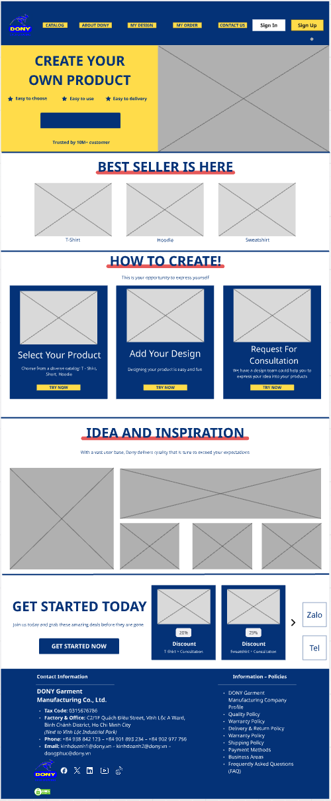

# Screen Spec: S01 Home Page

| Field | Value |
|---|---|
| Screen ID | `S01` |
| Screen name | Home Page |
| Actor | Guest and all authenticated roles |
| Priority | P1 |
| Belongs to module | [MFG-04](../specs/spec-MFG-04.md) |
| Route | `/` |
| Mockup image | img/S01-home_page.png |
| Status | Resolved implementation specification |

## 1. Purpose

**Shown when:** The landing page queries only currently Published products and configured public Dony contacts. It keeps sign-up, sign-in, catalog browsing and named information panels available without exposing staff data. All identifiers and permissions come from the server session; list filters are allowlisted and recoverable failures preserve entered values.

**The user leaves this screen when:** An authorized action in section 5 succeeds, the user follows a role-allowed global route, or they return to the validated originating route.

## 2. Mockup

The homepage's informational process copy must match MFG-06: digital-design approval, physical-sample shipment and approval, contract/deposit, production/delivery, then balance payment. Merge copy must use the versioned MFG-10 discount and timeline; it must not claim a percentage promotion or immediate stock availability.

## 3. Element inventory

| # | Element | Type | Content / data source | Required | Validation |
|---|---|---|---|---|---|
| 1 | Screen heading | Heading | Home Page | Yes | Static route title. |
| 2 | Route | Navigation target | / | Yes | Access checked on server. |
| 3 | product_id | Field / control | UUID, nullable | As specified | product_id: UUID, nullable; only Published products with public-safe name/image/price. |
| 4 | company_name/contact_links | Field / control | strings from configured company profile | As specified | company_name/contact_links: strings from configured company profile; omit unknown contacts. |
| 5 | navigation_visibility | Field / control | role-derived | As specified | Show Sign up/Sign in to Guest; render authenticated navigation from server permissions. |
| 6 | API errors | Field / control | standard API error envelope | As specified | 400 malformed; 422 invalid fields; 409 stale/duplicate; 429 rate limit; 503 dependency failure |
| 7 | Browse published item | Action | Open product detail. | Available when authorized | Destination: S09 |
| 8 | Start customization/request | Action | Preserve intended route through sign-in when needed. | Available when authorized | Destination: S13 or S15 |
| 9 | About/contact/help/policies | Action | Open named content panel on S01; show configured contacts only. | Available when authorized | Destination: S01 panel |

## 4. States

| State | What the user sees | Trigger |
|---|---|---|
| Loading | Load the S01 Home Page view model and show labelled progress; keep writes disabled until route data and authorization are resolved. | Request starts |
| Empty | Show no Published products or configured public links; preserve filters where present and explain eligibility/filter conditions. | Successful query returns no rows |
| Forbidden/not found | Return a safe 401/403/404 for S01 Home Page without revealing inaccessible record, customer, staff or payment details. | 401/403/404 |
| Error | For S01 Home Page, show the API code, message, field_errors and request_id; preserve safe user-entered values. | Request failure |
| Retry | Retry transient reads for S01 Home Page; retry a mutation only with its original idempotency key and identical payload, never as a new side effect. | Recoverable failure |
| Success | Refresh S01 Home Page from the committed server response, expose only the next role/state-allowed action and announce the result via aria-live. | Mutation commits |
| Conflict | For a stale S01 Home Page version or lifecycle state, reload authoritative data, explain the conflict and require explicit review before resubmission. | 409 |

## 5. Interactions and navigation

| # | Element | User action | System response | Goes to screen |
|---|---|---|---|---|
| 1 | Browse published item | Activate | Open product detail. | S09 |
| 2 | Start customization/request | Activate | Preserve intended route through sign-in when needed. | S13 or S15 |
| 3 | About/contact/help/policies | Activate | Open named content panel on S01; show configured contacts only. | S01 panel |

Home and public catalog are available to Guest and authenticated users. Customer designs and customer orders are Customer-only; profile and notifications require authentication. Sales Admin routes: S10, S18, S28, S30, S36, S42 and S43. Sales routes: S20 and assigned-only S21. System Admin routes: S39, S40 and S41. The server rechecks internal role, customer ownership and staff assignment for every route and notification target. Back returns to the validated originating route and preserves list filters; without one, use S26 for Customer, S28 for Sales Admin, S20 for Sales, S41 for System Admin, and S01 for Guest.

## 6. Screen-level rules

| Rule ID | Rule | Source |
|---|---|---|
| SR-001 | Access and ownership are checked server-side; do not trust submitted customer, company, role, price, or provider status. Apply 401/403/404 behavior and the field rules above. | Authorization and data ownership requirements |
| SR-002 | IDs are UUIDs; timestamps are UTC and displayed in Asia/Ho_Chi_Minh; money and quantities are integers. Mutations use expected_version; significant create/sign/pay/batch operations use idempotency keys. | Data representation and concurrency requirements |
| SR-003 | Apply the module lifecycle and validation rules linked below; preserve immutable submitted snapshots. | Module specification |
| SR-004 | Selected product and technical defaults are project implementation decisions; do not invent factual company, author, client-approval, or course identifiers. | Project implementation assumptions |

### Acceptance scenarios

1. When no published products exist, show an honest empty catalog panel and continue navigation.
2. When no Dony public contact is configured, hide contact/social links and render no fabricated values.

## 7. Linked requirements

| FR ID (from the module spec) | What this screen does for it |
|---|---|
| MFG-04/F-PROD-001 | UI touchpoint for **Catalog Grid View**; this screen defines the visible action/result, while the module spec owns server authorization, validation and persistence. |
The rules in this screen and its linked module specifications are complete for implementation.

## 8. Responsive and accessibility notes

Support 360px through desktop; stack columns and use labelled horizontal-scroll tables on narrow screens. Controls are keyboard-operable with visible focus, logical headings, associated form labels, and aria-live status/error announcements. Text contrast is at least 4.5:1 (large text 3:1); pointer targets are at least 24px. Preserve user-entered data after recoverable failures. Confirm destructive actions, disable duplicate submit while pending, and enforce idempotency on the server.

## 9. Open questions

| # | Question | Blocking? | Status |
|---|---|---|---|
| 1 | No unresolved screen behavior questions remain; routes, fields, permissions, and defaults are resolved in this specification and its linked module requirements. | No | Resolved |

## Completion checklist

- [x] Route, actor, module, priority, and mockup status are identified.
- [x] Element fields, actions, validation, and data ownership are documented.
- [x] Loading, empty, forbidden, error, retry, success, and conflict states are documented.
- [x] Navigation and acceptance scenarios are explicit.
- [x] Responsive and accessibility requirements follow the shared baseline.
- [x] No unresolved screen-level decisions remain.
