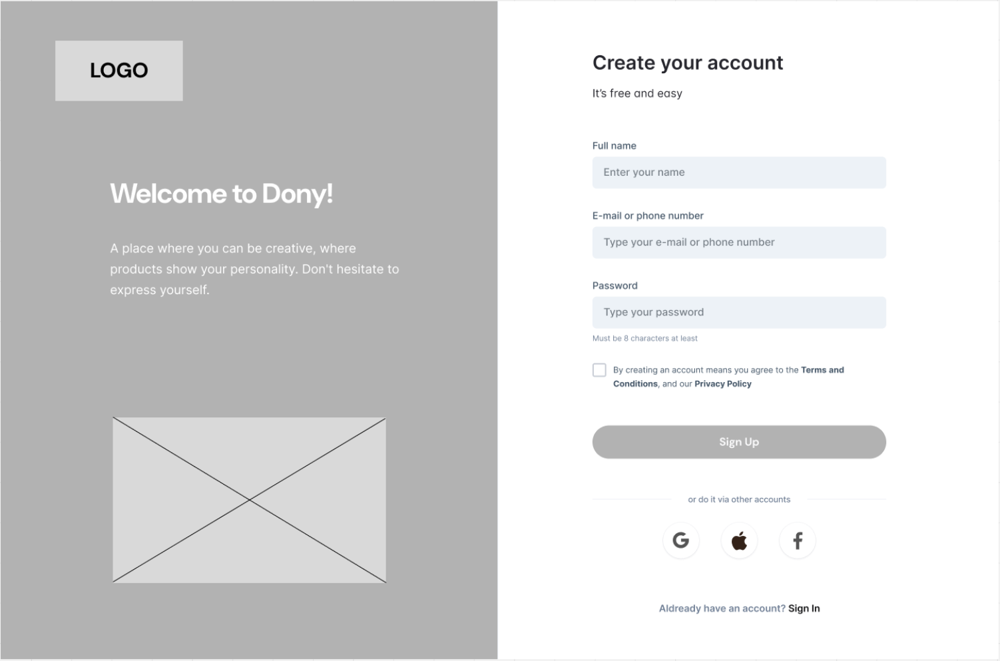

# Screen Spec: S02 Sign Up Screen

<!--

DBIZ3 Session 4 template. One file per screen. Keep the DBIZ2 Screen ID unchanged.

The mockup image stays an image; everything around it becomes text.

-->

| Field | Value |
|---|---|
| Screen ID | `S02` |
| Screen name | Sign Up Screen |
| Actor | Guest |
| Priority | [NEEDS CLARIFICATION: Must / Should / Could not given in Screen List] |
| Belongs to module | `spec-MFG-01.md` [NEEDS CLARIFICATION: file unavailable] |
| Mockup image | `img/S02-sign_up_screen.png` |
| Status | Draft |

## 1. Purpose

**Shown when:** Allow guest users to register a new account.

**The user leaves this screen when:** [NEEDS CLARIFICATION: all exit paths are not specified; documented interactions appear in section 5.]

## 2. Mockup

<!-- The image is the visual contract: spacing, grouping, and hierarchy. The tables below are the behavioural contract. -->

## 3. Element inventory

<!-- Walk the mockup top to bottom, left to right. Every visible element gets a stable name. -->

| # | Element | Type | Content / data source | Required | Validation |
|---|---|---|---|---|---|
| 1 | Brand panel logo | Image | Static LOGO placeholder | No | Not applicable — display only |
| 2 | Brand welcome heading | Header | Static: Welcome to Dony! | No | Not applicable — display only |
| 3 | Brand description | Text | Static welcome copy | No | Not applicable — display only |
| 4 | Brand image | Image | Placeholder | No | Not applicable — display only |
| 5 | Create account heading | Header | Static: Create your account | No | Not applicable — display only |
| 6 | Free and easy subtitle | Text | Static: It’s free and easy | No | Not applicable — display only |
| 7 | Full name label | Text | Static: Full name | No | Not applicable — display only |
| 8 | Full name input | Input | full_name (F-USER-002) | Yes | [NEEDS CLARIFICATION: validation rule not specified] |
| 9 | Email or phone label | Text | Static: E-mail or phone number | No | Not applicable — display only |
| 10 | Email or phone input | Input | [NEEDS CLARIFICATION: screenshot allows email or phone; F-USER-002 requires email, F-USER-003 uses email or phone] | [NEEDS CLARIFICATION: required phone alternative] | [NEEDS CLARIFICATION: validation rule not specified] |
| 11 | Password label | Text | Static: Password | No | Not applicable — display only |
| 12 | Password input | Input | password (F-USER-002) | Yes | At least 8 characters, as printed below input |
| 13 | Password helper | Text | Static: Must be 8 characters at least | No | Not applicable — display only |
| 14 | Terms checkbox | Toggle | Agreement to Terms and Conditions and Privacy Policy | [NEEDS CLARIFICATION: whether mandatory] | [NEEDS CLARIFICATION: validation rule not specified] |
| 15 | Terms and Conditions link | Button | Static: Terms and Conditions | No | Not applicable — display only |
| 16 | Privacy Policy link | Button | Static: Privacy Policy | No | Not applicable — display only |
| 17 | Sign Up submit button | Button | Static: Sign Up | No | Not applicable — display only |
| 18 | Other accounts divider | Text | Static: or do it via other accounts | No | Not applicable — display only |
| 19 | Google sign-up | Button | Google icon | No | Not applicable — display only |
| 20 | Apple sign-up | Button | Apple icon | No | Not applicable — display only |
| 21 | Facebook sign-up | Button | Facebook icon | No | Not applicable — display only |
| 22 | Existing account prompt | Text | Static: Already have an account? | No | Not applicable — display only |
| 23 | Sign In link | Button | Static: Sign In | No | Not applicable — display only |

## 4. States

| State | What the user sees | Trigger |
|---|---|---|
| Default | Blank registration form. | Open S02 |
| Empty (no data) | Blank fields as shown; submit availability [NEEDS CLARIFICATION]. | No relevant records or input |
| Loading | [NEEDS CLARIFICATION: loading treatment while creating account] | Data request or submit in progress |
| Error | [NEEDS CLARIFICATION: field and server error display] | Data request or submit fails |
| Success / confirmation | success_message from F-USER-002; placement and next screen [NEEDS CLARIFICATION]. | Successful relevant action |

## 5. Interactions and navigation

| # | Element | User action | System response | Goes to screen |
|---|---|---|---|---|
| 1 | Full name input | type | Update full_name | stays |
| 2 | Email or phone input | type | Update entered contact value | stays |
| 3 | Password input | type | Update password | stays |
| 4 | Terms checkbox | tap | Toggle agreement | stays |
| 5 | Terms and Conditions link | tap | [NEEDS CLARIFICATION: destination] | stays |
| 6 | Privacy Policy link | tap | [NEEDS CLARIFICATION: destination] | stays |
| 7 | Sign Up submit button | tap | F-USER-002 validates input and creates account; F-USER-003 sends verification; exact next screen unspecified | stays |
| 8 | Google sign-up | tap | [NEEDS CLARIFICATION: social sign-up behavior] | stays |
| 9 | Apple sign-up | tap | [NEEDS CLARIFICATION: social sign-up behavior] | stays |
| 10 | Facebook sign-up | tap | [NEEDS CLARIFICATION: social sign-up behavior] | stays |
| 11 | Sign In link | tap | Open login | S03 |

## 6. Screen-level rules

| Rule ID | Rule | Source |
|---|---|---|
| SR-001 | Password helper states a minimum of 8 characters. | Mockup |

## 7. Linked requirements

| FR ID (from the module spec) | What this screen does for it |
|---|---|
| F-USER-001 [NEEDS CLARIFICATION: module spec unavailable] | Display the registration form for new users to enter their personal account details. |
| F-USER-002 [NEEDS CLARIFICATION: module spec unavailable] | Validate input data and create a new user account record in the database. |
| F-USER-003 [NEEDS CLARIFICATION: module spec unavailable] | Send an OTP code or verification link via Email/SMS to activate the account. |

## 8. Responsive and accessibility notes

- Smallest supported width: [NEEDS CLARIFICATION: not specified in sources.]

- What collapses or stacks on a narrow screen: [NEEDS CLARIFICATION: no narrow-screen mockup or rule provided.]

- Text that must remain readable (contrast, minimum size): [NEEDS CLARIFICATION: no numeric accessibility criteria provided.]

## 9. Open questions

| # | Question | Blocking? | Status |
|---|---|---|---|
| 1 | [NEEDS CLARIFICATION: Screen List does not provide Must / Should / Could priority.] | [NEEDS CLARIFICATION: impact not assessed] | Open |
| 2 | [NEEDS CLARIFICATION: module spec spec-MFG-01.md is not present in project.] | [NEEDS CLARIFICATION: impact not assessed] | Open |
| 3 | [NEEDS CLARIFICATION: smallest supported width, narrow layout, and accessibility minimums are not specified.] | [NEEDS CLARIFICATION: impact not assessed] | Open |
| 4 | [NEEDS CLARIFICATION: Does phone replace email for registration?] | [NEEDS CLARIFICATION: impact not assessed] | Open |
| 5 | [NEEDS CLARIFICATION: Is the terms checkbox required?] | [NEEDS CLARIFICATION: impact not assessed] | Open |
| 6 | [NEEDS CLARIFICATION: What screen follows successful registration or verification?] | [NEEDS CLARIFICATION: impact not assessed] | Open |
| 7 | [NEEDS CLARIFICATION: mockup file uses a descriptive suffix; template assumes img/<SCREEN-ID>.png.] | [NEEDS CLARIFICATION: impact not assessed] | Open |

---

## Completion checklist

- [ ] The mockup is a separate cropped image file, named with the Screen ID. [NEEDS CLARIFICATION: actual image filenames include descriptive suffixes.]

- [x] Every visible element in the mockup appears in the element inventory.

- [x] Every input element has a validation rule or an explicit clarification.

- [x] All five states are filled in, or marked not applicable with a reason.

- [x] Every navigation target is an existing Screen ID or "stays".

- [ ] Every element that displays data names the field it displays, matching the module spec. [NEEDS CLARIFICATION: module specs and several field schemas unavailable.]

---

Template source: DBIZ3, VJCBI College - FTU, Session 4. Built on the DBIZ2 Screen Design structure (Screen List and Screen Layout), per DBIZ3 Syllabus v3.
