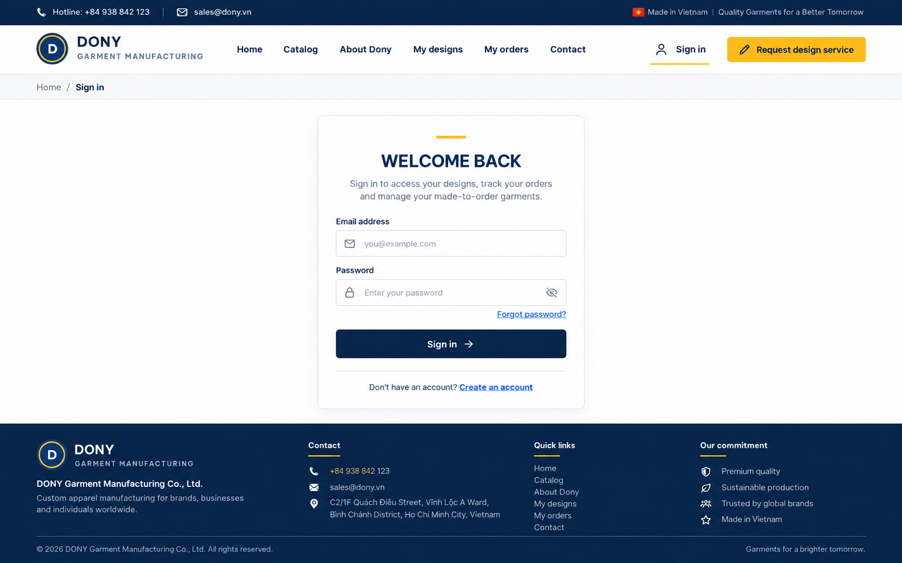

# Screen Spec: S03 Log In

| Field | Value |
|---|---|
| Screen ID | `S03` |
| Screen name | Log In |
| Actor | Guest; invited staff; existing Member accepting staff invitation |
| Priority | P1 |
| Belongs to module | [MFG-01](../specs/spec-MFG-01.md) |
| Route | `/login` |
| Mockup image | img/S03-login_screen.png |
| Status | Resolved implementation specification |

## 1. Purpose

**Shown when:** The form has two explicit modes: email/password authentication and staff invitation acceptance. Invitation acceptance uses the documented existing-account or new-account invitation path. All identifiers and permissions come from the server session; list filters are allowlisted and recoverable failures preserve entered values.

**The user leaves this screen when:** An authorized action in section 5 succeeds, the user follows a role-allowed global route, or they return to the validated originating route.

## 2. Mockup

Written behavior below takes precedence over obsolete sample content.

## 3. Element inventory

| # | Element | Type | Content / data source | Required | Validation |
|---|---|---|---|---|---|
| 1 | Screen heading | Heading | Log In | Yes | Static route title. |
| 2 | Route | Navigation target | /login | Yes | Access checked on server. |
| 3 | mode | Field / control | enum, required | As specified | Login or staff invitation acceptance. resolved identity rule |
| 4 | email | Field / control | string, required | As specified | Trim and case-normalize; global uniqueness. |
| 5 | password | Field / control | secret, required for login | As specified | Verify hash; never log or echo. |
| 6 | return_to | Field / control | internal URL, optional | As specified | Allowlisted route only; reject external redirects. |
| 7 | invitation_token | Field / control | secret, required in invitation mode | As specified | Hashed, single use, 48-hour expiry. |
| 8 | full_name / new_password | Field / control | string/secret, required for invited new staff | As specified | full_name 1..100; password 12..128; existing account authenticates then accepts invite. |
| 9 | failed attempts | Field / control | server counter | As specified | Limit 5 per account/IP within 15 minutes; return 429. |
| 10 | Authenticate | Action | Verify hash/rate limit, set secure session cookie, redirect to allowlisted return_to or authenticated role documented role default. | Available when authorized | Destination: return_to or role default |
| 11 | Accept invitation | Action | Existing identity authenticates then accepts; new invitee supplies full_name/password; consume invite and activate membership atomically. | Available when authorized | Destination: S41 completion, then role default |
| 12 | Forgot password | Action | Open recovery. | Available when authorized | Destination: S04 |
| 13 | Register | Action | Open registration. | Available when authorized | Destination: S02 |

## 4. States

| State | What the user sees | Trigger |
|---|---|---|
| Loading | Labelled progress/skeleton; disable duplicate submit. | Request starts |
| Empty | Render the screen-specific form/detail state; if a required route object is absent, show safe not-found and return to the authorized parent route. | Empty initial form or missing detail payload |
| Forbidden/not found | Safe message without revealing inaccessible identifiers. | 401/403/404 |
| Error | Show code, message, field_errors, request_id; preserve entered values. | Request failure |
| Retry | Retry reads on transient failure; reuse the same idempotency key only for mutations that require one for the documented mutation. | Recoverable failure |
| Success | Show committed state and next valid action; announce via aria-live. | Mutation commits |
| Conflict | Explain stale state; reload; never silently overwrite. | 409 |

## 5. Interactions and navigation

| # | Element | User action | System response | Goes to screen |
|---|---|---|---|---|
| 1 | Authenticate | Activate | Verify hash/rate limit, set secure session cookie, redirect to allowlisted return_to or authenticated role documented role default. | return_to or role default |
| 2 | Accept invitation | Activate | Existing identity authenticates then accepts; new invitee supplies full_name/password; consume invite and activate membership atomically. | S41 completion, then role default |
| 3 | Forgot password | Activate | Open recovery. | S04 |
| 4 | Register | Activate | Open registration. | S02 |

Home and public catalog are available to Guest and authenticated users. Customer designs and customer orders are Customer-only; profile and notifications require authentication. Company Admin routes: S10, S18, S28, S30, S36, S42 and S43. Sales Consultant routes: S20 and assigned-only S21. System Admin routes: S39, S40 and S41. The server rechecks role, company, membership, ownership and assignment for every route and notification target. Back returns to the validated originating route and preserves list filters; without one, use S26 for Customer, S28 for Company Admin, S20 for Sales Consultant, S41 for System Admin, and S01 for Guest.

## 6. Screen-level rules

| Rule ID | Rule | Source |
|---|---|---|
| SR-001 | Access and ownership are checked server-side; do not trust submitted customer, company, role, price, or provider status. Apply 401/403/404 behavior and the field rules above. | Authorization and data ownership requirements |
| SR-002 | IDs are UUIDs; timestamps are UTC and displayed in Asia/Ho_Chi_Minh; money and quantities are integers. Mutations use expected_version; significant create/sign/pay/batch operations use idempotency keys. | Data representation and concurrency requirements |
| SR-003 | Apply the module lifecycle and validation rules linked below; preserve immutable submitted snapshots. | Module specification |
| SR-004 | Selected product and technical defaults are project implementation decisions; do not invent factual company, author, client-approval, or course identifiers. | Project implementation assumptions |

### Acceptance scenarios

1. With valid credentials, establish secure HttpOnly SameSite=Lax session and use only internal return route.
2. After five failed attempts per account/IP in 15m, reject further login attempts with 429.
3. Given a valid staff invitation, an existing identity must authenticate before atomic membership activation; a new invitee supplies name/password, consumes the invite once, and reaches the invited role's default route.

## 7. Linked requirements

| FR ID (from the module spec) | What this screen does for it |
|---|---|
| MFG-01/F-USER-004 | Implements this screen's validated user flow and the linked source function. |
| MFG-01/F-USER-005 | Implements this screen's validated user flow and the linked source function. |
The rules in this screen and its linked module specifications are complete for implementation.

## 8. Responsive and accessibility notes

Support 360px through desktop; stack columns and use labelled horizontal-scroll tables on narrow screens. Controls are keyboard-operable with visible focus, logical headings, associated form labels, and aria-live status/error announcements. Text contrast is at least 4.5:1 (large text 3:1); pointer targets are at least 24px. Preserve user-entered data after recoverable failures. Confirm destructive actions, disable duplicate submit while pending, and enforce idempotency on the server.

## 9. Open questions

| # | Question | Blocking? | Status |
|---|---|---|---|
| 1 | No unresolved screen behavior questions remain; routes, fields, permissions, and defaults are resolved in this specification and its linked module requirements. | No | Resolved |

## Completion checklist

- [x] Route, actor, module, priority, and mockup status are identified.
- [x] Element fields, actions, validation, and data ownership are documented.
- [x] Loading, empty, forbidden, error, retry, success, and conflict states are documented.
- [x] Navigation and acceptance scenarios are explicit.
- [x] Responsive and accessibility requirements follow the shared baseline.
- [x] No unresolved screen-level decisions remain.
