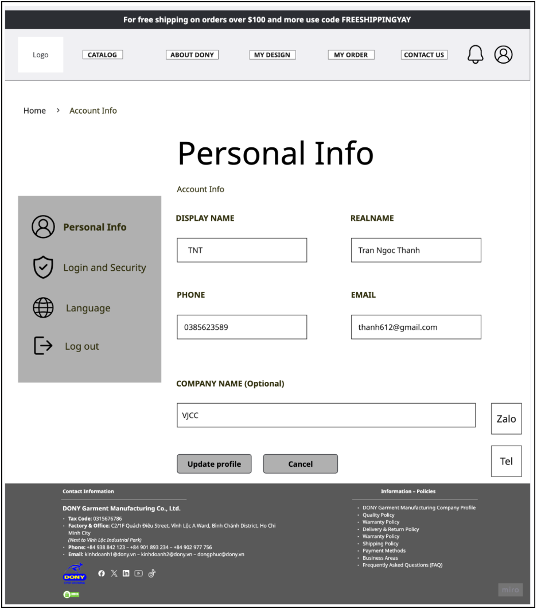

# Screen Spec: S06 User Profile

| Field | Value |
|---|---|
| Screen ID | `S06` |
| Screen name | User Profile |
| Actor | Member |
| Priority | P3 |
| Belongs to module | [MFG-02](../specs/spec-MFG-02.md) |
| Route | `/profile` |
| Mockup image | img/S06-user_profile_screen.png |
| Status | Resolved implementation specification |

## 1. Purpose

**Shown when:** The signed-in user can edit full_name and request a pending email change. The current email remains active until the new address is verified; memberships are display-only. All identifiers and permissions come from the server session; list filters are allowlisted and recoverable failures preserve entered values.

**The user leaves this screen when:** An authorized action in section 5 succeeds, the user follows a role-allowed global route, or they return to the validated originating route.

## 2. Mockup

Written behavior below takes precedence over obsolete sample content.

## 3. Element inventory

| # | Element | Type | Content / data source | Required | Validation |
|---|---|---|---|---|---|
| 1 | Screen heading | Heading | User Profile | Yes | Static route title. |
| 2 | Route | Navigation target | /profile | Yes | Access checked on server. |
| 3 | full_name | Field / control | string, required | As specified | Editable; trim; length 1..100. |
| 4 | email | Field / control | normalized email, read-only display | As specified | Change flow requests new email and verifies it before replacement; email remains globally unique. resolved identity rule |
| 5 | pending_email | Field / control | normalized email, optional | As specified | Show pending verification status; current email remains active until verified. resolved identity rule |
| 6 | role memberships | Field / control | enum array, read-only | As specified | Display assigned roles; Member cannot assign self. |
| 7 | expected_version | Field / control | version, required on update | As specified | Stale profile edit returns 409. |
| 8 | Save profile | Action | Check expected_version, update full_name and updated_at. | Available when authorized | Destination: S06 |
| 9 | Change password | Action | Open current/new password form. | Available when authorized | Destination: S07 |
| 10 | Change email | Action | Save a unique pending email and send verification; keep current email active until verified. | Available when authorized | Destination: S06 |
| 11 | Sign out | Action | Revoke current session, clear cookie, record audit event. | Available when authorized | Destination: S03 |

## 4. States

| State | What the user sees | Trigger |
|---|---|---|
| Loading | Load the S06 User Profile view model and show labelled progress; keep writes disabled until route data and authorization are resolved. | Request starts |
| Empty | Render the defined initial/empty state for S06 User Profile; if a required route object is absent, return a safe 404 and the authorized parent route. | Empty initial form or missing detail payload |
| Forbidden/not found | Return a safe 401/403/404 for S06 User Profile without revealing inaccessible record, customer, staff or payment details. | 401/403/404 |
| Error | For S06 User Profile, show the API code, message, field_errors and request_id; preserve safe user-entered values. | Request failure |
| Retry | Retry transient reads for S06 User Profile; retry a mutation only with its original idempotency key and identical payload, never as a new side effect. | Recoverable failure |
| Success | Refresh S06 User Profile from the committed server response, expose only the next role/state-allowed action and announce the result via aria-live. | Mutation commits |
| Conflict | For a stale S06 User Profile version or lifecycle state, reload authoritative data, explain the conflict and require explicit review before resubmission. | 409 |

## 5. Interactions and navigation

| # | Element | User action | System response | Goes to screen |
|---|---|---|---|---|
| 1 | Save profile | Activate | Check expected_version, update full_name and updated_at. | S06 |
| 2 | Change password | Activate | Open current/new password form. | S07 |
| 3 | Change email | Activate | Store a unique pending_email; keep current email until verification succeeds. | S06 |
| 4 | Sign out | Activate | Revoke current session, clear cookie, record audit event. | S03 |

Home and public catalog are available to Guest and authenticated users. Customer designs and customer orders are Customer-only; profile and notifications require authentication. Sales Admin routes: S10, S18, S28, S30, S36, S42 and S43. Sales routes: S20 and assigned-only S21. System Admin routes: S39, S40 and S41. The server rechecks internal role, customer ownership and staff assignment for every route and notification target. Back returns to the validated originating route and preserves list filters; without one, use S26 for Customer, S28 for Sales Admin, S20 for Sales, S41 for System Admin, and S01 for Guest.

## 6. Screen-level rules

| Rule ID | Rule | Source |
|---|---|---|
| SR-001 | Access and ownership are checked server-side; do not trust submitted customer, company, role, price, or provider status. Apply 401/403/404 behavior and the field rules above. | Authorization and data ownership requirements |
| SR-002 | IDs are UUIDs; timestamps are UTC and displayed in Asia/Ho_Chi_Minh; money and quantities are integers. Mutations use expected_version; significant create/sign/pay/batch operations use idempotency keys. | Data representation and concurrency requirements |
| SR-003 | Apply the module lifecycle and validation rules linked below; preserve immutable submitted snapshots. | Module specification |
| SR-004 | Selected product and technical defaults are project implementation decisions; do not invent factual company, author, client-approval, or course identifiers. | Project implementation assumptions |

### Acceptance scenarios

1. A user can update only own full_name; stale expected_version returns 409 without overwriting.
2. Role display cannot be edited by Member; logout revokes current server session.

## 7. Linked requirements

| FR ID (from the module spec) | What this screen does for it |
|---|---|
| MFG-02/F-PROF-001 | UI touchpoint for **Profile View**; this screen defines the visible action/result, while the module spec owns server authorization, validation and persistence. |
| MFG-02/F-PROF-002 | UI touchpoint for **Edit Profile Form**; this screen defines the visible action/result, while the module spec owns server authorization, validation and persistence. |
| MFG-02/F-PROF-003 | UI touchpoint for **Save Profile Logic**; this screen defines the visible action/result, while the module spec owns server authorization, validation and persistence. |
The rules in this screen and its linked module specifications are complete for implementation.

## 8. Responsive and accessibility notes

Support 360px through desktop; stack columns and use labelled horizontal-scroll tables on narrow screens. Controls are keyboard-operable with visible focus, logical headings, associated form labels, and aria-live status/error announcements. Text contrast is at least 4.5:1 (large text 3:1); pointer targets are at least 24px. Preserve user-entered data after recoverable failures. Confirm destructive actions, disable duplicate submit while pending, and enforce idempotency on the server.

## 9. Open questions

| # | Question | Blocking? | Status |
|---|---|---|---|
| 1 | No unresolved screen behavior questions remain; routes, fields, permissions, and defaults are resolved in this specification and its linked module requirements. | No | Resolved |

## Completion checklist

- [x] Route, actor, module, priority, and mockup status are identified.
- [x] Element fields, actions, validation, and data ownership are documented.
- [x] Loading, empty, forbidden, error, retry, success, and conflict states are documented.
- [x] Navigation and acceptance scenarios are explicit.
- [x] Responsive and accessibility requirements follow the shared baseline.
- [x] No unresolved screen-level decisions remain.
