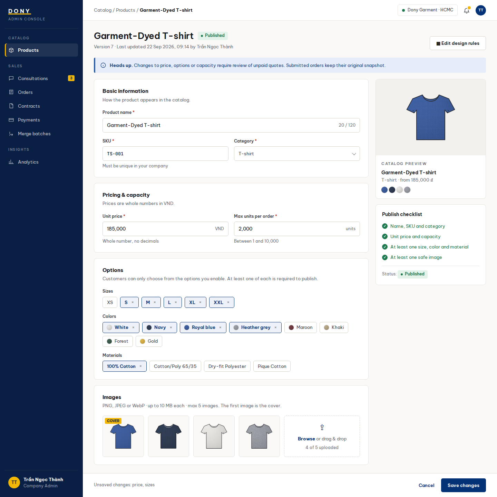

# Screen Spec: S12 Product Edit

| Field | Value |
|---|---|
| Screen ID | `S12` |
| Screen name | Product Edit |
| Actor | Sales Admin |
| Priority | P2 |
| Belongs to module | [MFG-04](../specs/spec-MFG-04.md) |
| Route | `/admin/products/{product_id}/edit` |
| Mockup image | img/S12-product_edit_screen.png |
| Status | Resolved implementation specification |

## 1. Purpose

**Shown when:** A Sales Admin edits a Dony-owned configurable garment base using version checks. Publishing requires all required production and design-rule fields; submitted order snapshots remain unchanged. The record is not finished-goods inventory. All identifiers and permissions come from the server session; list filters are allowlisted and recoverable failures preserve entered values.

**The user leaves this screen when:** An authorized action in section 5 succeeds, the user follows a role-allowed global route, or they return to the validated originating route.

## 2. Mockup

Written behavior below takes precedence over obsolete sample content.

## 3. Element inventory

| # | Element | Type | Content / data source | Required | Validation |
|---|---|---|---|---|---|
| 1 | Screen heading | Heading | Product Edit | Yes | Static route title. |
| 2 | Route | Navigation target | /admin/products/{product_id}/edit | Yes | Access checked on server. |
| 3 | product_id | Field / control | UUID, required | As specified | Current Dony-owned product base. |
| 4 | name/sku/category | Field / control | string, required | As specified | Same constraints as S11; SKU unique across Dony's single product catalogue. |
| 5 | unit_price_vnd | Field / control | integer, required | As specified | Nonnegative integer VND. |
| 6 | supported options/capacity | Field / control | arrays/integer | As specified | Current product rules; max_units_per_order 1..10000. |
| 7 | expected_version | Field / control | version, required | As specified | Stale edit returns 409. |
| 8 | quote consequence | Field / control | server state | As specified | Rule changes invalidate old quote for review; submitted snapshots unchanged. |
| 9 | Save changes | Action | Check expected_version; persist changes; invalidate/requote affected unpaid quote. | Available when authorized | Destination: S10 |
| 10 | Edit design rules | Action | Open rules editor. | Available when authorized | Destination: S14 |
| 11 | Cancel | Action | Discard edits. | Available when authorized | Destination: S10 |

## 4. States

| State | What the user sees | Trigger |
|---|---|---|
| Loading | Labelled progress/skeleton; disable duplicate submit. | Request starts |
| Empty | Render the screen-specific form/detail state; if a required route object is absent, show safe not-found and return to the authorized parent route. | Empty initial form or missing detail payload |
| Forbidden/not found | Safe message without revealing inaccessible identifiers. | 401/403/404 |
| Error | Show code, message, field_errors, request_id; preserve entered values. | Request failure |
| Retry | Retry reads on transient failure; reuse the same idempotency key only for mutations that require one for the documented mutation. | Recoverable failure |
| Success | Show committed state and next valid action; announce via aria-live. | Mutation commits |
| Conflict | Explain stale state; reload; never silently overwrite. | 409 |

## 5. Interactions and navigation

| # | Element | User action | System response | Goes to screen |
|---|---|---|---|---|
| 1 | Save changes | Activate | Check expected_version; persist changes; invalidate/requote affected unpaid quote. | S10 |
| 2 | Edit design rules | Activate | Open rules editor. | S14 |
| 3 | Cancel | Activate | Discard edits. | S10 |

Home and public catalog are available to Guest and authenticated users. Customer designs and customer orders are Customer-only; profile and notifications require authentication. Sales Admin routes: S10, S18, S28, S30, S36, S42 and S43. Sales routes: S20 and assigned-only S21. System Admin routes: S39, S40 and S41. The server rechecks internal role, customer ownership and staff assignment for every route and notification target. Back returns to the validated originating route and preserves list filters; without one, use S26 for Customer, S28 for Sales Admin, S20 for Sales, S41 for System Admin, and S01 for Guest.

## 6. Screen-level rules

| Rule ID | Rule | Source |
|---|---|---|
| SR-001 | Access and ownership are checked server-side; do not trust submitted customer, company, role, price, or provider status. Apply 401/403/404 behavior and the field rules above. | Authorization and data ownership requirements |
| SR-002 | IDs are UUIDs; timestamps are UTC and displayed in Asia/Ho_Chi_Minh; money and quantities are integers. Mutations use expected_version; significant create/sign/pay/batch operations use idempotency keys. | Data representation and concurrency requirements |
| SR-003 | Apply the module lifecycle and validation rules linked below; preserve immutable submitted snapshots. | Module specification |
| SR-004 | Selected product and technical defaults are project implementation decisions; do not invent factual company, author, client-approval, or course identifiers. | Project implementation assumptions |

### Acceptance scenarios

1. A current-version update saves and increments product version; stale version returns 409.
2. Changed rules invalidate affected outstanding quote for explicit review; signed/submitted snapshots remain unchanged.

## 7. Linked requirements

| FR ID (from the module spec) | What this screen does for it |
|---|---|
| MFG-04/F-PROD-007 | Implements this screen's validated user flow and the linked source function. |
| MFG-04/F-PROD-008 | Implements this screen's validated user flow and the linked source function. |
The rules in this screen and its linked module specifications are complete for implementation.

## 8. Responsive and accessibility notes

Support 360px through desktop; stack columns and use labelled horizontal-scroll tables on narrow screens. Controls are keyboard-operable with visible focus, logical headings, associated form labels, and aria-live status/error announcements. Text contrast is at least 4.5:1 (large text 3:1); pointer targets are at least 24px. Preserve user-entered data after recoverable failures. Confirm destructive actions, disable duplicate submit while pending, and enforce idempotency on the server.

## 9. Open questions

| # | Question | Blocking? | Status |
|---|---|---|---|
| 1 | No unresolved screen behavior questions remain; routes, fields, permissions, and defaults are resolved in this specification and its linked module requirements. | No | Resolved |

## Completion checklist

- [x] Route, actor, module, priority, and mockup status are identified.
- [x] Element fields, actions, validation, and data ownership are documented.
- [x] Loading, empty, forbidden, error, retry, success, and conflict states are documented.
- [x] Navigation and acceptance scenarios are explicit.
- [x] Responsive and accessibility requirements follow the shared baseline.
- [x] No unresolved screen-level decisions remain.
