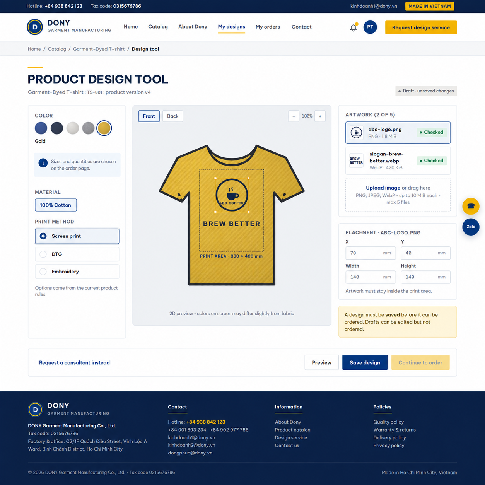

# Screen Spec: S13 Product Design Tool

| Field | Value |
|---|---|
| Screen ID | `S13` |
| Screen name | Product Design Tool |
| Actor | Customer owner |
| Priority | P1 |
| Belongs to module | [MFG-05](../specs/spec-MFG-05.md) |
| Route | `/designs/new?product_id={id}` |
| Mockup image | img/S13-product_design_tool_screen.png |
| Status | Resolved implementation specification |

## 1. Purpose

**Shown when:** The customer edits a private 2D garment design tied to an owned product version. The existing design workflow is a 2D front/back garment canvas with product-supported colour, material and print-method choices; size is not selected or saved here. The order screen S22 selects sizes and quantities. Up to five uploaded artwork assets can be positioned and resized within the selected printable area. Saving creates an immutable version; ordered snapshots are never overwritten. If the reference image depicts a size selector, it is obsolete; do not implement it. This screen does not reduce the workflow to a single-side canvas or introduce a fixed revision limit.

**The user leaves this screen when:** An authorized action in section 5 succeeds, the user follows a role-allowed global route, or they return to the validated originating route.

## 2. Mockup

The image documents the existing intended editor controls (front/back canvas, product options, artwork list, placement dimensions, draft state, preview and save). Written rules below govern validation and versioning; image/sample values do not override product rules.

## 3. Element inventory

| # | Element | Type | Content / data source | Required | Validation |
|---|---|---|---|---|---|
| 1 | Screen heading | Heading | Product Design Tool | Yes | Static route title. |
| 2 | Route | Navigation target | /designs/new?product_id={id} | Yes | Access checked on server. |
| 3 | product_id / product_version | Server-bound product selection | Published garment base and immutable rule version | Yes | If the product is unpublished or version changes before save, return 409 and preserve the draft for reload/revalidation. |
| 4 | Colour, material, print method | Product option selectors | Allowed values and compatibility from current MFG-04 rules | Yes | A selected combination must be enabled for the product/version; size is selected per order on S22, not stored in the design. |
| 5 | Front / Back canvas tabs | Canvas surface selector | Independently configured printable areas for the chosen product; seed area is 300 × 400 mm on both sides for S/M/L/XL | At least one supported surface | Switching surface preserves that surface's artwork placements; unsupported sides are disabled, not inferred. |
| 6 | Artwork upload/list | Multi-file uploader and asset list | PNG/JPEG/WebP, max 10 MiB each, max 5 assets | Optional until user adds artwork | Validate actual MIME, scan result and ownership; reject unsupported/unsafe files without losing other draft settings. |
| 7 | Artwork placement | Drag/resize handles and numeric X, Y, width, height (mm) | Coordinates relative to selected print area's top-left | Required for each placed asset | Entire artwork bounds must remain inside printable area; positive dimensions; invalid placement cannot preview/save. No rotation or text tool is implied. |
| 8 | Zoom and draft indicator | Canvas controls/status | View-only zoom; unsaved changes indicator | Yes | Zoom does not change saved physical coordinates; leaving with unsaved edits prompts to save or discard. |
| 9 | Preview | Action | Render selected garment options and front/back artwork using current product rules | Available when configuration validates | Preview is non-persistent; unsafe or stale assets/rules block rendering with actionable error. |
| 10 | Save design | Primary action | Persist a new immutable Saved version owned by Customer | Available when configuration validates | Require expected product/design version and idempotency key; do not overwrite versions referenced by orders. |
| 11 | Continue to order | Primary action | Open S22 with the saved design/version | Saved version required | Draft or failed-save configurations are not orderable. |
| 12 | Request consultant | Secondary action | Open S15 for the separate assessed-design request | Could; only if service available | Does not mutate this saved design or incur a fee until the MFG-05 assessment/acceptance flow completes. |
| 13 | API errors | Inline error/alert | Standard API error envelope | On failure | 400 malformed; 422 invalid fields; 409 stale/duplicate; 429 rate limit; 503 dependency failure; preserve recoverable edits. |

## 4. States

| State | What the user sees | Trigger |
|---|---|---|
| Loading | Load the S13 Product Design Tool view model and show labelled progress; keep writes disabled until route data and authorization are resolved. | Request starts |
| Empty | Open an unconfigured draft with no artwork; require a supported product option before preview/save. | Screen has no eligible or matching record |
| Forbidden/not found | Return a safe 401/403/404 for S13 Product Design Tool without revealing inaccessible record, customer, staff or payment details. | 401/403/404 |
| Error | For S13 Product Design Tool, show the API code, message, field_errors and request_id; preserve safe user-entered values. | Request failure |
| Retry | Retry transient reads for S13 Product Design Tool; retry a mutation only with its original idempotency key and identical payload, never as a new side effect. | Recoverable failure |
| Success | Persist a new immutable design version; show version/status and offer S17 or S22. | Valid action commits |
| Conflict | Product/design version changed: preserve local placements, reload printable-area rules, and require review before saving. | Stale version, duplicate or invalid lifecycle transition |
## 5. Interactions and navigation

| # | Element | User action | System response | Goes to screen |
|---|---|---|---|---|
| 1 | Front/Back canvas | Select tab | Switch printable surface while preserving that surface's artwork placement draft. | S13 |
| 2 | Add artwork | Upload file | Validate file type, size, scan status and max-five limit; add only a safe asset to the draft. | S13 |
| 3 | Artwork placement | Drag/resize or edit X/Y/width/height | Keep the complete artwork bounds inside the selected print area; show an inline error otherwise. | S13 |
| 4 | Preview | Activate | Render the current valid option and artwork configuration without saving. | S13 |
| 5 | Save design | Activate | Save a new immutable version; show version/status and route to customer designs. | S17 |
| 6 | Continue to order | Activate | Continue only with a successfully saved version. | S22 |
| 7 | Request consultant | Activate | Open the separate MFG-05 service-request flow; no fee is charged at this step. | S15 |

Portal: Customer owner. Route: /designs/new?product_id={id}. Back preserves the originating route and filters. Fallback: Customer→S26; Sales Admin→S28; Sales→S20; System Admin→S41; Guest→S01. Enforce role, ownership and assignment before rendering.

## 6. Screen-level rules

| Rule ID | Rule | Source |
|---|---|---|
| SR-001 | Access and ownership are checked server-side; do not trust submitted customer, company, role, price, or provider status. Apply 401/403/404 behavior and the field rules above. | Authorization and data ownership requirements |
| SR-002 | IDs are UUIDs; timestamps are UTC and displayed in Asia/Ho_Chi_Minh; money and quantities are integers. Mutations use expected_version; significant create/sign/pay/batch operations use idempotency keys. | Data representation and concurrency requirements |
| SR-003 | Apply the module lifecycle and validation rules linked below; preserve immutable submitted snapshots. | Module specification |
| SR-004 | Selected product and technical defaults are project implementation decisions; do not invent factual company, author, client-approval, or course identifiers. | Project implementation assumptions |

### Acceptance scenarios

1. Saved design stores product and rule versions plus customer ownership; image is private scanned asset.
2. Draft cannot be ordered; invalid coordinate or changed rule blocks save and preserves editable configuration.

## 7. Linked requirements

| FR ID (from the module spec) | What this screen does for it |
|---|---|
| MFG-05/F-DES-001 | **Design Product** — Render the design workspace using current Published product rules and options. |
| MFG-05/F-DES-002 | **Design Product** — Validate compatibility/assets and produce a nonpersistent 2D preview. |
| MFG-05/F-DES-003 | **Design Product** — Save an immutable design version transactionally with idempotency; preserve source_design_request_id on derived copies/versions. |

## 8. Responsive and accessibility notes

Support 360px through desktop; stack columns and use labelled horizontal-scroll tables on narrow screens. Controls are keyboard-operable with visible focus, logical headings, associated form labels, and aria-live status/error announcements. Text contrast is at least 4.5:1 (large text 3:1); pointer targets are at least 24px. Preserve user-entered data after recoverable failures. Confirm destructive actions, disable duplicate submit while pending, and enforce idempotency on the server.

## 9. Open questions

| # | Question | Blocking? | Status |
|---|---|---|---|
| 1 | No unresolved screen behavior questions remain; routes, fields, permissions, and defaults are resolved in this specification and its linked module requirements. | No | Resolved |

## Completion checklist

- [x] Route, actor, module, priority, and mockup status are identified.
- [x] Element fields, actions, validation, and data ownership are documented.
- [x] Loading, empty, forbidden, error, retry, success, and conflict states are documented.
- [x] Navigation and acceptance scenarios are explicit.
- [x] Responsive and accessibility requirements follow the shared baseline.
- [x] No unresolved screen-level decisions remain.
