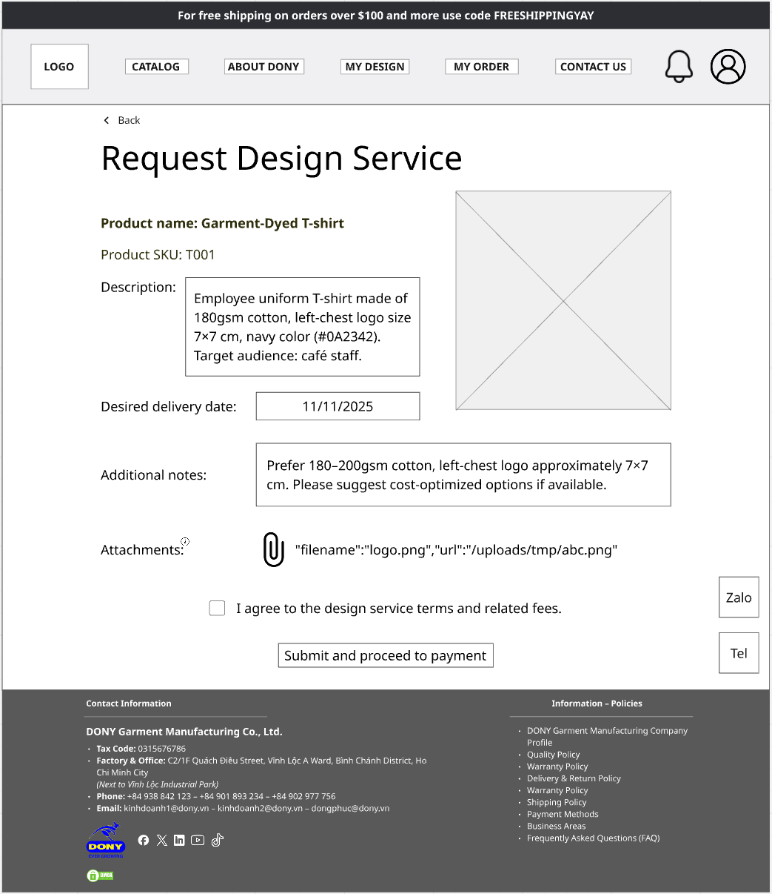

# Screen Spec: S15 Design Service Request Screen

<!--

DBIZ3 Session 4 template. One file per screen. Keep the DBIZ2 Screen ID unchanged.

The mockup image stays an image; everything around it becomes text.

-->

| Field | Value |
|---|---|
| Screen ID | `S15` |
| Screen name | Design Service Request Screen |
| Actor | Customer |
| Priority | [NEEDS CLARIFICATION: Must / Should / Could not given in Screen List] |
| Belongs to module | `spec-MFG-05.md` [NEEDS CLARIFICATION: file unavailable] |
| Mockup image | `img/S15-design_service_request_screen.png` |
| Status | Draft |

## 1. Purpose

**Shown when:** Allow customers to submit design service requests with requirements.

**The user leaves this screen when:** [NEEDS CLARIFICATION: all exit paths are not specified; documented interactions appear in section 5.]

## 2. Mockup

<!-- The image is the visual contract: spacing, grouping, and hierarchy. The tables below are the behavioural contract. -->

## 3. Element inventory

<!-- Walk the mockup top to bottom, left to right. Every visible element gets a stable name. -->

| # | Element | Type | Content / data source | Required | Validation |
|---|---|---|---|---|---|
| 1 | Shipping promotion banner | Text | Static: For free shipping on orders over $100 and more use code FREESHIPPINGYAY | No | Not applicable — display only |
| 2 | Header logo | Image | Static logo placeholder | No | Not applicable — display only |
| 3 | Catalog navigation | Button | Static: CATALOG | No | Not applicable — display only |
| 4 | About Dony navigation | Button | Static: ABOUT DONY | No | Not applicable — display only |
| 5 | My Design navigation | Button | Static: MY DESIGN | No | Not applicable — display only |
| 6 | My Order navigation | Button | Static: MY ORDER | No | Not applicable — display only |
| 7 | Contact Us navigation | Button | Static: CONTACT US | No | Not applicable — display only |
| 8 | Notification bell | Button | Bell icon | No | Not applicable — display only |
| 9 | Account icon | Button | Account icon | No | Not applicable — display only |
| 10 | Back link | Button | Static: Back | No | Not applicable — display only |
| 11 | Request heading | Header | Static: Request Design Service | No | Not applicable — display only |
| 12 | Product name | Text | base product name [NEEDS CLARIFICATION: request field mapping] | No | Not applicable — display only |
| 13 | Product SKU | Text | base product SKU [NEEDS CLARIFICATION: request field mapping] | No | Not applicable — display only |
| 14 | Description label | Text | Static: Description | No | Not applicable — display only |
| 15 | Description input | Input | requirement_text (F-DES-006) | Yes | [NEEDS CLARIFICATION: validation rule not specified] |
| 16 | Product image | Image | Base product image placeholder | No | Not applicable — display only |
| 17 | Desired delivery date label | Text | Static: Desired delivery date | No | Not applicable — display only |
| 18 | Desired delivery date input | Input | deadline (F-DES-006) | Yes | [NEEDS CLARIFICATION: date constraints not specified] |
| 19 | Additional notes label | Text | Static: Additional notes | No | Not applicable — display only |
| 20 | Additional notes input | Input | [NEEDS CLARIFICATION: field absent from F-DES-006] | [NEEDS CLARIFICATION] | [NEEDS CLARIFICATION: validation rule not specified] |
| 21 | Attachments label | Text | Static: Attachments | No | Not applicable — display only |
| 22 | Attachments control | Button | attached_ref_images (F-DES-006); paperclip icon and filename/URL text | No | Not applicable — display only |
| 23 | Agreement checkbox | Toggle | Agreement to design service terms and related fees | [NEEDS CLARIFICATION: mandatory status] | [NEEDS CLARIFICATION: validation rule not specified] |
| 24 | Agreement text | Text | Static: I agree to the design service terms and related fees. | No | Not applicable — display only |
| 25 | Submit and proceed button | Button | Static: Submit and proceed to payment | No | Not applicable — display only |
| 26 | Zalo contact button | Button | Static: Zalo | No | Not applicable — display only |
| 27 | Telephone contact button | Button | Static: Tel | No | Not applicable — display only |
| 28 | Footer contact heading | Text | Static: Contact Information | No | Not applicable — display only |
| 29 | Company name | Text | Static: DONY Garment Manufacturing Co., Ltd. | No | Not applicable — display only |
| 30 | Tax code | Text | Static: 0315676786 | No | Not applicable — display only |
| 31 | Factory and office address | Text | Static address printed in mockup | No | Not applicable — display only |
| 32 | Phone numbers | Text | Static phone numbers printed in mockup | No | Not applicable — display only |
| 33 | Email addresses | Text | Static email addresses printed in mockup | No | Not applicable — display only |
| 34 | Footer DONY logo | Image | Static DONY logo | No | Not applicable — display only |
| 35 | Footer Facebook icon | Button | Facebook icon | No | Not applicable — display only |
| 36 | Footer X icon | Button | X icon | No | Not applicable — display only |
| 37 | Footer LinkedIn icon | Button | LinkedIn icon | No | Not applicable — display only |
| 38 | Footer YouTube icon | Button | YouTube icon | No | Not applicable — display only |
| 39 | Footer TikTok icon | Button | TikTok icon | No | Not applicable — display only |
| 40 | Footer certification badge | Image | Green certification badge | No | Not applicable — display only |
| 41 | Footer policy heading | Text | Static: Information - Policies | No | Not applicable — display only |
| 42 | Company profile link | Button | Static: DONY Garment Manufacturing Company Profile | No | Not applicable — display only |
| 43 | Quality policy link | Button | Static: Quality Policy | No | Not applicable — display only |
| 44 | Warranty policy link | Button | Static: Warranty Policy | No | Not applicable — display only |
| 45 | Delivery and return policy link | Button | Static: Delivery & Return Policy | No | Not applicable — display only |
| 46 | Second warranty policy link | Button | Static: Warranty Policy (repeated in mockup) | No | Not applicable — display only |
| 47 | Shipping policy link | Button | Static: Shipping Policy | No | Not applicable — display only |
| 48 | Payment methods link | Button | Static: Payment Methods | No | Not applicable — display only |
| 49 | Business areas link | Button | Static: Business Areas | No | Not applicable — display only |
| 50 | FAQ link | Button | Static: Frequently Asked Questions (FAQ) | No | Not applicable — display only |

## 4. States

| State | What the user sees | Trigger |
|---|---|---|
| Default | Pre-filled design request example. | Open S15 |
| Empty (no data) | [NEEDS CLARIFICATION: empty form and absent product image handling] | No relevant records or input |
| Loading | [NEEDS CLARIFICATION: request submission loading treatment] | Data request or submit in progress |
| Error | [NEEDS CLARIFICATION: request error treatment] | Data request or submit fails |
| Success / confirmation | Request record created; payment screen S16. | Successful relevant action |

## 5. Interactions and navigation

| # | Element | User action | System response | Goes to screen |
|---|---|---|---|---|
| 1 | Header logo | tap | Open home page | S01 |
| 2 | Catalog navigation | tap | Open product catalog | S08 |
| 3 | About Dony navigation | tap | [NEEDS CLARIFICATION: destination not in Screen List] | stays |
| 4 | My Design navigation | tap | Open saved designs | S17 |
| 5 | My Order navigation | tap | Open customer orders | S26 |
| 6 | Contact Us navigation | tap | [NEEDS CLARIFICATION: destination not in Screen List] | stays |
| 7 | Notification bell | tap | Open notification panel | S38 |
| 8 | Account icon | tap | Open user profile | S06 |
| 9 | Back link | tap | Return to product detail | S09 |
| 10 | Description input | type | Update requirement_text | stays |
| 11 | Desired delivery date input | type/select | Update deadline | stays |
| 12 | Additional notes input | type | Update additional notes; persistence [NEEDS CLARIFICATION] | stays |
| 13 | Attachments control | tap | Choose attached_ref_images; limits [NEEDS CLARIFICATION] | stays |
| 14 | Agreement checkbox | tap | Toggle agreement | stays |
| 15 | Submit and proceed button | tap | F-DES-006 creates request and proceeds to design service payment | S16 |
| 16 | Zalo contact button | tap | [NEEDS CLARIFICATION: contact destination] | stays |
| 17 | Telephone contact button | tap | [NEEDS CLARIFICATION: dial behavior] | stays |
| 18 | Footer Facebook icon | tap | [NEEDS CLARIFICATION: external or in-system destination] | stays |
| 19 | Footer X icon | tap | [NEEDS CLARIFICATION: external or in-system destination] | stays |
| 20 | Footer LinkedIn icon | tap | [NEEDS CLARIFICATION: external or in-system destination] | stays |
| 21 | Footer YouTube icon | tap | [NEEDS CLARIFICATION: external or in-system destination] | stays |
| 22 | Footer TikTok icon | tap | [NEEDS CLARIFICATION: external or in-system destination] | stays |
| 23 | Company profile link | tap | [NEEDS CLARIFICATION: external or in-system destination] | stays |
| 24 | Quality policy link | tap | [NEEDS CLARIFICATION: external or in-system destination] | stays |
| 25 | Warranty policy link | tap | [NEEDS CLARIFICATION: external or in-system destination] | stays |
| 26 | Delivery and return policy link | tap | [NEEDS CLARIFICATION: external or in-system destination] | stays |
| 27 | Second warranty policy link | tap | [NEEDS CLARIFICATION: external or in-system destination] | stays |
| 28 | Shipping policy link | tap | [NEEDS CLARIFICATION: external or in-system destination] | stays |
| 29 | Payment methods link | tap | [NEEDS CLARIFICATION: external or in-system destination] | stays |
| 30 | Business areas link | tap | [NEEDS CLARIFICATION: external or in-system destination] | stays |
| 31 | FAQ link | tap | [NEEDS CLARIFICATION: external or in-system destination] | stays |

## 6. Screen-level rules

| Rule ID | Rule | Source |
|---|---|---|
| SR-001 | F-DES-006 requires requirement_text and deadline; attached_ref_images are optional. | function-list.md, F-DES-006 |

## 7. Linked requirements

| FR ID (from the module spec) | What this screen does for it |
|---|---|
| F-DES-005 [NEEDS CLARIFICATION: module spec unavailable] | Display a form for customers to enter special design service requirements. |
| F-DES-006 [NEEDS CLARIFICATION: module spec unavailable] | Create a new design service request record and await payment processing. |

## 8. Responsive and accessibility notes

- Smallest supported width: [NEEDS CLARIFICATION: not specified in sources.]

- What collapses or stacks on a narrow screen: [NEEDS CLARIFICATION: no narrow-screen mockup or rule provided.]

- Text that must remain readable (contrast, minimum size): [NEEDS CLARIFICATION: no numeric accessibility criteria provided.]

## 9. Open questions

| # | Question | Blocking? | Status |
|---|---|---|---|
| 1 | [NEEDS CLARIFICATION: Screen List does not provide Must / Should / Could priority.] | [NEEDS CLARIFICATION: impact not assessed] | Open |
| 2 | [NEEDS CLARIFICATION: module spec spec-MFG-05.md is not present in project.] | [NEEDS CLARIFICATION: impact not assessed] | Open |
| 3 | [NEEDS CLARIFICATION: smallest supported width, narrow layout, and accessibility minimums are not specified.] | [NEEDS CLARIFICATION: impact not assessed] | Open |
| 4 | [NEEDS CLARIFICATION: Where are Additional notes stored?] | [NEEDS CLARIFICATION: impact not assessed] | Open |
| 5 | [NEEDS CLARIFICATION: Are terms agreement and product selection mandatory?] | [NEEDS CLARIFICATION: impact not assessed] | Open |
| 6 | [NEEDS CLARIFICATION: mockup file uses a descriptive suffix; template assumes img/<SCREEN-ID>.png.] | [NEEDS CLARIFICATION: impact not assessed] | Open |

---

## Completion checklist

- [ ] The mockup is a separate cropped image file, named with the Screen ID. [NEEDS CLARIFICATION: actual image filenames include descriptive suffixes.]

- [x] Every visible element in the mockup appears in the element inventory.

- [x] Every input element has a validation rule or an explicit clarification.

- [x] All five states are filled in, or marked not applicable with a reason.

- [x] Every navigation target is an existing Screen ID or "stays".

- [ ] Every element that displays data names the field it displays, matching the module spec. [NEEDS CLARIFICATION: module specs and several field schemas unavailable.]

---

Template source: DBIZ3, VJCBI College - FTU, Session 4. Built on the DBIZ2 Screen Design structure (Screen List and Screen Layout), per DBIZ3 Syllabus v3.
