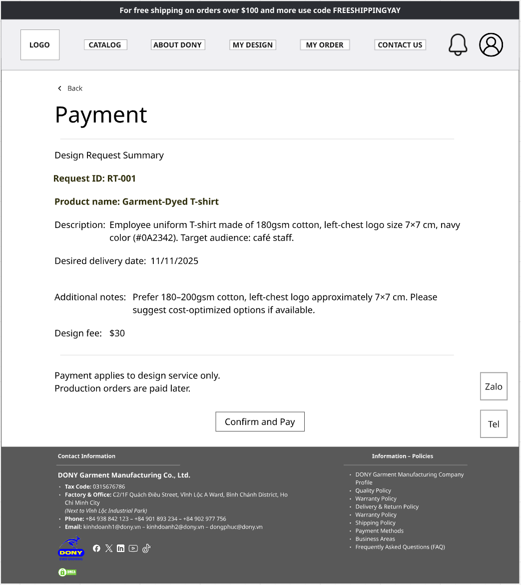

# Screen Spec: S16 Design Service Payment

| Field | Value |
|---|---|
| Screen ID | `S16` |
| Screen name | Design Service Payment |
| Actor | Customer owner |
| Priority | P3 |
| Belongs to module | [MFG-06](../specs/spec-MFG-06.md) |
| Route | `/design-requests/{request_id}/payment` |
| Mockup image | img/S16-design_service_payment_screen.png |
| Status | Deprecated workflow; retained historical screen and PNG |

## 1. Purpose

**Shown when:** An old design-request payment URL is opened. Authenticate and verify request ownership, then redirect to `/designs?tab=requests&request_id={id}` in S17. S16 has no active payment, refund or cancellation workflow; no SERVICE transaction is created. The original PNG is historical only.

**The user leaves this screen when:** An authorized action in section 5 succeeds, the user follows a role-allowed global route, or they return to the validated originating route.

## 2. Mockup

This PNG documents the retired upfront-payment flow only. Written deprecation/redirect behavior below replaces all obsolete payment controls; retain S16 numbering and this original image.

## 3. Element inventory

| # | Element | Type | Content / data source | Required | Validation |
|---|---|---|---|---|---|
| 1 | Screen heading | Heading | Design Service Payment | Yes | Static route title. |
| 2 | Route | Navigation target | /design-requests/{request_id}/payment | Yes | Access checked on server. |
| 3 | request_id | Route parameter | UUID | Yes | Authenticate and verify ownership; inaccessible request returns 404. |
| 4 | Deprecated route notice | Read-only text | Request management has moved to S17. | Yes | No fee, payment attempt, provider redirect or refund controls. |
| 5 | Open request | Navigation | Owned request status in S17 | Yes | Destination: /designs?tab=requests&request_id={id} |

## 4. States

| State | What the user sees | Trigger |
|---|---|---|
| Loading | Labelled progress/skeleton; disable duplicate submit. | Request starts |
| Empty | Show a safe not-found message for a missing request. | Request lookup returns no owned record |
| Forbidden/not found | Safe message without revealing inaccessible identifiers. | 401/403/404 |
| Error | Show code, message, field_errors, request_id; preserve entered values. | Request failure |
| Retry | Retry reads on transient failure; reuse the same idempotency key only for mutations that require one for the documented mutation. | Recoverable failure |
| Success | Redirect to the authorized S17 request view. | Ownership check succeeds |
| Conflict | Explain stale state; reload; never silently overwrite. | 409 |

## 5. Interactions and navigation

| # | Element | User action | System response | Goes to screen |
|---|---|---|---|---|
| 1 | Open old route | Navigate | Authenticate, verify ownership and redirect without creating a payment. | S17 /designs?tab=requests&request_id={id} |

Home and public catalog are available to Guest and authenticated users. Customer designs and customer orders are Customer-only; profile and notifications require authentication. Company Admin routes: S10, S18, S28, S30, S36, S42 and S43. Sales Consultant routes: S20 and assigned-only S21. System Admin routes: S39, S40 and S41. The server rechecks role, company, membership, ownership and assignment for every route and notification target. Back returns to the validated originating route and preserves list filters; without one, use S26 for Customer, S28 for Company Admin, S20 for Sales Consultant, S41 for System Admin, and S01 for Guest.

## 6. Screen-level rules

| Rule ID | Rule | Source |
|---|---|---|
| SR-001 | Access and ownership are checked server-side; do not trust submitted customer, company, role, price, or provider status. Apply 401/403/404 behavior and the field rules above. | Authorization and data ownership requirements |
| SR-002 | IDs are UUIDs; timestamps are UTC and displayed in Asia/Ho_Chi_Minh; money and quantities are integers. Mutations use expected_version; significant create/sign/pay/batch operations use idempotency keys. | Data representation and concurrency requirements |
| SR-003 | Apply the module lifecycle and validation rules linked below; preserve immutable submitted snapshots. | Module specification |
| SR-004 | Selected product and technical defaults are project implementation decisions; do not invent factual company, author, client-approval, or course identifiers. | Project implementation assumptions |

### Acceptance scenarios

1. An owned request opened through the old S16 URL redirects to its S17 request view without payment side effects.
2. Missing/foreign requests return safe 404; unauthenticated users authenticate before ownership checks.
3. S16 and its PNG remain historical references; active fee collection occurs only with ORDER payment in S35.

## 7. Linked requirements

| FR ID (from the module spec) | What this screen does for it |
|---|---|
| MFG-05/F-DES-004 | Destination request view after ownership-checked redirection. |
Additional linked modules: [MFG-05](../specs/spec-MFG-05.md).

The rules in this screen and its linked module specifications are complete for implementation.

## 8. Responsive and accessibility notes

Support 360px through desktop; stack columns and use labelled horizontal-scroll tables on narrow screens. Controls are keyboard-operable with visible focus, logical headings, associated form labels, and aria-live status/error announcements. Text contrast is at least 4.5:1 (large text 3:1); pointer targets are at least 24px. Preserve user-entered data after recoverable failures. Confirm destructive actions, disable duplicate submit while pending, and enforce idempotency on the server.

## 9. Open questions

| # | Question | Blocking? | Status |
|---|---|---|---|
| 1 | No unresolved screen behavior questions remain; routes, fields, permissions, and defaults are resolved in this specification and its linked module requirements. | No | Resolved |

## Completion checklist

- [x] Route, actor, module, priority, and mockup status are identified.
- [x] Element fields, actions, validation, and data ownership are documented.
- [x] Loading, empty, forbidden, error, retry, success, and conflict states are documented.
- [x] Navigation and acceptance scenarios are explicit.
- [x] Responsive and accessibility requirements follow the shared baseline.
- [x] No unresolved screen-level decisions remain.
