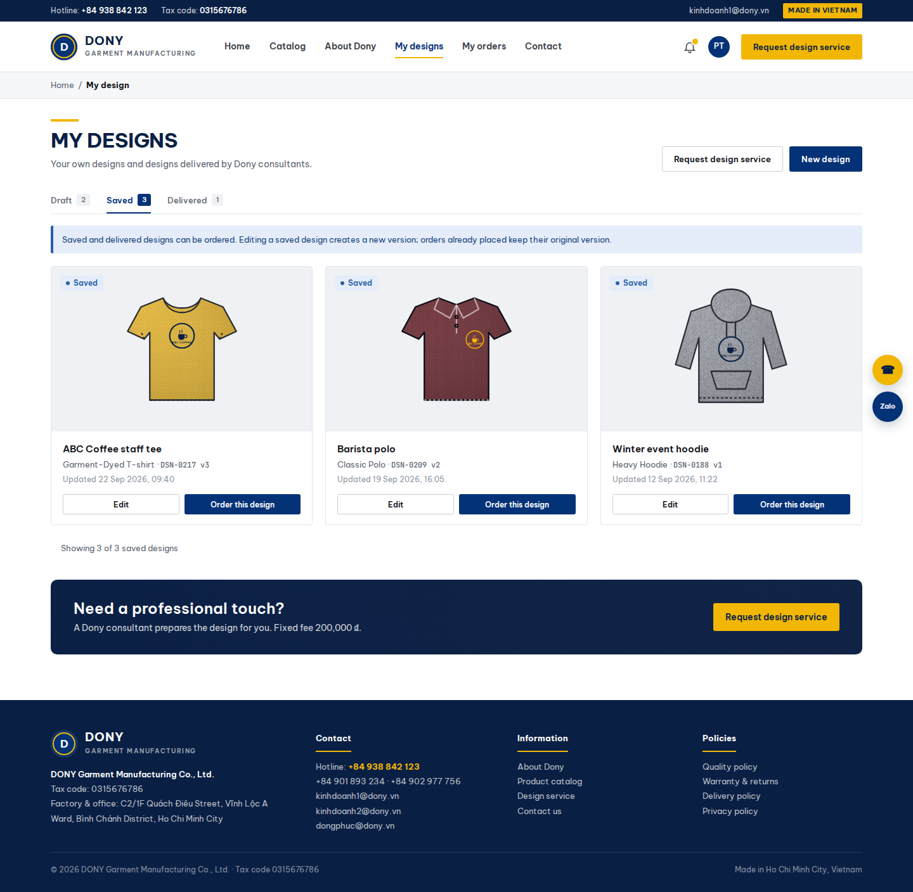

# Screen Spec: S17 Customer Designs

| Field | Value |
|---|---|
| Screen ID | `S17` |
| Screen name | Customer Designs |
| Actor | Customer owner |
| Priority | P3 |
| Belongs to module | [MFG-05](../specs/spec-MFG-05.md) |
| Route | `/designs` |
| Mockup image | img/S17-customer_designs_screen.png |
| Status | Resolved implementation specification |

## 1. Purpose

**Shown when:** The customer sees only owned saved designs, consultant deliveries and a separate request tab, with product/version context and actions valid for each design state. All identifiers and permissions come from the server session; list filters are allowlisted and recoverable failures preserve entered values.

**The user leaves this screen when:** An authorized action in section 5 succeeds, the user follows a role-allowed global route, or they return to the validated originating route.

## 2. Mockup

Written behavior below takes precedence over obsolete sample content.

## 3. Element inventory

| # | Element | Type | Content / data source | Required | Validation |
|---|---|---|---|---|---|
| 1 | Screen heading | Heading | Customer Designs | Yes | Static route title. |
| 2 | Route | Navigation target | /designs | Yes | Access checked on server. |
| 3 | tab | Field / control | enum: Draft, Saved, Delivered, requests | As specified | Filter scoped to authenticated customer_id. |
| 4 | design_id / design_version / product_id | Field / control | UUID / integer version / UUID | As specified | Show latest owned version and associated product version. |
| 5 | status | Field / control | Draft, Saved, Delivered | As specified | Draft is editable but not orderable; Saved self-design and Delivered consultant design are orderable. |
| 6 | preview_asset_id | Field / control | private UUID | As specified | Access-checked expiring URL; customer-owned assets only. |
| 7 | updated_at | Field / control | UTC timestamp | As specified | Display in Asia/Ho_Chi_Minh. |
| 8 | API errors | Field / control | standard API error envelope | As specified | 400 malformed; 404 inaccessible design; 409 stale version; preserve filters on retry. |
| 9 | Edit saved design | Action | Create new design version; never alter ordered snapshot. | Available when authorized | Destination: S13 |
| 10 | Order design | Action | Permit saved self-design or delivered consultant design only. | Available when authorized | Destination: S22 |
| 11 | Request design service | Action | Create new request for selected product. | Available when authorized | Destination: S15 |
| 12 | request_id / status / assessment | Read-only request detail | Owned request UUID, status, complexity, rationale/rejection reason, requested_deadline, committed_due_at | In requests tab | Submitted, UnderReview, FeeProposed, Approved, Assigned, InProgress, Delivered, Cancelled, Rejected; never expose CRM notes. |
| 13 | proposed/accepted fee | Read-only integer VND | null before assessment, 0 for Simple, proposed/accepted amount for Complex | In requests tab | State whether fee is awaiting acceptance or accepted; collected only with the first order under MFG-06 BR-008, never now. |
| 14 | Accept fee | Action | Explicit acceptance of displayed amount/proposal_version with expected_version and Idempotency-Key | FeeProposed only | Destination: S17; owner only; stale version/amount 409; store acceptance and Approved. |
| 15 | Cancel request | Action | Confirm cancellation with expected_version and Idempotency-Key | Eligible unassigned state only | Submitted/UnderReview/FeeProposed/Approved; no refund; reject Assigned/InProgress/Delivered/Rejected; repeat Cancelled returns same result. |
| 16 | Delivery / source request | Read-only link | Delivered immutable design and source_design_request_id | When delivered | Copies retain provenance; order action follows MFG-06 fee allocation; no order means no collection. |

## 4. States

| State | What the user sees | Trigger |
|---|---|---|
| Loading | Labelled progress/skeleton; disable duplicate submit. | Request starts |
| Empty | Show no owned designs in the selected state; preserve filters where present and explain eligibility/filter conditions. | Successful query returns no rows |
| Forbidden/not found | Safe message without revealing inaccessible identifiers. | 401/403/404 |
| Error | Show code, message, field_errors, request_id; preserve entered values. | Request failure |
| Retry | Retry reads on transient failure; reuse the same idempotency key only for mutations that require one for the documented mutation. | Recoverable failure |
| Success | Show committed state and next valid action; announce via aria-live. | Mutation commits |
| Conflict | Explain stale state; reload; never silently overwrite. | 409 |

## 5. Interactions and navigation

| # | Element | User action | System response | Goes to screen |
|---|---|---|---|---|
| 1 | Edit saved design | Activate | Create new design version; never alter ordered snapshot. | S13 |
| 2 | Order design | Activate | Permit saved self-design or delivered consultant design only. | S22 |
| 3 | Request design service | Activate | Create new request for selected product. | S15 |
| 4 | Open request | Select request or follow S15/notification link | Load owned request by request_id in requests tab. | S17 |
| 5 | Accept fee | Explicitly confirm displayed fee | Version-check exact proposal; atomically save acceptance and Approved; notify Admin. | S17 |
| 6 | Cancel request | Confirm | Atomically cancel only eligible unassigned state; notify owner/Admin; no refund; race/stale 409. | S17 |

Home and public catalog are available to Guest and authenticated users. Customer designs and customer orders are Customer-only; profile and notifications require authentication. Sales Admin routes: S10, S18, S28, S30, S36, S42 and S43. Sales routes: S20 and assigned-only S21. System Admin routes: S39, S40 and S41. The server rechecks internal role, customer ownership and staff assignment for every route and notification target. Back returns to the validated originating route and preserves list filters; without one, use S26 for Customer, S28 for Sales Admin, S20 for Sales, S41 for System Admin, and S01 for Guest.

## 6. Screen-level rules

| Rule ID | Rule | Source |
|---|---|---|
| SR-001 | Access and ownership are checked server-side; do not trust submitted customer, company, role, price, or provider status. Apply 401/403/404 behavior and the field rules above. | Authorization and data ownership requirements |
| SR-002 | IDs are UUIDs; timestamps are UTC and displayed in Asia/Ho_Chi_Minh; money and quantities are integers. Mutations use expected_version; significant create/sign/pay/batch operations use idempotency keys. | Data representation and concurrency requirements |
| SR-003 | Apply the module lifecycle and validation rules linked below; preserve immutable submitted snapshots. | Module specification |
| SR-004 | Selected product and technical defaults are project implementation decisions; do not invent factual company, author, client-approval, or course identifiers. | Project implementation assumptions |

### Acceptance scenarios

1. Only own designs appear; Saved and Delivered records offer order action while Draft does not.
2. An ordered design edit creates a new version and cannot mutate order snapshot.
3. Submission opens the selected Submitted request; Simple approval shows free; Complex remains unassignable until exact fee acceptance.
4. Cancellation before assignment succeeds even after acceptance; assignment winning the race makes cancellation return 409. Repeated cancellation has no duplicate effect.
5. A Delivered request links to its immutable design; zero/no-order fee behavior follows MFG-06 BR-008.

## 7. Linked requirements

| FR ID (from the module spec) | What this screen does for it |
|---|---|
| MFG-05/F-DES-004 | Implements this screen's validated user flow and the linked source function. |
| MFG-05/F-DES-012 | Explicit acceptance of the current Complex fee proposal. |
| MFG-05/F-DES-013 | Eligible preassignment cancellation without refund. |
The rules in this screen and its linked module specifications are complete for implementation.

## 8. Responsive and accessibility notes

Support 360px through desktop; stack columns and use labelled horizontal-scroll tables on narrow screens. Controls are keyboard-operable with visible focus, logical headings, associated form labels, and aria-live status/error announcements. Text contrast is at least 4.5:1 (large text 3:1); pointer targets are at least 24px. Preserve user-entered data after recoverable failures. Confirm destructive actions, disable duplicate submit while pending, and enforce idempotency on the server.

## 9. Open questions

| # | Question | Blocking? | Status |
|---|---|---|---|
| 1 | No unresolved screen behavior questions remain; routes, fields, permissions, and defaults are resolved in this specification and its linked module requirements. | No | Resolved |

## Completion checklist

- [x] Route, actor, module, priority, and mockup status are identified.
- [x] Element fields, actions, validation, and data ownership are documented.
- [x] Loading, empty, forbidden, error, retry, success, and conflict states are documented.
- [x] Navigation and acceptance scenarios are explicit.
- [x] Responsive and accessibility requirements follow the shared baseline.
- [x] No unresolved screen-level decisions remain.
