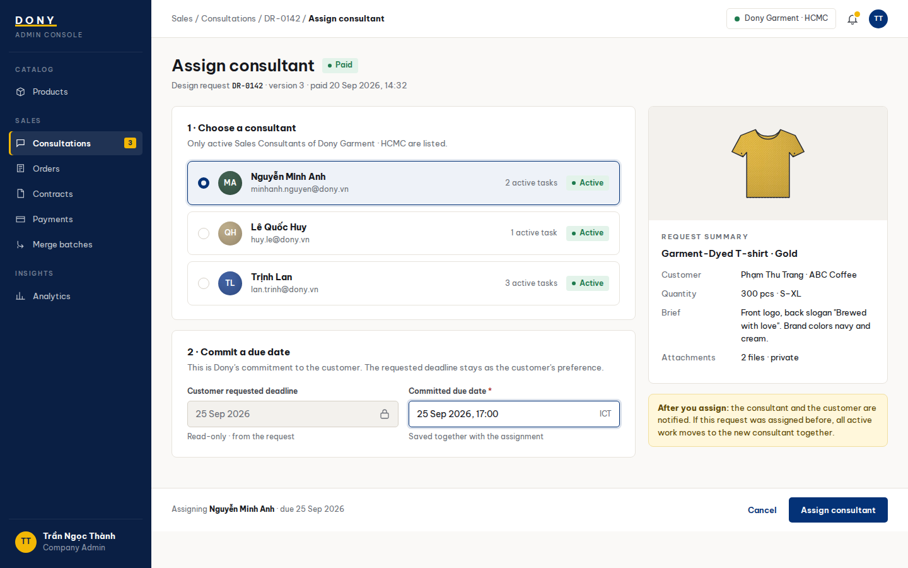

# Screen Spec: S19 Consultation Assignment

| Field | Value |
|---|---|
| Screen ID | `S19` |
| Screen name | Consultation Assignment |
| Actor | Sales Admin |
| Priority | P2 |
| Belongs to module | [MFG-05](../specs/spec-MFG-05.md) |
| Route | `/admin/design-requests/{request_id}/assignment` |
| Mockup image | img/S19-consultation_assignment_screen.png |
| Status | Resolved implementation specification |

## 1. Purpose

**Shown when:** The Sales Admin assigns one eligible Approved, unassigned DesignRequest to an active Dony Sales employee and records Dony's committed due date. All identifiers and permissions come from the server session; list filters are allowlisted and recoverable failures preserve entered values.

**The user leaves this screen when:** An authorized action in section 5 succeeds, the user follows a role-allowed global route, or they return to the validated originating route.

## 2. Mockup

Written behavior below takes precedence over obsolete sample content.

## 3. Element inventory

| # | Element | Type | Content / data source | Required | Validation |
|---|---|---|---|---|---|
| 1 | Screen heading | Heading | Consultation Assignment | Yes | Static route title. |
| 2 | Route | Navigation target | /admin/design-requests/{request_id}/assignment | Yes | Access checked on server. |
| 3 | request_id | Field / control | UUID path parameter | As specified | Request must be Approved (Simple or accepted Complex fee) and unassigned, or eligible for atomic reassignment. |
| 4 | sales_user_id | Field / control | UUID, required | As specified | Must reference an Active Dony StaffAccount with the Sales role. |
| 5 | committed_due_at | Field / control | UTC timestamp, required | As specified | Admin commitment at assignment; requested_deadline remains customer preference. |
| 6 | expected_version | Field / control | integer, required | As specified | Stale request returns 409; assignment and due date save atomically. |
| 7 | buyer_organization_id / customer_id | Field / control | server-derived UUIDs | As specified | Buyer organization is contextual customer data; authorization comes from the Dony staff role and assignment. |
| 8 | API errors | Field / control | standard API error envelope | As specified | 400 malformed; 403 prohibited; 404 inaccessible; 409 stale/duplicate assignment; 422 invalid consultant/date. |
| 9 | Assign consultant | Action | Atomic assign/reassign, record committed_due_at, notify after commit. | Available when authorized | Destination: S18 requests tab |
| 10 | Cancel | Action | Leave request unchanged. | Available when authorized | Destination: S18 |

## 4. States

| State | What the user sees | Trigger |
|---|---|---|
| Loading | Load the S19 Consultation Assignment view model and show labelled progress; keep writes disabled until route data and authorization are resolved. | Request starts |
| Empty | Render the defined initial/empty state for S19 Consultation Assignment; if a required route object is absent, return a safe 404 and the authorized parent route. | Empty initial form or missing detail payload |
| Forbidden/not found | Return a safe 401/403/404 for S19 Consultation Assignment without revealing inaccessible record, customer, staff or payment details. | 401/403/404 |
| Error | For S19 Consultation Assignment, show the API code, message, field_errors and request_id; preserve safe user-entered values. | Request failure |
| Retry | Retry transient reads for S19 Consultation Assignment; retry a mutation only with its original idempotency key and identical payload, never as a new side effect. | Recoverable failure |
| Success | Refresh S19 Consultation Assignment from the committed server response, expose only the next role/state-allowed action and announce the result via aria-live. | Mutation commits |
| Conflict | For a stale S19 Consultation Assignment version or lifecycle state, reload authoritative data, explain the conflict and require explicit review before resubmission. | 409 |

## 5. Interactions and navigation

| # | Element | User action | System response | Goes to screen |
|---|---|---|---|---|
| 1 | Assign consultant | Activate | Atomic assign/reassign, record committed_due_at, notify after commit. | S18 requests tab |
| 2 | Cancel | Activate | Leave request unchanged. | S18 |

Home and public catalog are available to Guest and authenticated users. Customer designs and customer orders are Customer-only; profile and notifications require authentication. Sales Admin routes: S10, S18, S28, S30, S36, S42 and S43. Sales routes: S20 and assigned-only S21. System Admin routes: S39, S40 and S41. The server rechecks internal role, customer ownership and staff assignment for every route and notification target. Back returns to the validated originating route and preserves list filters; without one, use S26 for Customer, S28 for Sales Admin, S20 for Sales, S41 for System Admin, and S01 for Guest.

## 6. Screen-level rules

| Rule ID | Rule | Source |
|---|---|---|
| SR-001 | Access and ownership are checked server-side; do not trust submitted customer, company, role, price, or provider status. Apply 401/403/404 behavior and the field rules above. | Authorization and data ownership requirements |
| SR-002 | IDs are UUIDs; timestamps are UTC and displayed in Asia/Ho_Chi_Minh; money and quantities are integers. Mutations use expected_version; significant create/sign/pay/batch operations use idempotency keys. | Data representation and concurrency requirements |
| SR-003 | Apply the module lifecycle and validation rules linked below; preserve immutable submitted snapshots. | Module specification |
| SR-004 | Selected product and technical defaults are project implementation decisions; do not invent factual company, author, client-approval, or course identifiers. | Project implementation assumptions |

### Acceptance scenarios

1. Assignment succeeds only for active Dony Sales employee and records committed_due_at atomically.
2. Concurrent/stale assignment returns 409 and does not create duplicate notices.
3. Assignment locks/version-checks the request with customer assignment; if cancellation wins, return 409 without assignment or partial transfer.

## 7. Linked requirements

| FR ID (from the module spec) | What this screen does for it |
|---|---|
| MFG-08/F-ORD-003 | UI touchpoint for **Assign Sales Logic**; this screen defines the visible action/result, while the module spec owns server authorization, validation and persistence. |
| MFG-08/F-ORD-004 | UI touchpoint for **Assign Notify Logic**; this screen defines the visible action/result, while the module spec owns server authorization, validation and persistence. |
Additional linked modules: [MFG-08](../specs/spec-MFG-08.md).

The rules in this screen and its linked module specifications are complete for implementation.

## 8. Responsive and accessibility notes

Support 360px through desktop; stack columns and use labelled horizontal-scroll tables on narrow screens. Controls are keyboard-operable with visible focus, logical headings, associated form labels, and aria-live status/error announcements. Text contrast is at least 4.5:1 (large text 3:1); pointer targets are at least 24px. Preserve user-entered data after recoverable failures. Confirm destructive actions, disable duplicate submit while pending, and enforce idempotency on the server.

## 9. Open questions

| # | Question | Blocking? | Status |
|---|---|---|---|
| 1 | No unresolved screen behavior questions remain; routes, fields, permissions, and defaults are resolved in this specification and its linked module requirements. | No | Resolved |

## Completion checklist

- [x] Route, actor, module, priority, and mockup status are identified.
- [x] Element fields, actions, validation, and data ownership are documented.
- [x] Loading, empty, forbidden, error, retry, success, and conflict states are documented.
- [x] Navigation and acceptance scenarios are explicit.
- [x] Responsive and accessibility requirements follow the shared baseline.
- [x] No unresolved screen-level decisions remain.
