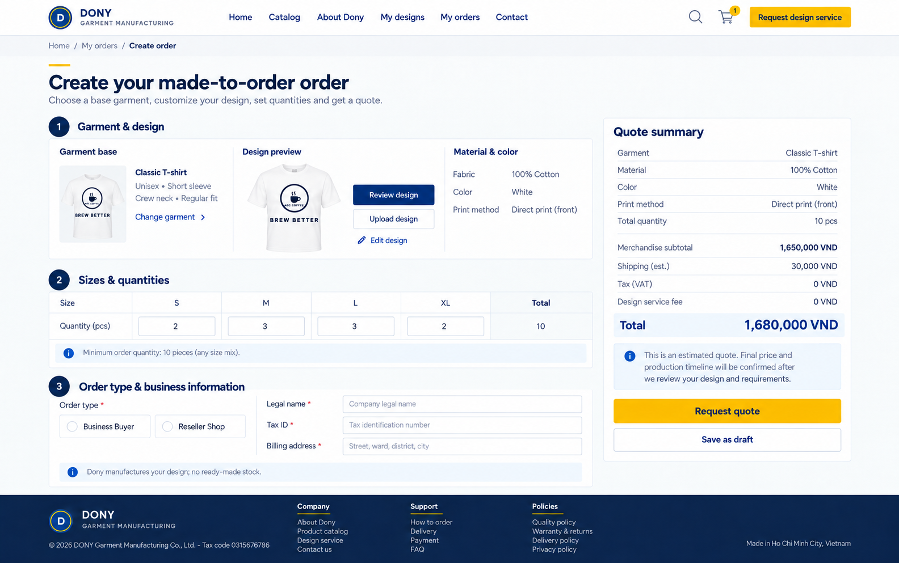

# Screen Spec: S22 Create Order

| Field | Value |
|---|---|
| Screen ID | `S22` |
| Screen name | Create Order |
| Actor | Customer owner |
| Priority | P1 |
| Belongs to module | [MFG-06](../specs/spec-MFG-06.md) |
| Route | `/orders/new?design_id={id}` |
| Mockup image | `img/S22-create_order_screen.png` |
| Status | Resolved implementation specification |

## 1. Purpose

**Shown when:** The customer enters exact recipient name, phone and full delivery address (address line, ward and province), chooses positive integer quantities by supported size, confirms whether this order is for a Business Buyer or Reseller Shop, and requests a server-priced quote for an owned eligible design. These are Dony's only customer purchasing models; each requires legal name, tax ID and billing address as commercial snapshots, not tenant or authorization data. The server enforces product MOQ and max_units_per_order and revalidates the saved design against every selected size. All identifiers and permissions come from the server session; recoverable failures preserve entered values.

**The user leaves this screen when:** An authorized action in section 5 succeeds, the user follows a role-allowed global route, or they return to the validated originating route.

## 2. Mockup

Written behavior below takes precedence over obsolete sample content. MVP does not show the historical merge action or merge controls; merge becomes available only after MFG-10 activation.

## 3. Element inventory

| # | Element | Type | Content / data source | Required | Validation |
|---|---|---|---|---|---|
| 1 | Screen heading | Heading | Create Order | Yes | Static route title. |
| 2 | Route | Navigation target | /orders/new?design_id={id} | Yes | Access checked on server. |
| 3 | design_id | Field / control | UUID, required | As specified | Customer-owned Saved self-design or Delivered consultant design. |
| 4 | design_version / product_version | Field / control | UUID/version, required | As specified | Must match current product rule; changed rules require explicit review. |
| 5 | quantity_by_size | Field / control | object map, required | As specified | Supported size keys; each value positive integer; aggregate quantity must be at least product MOQ and at most 10000; MVP seed MOQ is 10 across all sizes. |
| 6 | recipient_name | Field / control | string, required | As specified | Trimmed, 1..100 characters. |
| 7 | phone | Field / control | string, required | As specified | 8..15 digits, optional leading +. |
| 8 | address_line | Field / control | string, required | As specified | Trimmed, 1..250 characters. |
| 9 | ward | Field / control | string, required | As specified | Trimmed, 1..100 characters. |
| 10 | province | Field / control | string, required | As specified | Trimmed, 1..100 characters. |
| 11 | country | Field / control | enum, required | As specified | Exactly VN. |
| 12 | buyer_type | Required order-purpose selector | Business Buyer or Reseller Shop | Yes; no default | Business Buyer means company uniforms/garments for its staff; Reseller Shop commissions its own designs/specifications for Dony to manufacture for resale. Neither means buying Dony ready-made stock; neither is a system role or tenant boundary. |
| 13 | buyer_legal_name / buyer_tax_id / billing_address | Required business-detail fields | Required for both buyer types | Yes | Trimmed strings; legal name 1..200, tax ID 1..50, billing address 1..250. Values are snapshotted to quote/order/contract; no tax-registry verification is claimed. |
| 14 | client customer_id/buyer_organization_id/unit_price/total | Prohibited client authority | Server-derived | Yes | Resolve Customer session; never trust client organization ID, unit price or total. The organization is descriptive commercial data, not tenant authority. |
| 15 | expected_version / Idempotency-Key | Version / UUID | Required for mutation | Yes | Reject stale state; financially significant order create is idempotent. |
| 16 | capacity | Server-derived integer | Product max_units_per_order | Yes | Reject quote if aggregate quantity exceeds capacity with 422 CAPACITY_EXCEEDED. |
| 17 | Get quote | Action | Server applies volume tier to aggregate quantity and per-garment option surcharges, then adds shipping/tax/design-fee lines; no order is created yet. | Available when authorized | Destination: S25 |
| 18 | Select merge | Post-MVP action | Continue to explicit opt-in/terms after MFG-10 activation. | Post-MVP only | Destination: S23; omit from MVP UI and API input. |
| 19 | Select design | Action | Return to owned designs. | Available when authorized | Destination: S17 |

## 4. States

| State | What the user sees | Trigger |
|---|---|---|
| Loading | Load the S22 Create Order view model and show labelled progress; keep writes disabled until route data and authorization are resolved. | Request starts |
| Empty | Require a saved design and valid quantity by size; retain buyer organization fields and show missing prerequisites. | Screen has no eligible or matching record |
| Forbidden/not found | Return a safe 401/403/404 for S22 Create Order without revealing inaccessible record, customer, staff or payment details. | 401/403/404 |
| Error | For S22 Create Order, show the API code, message, field_errors and request_id; preserve safe user-entered values. | Request failure |
| Retry | Retry transient reads for S22 Create Order; retry a mutation only with its original idempotency key and identical payload, never as a new side effect. | Recoverable failure |
| Success | Save quote with buyer-type/organization snapshots and size quantities; route to quote summary. | Valid action commits |
| Conflict | Price, product rule, or design version changed: retain the size mix, re-quote, and require customer confirmation. | Stale version, duplicate or invalid lifecycle transition |
## 5. Interactions and navigation

| # | Element | User action | System response | Goes to screen |
|---|---|---|---|---|
| 1 | Get quote | Activate | Server computes amounts for design/options/quantities/address; no order created yet. | S25 |
| 2 | Select merge | Post-MVP only | Available after MFG-10 activation; not rendered in MVP. | S23 |
| 3 | Select design | Activate | Return to owned designs. | S17 |

Portal: Customer owner. Route: /orders/new?design_id={id}. Back preserves the originating route and filters. Fallback: Customer→S26; Sales Admin→S28; Sales→S20; System Admin→S41; Guest→S01. Enforce role, ownership and assignment before rendering.

## 6. Screen-level rules

| Rule ID | Rule | Source |
|---|---|---|
| SR-001 | Access and ownership are checked server-side; do not trust submitted customer, company, role, price, or provider status. Apply 401/403/404 behavior and the field rules above. | Authorization and data ownership requirements |
| SR-002 | IDs are UUIDs; timestamps are UTC and displayed in Asia/Ho_Chi_Minh; money and quantities are integers. Mutations use expected_version; significant create/sign/pay/batch operations use idempotency keys. | Data representation and concurrency requirements |
| SR-003 | Apply the module lifecycle and validation rules linked below; preserve immutable submitted snapshots. | Module specification |
| SR-004 | Selected product and technical defaults are project implementation decisions; do not invent factual company, author, client-approval, or course identifiers. | Project implementation assumptions |

### Acceptance scenarios

1. Exact VN address, required Business Buyer/Reseller Shop snapshot, supported size map with aggregate quantity from MOQ through 10000, and owned eligible design pass quote creation.
2. Client-supplied customer/company/price/total is ignored or rejected; invalid phone/address/quantity returns field errors.

## 7. Linked requirements

| FR ID (from the module spec) | What this screen does for it |
|---|---|
| MFG-06/F-PAY-001 | **Finalize Order** — Render checkout for the customer's eligible design and Published Dony configurable product base. |
| MFG-06/F-PAY-003 | **Finalize Order** — Atomically create one `AwaitingDigitalApproval` order from a current quote with immutable snapshots and idempotency; lock/revalidate and claim any design-fee allocation under BR-008. |

## 8. Responsive and accessibility notes

Support 360px through desktop; stack columns and use labelled horizontal-scroll tables on narrow screens. Controls are keyboard-operable with visible focus, logical headings, associated form labels, and aria-live status/error announcements. Text contrast is at least 4.5:1 (large text 3:1); pointer targets are at least 24px. Preserve user-entered data after recoverable failures. Confirm destructive actions, disable duplicate submit while pending, and enforce idempotency on the server.

## 9. Open questions

| # | Question | Blocking? | Status |
|---|---|---|---|
| 1 | No unresolved screen behavior questions remain; routes, fields, permissions, and defaults are resolved in this specification and its linked module requirements. | No | Resolved |

## Completion checklist

- [x] Route, actor, module, priority, and mockup status are identified.
- [x] Element fields, actions, validation, and data ownership are documented.
- [x] Loading, empty, forbidden, error, retry, success, and conflict states are documented.
- [x] Navigation and acceptance scenarios are explicit.
- [x] Responsive and accessibility requirements follow the shared baseline.
- [x] No unresolved screen-level decisions remain.
