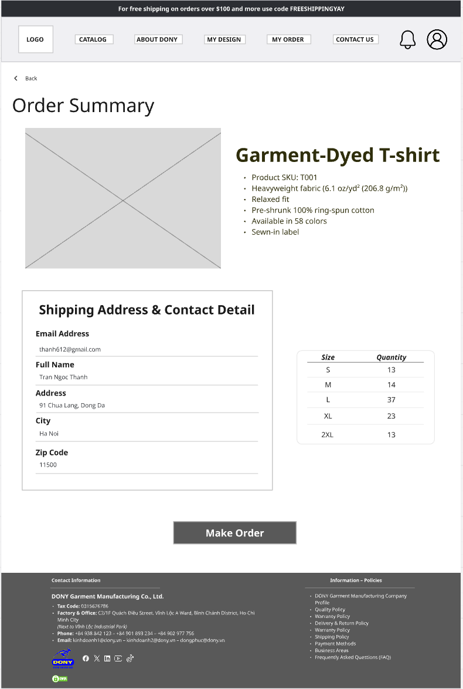

# Screen Spec: S25 Order Summary

| Field | Value |
|---|---|
| Screen ID | `S25` |
| Screen name | Order Summary |
| Actor | Customer owner |
| Priority | P1 |
| Belongs to module | [MFG-06](../specs/spec-MFG-06.md) |
| Route | `/orders/summary?quote_id={id}` |
| Mockup image | `img/S25-order_summary_screen.png` |
| Status | Resolved implementation specification |

## 1. Purpose

**Shown when:** The customer reviews an unexpired server quote with integer VND line amounts, delivery address and expiry before submitting the order. In MVP this is a standard quote with no merge choice and zero merge discount; the merge rows/actions below are post-MFG-10 only. All identifiers and permissions come from the server session; list filters are allowlisted and recoverable failures preserve entered values.

**The user leaves this screen when:** An authorized action in section 5 succeeds, the user follows a role-allowed global route, or they return to the validated originating route.

## 2. Mockup

Written behavior below takes precedence over obsolete sample content. MVP omits merge preference controls and always displays merge discount as zero; the historical mockup is not an MVP implementation reference for merge or promotional controls.

## 3. Element inventory

| # | Element | Type | Content / data source | Required | Validation |
|---|---|---|---|---|---|
| 1 | Screen heading | Heading | Order Summary | Yes | Static route title. |
| 2 | Route | Navigation target | /orders/summary?quote_id={id} | Yes | Access checked on server. |
| 3 | quote_id | Field / control | UUID | As specified | quote_id: UUID; server quote lasts 30 minutes and binds product/design/policy versions. |
| 4 | subtotal_vnd | Field / control | sum(quantity*(unit_price_vnd+option_surcharge_vnd)), integer. | As specified | subtotal_vnd: sum(quantity*(unit_price_vnd+option_surcharge_vnd)), integer. |
| 5 | merge_discount_vnd | Post-MVP field | MFG-10 v3 amount | No | MVP always displays 0 and has no opt-in control; after MFG-10 activation show `min(subtotal_vnd, 840000)` when opted in, otherwise 0. |
| 6 | price_breakdown | Read-only quote breakdown | integer VND | Yes | MVP shows subtotal, zero merge discount, shipping, tax, separate design_fee_vnd and total; merge fee is 0. Design fee is outside subtotal and never discounted or quantity-multiplied. |
| 7 | quote_id / expected_version / Idempotency-Key | Field / control | required submission contract | As specified | Never submit a client total; an expired/superseded quote returns to requote and explicit review. |
| 8 | API errors | Field / control | standard API error envelope | As specified | 400 malformed; 422 invalid fields; 409 stale/duplicate; 429 rate limit; 503 dependency failure |
| 9 | Submit order | Action | Revalidate quote and fee-allocation versions; atomically claim any fee allocation and create an `AwaitingDigitalApproval` order with immutable snapshots and idempotency. | Available when authorized | Destination: S27 |
| 10 | Edit quantities/address | Action | Requote and show changed breakdown before submit. | Available when authorized | Destination: S22 |
| 11 | Change merge preference | Post-MVP action | Requote with explicit preference only after MFG-10 activation. | Post-MVP only | Destination: S23; omit from MVP UI and API input. |

## 4. States

| State | What the user sees | Trigger |
|---|---|---|
| Loading | Load the S25 Order Summary view model and show labelled progress; keep writes disabled until route data and authorization are resolved. | Request starts |
| Empty | Render the defined initial/empty state for S25 Order Summary; if a required route object is absent, return a safe 404 and the authorized parent route. | Empty initial form or missing detail payload |
| Forbidden/not found | Return a safe 401/403/404 for S25 Order Summary without revealing inaccessible record, customer, staff or payment details. | 401/403/404 |
| Error | For S25 Order Summary, show the API code, message, field_errors and request_id; preserve safe user-entered values. | Request failure |
| Retry | Retry transient reads for S25 Order Summary; retry a mutation only with its original idempotency key and identical payload, never as a new side effect. | Recoverable failure |
| Success | Refresh S25 Order Summary from the committed server response, expose only the next role/state-allowed action and announce the result via aria-live. | Mutation commits |
| Conflict | For a stale S25 Order Summary version or lifecycle state, reload authoritative data, explain the conflict and require explicit review before resubmission. | 409 |

## 5. Interactions and navigation

| # | Element | User action | System response | Goes to screen |
|---|---|---|---|---|
| 1 | Submit order | Activate | Revalidate quote and fee-allocation versions; atomically claim any fee allocation and create an `AwaitingDigitalApproval` order with immutable snapshots. | S27 |
| 2 | Edit quantities/address | Activate | Requote and show changed breakdown before submit. | S22 |
| 3 | Change merge preference | Post-MVP only | Available after MFG-10 activation; not rendered in MVP. | S23 |

Home and public catalog are available to Guest and authenticated users. Customer designs and customer orders are Customer-only; profile and notifications require authentication. Sales Admin routes: S10, S18, S28, S30, S36, S42 and S43. Sales routes: S20 and assigned-only S21. System Admin routes: S39, S40 and S41. The server rechecks internal role, customer ownership and staff assignment for every route and notification target. Back returns to the validated originating route and preserves list filters; without one, use S26 for Customer, S28 for Sales Admin, S20 for Sales, S41 for System Admin, and S01 for Guest.

## 6. Screen-level rules

| Rule ID | Rule | Source |
|---|---|---|
| SR-001 | Access and ownership are checked server-side; do not trust submitted customer, company, role, price, or provider status. Apply 401/403/404 behavior and the field rules above. | Authorization and data ownership requirements |
| SR-002 | IDs are UUIDs; timestamps are UTC and displayed in Asia/Ho_Chi_Minh; money and quantities are integers. Mutations use expected_version; significant create/sign/pay/batch operations use idempotency keys. | Data representation and concurrency requirements |
| SR-003 | Apply the module lifecycle and validation rules linked below; preserve immutable submitted snapshots. | Module specification |
| SR-004 | Selected product and technical defaults are project implementation decisions; do not invent factual company, author, client-approval, or course identifiers. | Project implementation assumptions |

### Acceptance scenarios

1. Valid unexpired quote submission creates one `AwaitingDigitalApproval` order and immutable address/price/design snapshots; contract and payment are not yet available.
2. Expired quote or changed product/design version requires requote and review; duplicate same key returns same order.
3. First Complex-design order shows accepted fee separately; pending fee-bearing order blocks another order until InProduction or resolved cancellation. Stale allocation returns 409 and requires a reviewed replacement quote; repeat orders after InProduction show fee 0.

## 7. Linked requirements

| FR ID (from the module spec) | What this screen does for it |
|---|---|
| MFG-06/F-PAY-002 | UI touchpoint for **Order Summary View**; this screen defines the visible action/result, while the module spec owns server authorization, validation and persistence. |
| MFG-06/F-PAY-003 | UI touchpoint for **Create Order Logic**; this screen defines the visible action/result, while the module spec owns server authorization, validation and persistence. |
The rules in this screen and its linked module specifications are complete for implementation.

## 8. Responsive and accessibility notes

Support 360px through desktop; stack columns and use labelled horizontal-scroll tables on narrow screens. Controls are keyboard-operable with visible focus, logical headings, associated form labels, and aria-live status/error announcements. Text contrast is at least 4.5:1 (large text 3:1); pointer targets are at least 24px. Preserve user-entered data after recoverable failures. Confirm destructive actions, disable duplicate submit while pending, and enforce idempotency on the server.

## 9. Open questions

| # | Question | Blocking? | Status |
|---|---|---|---|
| 1 | No unresolved screen behavior questions remain; routes, fields, permissions, and defaults are resolved in this specification and its linked module requirements. | No | Resolved |

## Completion checklist

- [x] Route, actor, module, priority, and mockup status are identified.
- [x] Element fields, actions, validation, and data ownership are documented.
- [x] Loading, empty, forbidden, error, retry, success, and conflict states are documented.
- [x] Navigation and acceptance scenarios are explicit.
- [x] Responsive and accessibility requirements follow the shared baseline.
- [x] No unresolved screen-level decisions remain.
