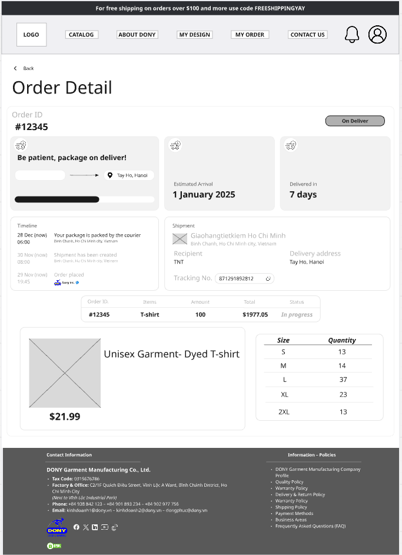

# Screen Spec: S27 Customer Order Detail Screen

<!--

DBIZ3 Session 4 template. One file per screen. Keep the DBIZ2 Screen ID unchanged.

The mockup image stays an image; everything around it becomes text.

-->

| Field | Value |
|---|---|
| Screen ID | `S27` |
| Screen name | Customer Order Detail Screen |
| Actor | Customer |
| Priority | [NEEDS CLARIFICATION: Must / Should / Could not given in Screen List] |
| Belongs to module | `spec-MFG-07.md` [NEEDS CLARIFICATION: file unavailable] |
| Mockup image | `img/S27-customer_order_detail_screen.png` |
| Status | Draft |

## 1. Purpose

**Shown when:** Display order details, order status, production/shipment status, and allow order cancellation if eligible.

**The user leaves this screen when:** [NEEDS CLARIFICATION: all exit paths are not specified; documented interactions appear in section 5.]

## 2. Mockup

<!-- The image is the visual contract: spacing, grouping, and hierarchy. The tables below are the behavioural contract. -->

## 3. Element inventory

<!-- Walk the mockup top to bottom, left to right. Every visible element gets a stable name. -->

| # | Element | Type | Content / data source | Required | Validation |
|---|---|---|---|---|---|
| 1 | Shipping promotion banner | Text | Static: For free shipping on orders over $100 and more use code FREESHIPPINGYAY | No | Not applicable — display only |
| 2 | Header logo | Image | Static logo placeholder | No | Not applicable — display only |
| 3 | Catalog navigation | Button | Static: CATALOG | No | Not applicable — display only |
| 4 | About Dony navigation | Button | Static: ABOUT DONY | No | Not applicable — display only |
| 5 | My Design navigation | Button | Static: MY DESIGN | No | Not applicable — display only |
| 6 | My Order navigation | Button | Static: MY ORDER | No | Not applicable — display only |
| 7 | Contact Us navigation | Button | Static: CONTACT US | No | Not applicable — display only |
| 8 | Notification bell | Button | Bell icon | No | Not applicable — display only |
| 9 | Account icon | Button | Account icon | No | Not applicable — display only |
| 10 | Back link | Button | Static: Back | No | Not applicable — display only |
| 11 | Order Detail heading | Header | Static: Order Detail | No | Not applicable — display only |
| 12 | Order ID | Text | order_id (F-ORD-002) | No | Not applicable — display only |
| 13 | On Deliver status badge | Text | full_order_object.status [NEEDS CLARIFICATION: schema] | No | Not applicable — display only |
| 14 | Delivery progress card | List | Package-on-deliver message, route, progress bar | No | Not applicable — display only |
| 15 | Estimated arrival card | List | Estimated Arrival date | No | Not applicable — display only |
| 16 | Delivered in card | List | Static sample: 7 days | No | Not applicable — display only |
| 17 | Timeline panel | List | tracking_timeline (F-ORD-002): package packed; shipment created; order placed | No | Not applicable — display only |
| 18 | Shipment panel | List | Carrier, recipient, delivery address, tracking number | No | Not applicable — display only |
| 19 | Tracking number copy icon | Button | Copy icon beside tracking number | No | Not applicable — display only |
| 20 | Order summary row | List | Order ID, items, amount, total, status | No | Not applicable — display only |
| 21 | Product image | Image | Ordered product placeholder | No | Not applicable — display only |
| 22 | Product name | Text | full_order_object item name [NEEDS CLARIFICATION: schema] | No | Not applicable — display only |
| 23 | Unit price | Text | Static sample: $21.99 | No | Not applicable — display only |
| 24 | Size quantity table | List | S, M, L, XL, 2XL quantities | No | Not applicable — display only |
| 25 | Zalo contact button | Button | Static: Zalo | No | Not applicable — display only |
| 26 | Telephone contact button | Button | Static: Tel | No | Not applicable — display only |
| 27 | Footer contact heading | Text | Static: Contact Information | No | Not applicable — display only |
| 28 | Company name | Text | Static: DONY Garment Manufacturing Co., Ltd. | No | Not applicable — display only |
| 29 | Tax code | Text | Static: 0315676786 | No | Not applicable — display only |
| 30 | Factory and office address | Text | Static address printed in mockup | No | Not applicable — display only |
| 31 | Phone numbers | Text | Static phone numbers printed in mockup | No | Not applicable — display only |
| 32 | Email addresses | Text | Static email addresses printed in mockup | No | Not applicable — display only |
| 33 | Footer DONY logo | Image | Static DONY logo | No | Not applicable — display only |
| 34 | Footer Facebook icon | Button | Facebook icon | No | Not applicable — display only |
| 35 | Footer X icon | Button | X icon | No | Not applicable — display only |
| 36 | Footer LinkedIn icon | Button | LinkedIn icon | No | Not applicable — display only |
| 37 | Footer YouTube icon | Button | YouTube icon | No | Not applicable — display only |
| 38 | Footer TikTok icon | Button | TikTok icon | No | Not applicable — display only |
| 39 | Footer certification badge | Image | Green certification badge | No | Not applicable — display only |
| 40 | Footer policy heading | Text | Static: Information - Policies | No | Not applicable — display only |
| 41 | Company profile link | Button | Static: DONY Garment Manufacturing Company Profile | No | Not applicable — display only |
| 42 | Quality policy link | Button | Static: Quality Policy | No | Not applicable — display only |
| 43 | Warranty policy link | Button | Static: Warranty Policy | No | Not applicable — display only |
| 44 | Delivery and return policy link | Button | Static: Delivery & Return Policy | No | Not applicable — display only |
| 45 | Second warranty policy link | Button | Static: Warranty Policy (repeated in mockup) | No | Not applicable — display only |
| 46 | Shipping policy link | Button | Static: Shipping Policy | No | Not applicable — display only |
| 47 | Payment methods link | Button | Static: Payment Methods | No | Not applicable — display only |
| 48 | Business areas link | Button | Static: Business Areas | No | Not applicable — display only |
| 49 | FAQ link | Button | Static: Frequently Asked Questions (FAQ) | No | Not applicable — display only |

## 4. States

| State | What the user sees | Trigger |
|---|---|---|
| Default | Order #12345 with delivery progress and item details. | Open S27 |
| Empty (no data) | [NEEDS CLARIFICATION: missing order or tracking data] | No relevant records or input |
| Loading | [NEEDS CLARIFICATION: detail loading treatment] | Data request or submit in progress |
| Error | [NEEDS CLARIFICATION: detail fetch error treatment] | Data request or submit fails |
| Success / confirmation | Not applicable — no submit or confirmation action shown. | Successful relevant action |

## 5. Interactions and navigation

| # | Element | User action | System response | Goes to screen |
|---|---|---|---|---|
| 1 | Header logo | tap | Open home page | S01 |
| 2 | Catalog navigation | tap | Open product catalog | S08 |
| 3 | About Dony navigation | tap | [NEEDS CLARIFICATION: destination not in Screen List] | stays |
| 4 | My Design navigation | tap | Open saved designs | S17 |
| 5 | My Order navigation | tap | Open customer orders | S26 |
| 6 | Contact Us navigation | tap | [NEEDS CLARIFICATION: destination not in Screen List] | stays |
| 7 | Notification bell | tap | Open notification panel | S38 |
| 8 | Account icon | tap | Open user profile | S06 |
| 9 | Back link | tap | Return to customer order list | S26 |
| 10 | Tracking number copy icon | tap | Copy displayed tracking number [NEEDS CLARIFICATION: confirmation] | stays |
| 11 | Zalo contact button | tap | [NEEDS CLARIFICATION: contact destination] | stays |
| 12 | Telephone contact button | tap | [NEEDS CLARIFICATION: dial behavior] | stays |
| 13 | Footer Facebook icon | tap | [NEEDS CLARIFICATION: external or in-system destination] | stays |
| 14 | Footer X icon | tap | [NEEDS CLARIFICATION: external or in-system destination] | stays |
| 15 | Footer LinkedIn icon | tap | [NEEDS CLARIFICATION: external or in-system destination] | stays |
| 16 | Footer YouTube icon | tap | [NEEDS CLARIFICATION: external or in-system destination] | stays |
| 17 | Footer TikTok icon | tap | [NEEDS CLARIFICATION: external or in-system destination] | stays |
| 18 | Company profile link | tap | [NEEDS CLARIFICATION: external or in-system destination] | stays |
| 19 | Quality policy link | tap | [NEEDS CLARIFICATION: external or in-system destination] | stays |
| 20 | Warranty policy link | tap | [NEEDS CLARIFICATION: external or in-system destination] | stays |
| 21 | Delivery and return policy link | tap | [NEEDS CLARIFICATION: external or in-system destination] | stays |
| 22 | Second warranty policy link | tap | [NEEDS CLARIFICATION: external or in-system destination] | stays |
| 23 | Shipping policy link | tap | [NEEDS CLARIFICATION: external or in-system destination] | stays |
| 24 | Payment methods link | tap | [NEEDS CLARIFICATION: external or in-system destination] | stays |
| 25 | Business areas link | tap | [NEEDS CLARIFICATION: external or in-system destination] | stays |
| 26 | FAQ link | tap | [NEEDS CLARIFICATION: external or in-system destination] | stays |

## 6. Screen-level rules

| Rule ID | Rule | Source |
|---|---|---|
| SR-001 | The mockup shows delivery tracking and order item details. | Mockup |

## 7. Linked requirements

| FR ID (from the module spec) | What this screen does for it |
|---|---|
| F-ORD-002 [NEEDS CLARIFICATION: module spec unavailable] | Display details of a specific order including items, shipping, and payment info. |

## 8. Responsive and accessibility notes

- Smallest supported width: [NEEDS CLARIFICATION: not specified in sources.]

- What collapses or stacks on a narrow screen: [NEEDS CLARIFICATION: no narrow-screen mockup or rule provided.]

- Text that must remain readable (contrast, minimum size): [NEEDS CLARIFICATION: no numeric accessibility criteria provided.]

## 9. Open questions

| # | Question | Blocking? | Status |
|---|---|---|---|
| 1 | [NEEDS CLARIFICATION: Screen List does not provide Must / Should / Could priority.] | [NEEDS CLARIFICATION: impact not assessed] | Open |
| 2 | [NEEDS CLARIFICATION: module spec spec-MFG-07.md is not present in project.] | [NEEDS CLARIFICATION: impact not assessed] | Open |
| 3 | [NEEDS CLARIFICATION: smallest supported width, narrow layout, and accessibility minimums are not specified.] | [NEEDS CLARIFICATION: impact not assessed] | Open |
| 4 | [NEEDS CLARIFICATION: Screen Overview mentions order cancellation if eligible, but no cancellation control appears in the mockup.] | [NEEDS CLARIFICATION: impact not assessed] | Open |
| 5 | [NEEDS CLARIFICATION: mockup file uses a descriptive suffix; template assumes img/<SCREEN-ID>.png.] | [NEEDS CLARIFICATION: impact not assessed] | Open |

---

## Completion checklist

- [ ] The mockup is a separate cropped image file, named with the Screen ID. [NEEDS CLARIFICATION: actual image filenames include descriptive suffixes.]

- [x] Every visible element in the mockup appears in the element inventory.

- [x] Every input element has a validation rule or an explicit clarification.

- [x] All five states are filled in, or marked not applicable with a reason.

- [x] Every navigation target is an existing Screen ID or "stays".

- [ ] Every element that displays data names the field it displays, matching the module spec. [NEEDS CLARIFICATION: module specs and several field schemas unavailable.]

---

Template source: DBIZ3, VJCBI College - FTU, Session 4. Built on the DBIZ2 Screen Design structure (Screen List and Screen Layout), per DBIZ3 Syllabus v3.
