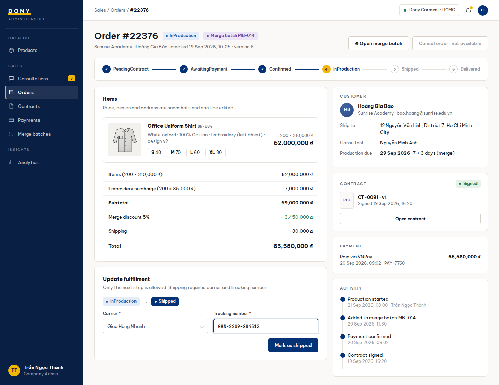

# Screen Spec: S29 Order Detail (Admin)

| Field | Value |
|---|---|
| Screen ID | `S29` |
| Screen name | Order Detail (Admin) |
| Actor | Sales Admin / Assigned Sales |
| Priority | P1 |
| Belongs to module | [MFG-07](../specs/spec-MFG-07.md) |
| Route | `/admin/orders/{order_id}` |
| Mockup image | img/S29-order_detail_admin_screen.png |
| Status | Resolved implementation specification |

## 1. Purpose

**Shown when:** The Sales Admin sees any Dony order; a Sales employee sees only an order tied to their current customer assignment. Mutations follow order state and expected_version. All identifiers and permissions come from the server session.

**The user leaves this screen when:** An authorized action in section 5 succeeds, the user follows a role-allowed global route, or they return to the validated originating route.

## 2. Mockup

Written behavior below takes precedence over obsolete sample content.

## 3. Element inventory

| # | Element | Type | Content / data source | Required | Validation |
|---|---|---|---|---|---|
| 1 | Screen heading | Heading | Order Detail (Admin) | Yes | Static route title. |
| 2 | Route | Navigation target | /admin/orders/{order_id} | Yes | Access checked on server. |
| 3 | order_id / snapshots | Field / control | UUID and read-only data | As specified | Sales Admin or assigned Sales only; price, address, design and contract snapshots cannot be edited. |
| 4 | lifecycle_event / expected_version | Field / control | required mutation inputs | As specified | Permit only staff-owned actions: start sample preparation, dispatch sample, start production, ship goods, or record authorized delivery proof. |
| 5 | sample / shipment / delivery evidence | Evidence panel | Versioned sample fields, carrier tracking event or signed proof-of-delivery reference | By transition | Sample dispatch binds sample/design version and tracking; goods shipment requires carrier/tracking and server shipped_at; verified delivery proof records evidence and verified-delivered timestamp but leaves status Shipped while the 3-day auto-confirmation timer runs. |
| 6 | cancellation_reason | Field / control | string 1..500, Sales Admin only | As specified | Require current cancellation eligibility; Sales cannot cancel. |
| 7 | contract_action | Field / control | Sales Admin only | As specified | Open S33 only when current physical sample is Approved and order is PendingContract; never mutate a Signed contract. |
| 8 | API errors | Field / control | standard API error envelope | As specified | 400 malformed; 422 invalid fields; 409 stale/duplicate; 429 rate limit; 503 dependency failure |
| 9 | Start/dispatch physical sample | Action | Advance `DigitalDesignApproved→SampleInPreparation→SampleShipped` and retain sample version/evidence. | State and role allowed | Destination: S29 |
| 10 | Generate contract | Action | Snapshot current approved design/sample plus commercial and deposit terms. | Only in PendingContract with Approved sample | Destination: S33 |
| 11 | Start production / ship | Action | Advance `Confirmed→InProduction→Shipped`; shipping requires carrier and tracking. | State and role allowed | Destination: S29 |
| 12 | Record delivery proof | Action | Store/verify the evidence timestamp, notify the Customer and start the MFG-06 BR-007 3-calendar-day timer; do not change status immediately or expose balance payment. | Sales Admin only | Destination: S29 |
| 13 | Cancel order | Action | Sales Admin with reason and eligibility; Sales cannot cancel. | Available when authorized | Destination: S28 |
| 14 | Merge batch | Action | Sales Admin opens the batch console. | Available when authorized | Destination: S42 |

## 4. States

| State | What the user sees | Trigger |
|---|---|---|
| Loading | Load the S29 Order Detail (Admin) view model and show labelled progress; keep writes disabled until route data and authorization are resolved. | Request starts |
| Empty | Render the defined initial/empty state for S29 Order Detail (Admin); if a required route object is absent, return a safe 404 and the authorized parent route. | Empty initial form or missing detail payload |
| Forbidden/not found | Return a safe 401/403/404 for S29 Order Detail (Admin) without revealing inaccessible record, customer, staff or payment details. | 401/403/404 |
| Error | For S29 Order Detail (Admin), show the API code, message, field_errors and request_id; preserve safe user-entered values. | Request failure |
| Retry | Retry transient reads for S29 Order Detail (Admin); retry a mutation only with its original idempotency key and identical payload, never as a new side effect. | Recoverable failure |
| Success | Refresh S29 Order Detail (Admin) from the committed server response, expose only the next role/state-allowed action and announce the result via aria-live. | Mutation commits |
| Conflict | For a stale S29 Order Detail (Admin) version or lifecycle state, reload authoritative data, explain the conflict and require explicit review before resubmission. | 409 |

## 5. Interactions and navigation

| # | Element | User action | System response | Goes to screen |
|---|---|---|---|---|
| 1 | Start/dispatch physical sample | Activate | Persist versioned preparation/dispatch event and notify Customer. | S29 |
| 2 | Generate contract | Activate | Snapshot current approved sample and payment terms. | S33 |
| 3 | Start production / ship | Activate | Commit one valid fulfillment transition with required shipment evidence. | S29 |
| 4 | Record delivery proof | Activate | Persist and verify evidence; keep order `Shipped`, show countdown, and let the scheduled MFG-06 event transition after three calendar days unless the Customer confirms sooner. | S29 |
| 5 | Cancel order | Activate | Sales Admin supplies a reason; server rechecks eligibility. | S28 |
| 6 | Merge batch | Activate | Sales Admin opens eligible candidates. | S42 |

Home and public catalog are available to Guest and authenticated users. Customer designs and customer orders are Customer-only; profile and notifications require authentication. Sales Admin routes: S10, S18, S28, S30, S36, S42 and S43. Sales routes: S20 and assigned-only S21. System Admin routes: S39, S40 and S41. The server rechecks internal role, customer ownership and staff assignment for every route and notification target. Back returns to the validated originating route and preserves list filters; without one, use S26 for Customer, S28 for Sales Admin, S20 for Sales, S41 for System Admin, and S01 for Guest.

## 6. Screen-level rules

| Rule ID | Rule | Source |
|---|---|---|
| SR-001 | Access and ownership are checked server-side; do not trust submitted customer, company, role, price, or provider status. Apply 401/403/404 behavior and the field rules above. | Authorization and data ownership requirements |
| SR-002 | IDs are UUIDs; timestamps are UTC and displayed in Asia/Ho_Chi_Minh; money and quantities are integers. Mutations use expected_version; significant create/sign/pay/batch operations use idempotency keys. | Data representation and concurrency requirements |
| SR-003 | Apply the module lifecycle and validation rules linked below; preserve immutable submitted snapshots. | Module specification |
| SR-004 | Selected product and technical defaults are project implementation decisions; do not invent factual company, author, client-approval, or course identifiers. | Project implementation assumptions |

### Acceptance scenarios

1. Only valid next fulfillment transition is applied; shipment requires carrier, tracking and timestamp.
2. Sales cannot cancel an order or bypass Customer design/sample approval, contract, deposit, receipt or balance gates; stale order version returns 409.
3. Staff can never set `Completed`; only verified BALANCE settlement can do so.

## 7. Linked requirements

| FR ID (from the module spec) | What this screen does for it |
|---|---|
| MFG-07/F-ORD-005 | UI touchpoint for **Admin Order Dashboard**; this screen defines the visible action/result, while the module spec owns server authorization, validation and persistence. |
| MFG-07/F-ORD-006 | UI touchpoint for **Status Update Logic**; this screen defines the visible action/result, while the module spec owns server authorization, validation and persistence. |
| MFG-07/F-ORD-007 | UI touchpoint for **Status Notify Logic**; this screen defines the visible action/result, while the module spec owns server authorization, validation and persistence. |
| MFG-06/F-PAY-003 | Implements versioned physical-sample preparation/dispatch and preserves Customer approval gates. |
| MFG-09/F-CONTR-001 | Opens contract generation only after the current physical sample is Approved. |
Additional linked modules: [MFG-06](../specs/spec-MFG-06.md), [MFG-09](../specs/spec-MFG-09.md).

The rules in this screen and its linked module specifications are complete for implementation.

## 8. Responsive and accessibility notes

Support 360px through desktop; stack columns and use labelled horizontal-scroll tables on narrow screens. Controls are keyboard-operable with visible focus, logical headings, associated form labels, and aria-live status/error announcements. Text contrast is at least 4.5:1 (large text 3:1); pointer targets are at least 24px. Preserve user-entered data after recoverable failures. Confirm destructive actions, disable duplicate submit while pending, and enforce idempotency on the server.

## 9. Open questions

| # | Question | Blocking? | Status |
|---|---|---|---|
| 1 | No unresolved screen behavior questions remain; routes, fields, permissions, and defaults are resolved in this specification and its linked module requirements. | No | Resolved |

## Completion checklist

- [x] Route, actor, module, priority, and mockup status are identified.
- [x] Element fields, actions, validation, and data ownership are documented.
- [x] Loading, empty, forbidden, error, retry, success, and conflict states are documented.
- [x] Navigation and acceptance scenarios are explicit.
- [x] Responsive and accessibility requirements follow the shared baseline.
- [x] No unresolved screen-level decisions remain.
