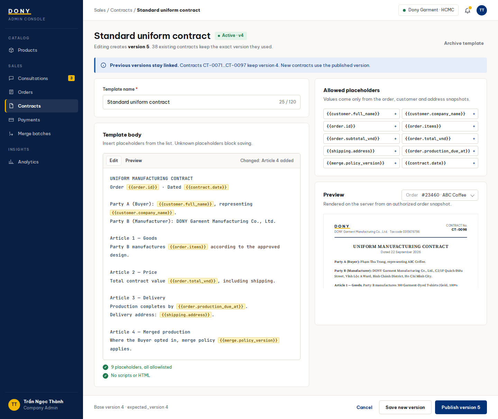

# Screen Spec: S32 Contract Template Edit

| Field | Value |
|---|---|
| Screen ID | `S32` |
| Screen name | Contract Template Edit |
| Actor | Sales Admin |
| Priority | P2 |
| Belongs to module | [MFG-09](../specs/spec-MFG-09.md) |
| Route | `/admin/contracts/templates/{template_id}/edit` |
| Mockup image | img/S32-contract_template_edit_screen.png |
| Status | Resolved implementation specification |

## 1. Purpose

**Shown when:** The Sales Admin edits a template by creating a new version. Existing contracts retain the exact template version and rendered snapshot they used. All identifiers and permissions come from the server session; list filters are allowlisted and recoverable failures preserve entered values.

**The user leaves this screen when:** An authorized action in section 5 succeeds, the user follows a role-allowed global route, or they return to the validated originating route.

## 2. Mockup

Written behavior below takes precedence over obsolete sample content.

## 3. Element inventory

| # | Element | Type | Content / data source | Required | Validation |
|---|---|---|---|---|---|
| 1 | Screen heading | Heading | Contract Template Edit | Yes | Static route title. |
| 2 | Route | Navigation target | /admin/contracts/templates/{template_id}/edit | Yes | Access checked on server. |
| 3 | template_id / current version | Field / control | UUID plus read model | As specified | Load Dony name, structured body, status and version before editing. |
| 4 | new template_body | Field / control | safe text and allowlisted placeholders | As specified | new template_body: safe text and allowlisted placeholders; creates immutable new version. |
| 5 | expected_version | Field / control | required integer | As specified | Stale save returns 409; previous immutable versions remain linked to existing contracts. |
| 6 | API errors | Field / control | standard API error envelope | As specified | 400 malformed; 422 invalid fields; 409 stale/duplicate; 429 rate limit; 503 dependency failure |
| 7 | Save new version | Action | Check expected_version and create immutable version. | Available when authorized | Destination: S30 templates tab |
| 8 | Publish version | Action | Activate the validated new version for future contracts. | Available when authorized | Destination: S30 templates tab |
| 9 | Archive template | Action | Disable future use; preserve versions referenced by contracts. | Available when authorized | Destination: S30 templates tab |
| 10 | Cancel | Action | Discard edits. | Available when authorized | Destination: S30 templates tab |

## 4. States

| State | What the user sees | Trigger |
|---|---|---|
| Loading | Load the S32 Contract Template Edit view model and show labelled progress; keep writes disabled until route data and authorization are resolved. | Request starts |
| Empty | Render the defined initial/empty state for S32 Contract Template Edit; if a required route object is absent, return a safe 404 and the authorized parent route. | Empty initial form or missing detail payload |
| Forbidden/not found | Return a safe 401/403/404 for S32 Contract Template Edit without revealing inaccessible record, customer, staff or payment details. | 401/403/404 |
| Error | For S32 Contract Template Edit, show the API code, message, field_errors and request_id; preserve safe user-entered values. | Request failure |
| Retry | Retry transient reads for S32 Contract Template Edit; retry a mutation only with its original idempotency key and identical payload, never as a new side effect. | Recoverable failure |
| Success | Refresh S32 Contract Template Edit from the committed server response, expose only the next role/state-allowed action and announce the result via aria-live. | Mutation commits |
| Conflict | For a stale S32 Contract Template Edit version or lifecycle state, reload authoritative data, explain the conflict and require explicit review before resubmission. | 409 |

## 5. Interactions and navigation

| # | Element | User action | System response | Goes to screen |
|---|---|---|---|---|
| 1 | Save new version | Activate | Check expected_version and create immutable version. | S30 templates tab |
| 2 | Publish version | Activate | Activate the validated new version for future contracts. | S30 templates tab |
| 3 | Archive template | Activate | Disable future use; preserve versions referenced by contracts. | S30 templates tab |
| 4 | Cancel | Activate | Discard edits. | S30 templates tab |

Home and public catalog are available to Guest and authenticated users. Customer designs and customer orders are Customer-only; profile and notifications require authentication. Sales Admin routes: S10, S18, S28, S30, S36, S42 and S43. Sales routes: S20 and assigned-only S21. System Admin routes: S39, S40 and S41. The server rechecks internal role, customer ownership and staff assignment for every route and notification target. Back returns to the validated originating route and preserves list filters; without one, use S26 for Customer, S28 for Sales Admin, S20 for Sales, S41 for System Admin, and S01 for Guest.

## 6. Screen-level rules

| Rule ID | Rule | Source |
|---|---|---|
| SR-001 | Access and ownership are checked server-side; do not trust submitted customer, company, role, price, or provider status. Apply 401/403/404 behavior and the field rules above. | Authorization and data ownership requirements |
| SR-002 | IDs are UUIDs; timestamps are UTC and displayed in Asia/Ho_Chi_Minh; money and quantities are integers. Mutations use expected_version; significant create/sign/pay/batch operations use idempotency keys. | Data representation and concurrency requirements |
| SR-003 | Apply the module lifecycle and validation rules linked below; preserve immutable submitted snapshots. | Module specification |
| SR-004 | Selected product and technical defaults are project implementation decisions; do not invent factual company, author, client-approval, or course identifiers. | Project implementation assumptions |

### Acceptance scenarios

1. Edit creates a new version while prior version referenced by a contract remains immutable.
2. Stale expected_version returns 409 and reload preserves prior active version.

## 7. Linked requirements

| FR ID (from the module spec) | What this screen does for it |
|---|---|
| MFG-09/F-CONTR-006 | UI touchpoint for **List contracts and manage versioned templates**; this screen defines the visible action/result, while the module spec owns server authorization, validation and persistence. |
| MFG-09/F-CONTR-007 | UI touchpoint for **Replace unsigned contract and notify customer**; this screen defines the visible action/result, while the module spec owns server authorization, validation and persistence. |
The rules in this screen and its linked module specifications are complete for implementation.

## 8. Responsive and accessibility notes

Support 360px through desktop; stack columns and use labelled horizontal-scroll tables on narrow screens. Controls are keyboard-operable with visible focus, logical headings, associated form labels, and aria-live status/error announcements. Text contrast is at least 4.5:1 (large text 3:1); pointer targets are at least 24px. Preserve user-entered data after recoverable failures. Confirm destructive actions, disable duplicate submit while pending, and enforce idempotency on the server.

## 9. Open questions

| # | Question | Blocking? | Status |
|---|---|---|---|
| 1 | No unresolved screen behavior questions remain; routes, fields, permissions, and defaults are resolved in this specification and its linked module requirements. | No | Resolved |

## Completion checklist

- [x] Route, actor, module, priority, and mockup status are identified.
- [x] Element fields, actions, validation, and data ownership are documented.
- [x] Loading, empty, forbidden, error, retry, success, and conflict states are documented.
- [x] Navigation and acceptance scenarios are explicit.
- [x] Responsive and accessibility requirements follow the shared baseline.
- [x] No unresolved screen-level decisions remain.
