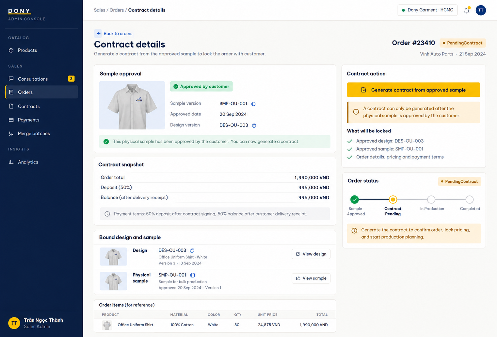

# Screen Spec: S33 Contract Detail (Sales Admin)

| Field | Value |
|---|---|
| Screen ID | `S33` |
| Screen name | Contract Detail (Sales Admin) |
| Actor | Sales Admin |
| Priority | P1 |
| Belongs to module | [MFG-09](../specs/spec-MFG-09.md) |
| Route | `/admin/contracts/{contract_id}` |
| Mockup image | img/S33-contract_detail_company_admin_screen.png |
| Status | Resolved implementation specification |

## 1. Purpose

**Shown when:** The Sales Admin sees a Dony contract whose order has a current Customer-approved physical sample, together with status history, generated private PDF and permitted void/supersede controls. All identifiers and permissions come from the server session.

**The user leaves this screen when:** An authorized action in section 5 succeeds, the user follows a role-allowed global route, or they return to the validated originating route.

## 2. Mockup

Written behavior below takes precedence over obsolete sample content.

## 3. Element inventory

| # | Element | Type | Content / data source | Required | Validation |
|---|---|---|---|---|---|
| 1 | Screen heading | Heading | Contract Detail (Sales Admin) | Yes | Static route title. |
| 2 | Route | Navigation target | /admin/contracts/{contract_id} | Yes | Access checked on server. |
| 3 | contract_id / order_id | Field / control | UUID / UUID | As specified | Both belong to Dony; inaccessible IDs return 404. |
| 4 | status | Field / control | Draft, Ready, Signed, Superseded, Voided | As specified | Controls appear only when allowed by contract state and role. |
| 5 | template_version / content_hash | Field / control | integer / SHA-256 | As specified | Generated from immutable order/customer/design/sample/payment-policy snapshots and selected template version. |
| 6 | pdf_asset_id | Field / control | private UUID, nullable until generated | As specified | Private PDF; download uses access-checked expiring URL. |
| 7 | ready_at / signed_at | Field / control | nullable UTC timestamps | As specified | Server-set after PDF storage or signature commit. |
| 8 | expected_version | Field / control | integer, required on mutation | As specified | Stale replacement/void returns 409; Signed version cannot be edited. |
| 9 | Generate PDF/publish Ready | Action | Generate and store PDF first; transition only on success, queue notice after commit. | Available when authorized | Destination: S34 |
| 10 | Replace unsigned contract | Action | Create a new version only from the same approved sample/commercial snapshot; supersede prior unsigned version and notify. | Available when authorized | Destination: S33 |
| 11 | Download PDF | Action | Issue authorized expiring URL. | Available when authorized | Destination: S33 |
| 12 | Approved sample/payment terms | Read-only evidence | design version, sample ID/version, approval time, total, deposit percent/amount and balance formula | Yes | Must match current Approved sample and immutable policy snapshot; no manual amount override. |

## 4. States

| State | What the user sees | Trigger |
|---|---|---|
| Loading | Load the S33 Contract Detail (Sales Admin) view model and show labelled progress; keep writes disabled until route data and authorization are resolved. | Request starts |
| Empty | Render the defined initial/empty state for S33 Contract Detail (Sales Admin); if a required route object is absent, return a safe 404 and the authorized parent route. | Empty initial form or missing detail payload |
| Forbidden/not found | Return a safe 401/403/404 for S33 Contract Detail (Sales Admin) without revealing inaccessible record, customer, staff or payment details. | 401/403/404 |
| Error | For S33 Contract Detail (Sales Admin), show the API code, message, field_errors and request_id; preserve safe user-entered values. | Request failure |
| Retry | Retry transient reads for S33 Contract Detail (Sales Admin); retry a mutation only with its original idempotency key and identical payload, never as a new side effect. | Recoverable failure |
| Success | Refresh S33 Contract Detail (Sales Admin) from the committed server response, expose only the next role/state-allowed action and announce the result via aria-live. | Mutation commits |
| Conflict | For a stale S33 Contract Detail (Sales Admin) version or lifecycle state, reload authoritative data, explain the conflict and require explicit review before resubmission. | 409 |

## 5. Interactions and navigation

| # | Element | User action | System response | Goes to screen |
|---|---|---|---|---|
| 1 | Generate PDF/publish Ready | Activate | Generate and store PDF first; transition only on success, queue notice after commit. | S34 |
| 2 | Replace unsigned contract | Activate | Create new version; supersede prior unsigned version and notify. | S33 |
| 3 | Download PDF | Activate | Issue authorized expiring URL. | S33 |

Home and public catalog are available to Guest and authenticated users. Customer designs and customer orders are Customer-only; profile and notifications require authentication. Sales Admin routes: S10, S18, S28, S30, S36, S42 and S43. Sales routes: S20 and assigned-only S21. System Admin routes: S39, S40 and S41. The server rechecks internal role, customer ownership and staff assignment for every route and notification target. Back returns to the validated originating route and preserves list filters; without one, use S26 for Customer, S28 for Sales Admin, S20 for Sales, S41 for System Admin, and S01 for Guest.

## 6. Screen-level rules

| Rule ID | Rule | Source |
|---|---|---|
| SR-001 | Access and ownership are checked server-side; do not trust submitted customer, company, role, price, or provider status. Apply 401/403/404 behavior and the field rules above. | Authorization and data ownership requirements |
| SR-002 | IDs are UUIDs; timestamps are UTC and displayed in Asia/Ho_Chi_Minh; money and quantities are integers. Mutations use expected_version; significant create/sign/pay/batch operations use idempotency keys. | Data representation and concurrency requirements |
| SR-003 | Apply the module lifecycle and validation rules linked below; preserve immutable submitted snapshots. | Module specification |
| SR-004 | Selected product and technical defaults are project implementation decisions; do not invent factual company, author, client-approval, or course identifiers. | Project implementation assumptions |

### Acceptance scenarios

1. Generation is rejected unless the order is `PendingContract` and its current physical sample is Approved.
2. Ready is published only after private PDF generation/storage succeeds and binds exact sample/deposit/balance terms; then notification enters outbox.
3. Signed contract cannot be edited/replaced; failed PDF leaves prior state and allows retry.

## 7. Linked requirements

| FR ID (from the module spec) | What this screen does for it |
|---|---|
| MFG-09/F-CONTR-003 | UI touchpoint for **Fill Contract Logic**; this screen defines the visible action/result, while the module spec owns server authorization, validation and persistence. |
| MFG-09/F-CONTR-004 | UI touchpoint for **Render PDF Logic**; this screen defines the visible action/result, while the module spec owns server authorization, validation and persistence. |
| MFG-09/F-CONTR-005 | UI touchpoint for **Ready Notify Logic**; this screen defines the visible action/result, while the module spec owns server authorization, validation and persistence. |
| MFG-09/F-CONTR-007 | UI touchpoint for **Replace unsigned contract and notify customer**; this screen defines the visible action/result, while the module spec owns server authorization, validation and persistence. |
The rules in this screen and its linked module specifications are complete for implementation.

## 8. Responsive and accessibility notes

Support 360px through desktop; stack columns and use labelled horizontal-scroll tables on narrow screens. Controls are keyboard-operable with visible focus, logical headings, associated form labels, and aria-live status/error announcements. Text contrast is at least 4.5:1 (large text 3:1); pointer targets are at least 24px. Preserve user-entered data after recoverable failures. Confirm destructive actions, disable duplicate submit while pending, and enforce idempotency on the server.

## 9. Open questions

| # | Question | Blocking? | Status |
|---|---|---|---|
| 1 | No unresolved screen behavior questions remain; routes, fields, permissions, and defaults are resolved in this specification and its linked module requirements. | No | Resolved |

## Completion checklist

- [x] Route, actor, module, priority, and mockup status are identified.
- [x] Element fields, actions, validation, and data ownership are documented.
- [x] Loading, empty, forbidden, error, retry, success, and conflict states are documented.
- [x] Navigation and acceptance scenarios are explicit.
- [x] Responsive and accessibility requirements follow the shared baseline.
- [x] No unresolved screen-level decisions remain.
