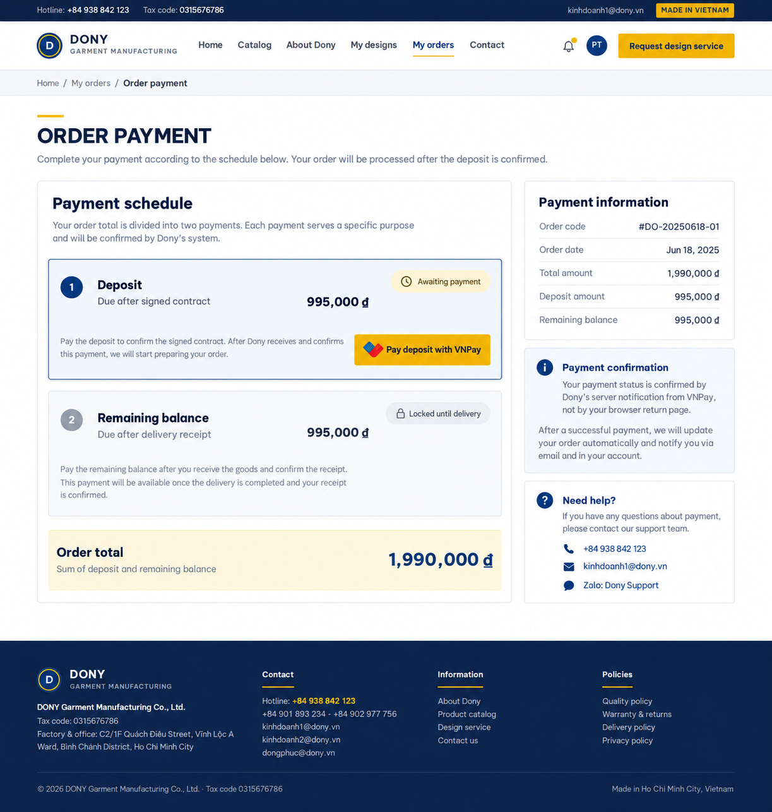

# Screen Spec: S35 Order Payment

| Field | Value |
|---|---|
| Screen ID | `S35` |
| Screen name | Order Payment |
| Actor | Customer owner |
| Priority | P1 |
| Belongs to module | [MFG-06](../specs/spec-MFG-06.md) |
| Route | `/orders/{order_id}/payment` |
| Mockup image | `img/S35-order_payment_screen.png` |
| Status | Resolved implementation specification |

## 1. Purpose

**Shown when:** The customer pays the exact server-snapshotted order total in integer VND through VNPay. Browser returns trigger status polling; verified callbacks alone confirm payment. Retry reuses an eligible pending attempt or creates a new attempt after failure/expiry. All identifiers and permissions come from the server session; list filters are allowlisted and recoverable failures preserve entered values.

**The user leaves this screen when:** An authorized action in section 5 succeeds, the user follows a role-allowed global route, or they return to the validated originating route.

## 2. Mockup

Written behavior below takes precedence over obsolete sample content.

## 3. Element inventory

| # | Element | Type | Content / data source | Required | Validation |
|---|---|---|---|---|---|
| 1 | Screen heading | Heading | Order Payment | Yes | Static route title. |
| 2 | Route | Navigation target | /orders/{order_id}/payment | Yes | Access checked on server. |
| 3 | order_id | Field / control | UUID, required | As specified | Current customer owns order; current Contract Signed; order AwaitingPayment. |
| 4 | subtotal_vnd | Field / control | integer, required | As specified | Immutable quote/order snapshot; sum quantity times unit price plus option surcharges. |
| 5 | merge_discount_vnd | Field / control | integer, required | As specified | floor(subtotal_vnd*5/100) only when accepted merge preference exists; otherwise 0. |
| 6 | shipping_vnd | Field / control | integer, required | As specified | 30000 VND snapshot. |
| 7 | merge_fee_vnd | Field / control | integer, required | As specified | 0 VND. |
| 8 | tax_vnd | Field / control | integer, required | As specified | 0 VND under classroom demo pricing assumption. |
| 9 | total_vnd | Field / control | integer, required | As specified | subtotal - discount + shipping + fee + tax; server snapshot only. |
| 10 | payment_method | Field / control | enum | As specified | VNPay only in this release; external sandbox/provider route. |
| 11 | transaction_id | Field / control | UUID | As specified | Returned browser route is lookup-only; poll status, never mark paid from browser. |
| 12 | Idempotency-Key | Field / control | UUID, required on initiation | As specified | Same key/payload returns same attempt; changed payload conflicts. |
| 13 | promo_code/marketing_consent/second merge consent | Field / control | absent | As specified | No promo controls; merge policy is already snapshotted at order submission. |
| 14 | Initiate/retry payment | Action | Reuse active Pending attempt or create new provider reference after failure; use server snapshot amount. | Available when authorized | Destination: External VNPay |
| 15 | Browser return | Action | Ignore claimed success, poll authoritative transaction. | Available when authorized | Destination: S35 |
| 16 | Verified success | Action | Show receipt/result and order status Confirmed. | Available when authorized | Destination: S27 |
| 17 | Failed/expired/processing | Action | Keep order AwaitingPayment; show retry/processing without false success. | Available when authorized | Destination: S35 |

## 4. States

| State | What the user sees | Trigger |
|---|---|---|
| Loading | Labelled progress/skeleton; disable duplicate submit. | Request starts |
| Empty | Render the screen-specific form/detail state; if a required route object is absent, show safe not-found and return to the authorized parent route. | Empty initial form or missing detail payload |
| Forbidden/not found | Safe message without revealing inaccessible identifiers. | 401/403/404 |
| Error | Show code, message, field_errors, request_id; preserve entered values. | Request failure |
| Retry | Retry reads on transient failure; reuse the same idempotency key only for mutations that require one for the documented mutation. | Recoverable failure |
| Success | Show committed state and next valid action; announce via aria-live. | Mutation commits |
| Conflict | Explain stale state; reload; never silently overwrite. | 409 |

## 5. Interactions and navigation

| # | Element | User action | System response | Goes to screen |
|---|---|---|---|---|
| 1 | Initiate/retry payment | Activate | Reuse active Pending attempt or create new provider reference after failure; use server snapshot amount. | External VNPay |
| 2 | Browser return | Activate | Ignore claimed success, poll authoritative transaction. | S35 |
| 3 | Verified success | Activate | Show receipt/result and order status Confirmed. | S27 |
| 4 | Failed/expired/processing | Activate | Keep order AwaitingPayment; show retry/processing without false success. | S35 |

Home and public catalog are available to Guest and authenticated users. Customer designs and customer orders are Customer-only; profile and notifications require authentication. Company Admin routes: S10, S18, S28, S30, S36, S42 and S43. Sales Consultant routes: S20 and assigned-only S21. System Admin routes: S39, S40 and S41. The server rechecks role, company, membership, ownership and assignment for every route and notification target. Back returns to the validated originating route and preserves list filters; without one, use S26 for Customer, S28 for Company Admin, S20 for Sales Consultant, S41 for System Admin, and S01 for Guest.

## 6. Screen-level rules

| Rule ID | Rule | Source |
|---|---|---|
| SR-001 | Access and ownership are checked server-side; do not trust submitted customer, company, role, price, or provider status. Apply 401/403/404 behavior and the field rules above. | Authorization and data ownership requirements |
| SR-002 | IDs are UUIDs; timestamps are UTC and displayed in Asia/Ho_Chi_Minh; money and quantities are integers. Mutations use expected_version; significant create/sign/pay/batch operations use idempotency keys. | Data representation and concurrency requirements |
| SR-003 | Apply the module lifecycle and validation rules linked below; preserve immutable submitted snapshots. | Module specification |
| SR-004 | Selected product and technical defaults are project implementation decisions; do not invent factual company, author, client-approval, or course identifiers. | Project implementation assumptions |

### Acceptance scenarios

1. For Signed/AwaitingPayment order, show exact subtotal/discount/shipping/fee/tax/total integer VND and initiate 15m attempt.
2. Browser return cannot mark paid; verified callback confirms once, while failed/expired stays AwaitingPayment and enables retry.

## 7. Linked requirements

| FR ID (from the module spec) | What this screen does for it |
|---|---|
| MFG-06/F-PAY-002 | Implements this screen's validated user flow and the linked source function. |
| MFG-06/F-PAY-004 | Implements this screen's validated user flow and the linked source function. |
| MFG-06/F-PAY-005 | Implements this screen's validated user flow and the linked source function. |
| MFG-06/F-PAY-006 | Implements this screen's validated user flow and the linked source function. |
The rules in this screen and its linked module specifications are complete for implementation.

## 8. Responsive and accessibility notes

Support 360px through desktop; stack columns and use labelled horizontal-scroll tables on narrow screens. Controls are keyboard-operable with visible focus, logical headings, associated form labels, and aria-live status/error announcements. Text contrast is at least 4.5:1 (large text 3:1); pointer targets are at least 24px. Preserve user-entered data after recoverable failures. Confirm destructive actions, disable duplicate submit while pending, and enforce idempotency on the server.

## 9. Open questions

| # | Question | Blocking? | Status |
|---|---|---|---|
| 1 | No unresolved screen behavior questions remain; routes, fields, permissions, and defaults are resolved in this specification and its linked module requirements. | No | Resolved |

## Completion checklist

- [x] Route, actor, module, priority, and mockup status are identified.
- [x] Element fields, actions, validation, and data ownership are documented.
- [x] Loading, empty, forbidden, error, retry, success, and conflict states are documented.
- [x] Navigation and acceptance scenarios are explicit.
- [x] Responsive and accessibility requirements follow the shared baseline.
- [x] No unresolved screen-level decisions remain.
